# Building Chess Habits V1, as Aman Hambleton Teaches It

Building Habits is not a list of perfect moves. It is a way to make chess simpler while the important things become automatic.

Across 32 full episodes, about 63½ hours of video, and 394 games, Aman starts with strict rules and then removes the training wheels. You may miss a stronger move while following the rules. That is deliberate. His instruction at the start is:

> "Focus on the fundamentals." — [Aman, Part 1](https://www.youtube.com/watch?v=p8pZbhjL-fQ&t=14s)

The goal is to play "high percentage moves" often enough that development, king safety, loose pieces, and simple endgames stop consuming all your attention. Each new level adds judgment without throwing away the earlier habits.

## Contents

1. [How the habits ladder works](#1-how-the-habits-ladder-works)
2. [Level 1: build the base](#2-level-1-build-the-base)
3. [The Level 1 opening routine](#3-the-level-1-opening-routine)
4. [Free pieces and automatic trades](#4-free-pieces-and-automatic-trades)
5. [Finish development before random pawn moves](#5-finish-development-before-random-pawn-moves)
6. [The first endgame habit](#6-the-first-endgame-habit)
7. [Level 2: add simple calculation](#7-level-2-add-simple-calculation)
8. [Take more space](#8-take-more-space)
9. [The first exceptions](#9-the-first-exceptions)
10. [Passed pawns and basic mates](#10-passed-pawns-and-basic-mates)
11. [Level 3: leave autopilot](#11-level-3-leave-autopilot)
12. [Choose the best available square](#12-choose-the-best-available-square)
13. [Build a small opening notebook](#13-build-a-small-opening-notebook)
14. [Level 4: remove the hard prohibitions](#14-level-4-remove-the-hard-prohibitions)
15. [Weak squares, colour complexes, and outposts](#15-weak-squares-colour-complexes-and-outposts)
16. [Endgames become required knowledge](#16-endgames-become-required-knowledge)
17. [The repertoire grows with the lessons](#17-the-repertoire-grows-with-the-lessons)
18. [What never leaves the habits](#18-what-never-leaves-the-habits)
19. [A practical training loop](#19-a-practical-training-loop)
20. [Decision checklist](#20-decision-checklist)

## 1. How the habits ladder works

The four levels are a sequence, not four unrelated rule sheets.

| Level | Playlist range | Main job |
| --- | --- | --- |
| 1 | roughly 400–700 | Develop, castle, stop hanging pieces, and simplify |
| 2 | roughly 700–1100 | Add basic tactics, safe premoves, space, and a few exceptions |
| 3 | roughly 1100–1550 | Stop playing on autopilot; learn recurring openings and choose squares consciously |
| 4 | roughly 1550–1900 | Lift the remaining restrictions; play from imbalances, weak squares, pawn structures, and endgames |

The rating labels describe the speedrun. They are not admission tests. Aman says to treat the next rule set as what you add once the previous one has taken you as far as it can: [Part 9, 0:45](https://www.youtube.com/watch?v=Rf7V3MCOum4&t=45s).

That is the central idea of the series:

- Use a small move filter.
- Repeat it until it becomes instinct.
- Add one new layer.
- Keep the old fundamentals while making room for exceptions.

At Level 1 Aman deliberately refuses tactics that he can see. At Level 4 he deliberately plays moves that Level 1 prohibited. Neither is a contradiction. The rule changes because the player's attention and knowledge have changed.

## 2. Level 1: build the base

The first level removes choices. Aman gives himself four restrictions:

- no premoves;
- no tactics;
- no gambits;
- no sacrifices.

He states them together in [Part 1 at 43:14](https://www.youtube.com/watch?v=p8pZbhjL-fQ&t=2594s). "No tactics" does not mean tactics are bad. It means a new player first needs a way to produce decent moves without finding every combination.

The positive habits are simple:

1. Know how every piece moves.
2. Put a pawn in the centre.
3. Develop knights, then bishops, toward the centre.
4. Castle as soon as possible.
5. Do not hang pieces; take the opponent's free pieces.
6. Accept equal or favourable trades.
7. Bring the rooks toward the middle after development.
8. Give the castled king an escape square.
9. In an endgame, activate the king and attack pawns.

The point is not that every item is always best. The point is that this sequence produces playable positions while cutting out many beginner losses.

## 3. The Level 1 opening routine

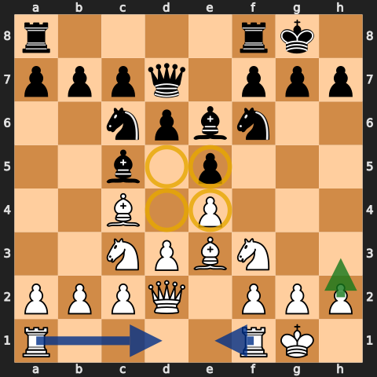

As White, Aman starts with `1.e4`. Against `1.e4`, he answers `1...e5`; against `1.d4`, he answers `1...d5`. The beginner version is intentionally symmetrical and direct.

The move order is a habit, not memorised theory:

1. Move a centre pawn two squares when it is safe.
2. Develop knights before bishops.
3. Point the minor pieces toward the four central squares.
4. Castle kingside as soon as the path is clear.
5. Move the queen only as much as needed to connect the rooks.
6. Bring the rooks toward the centre.

Aman's first game begins with `e4` because it controls the centre: [Part 1, 0:49](https://www.youtube.com/watch?v=p8pZbhjL-fQ&t=49s). A few minutes later he ignores other possibilities and castles because castling is the next habit move: [3:10](https://www.youtube.com/watch?v=p8pZbhjL-fQ&t=190s).

### Kick pieces that sit on the four pinning squares

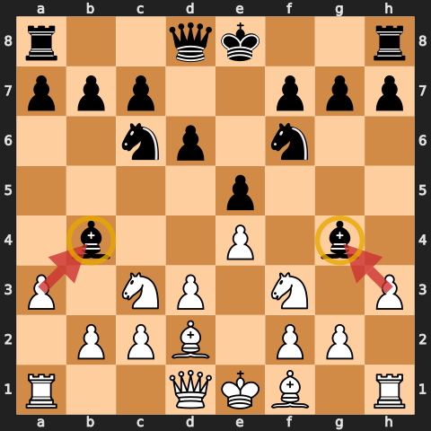

When a bishop or knight lands on `b4`, `g4`, `b5`, or `g5`, the Level 1 response is usually the nearby rook pawn: `a3`, `h3`, `a6`, or `h6`. Aman calls for the pawn immediately—"whenever there's a bishop, kick it out"—in [Part 5 at 1:25:07](https://www.youtube.com/watch?v=zDKC62tWFEw&t=5107s).

This prevents a beginner from spending several minutes calculating pins. Later levels add exceptions: sometimes the pin is harmless, sometimes the pawn move weakens the king, and sometimes keeping the tension matters more.

## 4. Free pieces and automatic trades

At Level 1, if an enemy bishop, knight, rook, or queen is undefended and can be taken safely, take it. Aman repeatedly clarifies that pawns do not count as "pieces" for this training rule. Do not derail development just to collect every loose pawn.

For exchanges, the first rule is deliberately blunt:

- trade equal pieces;
- trade a lower-value piece for a higher-value piece;
- if you are ahead, trade pieces and keep collecting pawns.

"We always do trades" is repeated throughout the early episodes; the equal-value version is explicit in [Part 3 at 54:06](https://www.youtube.com/watch?v=SmxnZQITf28&t=3246s).

Why teach an over-simple rule? It makes the board easier to read, gives fewer pieces a chance to hang, and lets material advantages reach an endgame. Levels 2 and 3 will teach when not to exchange.

Before any capture, still check one thing: after the trade, does another piece become loose? A legal capture is not automatically a safe capture.

## 5. Finish development before random pawn moves

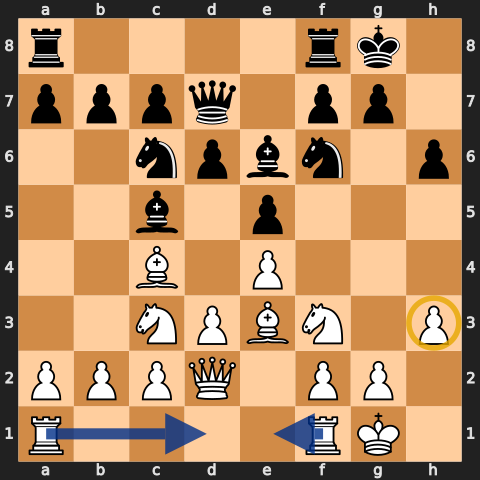

Once the minor pieces are developed, the king is castled, and the rooks are connected, Aman gives the king an escape square with `h3` or `h6`. This prevents the simplest back-rank mates.

Only then does he allow "random pawn moves"—usually a queenside pawn pushed one square. The phrase is comic, but the order matters:

1. centre;
2. development;
3. castle;
4. rooks;
5. escape square;
6. only then, a pawn move that gains space or asks the opponent a question.

Aman explicitly delays the random pawn moves until development is finished in [Part 1 at 1:47:07](https://www.youtube.com/watch?v=p8pZbhjL-fQ&t=6427s).

Do not turn "random pawn moves" into permission to weaken the castled king. It is a fallback for a position where the beginner has completed the useful moves and does not yet know how to form a plan.

## 6. The first endgame habit

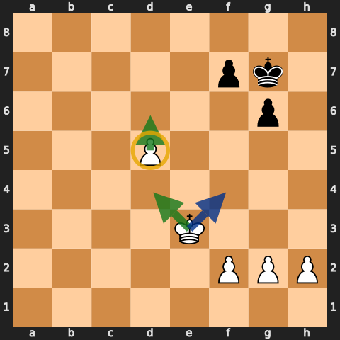

When queens and several pieces leave the board, the king changes jobs. It stops hiding and becomes an attacking piece.

Aman's Level 1 endgame plan is:

- bring the king toward the centre;
- attack enemy pawns with it;
- create a passed pawn;
- push the passed pawn.

"Use your king a lot and attack pawns" is his summary in [Part 2 at 36:56](https://www.youtube.com/watch?v=ZIuV0_gzgzc&t=2216s). When a passed pawn appears, the early-level rule is equally direct: push it. See [Part 3, 47:14](https://www.youtube.com/watch?v=SmxnZQITf28&t=2834s).

At this stage Aman is teaching direction, not complete endgame theory. Opposition, Lucena, Philidor, and exact rook technique arrive later.

## 7. Level 2: add simple calculation

Level 2 begins in Part 9. Most Level 1 habits remain, but several rules become less mechanical.

The main additions are:

- basic one-move tactics: forks, pins, skewers, discoveries, and simple mates;
- premoved recaptures and premoves under ten seconds;
- castling early, but not necessarily at the first legal moment;
- taking more central space with both centre pawns;
- developing pieces to more aggressive squares;
- capturing toward the centre in most pawn recaptures;
- keeping useful pins instead of releasing them automatically;
- placing a rook behind a passed pawn;
- never resigning and making the opponent finish the game.

Aman introduces the tactical layer at [Part 9, 2:33](https://www.youtube.com/watch?v=Rf7V3MCOum4&t=153s). He does not expect every tactic to be found. The aim is to improve from seeing a few of them to seeing most of the basic patterns.

### Safe premoves only

The first premoves are recaptures that cancel automatically if the opponent does not capture. Under ten seconds, more premoves are allowed. Aman sets those two cases out at [Part 9, 1:49](https://www.youtube.com/watch?v=Rf7V3MCOum4&t=109s).

Premoving a normal developing move is not part of the rule. The opponent's last move may have changed the position.

## 8. Take more space

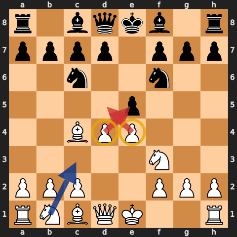

Level 1 often settled for one central pawn. Level 2 asks for both when the opponent permits it. With White, that means looking for `e4` and `d4`; with Black, `...e5` and `...d5`.

Aman describes the change as developing "a little bit more aggressive" and trying to get both pawns into the centre: [Part 9, 4:30](https://www.youtube.com/watch?v=Rf7V3MCOum4&t=270s).

Space is useful because it gives the pieces more squares and takes squares away from the opponent. It is not an instruction to push through an occupied or tactically unstable centre. Check what can capture the pawn first.

## 9. The first exceptions

Level 2 keeps the simple rules but adds named exceptions.

### Keep a useful pin

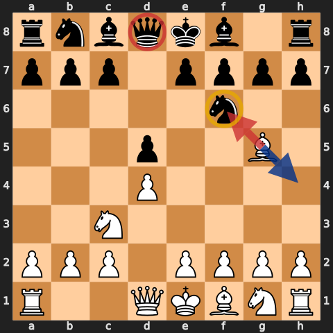

At Level 1, `Bg5` followed by `...h6` usually meant `Bxf6`. At Level 2, the bishop often retreats and keeps the pin. Exchanging may help the opponent develop the queen or improve the pawn structure.

Aman introduces "keep the tension" with the pinned bishop in [Part 9 at 4:18](https://www.youtube.com/watch?v=Rf7V3MCOum4&t=258s).

### Evaluate bishop-for-knight trades

The main trade exception is bishop for knight. In open positions, Aman asks the player to treat the bishop as the better piece unless there is a concrete reason to exchange. He explains the exception in [Part 9 at 14:04](https://www.youtube.com/watch?v=Rf7V3MCOum4&t=844s).

### Capture toward the centre—except when the position says otherwise

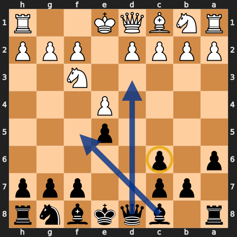

The default pawn recapture is toward the centre. The recurring exception is the Ruy Lopez Exchange structure: after `...a6`, `Bxc6 dxc6` captures away from the centre but opens the queen and c8-bishop. Aman calls this the main capture-away exception in [Part 9 at 5:49](https://www.youtube.com/watch?v=Rf7V3MCOum4&t=349s).

This is how the habits grow: keep the general rule, then attach a concrete exception that appears often.

## 10. Passed pawns and basic mates

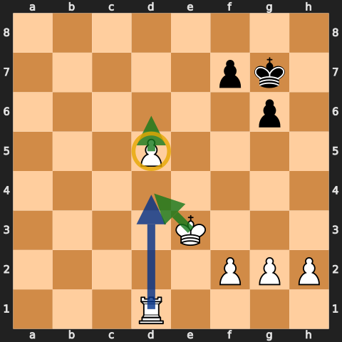

Level 2 adds enough endgame technique to convert the positions created by all those trades:

- rook behind a passed pawn;
- king in front of an enemy passed pawn when possible;
- ladder mate with two rooks or queen and rook;
- king-and-queen mate;
- king-and-rook mate;
- awareness of stalemate.

"Rook belongs behind passed pawns" appears in the Level 2 introduction at [Part 9, 4:08](https://www.youtube.com/watch?v=Rf7V3MCOum4&t=248s) and is repeated throughout the series.

The other practical rule is to keep playing. Aman calls "never resign" important at [Part 11, 21:32](https://www.youtube.com/watch?v=dZ4iVUQQ4T8&t=1292s). At these ratings, opponents still stalemate winning positions, miss mates, and mishandle promotions.

## 11. Level 3: leave autopilot

Level 3 begins at roughly 1100. Aman says the biggest change is to become "more proactive and less reactive": [Part 17, 0:45](https://www.youtube.com/watch?v=7u8KXf-KzEE&t=45s).

The old routines remain, but they no longer choose the move for you:

- develop, but choose the best available square;
- castle early, but read the danger first;
- use rooks actively, but choose the open or useful file;
- take many trades, but do not release every tension automatically;
- learn the opening positions that recur in your own games;
- memorise a small number of essential pawn and rook endgames;
- make your own threats instead of only answering the opponent.

Gambits and speculative sacrifices remain outside Aman's training rules at this level. The extra freedom comes from better placement and better knowledge, not from gambling material.

## 12. Choose the best available square

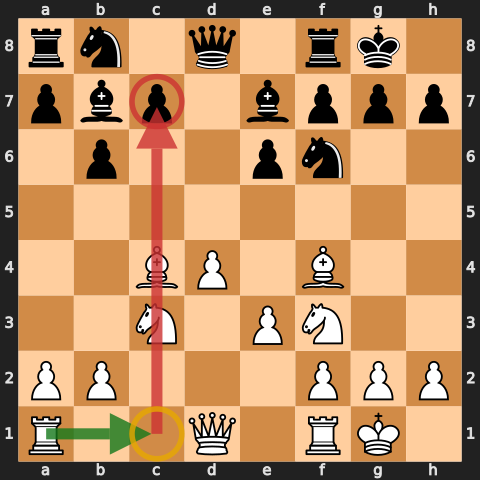

"Rooks to the middle" worked as a Level 1 shortcut. It becomes wrong when the centre is closed or another file is open. Aman now wants each piece on "the best available square": [Part 17, 1:40](https://www.youtube.com/watch?v=7u8KXf-KzEE&t=100s).

For a rook, ask:

- Is there an open file?
- Is there a semi-open file with a target?
- Can the rook stand behind a passed pawn?
- Can it oppose the enemy queen or rook?
- Will a central file open after a pawn break?

### Keep or resolve the tension?

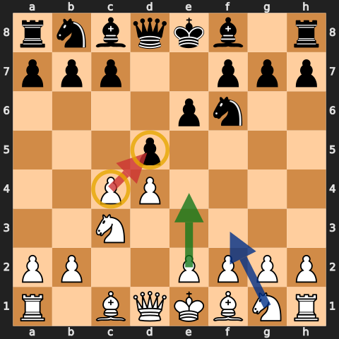

At Level 3, a legal exchange is no longer enough. Before `cxd5`, `exd5`, or a bishop-for-knight trade, ask what changes:

- Which side gains an open line?
- Whose piece improves after the recapture?
- Does one side lose a central pawn?
- Does the exchange help the side that is cramped?
- Are you ahead and trying to simplify, or behind and trying to keep chances?

Aman introduces "tension" as part of the new rule list and says that most trades remain attractive, but no longer all of them: [Part 17, 6:48](https://www.youtube.com/watch?v=7u8KXf-KzEE&t=408s).

## 13. Build a small opening notebook

Level 3 is the first time Aman separates the opening phase from the general habits. If the same position keeps appearing, analyze it after the game and commit a small, useful line to memory: [Part 17, 3:04](https://www.youtube.com/watch?v=7u8KXf-KzEE&t=184s).

The series builds a compact repertoire rather than trying to memorize everything:

| Position | Aman's recurring treatment |
| --- | --- |
| `1.e4 e5` | Keep the familiar classical development; the Four Knights is the training base |
| Caro-Kann | Use the Two Knights; the first Level 3 lesson begins at [Part 17, 13:22](https://www.youtube.com/watch?v=7u8KXf-KzEE&t=802s) |
| Sicilian | Build `Nf3`, `c3`, and `d4`; Aman states the plan at [Part 19, 47:34](https://www.youtube.com/watch?v=qK0Ds5vLAjE&t=2854s) |
| Scandinavian | Take on d5, draw Black's queen out, then develop with tempo; [Part 17, 1:08:09](https://www.youtube.com/watch?v=7u8KXf-KzEE&t=4089s) |
| French | Stop after the game and establish a repeatable system; the first dedicated review begins in [Part 18 at 1:29:31](https://www.youtube.com/watch?v=tOsISkmNwpg&t=5371s) |
| London | Study it because it appears often; Aman begins the first dedicated treatment in [Part 18 at 51:50](https://www.youtube.com/watch?v=tOsISkmNwpg&t=3110s) |

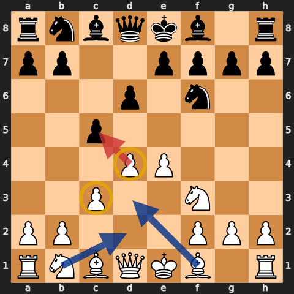

Opening memory has a boundary. Aman says opening-specific moves may not look "habitual"; once the remembered phase ends, fall back on development, king safety, useful files, loose pieces, and plans.

The full PGN is the better place to study the repertoire game by game. It contains all 394 games in chronological order with episode and timestamp links.

## 14. Level 4: remove the hard prohibitions

At roughly 1550, Aman begins "taking off the training wheels": [Part 27, 0:45](https://www.youtube.com/watch?v=x82SIL6XCHI&t=45s).

The big changes are:

- sacrifices and gambits can be considered;
- weakening pawn moves such as `g4` can be played when their benefits justify them;
- openings become more varied and specific;
- pawn structures and weak pawns drive the plan;
- colour complexes, bishop-versus-knight imbalances, and outposts matter;
- rook placement is position-specific;
- basic pawn and rook endgames must be known, not improvised;
- trade when ahead; preserve complexity when behind unless a concrete trade helps.

Aman does not say that every sacrifice is now good. He removes the definitive "no" because the player should be able to compare material with initiative, king safety, development, and concrete calculation.

He makes the same point with `g4`: the move weakens the king, but can have real benefits. See [Part 27, 1:49](https://www.youtube.com/watch?v=x82SIL6XCHI&t=109s).

## 15. Weak squares, colour complexes, and outposts

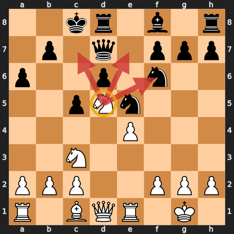

Level 4 plans start with the pawn structure. In the diagram, Black no longer has a pawn that can challenge a knight on d5. Aman builds the entire game around that square:

1. identify d5 as the weakness;
2. aim the bishop and knight toward it;
3. trade the bishop that controls it;
4. occupy it with a knight;
5. compare that permanent knight with Black's removable knight.

He calls d5 "a juicy, juicy weakness" and makes it the whole plan in [Part 29 at 1:50](https://www.youtube.com/watch?v=TISxvO2dr1c&t=110s).

The Level 4 questions are:

- Which pawn cannot be defended by another pawn?
- Which square can no longer be challenged by a pawn?
- Is one bishop trapped behind pawns of its own colour?
- Which minor piece should be traded to control the important colour complex?
- Can a rook attack the weakness from an open file?

An outpost is not just a central square. It is a useful square where a piece cannot be driven away by a pawn.

## 16. Endgames become required knowledge

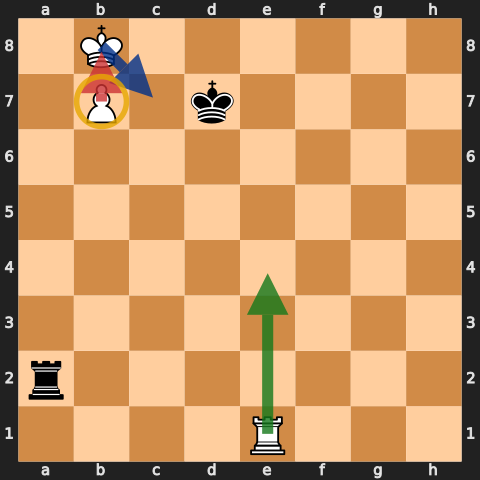

Level 1 said "activate the king." Level 4 requires named positions and exact technique:

- opposition in king-and-pawn endings;
- key squares and outside passed pawns;
- Lucena and Philidor rook endings;
- active-rook principles;
- rook behind a passed pawn;
- standard mating patterns, including bishop and knight.

Aman names Philidor, Lucena, opposition, and basic rook and pawn endings in the Level 4 introduction: [Part 27, 3:39](https://www.youtube.com/watch?v=x82SIL6XCHI&t=219s).

The progression matters. The early rule got the king moving. The later study tells you exactly where it belongs.

## 17. The repertoire grows with the lessons

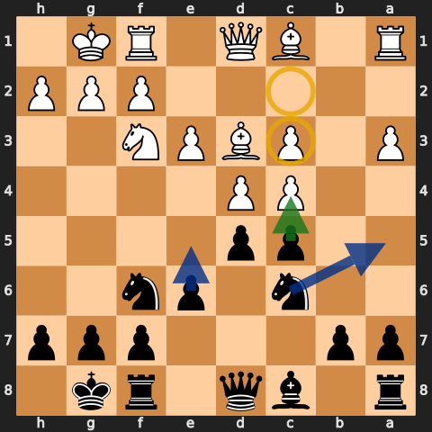

Level 4 keeps `1.e4` but no longer relies only on the Four Knights against `...e5`; Aman brings in the Ruy Lopez. Against `1.d4`, he introduces the Nimzo-Indian when White allows it.

The Nimzo fits the new lessons because `...Bb4` and `...Bxc3` create exactly the imbalances Level 4 is studying: bishop against knight, doubled pawns, weak squares, and play against a pawn structure. Aman explains that purpose in [Part 27 at 3:10:31](https://www.youtube.com/watch?v=x82SIL6XCHI&t=11431s).

Do not copy the opening names without the earlier habits. The opening gets you to a position; development, king safety, loose pieces, files, pawn breaks, and endgame knowledge still decide what happens next.

## 18. What never leaves the habits

By the final episodes, almost every rigid rule has an exception. The foundation remains:

- fight for the centre;
- develop with a purpose;
- secure the king;
- notice every loose piece;
- understand what a trade changes;
- put rooks on useful files or behind passed pawns;
- activate the king in the endgame;
- review positions that repeat;
- make high-percentage moves before searching for brilliance.

This is why the later play still looks connected to Level 1. The early rules have become instinct, leaving enough attention for calculation, openings, structure, and endgames.

## 19. A practical training loop

Use the series as a course, not background entertainment.

1. Choose the lowest level whose rules are not yet automatic for you.
2. Keep its restrictions for a block of games.
3. After each game, find the first moment you broke a habit—not necessarily the final blunder.
4. If an opening position repeats, save the position and learn one reliable response.
5. If an endgame appears, replay it from the critical position until the technique is clear.
6. Move up when the current checklist is mostly instinctive, not merely because your rating crossed a number.
7. When a later rule changes an earlier one, keep the earlier rule as the default and add the stated exception.

Aman's model is cumulative. In Part 1 he says later ideas are added to the initial rules so the player becomes more rounded: [43:29](https://www.youtube.com/watch?v=p8pZbhjL-fQ&t=2609s).

## 20. Decision checklist

Before every move:

1. What did the opponent's last move attack or leave undefended?
2. Am I in check? Is one of my pieces hanging?
3. Is there a safe free piece or favourable capture?
4. If I am still in the opening, which undeveloped piece can move toward the centre?
5. Can I castle safely?
6. Is there a basic check, fork, pin, skewer, or discovered attack at my current level?
7. What becomes open or weak if I trade?
8. Which file, square, or pawn is the real target?
9. Can I make a threat of my own instead of only reacting?
10. In an endgame, should the king come forward, should the rook go behind a pawn, or is there a known position to recall?

When you have no plan:

- Level 1: finish the setup, make luft, then gain safe space.
- Level 2: improve the centre, look for one-move tactics, and place the rook behind a passed pawn.
- Level 3: improve the worst piece and choose the best available square.
- Level 4: identify a weakness, an outpost, an imbalance, or a pawn break and build the plan around it.

## Study files

- [All 394 Building Habits V1 games](../pgn/building-habits-v1-games.pgn)
- [Complete playlist and timestamped source index](../sources/building-habits-v1.md)

The diagrams are legal instructional positions shown from the side whose plan is being explained. Green arrows are plans, blue arrows are development or manoeuvres, red arrows are pressure or captures, and yellow circles mark key squares or pieces.
