# Building Chess Habits V2, as Aman Hambleton Teaches It

Building Habits V2 teaches the same basic idea as V1: use a small set of reliable rules until good moves become automatic, then add judgment a little at a time.

This version is its own course. It runs through 55 full episodes, about 91.6 hours of video, and 527 games. Aman begins near 400 and finishes above 2000. The rules are strict at the start because the aim is not to find the engine's first move. It is to stop losing for simple, repeatable reasons.

## Contents

1. [What changed from V1](#1-what-changed-from-v1)
2. [The four levels](#2-the-four-levels)
3. [Level 1: build the routine](#3-level-1-build-the-routine)
4. [The snorkel](#4-the-snorkel)
5. [The red dot](#5-the-red-dot)
6. [RPM: Random Pawn Move](#6-rpm-random-pawn-move)
7. [Trades, the king, and never resigning](#7-trades-the-king-and-never-resigning)
8. [Level 2: add basic tactics](#8-level-2-add-basic-tactics)
9. [Keep the pin and take more space](#9-keep-the-pin-and-take-more-space)
10. [Premoves and mating patterns](#10-premoves-and-mating-patterns)
11. [Level 3: same habits, different order](#11-level-3-same-habits-different-order)
12. [A small opening layer](#12-a-small-opening-layer)
13. [Active, not reactive](#13-active-not-reactive)
14. [Level 4: make a plan](#14-level-4-make-a-plan)
15. [Weak pawns, squares, and colour complexes](#15-weak-pawns-squares-and-colour-complexes)
16. [Endgames](#16-endgames)
17. [What never changes](#17-what-never-changes)
18. [How to train with V2](#18-how-to-train-with-v2)
19. [Decision checklist](#19-decision-checklist)

## 1. What changed from V1

V2 is not V1 with new games. Aman teaches the same foundation, but the route is different.

| Area | V1 | V2 |
| --- | --- | --- |
| Course shape | 32 full episodes, 394 games | 55 full episodes, 527 games; the climb is slower and the transitions are more gradual |
| Opening theory | Level 3 builds an opening notebook; Level 4 adds a White Ruy Lopez and the Nimzo-Indian | Fewer named systems and less memorisation; the classical `e4` and Four Knights base remains throughout |
| Ruy Lopez | Becomes part of White's later repertoire | Discussed when opponents play it, but there is no V1-style switch to the Ruy as White |
| King safety language | Make an escape square | `h3` or `h6` becomes the **snorkel**; the **red dot** warns that the king is lined up with an enemy queen or rook |
| Spare pawn moves | “Random pawn moves” after development | The same fallback becomes a named button: **RPM**, Random Pawn Move |
| Rook placement | Later levels explicitly replace “rooks to the middle” with choosing the best open file | There is no comparable “rook science” lesson; rooks in the middle remains the default, with occasional position-specific choices of an open file |
| Later planning | Open files, outposts, pawn structures, colour complexes, and named endgames | Weak pawns, the square in front, bishop-versus-knight choices, colour complexes, and practical endgames carry more of the Level 4 work |

“Less opening theory” does not mean none. Level 3 keeps a few short, repeatable move orders, and Level 4 adds specific answers when a variation breaks the normal habits. Aman says Level 4 is partly about “fine-tuning some openings” in [Episode 42 at 1:03:10](https://www.youtube.com/watch?v=PbN-SUCz1r4&t=3790s). The Evans Gambit is his clearest example.

The Ruy point also needs care. Aman identifies and discusses the Ruy as Black in [Episode 42 at 12:10](https://www.youtube.com/watch?v=PbN-SUCz1r4&t=730s), and says it becomes more common at higher ratings. What V2 omits is the deliberate White-repertoire switch found in V1.

## 2. The four levels

| Level | V2 episode range | Speedrun range | Main job |
| --- | --- | --- | --- |
| 1 | 1–10 | about 400–700 | Build centre, develop, castle, simplify, and stop hanging pieces |
| 2 | 11–24 | about 700–1100 | Add basic tactics, more space, safe premoves, and a few exceptions |
| 3 | 25–40 | about 1100–1600 | Change the move order, play actively, and learn a small amount of opening material |
| 4 | 41–55 | about 1600–2000 | Form plans from pawn structures, weak squares, pieces, and endgames |

The rating marks belong to the speedrun, not to a placement test. If the previous level's routine is not automatic, stay there. Level 2 is dangerous without Level 1; Aman discovers that immediately when an ambitious pin nearly replaces the fundamentals in [Episode 11 at 22:57](https://www.youtube.com/watch?v=hezlfr9NqOg&t=1377s).

The final recap gives the intended order: fundamentals to 700, tactics to 1100, openings and more active play to 1600, then putting everything together. See [Episode 55 at 17:40](https://www.youtube.com/watch?v=da8SInBViuk&t=1060s).

## 3. Level 1: build the routine

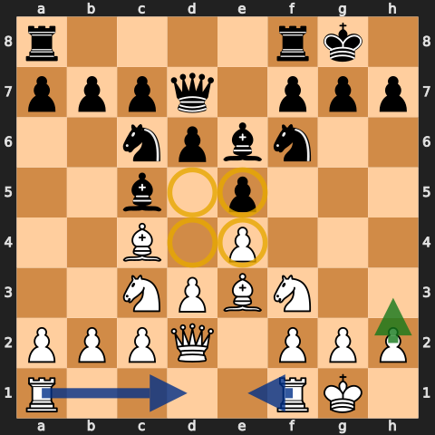

The first level removes choices. Aman uses four hard restrictions:

- no premoves;
- no tactics;
- no gambits;
- no sacrifices.

He also never resigns. The complete list is restated in [Episode 1 at 54:43](https://www.youtube.com/watch?v=COuBww22MUA&t=3283s).

The positive routine is:

1. Put a pawn in the centre.
2. Develop knights, then bishops, toward the centre.
3. Castle as soon as possible.
4. Take free pieces and equal trades.
5. Connect the rooks and bring them toward the middle.
6. Make an escape square for the king.
7. Only after the useful moves are finished, use an RPM.
8. In the endgame, activate the king and attack pawns.

“No tactics” is a training restriction, not a claim that tactics do not matter. Aman is making the move filter small enough to use in every game. The board may contain a brilliant move; Level 1 deliberately chooses a move the student can understand and repeat.

The opening is correspondingly plain. As White, start with `e4`. Against `e4`, answer with `...e5`; against `d4`, answer with `...d5`. Develop pieces instead of naming variations.

## 4. The snorkel

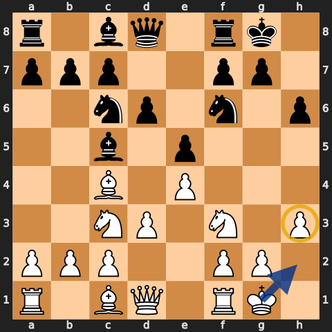

After castling short, `h3` or `...h6` gives the king a flight square. In V2 Aman calls this the **snorkel**: the king can “breathe” on h2 or h7 instead of dying on the back rank. The name first becomes explicit in [Episode 3 at 3:35](https://www.youtube.com/watch?v=txtjq9AhNbE&t=215s).

At Level 1 it is nearly automatic, but the order still matters. Deal with checks and attacks first. Finish urgent development. Aman later slows the snorkel down when an immediate `h3` or `...h6` would give the opponent a hook or miss a stronger central move; that adjustment begins in [Episode 6 at 1:13:34](https://www.youtube.com/watch?v=yNPv5lrbHDk&t=4414s).

So the habit is not “always push the h-pawn immediately.” It is:

- castle;
- make sure the king has room;
- do not create that room while something more urgent is happening.

## 5. The red dot

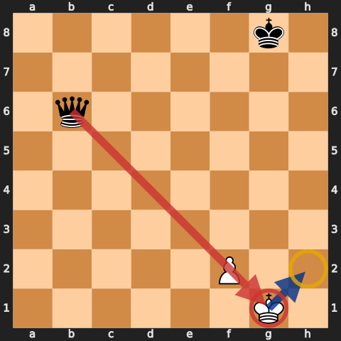

The **red dot** is V2's memorable king-safety warning. If an enemy queen or rook is lined up with the king—sometimes through one of your own pieces—imagine the laser sight and step aside before the line opens.

Aman develops the idea after being punished several times in Episode 4: when you feel the red dot, “duck for cover.” See [1:27:24](https://www.youtube.com/watch?v=WyfYv36M8Qc&t=5244s). The usual cure is `Kh2`, `...Kh7`, or another safe side-step made possible by the snorkel.

Use the concept as a scan:

1. Is the enemy queen or rook on the same file, rank, or diagonal as my king?
2. What piece or pawn currently blocks that line?
3. Can it move with check or tempo?
4. Can my king step away before the line becomes dangerous?

The red dot is not proof that a tactic works. It is a reason to look before continuing the routine.

## 6. RPM: Random Pawn Move

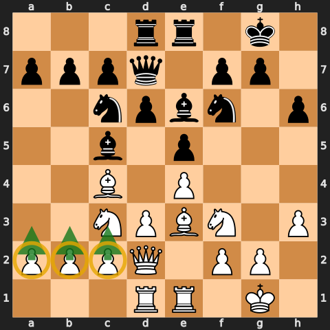

**RPM** means **Random Pawn Move**. Aman names the acronym in [Episode 2 at 18:43](https://www.youtube.com/watch?v=dptb79elO04&t=1123s) and keeps using it through the series.

It answers a common beginner question: “I developed, castled, connected my rooks, and made luft. What now?” Choose a safe pawn move that gains space, usually away from the castled king.

The order is the lesson. An RPM is not a substitute for development, and “random” does not mean careless. Before pushing:

- check that the pawn is not needed to defend something;
- do not open a line toward your king;
- prefer a central gain if one is safely available;
- avoid creating a permanent weak square for no reason.

At Level 3 Aman makes the centre-first refinement explicit: look for a useful central pawn move before a flank RPM. See [Episode 30 at 38:41](https://www.youtube.com/watch?v=_tihMB7Nsko&t=2321s).

## 7. Trades, the king, and never resigning

At Level 1, Aman takes equal trades. Fewer pieces mean fewer things to hang, and a material advantage becomes easier to use. Pawns are not “pieces” under this shortcut; do not abandon development to collect every pawn.

The endgame rule is equally direct.

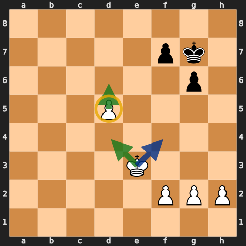

When the queens and several pieces are gone:

- bring the king toward the centre;
- attack pawns;
- create a passed pawn;
- push it;
- keep trading when ahead.

Aman calls the king a weapon in [Episode 5 at 2:49:11](https://www.youtube.com/watch?v=aSyCrQVVGU4&t=10151s). Exact opposition and rook technique come later; the first habit is simply to stop leaving the king on the back rank.

Never resign is part of the course from the first episode. The practical reason is visible all the way to 2000: opponents miss mates, allow perpetual checks, lose on time, and stalemate. Make them finish.

## 8. Level 2: add basic tactics

Level 2 begins in Episode 11. It is still Level 1, now with a small tactical layer and slightly more ambitious development. Aman summarizes the relationship in [Episode 13 at 0:39](https://www.youtube.com/watch?v=FlttDl7HzLc&t=39s): Level 2 is Level 1 plus tactics.

The additions are:

- one-move forks, pins, skewers, discoveries, and mates;
- more aggressive but still natural piece squares;
- both centre pawns when the position allows it;
- keeping a useful pin rather than exchanging automatically;
- safe premoved recaptures and emergency premoves under ten seconds;
- basic mating patterns and passed-pawn technique.

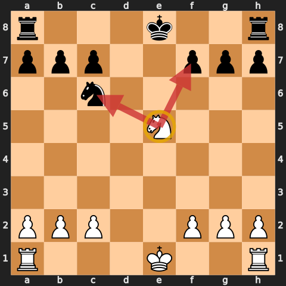

“Basic” matters. Do not turn every move into a six-move combination. Aman warns the class against reaching too far in [Episode 14 at 21:39](https://www.youtube.com/watch?v=4QvPqcOhtlY&t=1299s). Drill simple motifs until they appear without strain.

## 9. Keep the pin and take more space

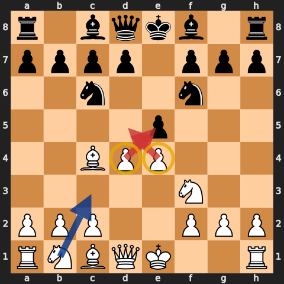

Level 1 often uses `d3` or `...d6`. Level 2 asks whether `d4` or `...d5` is safe. If the opponent has made no claim in the centre, take more room. Aman makes that adjustment in [Episode 14 at 29:58](https://www.youtube.com/watch?v=4QvPqcOhtlY&t=1798s).

The other important exception is the pin.

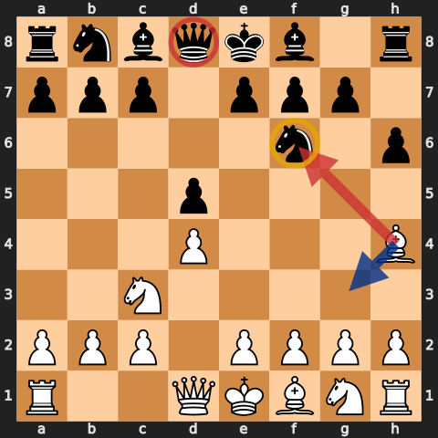

At Level 1, a bishop that pins a knight may take it as soon as a trade appears. At Level 2, keep the pin when it is useful. If the opponent asks the bishop a question with `...h6` or `h3`, retreating can preserve the pressure. Aman states the exception clearly in [Episode 11 at 31:02](https://www.youtube.com/watch?v=hezlfr9NqOg&t=1862s).

Do not generalize too far. Other equal trades remain part of the routine. This is one named exception, not permission to abandon simplification.

## 10. Premoves and mating patterns

V2 keeps premoves tightly controlled:

- a forced recapture may be premoved because the move disappears if the capture never happens;
- below about ten seconds, use more premoves to survive;
- otherwise, look at the opponent's move before moving.

Aman applies the under-ten-seconds rule in [Episode 13 at 48:05](https://www.youtube.com/watch?v=FlttDl7HzLc&t=2885s) and expands it in [Episode 16 at 16:52](https://www.youtube.com/watch?v=PK_FdvtLT-8&t=1012s).

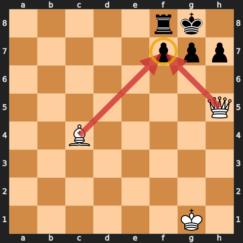

At this level, tactical study should spend more time on forks and mating patterns than on openings. Aman says that directly in [Episode 21 at 1:40:42](https://www.youtube.com/watch?v=c8R4gSauigI&t=6042s). Learn the box around a castled king, queen-and-bishop batteries, back-rank mates, ladder mates, and safe queen/rook conversions.

The point is not to premove a mate you have not checked. First know the pattern; only then use the clock technique when the sequence is forced.

## 11. Level 3: same habits, different order

Level 3 begins in Episode 25. Its simplest description comes later: **“Same habits, different order.”** See [Episode 33 at 23:09](https://www.youtube.com/watch?v=Za6CtR0W0To&t=1389s).

The old checklist no longer dictates every move. You may:

- delay the snorkel for a central move;
- use an RPM earlier when it gains tempo or supports the centre;
- decline an automatic trade;
- develop a bishop before a knight when the position calls for it;
- castle after a useful forcing move rather than immediately;
- make your own threat instead of answering a harmless one.

This freedom is earned. A piece that is genuinely hanging still needs attention. “Active” does not mean pretending the opponent has no threats.

## 12. A small opening layer

V2 introduces opening memory carefully. Aman says the Level 3 player learns a few lines that can produce a quick knockout; if the line ends, return to the habits. See [Episode 34 at 1:12:02](https://www.youtube.com/watch?v=WkvqIGsvzHU&t=4322s).

The recurring White base remains `1.e4` and classical development. Against `...e5`, the Four Knights appears repeatedly even in the 1800s; [Episode 49 at 7:08](https://www.youtube.com/watch?v=kiDh29V3eEQ&t=428s) calls out how common it has been.

The most explicit short system is against the Sicilian:

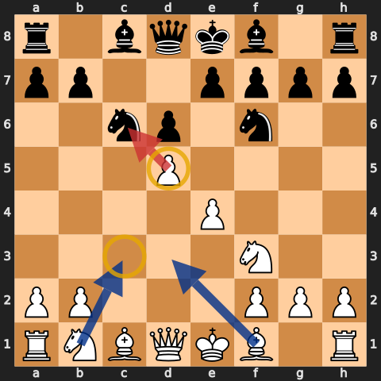

- play `Nf3` and `c3`;
- build `d4`;
- if Black has a knight on c6, use `d5` to gain space and hit it.

Aman gives `c3` and `d4` in [Episode 25 at 1:21:08](https://www.youtube.com/watch?v=O4sskxURwtk&t=4868s), then adds the `d5` response to `...Nc6` in [Episode 29 at 27:54](https://www.youtube.com/watch?v=oeCY0rJ5aYc&t=1674s).

Other openings stay simple:

- Scandinavian: take on d5, develop against the queen, then return to habits;
- French: use natural development and the Exchange structure when it keeps the game clear;
- Queen's Gambit: reinforce the centre rather than grabbing the c-pawn automatically;
- King's Gambit and other gambits: prefer a solid centre and avoid accepting frightening complications without a prepared answer;
- Evans Gambit at Level 4: learn one specific response because normal habit moves can fail.

This is deliberately smaller than V1's later repertoire work.

## 13. Active, not reactive

Aman's Level 3 refrain is **“active chess, not reactive chess.”** The explanation begins in [Episode 25 at 56:58](https://www.youtube.com/watch?v=O4sskxURwtk&t=3418s).

Reactive chess says: the opponent attacked something, so I must retreat. Active chess asks:

- Is the threat real?
- Can I castle, develop, or take the centre with tempo?
- Can I make a stronger threat?
- Can I solve the problem while improving a piece?

The same change applies to trades. Level 3 no longer takes every equal exchange. Before trading, ask who benefits from the recapture, which file opens, and whether the exchange improves or damages the pawn structure.

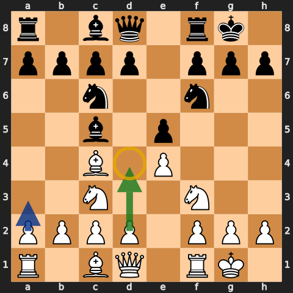

When no forcing move exists, improve the centre before pushing a harmless flank pawn. The RPM remains available; it has simply acquired an order of priority.

## 14. Level 4: make a plan

Level 4 begins at 1600 in Episode 41. The habits remain, but the main task is to formulate a plan. Aman says that directly in [Episode 42 at 5:19](https://www.youtube.com/watch?v=PbN-SUCz1r4&t=319s).

The new questions are broader:

- Which pawn is weak?
- Which square cannot be protected by a pawn?
- Which minor piece fits the pawn structure?
- Which colour of square matters?
- Which exchange improves the endgame?
- Can a rook become active on the seventh rank or behind a passed pawn?
- Is there a specific opening exception worth memorising?

Level 4 is not “no restrictions, do whatever you want.” Aman rejects that reading in [Episode 43 at 12:10](https://www.youtube.com/watch?v=gIDgEnRVYEo&t=730s). The rules are less rigid because the player should now see more consequences.

Rook placement is a useful example. V2 never presents a formal replacement for “rooks to the middle.” Aman still uses that default at Level 4. In individual positions he chooses an open file—[Episode 47 at 29:03](https://www.youtube.com/watch?v=nqz9YxpNWkM&t=1743s) is one example—but there is no V1-style open-file curriculum step.

## 15. Weak pawns, squares, and colour complexes

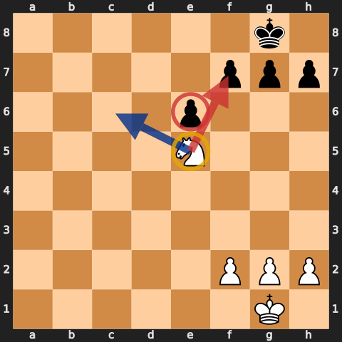

A weak pawn is often attacked most effectively by controlling the square in front of it. Put a piece there, stop the pawn from advancing, and make the defending pieces passive. Aman repeats the rule in [Episode 49 at 56:11](https://www.youtube.com/watch?v=kiDh29V3eEQ&t=3371s).

That gives a practical plan:

1. Find a pawn that cannot be protected by another pawn.
2. Control the square in front of it.
3. Occupy that square with a knight, bishop, rook, or king.
4. Add attackers or improve the worst piece.
5. Trade defenders when the exchange helps.

Colour complexes are taught through piece and pawn placement.

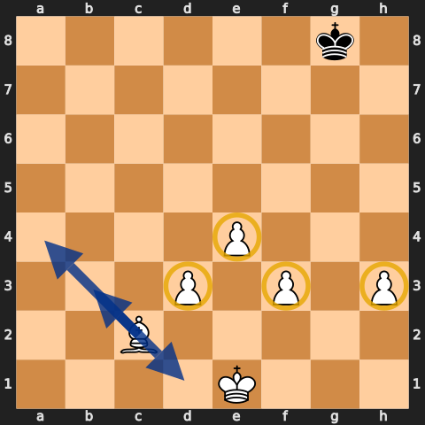

Against an enemy bishop, pieces are safest on the opposite colour. In an opposite-coloured-bishop ending where you need to hold, pawns on your own bishop's colour can be defended by that bishop. Aman's shorthand is **“pawns same color, pieces opposite color”** in [Episode 42 at 46:52](https://www.youtube.com/watch?v=PbN-SUCz1r4&t=2812s).

Do not apply the phrase blindly. With bishop against knight, pawns stuck on your own bishop's colour may obstruct it and become targets. The board decides whether the bishop is defending the chain or trapped behind it.

V2 starts this bishop-versus-knight discussion before Level 4 and keeps returning to it. That is one reason the later jump feels more gradual than V1.

## 16. Endgames

The early endgame habit—use the king—never leaves. Level 4 adds more exact technique:

- opposition and spare tempi in king-and-pawn endings;
- passed pawns and the square rule;
- rook behind a passed pawn;
- active rooks, especially on the second or seventh rank;
- choosing exchanges from the resulting pawn ending, not from material alone.

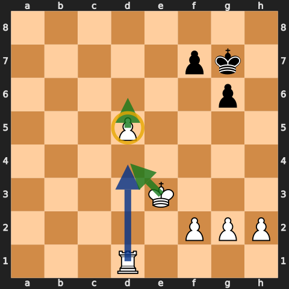

Aman works through the opposition idea in [Episode 51 at 1:31:37](https://www.youtube.com/watch?v=2toziMrJXQ0&t=5497s). The rook-behind-passed-pawn rule remains the practical default; it appears again near the finish in [Episode 54 at 1:33:52](https://www.youtube.com/watch?v=22H4WFhkruM&t=5632s).

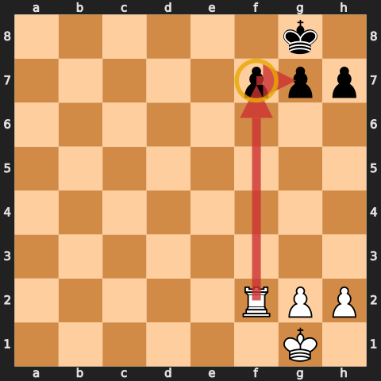

An active rook may be worth more than a pawn. Invading the second or seventh rank attacks several pawns at once and can cut off the king. Aman calls this the goal in a rook ending in [Episode 53 at 1:25:04](https://www.youtube.com/watch?v=JVb7dpL2WjA&t=5104s).

## 17. What never changes

By the end, the exact order is flexible. The foundation is not:

- fight for the centre;
- develop pieces to useful squares;
- get the king safe;
- notice checks, attacks, and loose pieces;
- make simple trades when they help;
- use every piece;
- activate the king in the endgame;
- push passed pawns and place rooks behind them;
- never resign merely because the position looks bad.

The advanced material works because these checks consume less attention. Aman is not replacing the habits; he is deciding when to reorder them.

## 18. How to train with V2

1. Start at the lowest level whose routine is not automatic.
2. Use that level's restrictions for a fixed block of games.
3. After each game, find the first broken habit, not just the final blunder.
4. Drill the basic tactic or mating pattern that appeared.
5. Save only opening positions that repeat; learn one short answer.
6. Replay the critical endgame from both sides.
7. Move up when the current move filter feels natural.
8. When a later rule changes an earlier one, keep the early rule as the default and add the exception.

The 527-game PGN is arranged chronologically and includes episode links for every game shown in the VODs. It is best used as a set of examples: filter by episode, jump to the source, and watch how the same rule survives different openings.

## 19. Decision checklist

Before every move:

1. Am I in check? What did the last move attack or leave loose?
2. Is there a safe free piece or simple trade?
3. Can I put a pawn or piece in the centre?
4. Can I finish development or castle?
5. Does my castled king have a snorkel?
6. Is there a red dot on the king?
7. At Level 2 or above, is there a basic fork, pin, skewer, discovery, or mate?
8. At Level 3 or above, can I play actively instead of answering a harmless move?
9. At Level 4, which weak pawn, square, piece, or endgame should determine the plan?
10. If nothing urgent exists, is there a useful central move before an RPM?

When short on time, simplify the question: check, capture, attack, improve the worst piece. Use premoves only in the safe cases allowed at your level.

## Study files

- [All 527 Building Habits V2 games](../pgn/building-habits-v2-games.pgn)
- [Complete 55-episode playlist and timestamped source index](../sources/building-habits-v2.md)
- [Building Habits V1 guide](building-habits-v1.md)

The diagrams are legal instructional positions, not claims that one exact game reached every board. Green arrows are plans, blue arrows are development or manoeuvres, red arrows are pressure or captures, and yellow circles mark key squares or pieces.
