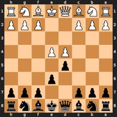
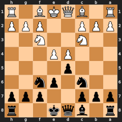
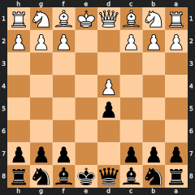
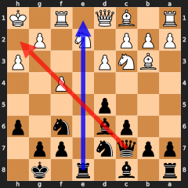
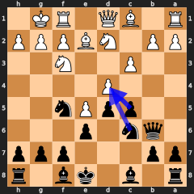
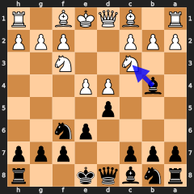
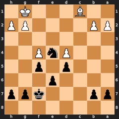

<!-- Generated from source HTML. GitHub renders the HTML below inside this markdown file. -->

<h1>The French Defense Playbook</h1>

A Data-Driven Cheat Sheet from 61 Games 
Based on Aman Hambleton's (sterkurstrakur) French Defense Speedrun &bull; Generated April 23, 2026

<strong>Contents</strong>
<ol>
<li>Overview — The French at a Glance</li>
<li>The Bad LSB — The Central Strategic Problem</li>
<li>The Exchange Variation — Three Plans</li>
<li>The Advanced Variation — Attacking the Chain</li>
<li>The Winawer — Positional Boldness</li>
<li>The Tarrasch & Sidelines</li>
<li>Opponent Disruptions — What Stops Our Plans</li>
<li>The Knight vs Bad Bishop Endgame</li>
<li>Statistics Deep Dive</li>
<li>Games by Theme</li>
</ol>

<!-- ============================================================ -->
<h2>1. Overview — The French at a Glance</h2>
<!-- ============================================================ -->

<strong>The French Defense: 1.e4 e6</strong> — We immediately signal that the center will be contested, not surrendered. The pawn on e6 supports ...d5 on the next move, challenging White's e4 directly.

<strong>The deal:</strong> We get a solid, closed center and clear strategic plans. The price? Our light-squared bishop gets locked behind the e6/d5 pawn chain — the "bad French bishop." Almost every plan in the French revolves around either solving this problem or making it irrelevant.

<strong>The speedrun record:</strong> 59/61 wins (96%) 1 draw 1 loss (likely vs Stockfish)

    
    
The French pawn structure after 1.e4 e6 2.d4 d5. Black challenges the center directly. Everything flows from this moment — White must choose a variation, and each one gives Black a different strategic plan.

<h3>Variation Breakdown</h3>
<table>
<tr><th>Variation</th><th>Games</th><th>Description</th></tr>
<tr><td><strong>Exchange</strong> (3.exd5 exd5)</td><td>26</td><td>Open center. Three sub-plans depending on opponent's play.</td></tr>
<tr><td><strong>Advanced</strong> (3.e5)</td><td>16</td><td>Closed center. Attack the d4 pawn chain from below.</td></tr>
<tr><td><strong>Winawer</strong> (3.Nc3 Bb4)</td><td>12</td><td>Pin the knight, trade the bad bishop. Positional sacrifice of DSB for light-square control.</td></tr>
<tr><td><strong>Tarrasch</strong> (3.Nd2)</td><td>4</td><td>Higher ELO variation. Treated similarly to Advanced with c5 break.</td></tr>
<tr><td><strong>Sidelines</strong> (2.Nf3, 2.f4, etc.)</td><td>12</td><td>Irregular responses. Aman adapts flexibly.</td></tr>
</table>

<strong>💡 The Core Principle:</strong> The French is <em>reactive</em> — our plan depends heavily on which variation White chooses. But the strategic thread is constant: solve or exploit the bad LSB, fight for the center, and aim for favorable endgames where our knight outshines their bishop.

<!-- ============================================================ -->
<h2>2. The Bad LSB — The Central Strategic Problem</h2>
<!-- ============================================================ -->

The light-squared bishop on c8 is trapped behind e6/d5. This is not just a French problem — it's <em>the</em> French problem. Every variation has a different solution, and choosing the right one is often the difference between a comfortable position and a cramped mess.

    
    
The bad LSB problem: Black's c8 bishop is completely blocked by e6 and d5. It has no active diagonal. Every French variation offers a different solution to free or trade this piece.

<h3>Solution 1: The Ba6 Trade (Winawer Advanced)</h3>

In the Winawer advanced, Aman plays <strong>b6 → Ba6</strong> to offer a direct trade of the bad LSB. We're willing to invest significant tempi — after the trade, we recapture with <strong>Nxa6</strong> (awkward!) and then reroute the knight via <strong>Nb8 → Nc6</strong> to a better square. The knight loses 3 tempi but the bishop was worth removing.

6 games with b6 + Ba6 2 games with Nxa6 reroute

    <h4>Ba6 Trade — Key Games (6 games)</h4>
    
b6 followed by Ba6 to trade the bad LSB. Nxa6 then Nb8→Nc6 reroute.

    <ul><li><a href="https://lichess.org/study/TRXhfaYZ/im3hwcKN">TylerBurleigh</a> ✓ (Winawer advanced)</li><li><a href="https://lichess.org/study/TRXhfaYZ/9nHsfkmC">martinlop64</a> ✓ (Winawer advanced)</li><li><a href="https://lichess.org/study/TRXhfaYZ/Z5U92nFo">alfredoolivera</a> ✓ (Winawer advanced)</li><li><a href="https://lichess.org/study/TRXhfaYZ/dKhx1AuG">BestPaper</a> ✓ (Winawer advanced)</li><li><a href="https://lichess.org/study/TRXhfaYZ/9v52Ti6Z">Asdecuty</a> ✓ (Winawer advanced)</li><li><a href="https://lichess.org/study/TRXhfaYZ/XdFMOJSs">Hakuna_Patataa</a> ✓ (1. d4 Winawer transposition)</li></ul>
    

<h3>Solution 2: Development to g4/f5/e6 (Exchange Variation)</h3>

In the exchange variation, the e-file opens and the LSB is no longer structurally trapped. It develops naturally to the <strong>h7-b1 diagonal</strong> — typically <strong>Bg4</strong> (pinning the knight), <strong>Bf5</strong> (active post), or <strong>Be6</strong> (solid defense of d5). In many games, it gets traded on this diagonal, often via Bxd3 or Bxf1.

11 games with Bg4 12 games with Bf5 5 games with Be6 11 traded on the diagonal

<h3>Solution 3: Bd7 → Bb5 (Advanced Variation)</h3>

In the advanced, the chain is closed. Aman sometimes uses <strong>Bd7 → Bb5</strong> to offer the trade on a different diagonal. Mentioned in annotations as an alternative to Qb6 — "starting with Qb6 to leave the option open to play Bd7, Bb5 to trade off the bad French bishop."

3 games with Bd7-Bb5 16 games with Bd7

<h3>Solution 4: Make It Irrelevant</h3>

Sometimes you don't solve the bad bishop — you make it irrelevant. In many exchange games, Aman aims for <strong>knight vs bad bishop endgames</strong> where our knight dominates their remaining bishop. The French bishop isn't a problem if the game is won before it matters, or if the opponent's pieces are worse.

14 games with N vs B endgame theme

<strong>📊 Across all variations:</strong> The LSB was actively developed (Bg4/Bf5/Be6/Ba6/Bb5) in <strong>33</strong> of 61 games. In the rest, it either stayed home or the game ended before it mattered (quick wins, etc.). The message: actively solving the LSB problem is a priority, not an afterthought.

<!-- ============================================================ -->
<h2>3. The Exchange Variation — Three Plans</h2>
<!-- ============================================================ -->

After <strong>1.e4 e6 2.d4 d5 3.exd5 exd5</strong>, the center is symmetrical and open. The e-file is half-open. This is where the French gets interesting — we have <strong>three distinct plans</strong>, and the right choice depends on what our opponent does in the first few moves.

    
    
Exchange French after 3.exd5 exd5: symmetrical center, open e-file. The bad LSB problem is eased — now choose between Stonewall setup (Plan A), Aggressive O-O-O (Plan B), or Conservative O-O (Plan C).

26 exchange games total 7 aggressive 7 conservative 2 with SW discussion

<h3>Plan A: The Stonewall Setup (f5, Nf6, O-O)</h3>

Push <strong>f5</strong> and go into a Stonewall-like structure with Nf6, Bd6, O-O. This is the dream — a familiar structure for wonestall enjoyers. But it's <strong>fragile</strong> and can be thwarted easily at higher ELOs.

<strong>🌳 When is the Stonewall safe?</strong>  
<strong>✅ Green light (SW possible):</strong> 
&nbsp;&nbsp;• Opponent plays <strong>Nf3</strong> (blocks Qh5+ check) AND wastes tempo (e.g. h3) 
&nbsp;&nbsp;• Opponent has no way to get Qh5+ or Qe2+ in 
&nbsp;&nbsp;• Opponent hasn't played c4 + Nc3 + O-O + Re1  
<strong>🔴 Red flags (SW dangerous):</strong> 
&nbsp;&nbsp;• <strong>Qh5+</strong> or <strong>Qe2+</strong> early — disrupts our setup, may force us off-plan 
&nbsp;&nbsp;• <strong>c4 + Nc3</strong> — attacks our d5 pawn, may force us to drop a pawn 
&nbsp;&nbsp;• <strong>O-O + Re1+</strong> — rook check on the open e-file causes problems 
&nbsp;&nbsp;• <strong>Bc4 → Bb3</strong> — early bishop pressure on d5, very annoying  
<strong>Bottom line:</strong> The SW needs the opponent to cooperate. If they know what they're doing, it "will not scale past the level that our opponents start to really know what they're doing." At lower ELOs, "hope chess" works. At higher levels, look at Plans B or C.

<strong>⚠️ From the annotations:</strong> "Again, this is the way the SW can get us into a right mess." &bull; "Could get ourselves in trouble with the SW here." &bull; "Do we really want to try to force the SW and play these kinds of positions?" — Repeated warnings across 2 games.

    <h4>Exchange with SW References (2 games)</h4>
    
Games where the Stonewall was discussed, attempted, or explicitly avoided.

    <ul><li><a href="https://lichess.org/study/TRXhfaYZ/0QwYj6hk">swoosh999</a> ✓ (advanced)</li><li><a href="https://lichess.org/study/TRXhfaYZ/NDUZuE7w">1992marko</a> ✓ (exchange aggressive O-O-O could have forced a SW)</li></ul>
    

<h3>Plan B: The Aggressive French Exchange (Bd6, Ne7, Bg4/Bf5/Be6, Qd7, O-O-O)</h3>

The punchy option. Develop the DSB to d6 (aimed at h2), knight to e7, LSB to g4/f5/e6, queen to d7, then <strong>castle queenside</strong> and launch the <strong>f6 + g5 + h5 pawn storm</strong>. This creates massive kingside attacking chances.

7 games with O-O-O 7 with full setup (Bd6+Qd7+O-O-O)

<strong>💡 Key detail — f6 and Bg5:</strong> In this setup, when the opponent plays <strong>Bg5</strong> pinning our knight to our king, we respond with <strong>f6</strong> — and we're happy about it. Why? Because (1) we wanted to play f6 anyway, (2) f6 controls g5 and e5, preventing knight infiltration, and (3) it prepares our g5 pawn push and kingside storm. The "pin" actually helps us. Appears in <strong>9</strong> games.

<strong>💡 Move order tip — Bd6 first:</strong> Aman mentions he likes to play Bd6 first when going aggressive. The reason: if the d-pawn is attacked (by Nc3), we want to respond with Ne7 — but Ne7 blocks the DSB if it hasn't been developed yet. DSB out first, then Ne7.

<strong>⚠️ What prevents Plan B?</strong> 
• <strong>Nc3</strong> (34 games) — attacks d5 pawn immediately, may prevent smooth development 
• <strong>c4</strong> (7 games) — strong disruption, forces us to respond to d5 pressure 
• <strong>Bc4 → Bb3</strong> (4 games) — bishop eyes d5, cramping 
• <strong>Qe2+</strong> (10 games) — may force early O-O instead of O-O-O; plan switches to Re8 pressure

    <h4>Aggressive Exchange (O-O-O) — Key Games (7 games)</h4>
    
The attacking setup: Bd6, LSB development, Qd7, O-O-O, kingside storm.

    <ul><li><a href="https://lichess.org/study/TRXhfaYZ/DW6LJkAU">turtletaufiq</a> ✓ (exchange aggressive O-O-O)</li><li><a href="https://lichess.org/study/TRXhfaYZ/1eCLvY47">iiFurryii</a> ✓ (exchange aggressive O-O-O)</li><li><a href="https://lichess.org/study/TRXhfaYZ/NDUZuE7w">1992marko</a> ✓ (exchange aggressive O-O-O could have forced a SW)</li><li><a href="https://lichess.org/study/TRXhfaYZ/sYH1q6JZ">LuisH-97</a> ✓ (exchange aggressive O-O-O)</li><li><a href="https://lichess.org/study/TRXhfaYZ/TAcIrbDH">Armen_1962</a> ✓ (exchange aggressive O-O-O)</li><li><a href="https://lichess.org/study/TRXhfaYZ/rV4wLuZA">spadi1969</a> ✓ (exchange aggressive O-O-O)</li><li><a href="https://lichess.org/study/TRXhfaYZ/jIhnynTc">James007229</a> ✓ (exchange aggressive O-O-O)</li></ul>
    

<h3>Plan C: The Conservative French Exchange (Bd6, c6, Nf6, O-O)</h3>

    
    
The ideal conservative setup: Re8 seizes the open e-file, Qc7 creates a battery with the Bd6 (eyeing h2), Nbd7 is flexible (supports Ne5/Nc5). From here Black grinds — the position is comfortable with no weaknesses.

The fallback. Develop solidly with <strong>Bd6, c6, Nf6, O-O</strong>. The most boring variation — little imbalance — but reliable and safe. Often followed by an <strong>h6 luft ("snork")</strong> and a Building Habits-style grind.

From the annotations: "It might be a boring set up but it allows us to get safely to the middle game with a comfortable position pretty much every time. Very habits-like, really."

7 games with conservative setup 11 with Re8 2 with Qc7 8 with QS pawn expansion

<h4>The Conservative Setup: Re8 + Qc7 + Nbd7</h4>

The conservative exchange is not just "boring and safe" — it has a concrete middlegame plan. After <strong>Bd6, c6, Nf6, O-O</strong>, the next phase is:

<ol>
<li><strong>Re8</strong> — Seize the open e-file immediately after castling. The rook pressures e1 and any piece that lands on e5. In 11 of the O-O exchange games, Aman plays Re8 (typically moves 8-11).</li>
<li><strong>Qc7</strong> — Creates a battery with the Bd6, aiming down the c7-h2 diagonal toward White's king. Also keeps the bishop defended when the knight reroutes via Nbd7. Aman plays this in 2 games.</li>
<li><strong>Nbd7</strong> — Flexible knight placement (7 games). Supports Nc5 (pressuring d3/e4), or Ne5 occupying the outpost. Also clears the way for Qc7 without blocking pieces.</li>
</ol>

<strong>Model sequence:</strong> ...Bd6, ...c6, ...Nf6, ...O-O, ...h6, ...Re8, ...Nbd7, ...Qc7 — then grind.

<strong>Key example:</strong> vs nelson2127 — perfect setup: 8...Re8 9...Nbd7 10...Qc7, and after White's 11.Ng4?? the rook on e8 immediately punishes with Rxe1+.

<h4>Queenside Pawn Expansion (b5-a5-b4)</h4>

In 8 exchange O-O games, Aman pushes queenside pawns as a secondary plan. This is not random — it's a positional idea that fits the symmetrical structure:

<ul>
<li><strong>Space + piece activity:</strong> b5-a5 gains queenside space and opens lines for the rooks/bishop. The c8 bishop can develop to b7 behind the b-pawn.</li>
<li><strong>Create targets:</strong> ...b4 can hit a Nc3, destabilizing White's center control. If axb4, the a-file opens for Black's rook.</li>
<li><strong>Endgame squeeze:</strong> Connected passed pawns on the queenside become decisive in simplified positions.</li>
</ul>

<strong>Best example:</strong> vs miks121236 — 12...b5 13...a5 14...Nc5 15...b4 cracking open the queenside. White's 16.Bd2?? loses material to bxc3. The resulting pawn majority wins a 86-move grind.

<strong>Even in losses:</strong> vs Laszar0v — 18...a5 and later 31...b5 as counterplay, though Black went wrong tactically. The idea was still correct.

    <h4>Conservative Exchange — Key Games (7 games)</h4>
    
Solid Bd6 + c6 + Nf6 + O-O setup. Safe fallback when aggressive plans are denied.

    <ul><li><a href="https://lichess.org/study/TRXhfaYZ/3e9BdSWX">nelson2127</a> ✓ (exchange conservative O-O)</li><li><a href="https://lichess.org/study/TRXhfaYZ/YlPsjY4J">mazouziabdo</a> ✓ (exchange conservative O-O)</li><li><a href="https://lichess.org/study/TRXhfaYZ/DnAWDMiE">Mohamadkorosh</a> ✓ (exchange conservative O-O)</li><li><a href="https://lichess.org/study/TRXhfaYZ/66JZHNUP">miks121236</a> ✓ (exchange conservative O-O)</li><li><a href="https://lichess.org/study/TRXhfaYZ/VO4Qfhtu">Altiniiiiii</a> ✓ (exchange conservative O-O)</li><li><a href="https://lichess.org/study/TRXhfaYZ/Ws7lLVX0">kushtrim22222</a> ✓ (Winawer exchange)</li><li><a href="https://lichess.org/study/TRXhfaYZ/UgAV9SQA">Laszar0v</a> ✗ (exchange conservative Qe2+ O-O. Likely vs Stockfish)</li></ul>
    

    <h4>Re8 Open File Pressure (11 games)</h4>
    
Rook to the open e-file — the primary active idea in the conservative setup.

    <ul><li><a href="https://lichess.org/study/TRXhfaYZ/B8OXuk9t">LMARTG</a> ✓ (exchange, early Qe2 check)</li><li><a href="https://lichess.org/study/TRXhfaYZ/3e9BdSWX">nelson2127</a> ✓ (exchange conservative O-O)</li><li><a href="https://lichess.org/study/TRXhfaYZ/YlPsjY4J">mazouziabdo</a> ✓ (exchange conservative O-O)</li><li><a href="https://lichess.org/study/TRXhfaYZ/V375WRLW">nahcohen</a> ✓ (exchange, early Qe2+, O-O)</li><li><a href="https://lichess.org/study/TRXhfaYZ/DnAWDMiE">Mohamadkorosh</a> ✓ (exchange conservative O-O)</li><li><a href="https://lichess.org/study/TRXhfaYZ/VTYfQRxf">Dom910</a> ✓ (exchange 4. c4)</li><li><a href="https://lichess.org/study/TRXhfaYZ/66JZHNUP">miks121236</a> ✓ (exchange conservative O-O)</li><li><a href="https://lichess.org/study/TRXhfaYZ/VO4Qfhtu">Altiniiiiii</a> ✓ (exchange conservative O-O)</li><li><a href="https://lichess.org/study/TRXhfaYZ/Ws7lLVX0">kushtrim22222</a> ✓ (Winawer exchange)</li><li><a href="https://lichess.org/study/TRXhfaYZ/ahMAdwCk">idanpurnomo</a> ✓ (exchange conservative O-O 4. c4)</li><li><a href="https://lichess.org/study/TRXhfaYZ/UgAV9SQA">Laszar0v</a> ✗ (exchange conservative Qe2+ O-O. Likely vs Stockfish)</li></ul>
    

    <h4>Queenside Pawn Expansion (8 games)</h4>
    
b5/a5 push — secondary plan creating queenside space and targets.

    <ul><li><a href="https://lichess.org/study/TRXhfaYZ/B8OXuk9t">LMARTG</a> ✓ (exchange, early Qe2 check)</li><li><a href="https://lichess.org/study/TRXhfaYZ/V375WRLW">nahcohen</a> ✓ (exchange, early Qe2+, O-O)</li><li><a href="https://lichess.org/study/TRXhfaYZ/jNZxC2wT">nik6703</a> ✓ (exchange aggressive transitions to O-O, active king)</li><li><a href="https://lichess.org/study/TRXhfaYZ/66JZHNUP">miks121236</a> ✓ (exchange conservative O-O)</li><li><a href="https://lichess.org/study/TRXhfaYZ/Ws7lLVX0">kushtrim22222</a> ✓ (Winawer exchange)</li><li><a href="https://lichess.org/study/TRXhfaYZ/cseCq5Iu">Cirillo5</a> ✓ (Winawer exchange)</li><li><a href="https://lichess.org/study/TRXhfaYZ/RNtltNGp">potatolauncher3000</a> ✓ (exchange conservative O-O 4. c4)</li><li><a href="https://lichess.org/study/TRXhfaYZ/UgAV9SQA">Laszar0v</a> ✗ (exchange conservative Qe2+ O-O. Likely vs Stockfish)</li></ul>
    

<strong>🌳 Exchange Decision Tree:</strong>  
1. Can you play the <strong>Stonewall</strong>? (Nf3 blocks checks, opponent wasted tempo, no c4+Nc3+Re1 threat) 
&nbsp;&nbsp;&nbsp;→ Yes → <strong>Plan A: f5, Nf6, O-O</strong> (SW structure) 
&nbsp;&nbsp;&nbsp;→ No → Continue to 2  
2. Can you play the <strong>Aggressive setup</strong>? (No immediate Nc3/c4/Bc4 pressure on d5, no Qe2+ forcing early O-O) 
&nbsp;&nbsp;&nbsp;→ Yes → <strong>Plan B: Bd6, Ne7, Bg4/Bf5/Be6, Qd7, O-O-O, pawn storm</strong> 
&nbsp;&nbsp;&nbsp;→ No → Continue to 3  
3. Fall back to <strong>Conservative</strong>: 
&nbsp;&nbsp;&nbsp;→ <strong>Plan C: Bd6, c6, Nf6, O-O, then Re8 + Nbd7 + Qc7 → grind</strong> 
&nbsp;&nbsp;&nbsp;→ Secondary plan: <strong>b5-a5 queenside expansion</strong> when center is stable

<h3>The Qe2+ Problem</h3>

When the opponent plays an early <strong>Qe2+</strong>, our plans shift. We often must castle kingside quickly (O-O) and pivot to <strong>Re8</strong> pressure on the open e-file to harass the exposed queen. The aggressive O-O-O plan is usually off the table, but the resulting positions still offer good chances.

10 games with Qe2+ disruption

    <h4>vs Qe2+ Disruption (10 games)</h4>
    
Early queen check forces a change of plans. Usually O-O followed by Re8 pressure.

    <ul><li><a href="https://lichess.org/study/TRXhfaYZ/B8OXuk9t">LMARTG</a> ✓ (exchange, early Qe2 check)</li><li><a href="https://lichess.org/study/TRXhfaYZ/1eCLvY47">iiFurryii</a> ✓ (exchange aggressive O-O-O)</li><li><a href="https://lichess.org/study/TRXhfaYZ/ohl7A9Ku">vnd83</a> ✓ (exchange, early Qe2+ )</li><li><a href="https://lichess.org/study/TRXhfaYZ/Ia2sNfxk">DANIELONATE</a> ✓ (early Bb5+)</li><li><a href="https://lichess.org/study/TRXhfaYZ/aVaw7uCz">Olliert</a> ✓ (Winawer exchange)</li><li><a href="https://lichess.org/study/TRXhfaYZ/V375WRLW">nahcohen</a> ✓ (exchange, early Qe2+, O-O)</li><li><a href="https://lichess.org/study/TRXhfaYZ/4X4x2BKC">zulu666666</a> ✓ (Tarrasch)</li><li><a href="https://lichess.org/study/TRXhfaYZ/L7QxRaEm">TheGreyhound</a> ✓ (2. Qe2)</li><li><a href="https://lichess.org/study/TRXhfaYZ/UgAV9SQA">Laszar0v</a> ✗ (exchange conservative Qe2+ O-O. Likely vs Stockfish)</li><li><a href="https://lichess.org/study/TRXhfaYZ/7egCRhtX">hh33zz</a> ✓ (2. Nc3)</li></ul>
    

<!-- ============================================================ -->
<h2>4. The Advanced Variation — Attacking the Chain</h2>
<!-- ============================================================ -->

    
    
Advanced French: Black's ideal setup achieved — Qb6 + Nc6 + c5 = triple pressure on d4 (the chain's base). Nf5 on the outpost (protected by e6). Attack the base, not the tip.

After <strong>1.e4 e6 2.d4 d5 3.e5</strong>, the center is locked. White has a space advantage but an overextended pawn chain. Our job: <strong>attack that chain from below</strong>. The primary targets are the d4 pawn (base) and the e5 pawn (tip).

16 advanced games 13 with Qb6 12 with Qb6+Nc6 combined

<h3>The Core Plan: Qb6 + Nc6 + c5</h3>

Three pieces converge on d4:

<ul>
<li><strong>Qb6</strong> — pressures d4 and threatens b2 (opponents frequently blunder the b2 pawn by moving their DSB out)</li>
<li><strong>Nc6</strong> — adds a third attacker on d4</li>
<li><strong>c5</strong> — the classic pawn lever against the chain base</li>
</ul>

At lower ELOs, Aman starts with Qb6 first because opponents often blunder b2 immediately. At higher ELOs, Nc6 first to keep more flexibility.

<strong>💡 Rule of thumb:</strong> If the opponent does not play c3, take with <strong>cxd4</strong>. Exchanging opens lines and removes the chain base. After cxd4, the DSB may be temporarily blocked, but the position opens up favorably.

<strong>📊 The b2 blunder:</strong> In <strong>6</strong> games, Aman won the b2 pawn after the opponent moved their DSB to defend d4. "Lower ELO players playing the French advanced find it very difficult to keep their pawn chain intact as they don't know the accurate way to defend and often collapse to queenside pressure."

<h3>The Ne7 → f5 Push</h3>

After the initial pressure with Qb6/Nc6/c5, the g8 knight comes to <strong>e7</strong> (not f6, which is blocked by e5). From e7, it supports a <strong>f5</strong> break — another attack on the pawn chain, this time from the other side. The cxd4 exchange may come first, temporarily blocking the DSB, but the position opens after f5.

Aman also uses <strong>Bd7</strong> in the advanced for flexible LSB deployment — potentially Bb5 to trade, or simply supporting the queenside.

8 advanced games with Ne7 2 games with f5 break

<h3>An Important Note: The Closed Center</h3>

<strong>📊 No rush to castle:</strong> In the advanced French, the center is <em>closed</em>. Aman frequently delays or skips castling entirely. "One good aspect of the French is that the center is closed so there is often not a pressing need to castle." Many games are won with the king still in the center, using the extra tempi for the attack.

    <h4>Qb6 + Nc6 Combined Pressure (12 games)</h4>
    
Both Qb6 and Nc6 target d4. The core advanced plan.

    <ul><li><a href="https://lichess.org/study/TRXhfaYZ/SzTZBlsn">hyio</a> ✓ (advanced)</li><li><a href="https://lichess.org/study/TRXhfaYZ/0QwYj6hk">swoosh999</a> ✓ (advanced)</li><li><a href="https://lichess.org/study/TRXhfaYZ/yh0VwSkh">graceplayschess2</a> ✓ (advanced)</li><li><a href="https://lichess.org/study/TRXhfaYZ/60dglOcm">Le_Sang93</a> ✓ (advanced)</li><li><a href="https://lichess.org/study/TRXhfaYZ/VOezKivv">SlipShodMan</a> ✓ (advanced)</li><li><a href="https://lichess.org/study/TRXhfaYZ/vXimecki">micoponj</a> ✓ (advanced)</li><li><a href="https://lichess.org/study/TRXhfaYZ/BWkuctQA">Zat001ch1e</a> ✓ (advanced)</li><li><a href="https://lichess.org/study/TRXhfaYZ/NSJT64ZM">hishamm9</a> ✓ (2. Nf3)</li><li><a href="https://lichess.org/study/TRXhfaYZ/ShPF0dS7">lossmoose</a> ✓ (advanced)</li><li><a href="https://lichess.org/study/TRXhfaYZ/D4Xq9FHW">uhmaho</a> ✓ (advanced)</li><li><a href="https://lichess.org/study/TRXhfaYZ/yFHT7LwI">More2Lose</a> ✓ (Tarrasch)</li><li><a href="https://lichess.org/study/TRXhfaYZ/7egCRhtX">hh33zz</a> ✓ (2. Nc3)</li></ul>
    

    <h4>b2 Pawn Grabs (6 games)</h4>
    
Opponents blunder the b2 pawn after moving their DSB. 'Pawn grabber Hambo strikes again!'

    <ul><li><a href="https://lichess.org/study/TRXhfaYZ/SzTZBlsn">hyio</a> ✓ (advanced)</li><li><a href="https://lichess.org/study/TRXhfaYZ/0QwYj6hk">swoosh999</a> ✓ (advanced)</li><li><a href="https://lichess.org/study/TRXhfaYZ/60dglOcm">Le_Sang93</a> ✓ (advanced)</li><li><a href="https://lichess.org/study/TRXhfaYZ/VOezKivv">SlipShodMan</a> ✓ (advanced)</li><li><a href="https://lichess.org/study/TRXhfaYZ/2Y93AeEZ">franky24</a> ✓ (2. f4)</li><li><a href="https://lichess.org/study/TRXhfaYZ/RNtltNGp">potatolauncher3000</a> ✓ (exchange conservative O-O 4. c4)</li></ul>
    

<!-- ============================================================ -->
<h2>5. The Winawer — Positional Boldness</h2>
<!-- ============================================================ -->

    
    
The Winawer: 3...Bb4 pins the Nc3. Aman plays this 100% of the time against Nc3. After e5, the battle for light squares begins — b6 then Ba6 trades the bad LSB.

After <strong>1.e4 e6 2.d4 d5 3.Nc3</strong>, we play <strong>3...Bb4</strong> — pinning the knight and preparing to trade or retreat. The Winawer is the sharpest mainline French and often leads to asymmetric pawn structures after White plays e5.

12 Winawer games 5 advanced 4 exchange 2 Ne2 gambit

<h3>Winawer Advanced: The b6 → Ba6 Plan</h3>

When White pushes e5 (Winawer advanced), Aman's plan is clear: <strong>b6 → Ba6</strong> — trading the bad LSB. After <strong>Nxa6</strong>, we accept the awkward knight and reroute it: <strong>Nb8 → Nc6</strong>. This costs tempi but eliminates the fundamental French weakness.

After the trade, we play positional chess. We'll be weak on dark squares (having traded the DSB for the pin earlier) but <strong>strong on light squares</strong>. Our central pawns create outposts for our knights. The endgame plan: reach <strong>Knight vs Bishop</strong> where our pawns are fixed on the right color.

<strong>💡 The h6/h5 Idea:</strong> In the Winawer advanced, a common White plan is Nh3→Nf4 targeting e6 and d5. Aman's counter is <strong>h5</strong> — "doesn't make a lot of sense, but that's normally what the plan is." It prevents Nf4-g6 ideas and gains kingside space.

<strong>💡 Qg4 Counter:</strong> After Bb4, White can play <strong>Qg4</strong> attacking g7. This is a "nice counter to Bb4 for white." When White plays Nf3 first, Qg4 is prevented — which is good for us.

    <h4>Winawer Advanced — Key Games (5 games)</h4>
    
The positional approach: b6, Ba6 trade, knight reroute, light-square control.

    <ul><li><a href="https://lichess.org/study/TRXhfaYZ/im3hwcKN">TylerBurleigh</a> ✓ (Winawer advanced)</li><li><a href="https://lichess.org/study/TRXhfaYZ/9nHsfkmC">martinlop64</a> ✓ (Winawer advanced)</li><li><a href="https://lichess.org/study/TRXhfaYZ/Z5U92nFo">alfredoolivera</a> ✓ (Winawer advanced)</li><li><a href="https://lichess.org/study/TRXhfaYZ/dKhx1AuG">BestPaper</a> ✓ (Winawer advanced)</li><li><a href="https://lichess.org/study/TRXhfaYZ/9v52Ti6Z">Asdecuty</a> ✓ (Winawer advanced)</li></ul>
    

<h3>Winawer Exchange: LSB Freed</h3>

When White exchanges (exd5 exd5) in the Winawer, the LSB is no longer bad — the e-file is open and the bishop has squares. "Because this transposed to the exchange our 'bad' French bishop is no longer bad." We can play Nc6 directly and bring the LSB to g4 or wherever it's needed.

    <h4>Winawer Exchange — Key Games (4 games)</h4>
    
Exchange in the Winawer frees the LSB. Flexible piece development.

    <ul><li><a href="https://lichess.org/study/TRXhfaYZ/aVaw7uCz">Olliert</a> ✓ (Winawer exchange)</li><li><a href="https://lichess.org/study/TRXhfaYZ/Ws7lLVX0">kushtrim22222</a> ✓ (Winawer exchange)</li><li><a href="https://lichess.org/study/TRXhfaYZ/cseCq5Iu">Cirillo5</a> ✓ (Winawer exchange)</li><li><a href="https://lichess.org/study/TRXhfaYZ/vVEL1Z3a">joca1234</a> ✓ (1.d4 Winawer exchange transposition)</li></ul>
    

<h3>Winawer Ne2 Gambit: Why NOT Bxc3</h3>

When White plays <strong>4.Ne2</strong> instead of the mainline e5, the whole logic of the Winawer shifts. Normally, Bxc3+ is powerful because it <em>doubles White's pawns</em> — bxc3 creates a permanent structural weakness. But with Ne2 on the board, White recaptures <strong>Nxc3</strong> instead — no pawn damage at all.

From the annotations: <em>"We don't want to play Bxc3 because it just gets replaced by a knight."</em> And: <em>"The Ne2 makes our Bxc3 plan, b6, Ba6 plans etc., a lot less interesting so we go for regular development."</em>

<strong>💡 The Ba5 Retreat:</strong> Instead of trading on c3, Aman plays <strong>a3 Ba5</strong> — retreating the bishop to a useful diagonal. In both Ne2 games (TodorovicMilos, hallvardhf), the bishop goes to a5 after a3, never takes on c3. The bishop stays active, eyes the c3 square from a distance, and can reroute to b6 (pressuring d4) or stay on a5 depending on the position.

<strong>🌳 Ne2 Gambit — Key Ideas:</strong>  
<strong>DON'T:</strong> Play Bxc3 — Nxc3 recaptures cleanly, no structural damage to White 
<strong>DO:</strong> Retreat Ba5 after a3, develop Nc6, assault the center with f6 (if e5 is played) 
<strong>Castle:</strong> Prefer O-O. From the annotations: "we prefer O-O" — keep it simple 
<strong>Center play:</strong> "When the knight is not on f3 we need to assault the center"  
<strong>After e5 f6:</strong> The f-file opens. Nge7→Nf5 aims at d4. Qf7 eyes f2 after castling. 
<strong>After exd5:</strong> Transposes to exchange-like positions where Ne2 is slightly misplaced.

    <h4>Winawer Ne2 Gambit — Key Games (2 games)</h4>
    
White plays 4.Ne2 instead of e5. Ba5 retreat, not Bxc3.

    <ul><li><a href="https://lichess.org/study/TRXhfaYZ/TSrPWH7Q">TodorovicMilos</a> ✓ (Winawer 4. Ne2 gambit)</li><li><a href="https://lichess.org/study/TRXhfaYZ/FOkGGQAN">hallvardhf</a> ½ (Winawer 4. Ne2 gambit)</li></ul>
    

<!-- ============================================================ -->
<h2>6. The Tarrasch & Sidelines</h2>
<!-- ============================================================ -->

<h3>The Tarrasch (3.Nd2)</h3>

More common at higher ELOs. GM Naroditski recommended this against the French. Aman has two responses:

<ul>
<li><strong>Main line: c5</strong> — treated similarly to the advanced. Take cxd4, recapture with the queen (which can't be harassed by knights since Nd2 blocks Nc3). Then develop with a6, b5, Bb7 ideas.</li>
<li><strong>Alternative: h6, a6 waiting moves</strong> — wait for White to commit before choosing a plan. Aman mentions this but it rarely appeared in the speedrun.</li>
</ul>

4 Tarrasch games 1 with early O-O

<strong>💡 Tarrasch tip:</strong> After cxd4, Qxd4 is playable because White's knight is on d2 (not c3), so there's no Nc3 tempo on the queen. "Again recapturing with the queen, which can't be harassed by white's knights."

<strong>📊 Castle Early, Castle Kingside:</strong> In the main c5 Tarrasch line, the plan is to castle kingside and <em>early</em>. The model sequence: <strong>c5 → cxd4/Qxd4 → Nf6 → Qd8 (or Qd7) → O-O</strong>. vs zulu666666 shows the ideal: O-O on move 8 with "nice easy development" and a comfortable position. When castling is delayed (SleezyMcCheesy, O-O on move 20), king safety becomes a recurring problem — "Aman thinks this may be an inaccuracy before castling." The Tarrasch gives an open position where the king needs shelter fast.

<strong>⚠️ Don't get cute:</strong> Games where Aman delayed castling in the Tarrasch got messy. vs dungeontrapz — never castled, had "queen developed off the back rank, a terrible LSB, and king in the middle of the board." vs More2Lose — never castled in the alternative h6/a6 line (though this was a high-level game where things moved too fast). The takeaway: in the standard c5 line, prioritize O-O over ambitious piece play.

    <h4>Tarrasch — Key Games (4 games)</h4>
    
3.Nd2 variation. c5 main line, queen recaptures freely, castle early.

    <ul><li><a href="https://lichess.org/study/TRXhfaYZ/4X4x2BKC">zulu666666</a> ✓ (Tarrasch)</li><li><a href="https://lichess.org/study/TRXhfaYZ/mke1iZMY">dungeontrapz</a> ✓ (Tarrasch)</li><li><a href="https://lichess.org/study/TRXhfaYZ/vkWqMAKH">SleezyMcCheesy</a> ✓ (Tarrasch)</li><li><a href="https://lichess.org/study/TRXhfaYZ/yFHT7LwI">More2Lose</a> ✓ (Tarrasch)</li></ul>
    

<h3>Sidelines (2.Nf3, 2.f4, 2.Nc3, 2.c4, KIA, etc.)</h3>

Irregular White responses. The key insight: <strong>stick to the classical setup</strong>. Across 12 sideline games, Aman plays c5 in 16 and Nc6 in 8. The message: when the opponent plays something strange, don't panic — play c5, Nc6, develop naturally, and castle when safe.

7 with classical c5 + Nc6

<strong>💡 The Default Response to Weird Stuff:</strong> From the annotations — <em>"stick to what we know"</em> (vs GeneralAdorni, 2.Nf3) and <em>"Basically Aman plans to play this as a normal French advanced"</em> (vs santonegger, 2.f4). The classical setup (<strong>c5, Nc6, Bd7, O-O</strong>) works against almost everything because it's built on fundamental principles: contest the center, develop pieces, get the king safe. Don't try to "punish" weird openings — just play good chess.

<h4>King's Indian Attack (KIA)</h4>

The KIA gets a specific response: <strong>Bd6, Ne7, Nc6, O-O</strong> (castled move 7 vs kkakdkk). Against g3 setups, if White closes the center with d5, this opens our LSB — and we aim for ...g5, ...f6 to shut down White's f4 break. <em>"If we can prevent f4 then our opponent's position is almost hopeless."</em>

<h4>2.f4 — The Nh6 Luxury</h4>

When White plays f4 early, it gives us the <strong>Nh6→Nf5 route</strong> for free. Normally the knight must go via e7 (blocking the DSB temporarily), but f4 opens the h6 square. After c5, Nc6, Nh6→Nf5, we have excellent piece placement. <em>"Since our opponent played f4 it allows us the luxury of routing our knight via h6 to f5."</em>

    <h4>Sidelines — Key Games (12 games)</h4>
    
Non-standard White responses. Classical setup: c5, Nc6, develop, castle.

    <ul><li><a href="https://lichess.org/study/TRXhfaYZ/Kl4Yfayw">mourada1d8</a> ✓ (Nf3 gambit)</li><li><a href="https://lichess.org/study/TRXhfaYZ/Ia2sNfxk">DANIELONATE</a> ✓ (early Bb5+)</li><li><a href="https://lichess.org/study/TRXhfaYZ/gn2gT477">GeneralAdorni</a> ✓ (2. Nf3)</li><li><a href="https://lichess.org/study/TRXhfaYZ/oakfmmj1">Dessolator9</a> ✓ (2 knights French)</li><li><a href="https://lichess.org/study/TRXhfaYZ/NSJT64ZM">hishamm9</a> ✓ (2. Nf3)</li><li><a href="https://lichess.org/study/TRXhfaYZ/pnGcB4y8">azdast124</a> ✓ (2. e5)</li><li><a href="https://lichess.org/study/TRXhfaYZ/pxftQ7Io">santonegger</a> ✓ (2. f4)</li><li><a href="https://lichess.org/study/TRXhfaYZ/2Y93AeEZ">franky24</a> ✓ (2. f4)</li><li><a href="https://lichess.org/study/TRXhfaYZ/lwSPP4Zy">kkakdkk</a> ✓ (King's Indian Attack)</li><li><a href="https://lichess.org/study/TRXhfaYZ/L7QxRaEm">TheGreyhound</a> ✓ (2. Qe2)</li><li><a href="https://lichess.org/study/TRXhfaYZ/7egCRhtX">hh33zz</a> ✓ (2. Nc3)</li><li><a href="https://lichess.org/study/TRXhfaYZ/uBsHCNMw">Shikakaka</a> ✓ (2. c4)</li></ul>
    

<!-- ============================================================ -->
<h2>7. Opponent Disruptions — What Stops Our Plans</h2>
<!-- ============================================================ -->

The French is reactive — our plans depend on what White does. Here are the most common disruptions and how Aman handles them.

<h3>Nc3 — Attacks d5 (34 games, 55%)</h3>

The most common disruption. The knight attacks our d5 pawn and often prevents our aggressive exchange setup. When Nc3 hits, we may need to defend d5 (with Be6, or c6) or pivot to the conservative plan.

From the annotations: "Again, we can't play our system here as the d5 pawn is hit."

<h3>Qe2+ / Qh5+ — Queen Checks (10 games)</h3>

Early queen checks (especially Qe2+) force us to respond and often prevent the aggressive O-O-O setup. The typical response: <strong>castle kingside quickly (O-O) and pivot to Re8 pressure</strong> on the exposed queen. In some games, Qe2+ actually makes the Stonewall possible (because the queen blocks checks itself).

<h3>c4 — Attacks the Center (7 games)</h3>

"That early c4 move by white is a killer when trying to force the SW." When White plays c4 before or alongside Nc3, our d5 pawn is under enormous pressure. Combined with O-O and Re1, White gets a very active position. This is why the Stonewall often fails at higher ELOs.

<h3>Re1+ — Rook Check (8 games)</h3>

On the open e-file, White can play Re1+ which checks our king and forces us to deal with it — either blocking with a piece (losing that piece's flexibility) or moving the king (losing castling rights). Often comes as part of the c4 + Nc3 + O-O + Re1 battery that dismantles the Stonewall attempt.

<h3>Bg5 — The Pin (20 games, 32%)</h3>

A common move that pins our knight. In the aggressive exchange, we answer with <strong>f6</strong> — which we wanted to play anyway. f6 repels the bishop, controls e5 and g5, and prepares our pawn storm. The "pin" actually accelerates our plan. See Section 3 (Plan B) for details.

<table>
<tr><th>Disruption</th><th>Games</th><th>Primary Response</th></tr>
<tr><td>Nc3</td><td>34</td><td>Defend d5 (Be6/c6) or switch to conservative plan</td></tr>
<tr><td>Qe2+ / Qh5+</td><td>10</td><td>O-O quickly, Re8 pressure</td></tr>
<tr><td>c4</td><td>7</td><td>Take dxc4 or accept SW is off the table</td></tr>
<tr><td>Re1+</td><td>8</td><td>Block or accept tempo loss</td></tr>
<tr><td>Bg5</td><td>20</td><td>f6 — we wanted this anyway</td></tr>
<tr><td>Bc4/Bb3</td><td>4</td><td>Defend d5, cramped but manageable</td></tr>
<tr><td>h3 (wasted tempo)</td><td>9</td><td>Exploit the tempo — SW may be possible!</td></tr>
</table>

<!-- ============================================================ -->
<h2>8. The Knight vs Bad Bishop Endgame</h2>
<!-- ============================================================ -->

    
    
Knight vs Bad Bishop endgame: Black's Ne4 dominates from the outpost, doubly supported by d5 and f5 — untouchable by White pawns. White's dark-squared bishop is trapped behind its own d4/f4 pawns with nothing to do. This is the endgame Black aims for in the French.

A recurring theme across the speedrun: Aman steers toward <strong>knight vs bad bishop endgames</strong>. The idea is strategic — leave the opponent with a bishop that's restricted by its own pawns, while our knight can access every square.

This isn't unique to the French — it's a pattern across Aman's repertoire (Building Habits, Stonewall). But the French is particularly well-suited because the pawn structures naturally create outpost squares for the knight and lock in the opponent's remaining bishop.

14 games with N vs B theme

<h3>How to Get There</h3>

<strong>💡 Strategic principles:</strong> 
• <strong>Trade one bishop, keep one knight</strong> — When facing the bishop pair, look to trade one of the opponent's bishops (preferably the active one). The remaining bishop becomes restricted. 
• <strong>Pawns on opposite color to our pieces</strong> — Place pawns on the <em>opposite</em> color of our remaining bishop (or on dark squares if we have a knight). This maximizes piece activity. 
• <strong>Look for c4, e4, f5 outposts</strong> — "c4 is an important square in the French. We see how it could become a strong outpost for our knight via Na5, Nc4. Especially strong in a N vs DSB endgame as our knight would be anchored on a light square." 
• <strong>Simplify when ahead</strong> — Trading into the endgame amplifies structural advantages. "We are happy to take [the trade]" is a frequent refrain.

<strong>📊 From the turtletaufiq game (a masterclass):</strong> "Positionally we are already better. We control g5 and e5 with our f pawn and prevent knight infiltration. We have the bishop pair." Aman then gradually simplifies, aiming for the N vs B endgame. "Look at the mobility of our bishop vs the opponent's. We can traverse the board at will. Our opponent is boxed in and restricted." Eventually: "c4 is an important square... knight anchored on a light square."

    <h4>Knight vs Bad Bishop Endgame — Key Games (14 games)</h4>
    
Games where Aman steered toward a favorable N vs B endgame.

    <ul><li><a href="https://lichess.org/study/TRXhfaYZ/DW6LJkAU">turtletaufiq</a> ✓ (exchange aggressive O-O-O)</li><li><a href="https://lichess.org/study/TRXhfaYZ/SzTZBlsn">hyio</a> ✓ (advanced)</li><li><a href="https://lichess.org/study/TRXhfaYZ/Ia2sNfxk">DANIELONATE</a> ✓ (early Bb5+)</li><li><a href="https://lichess.org/study/TRXhfaYZ/aVaw7uCz">Olliert</a> ✓ (Winawer exchange)</li><li><a href="https://lichess.org/study/TRXhfaYZ/vXimecki">micoponj</a> ✓ (advanced)</li><li><a href="https://lichess.org/study/TRXhfaYZ/BWkuctQA">Zat001ch1e</a> ✓ (advanced)</li><li><a href="https://lichess.org/study/TRXhfaYZ/jNZxC2wT">nik6703</a> ✓ (exchange aggressive transitions to O-O, active king)</li><li><a href="https://lichess.org/study/TRXhfaYZ/66JZHNUP">miks121236</a> ✓ (exchange conservative O-O)</li><li><a href="https://lichess.org/study/TRXhfaYZ/Z5U92nFo">alfredoolivera</a> ✓ (Winawer advanced)</li><li><a href="https://lichess.org/study/TRXhfaYZ/ShPF0dS7">lossmoose</a> ✓ (advanced)</li><li><a href="https://lichess.org/study/TRXhfaYZ/vkWqMAKH">SleezyMcCheesy</a> ✓ (Tarrasch)</li><li><a href="https://lichess.org/study/TRXhfaYZ/jIhnynTc">James007229</a> ✓ (exchange aggressive O-O-O)</li><li><a href="https://lichess.org/study/TRXhfaYZ/D4Xq9FHW">uhmaho</a> ✓ (advanced)</li><li><a href="https://lichess.org/study/TRXhfaYZ/9v52Ti6Z">Asdecuty</a> ✓ (Winawer advanced)</li></ul>
    

<!-- ============================================================ -->
<h2>9. Statistics Deep Dive</h2>
<!-- ============================================================ -->

<h3>Variation Distribution</h3>
<table>
<tr><th>Variation</th><th>Games</th><th>%</th></tr>
<tr><td>Exchange (all)</td><td>26</td><td>42%</td></tr>
<tr><td>Advanced (non-Winawer)</td><td>11</td><td>18%</td></tr>
<tr><td>Winawer Advanced</td><td>5</td><td>8%</td></tr>
<tr><td>Winawer Exchange</td><td>4</td><td>6%</td></tr>
<tr><td>Winawer Ne2 Gambit</td><td>2</td><td>3%</td></tr>
<tr><td>Tarrasch</td><td>4</td><td>6%</td></tr>
<tr><td>Other/Sidelines</td><td>12</td><td>19%</td></tr>
</table>

<h3>Castling Patterns</h3>
<table>
<tr><th>Pattern</th><th>Games</th><th>%</th></tr>
<tr><td>O-O (kingside)</td><td>36</td><td>59%</td></tr>
<tr><td>O-O-O (queenside)</td><td>10</td><td>16%</td></tr>
<tr><td>Never castled</td><td>15</td><td>24%</td></tr>
</table>

<h3>Key Move Frequencies</h3>
<table>
<tr><th>Our Move</th><th>Games</th><th>%</th><th>Context</th></tr>
<tr><td>Nc6</td><td>35</td><td>57%</td><td>Universal development move</td></tr>
<tr><td>c5 break</td><td>24</td><td>39%</td><td>Key pawn lever in advanced/Tarrasch</td></tr>
<tr><td>h6 snork</td><td>18</td><td>29%</td><td>Luft + prevents Bg5/Ng5</td></tr>
<tr><td>Ne7</td><td>17</td><td>27%</td><td>Key in both Winawer and exchange</td></tr>
<tr><td>Bb4 pin</td><td>18</td><td>29%</td><td>The Winawer move</td></tr>
<tr><td>h5 push</td><td>16</td><td>26%</td><td>Kingside expansion / prevents Nf4</td></tr>
<tr><td>Qb6</td><td>13</td><td>21%</td><td>Pressure on d4/b2 in advanced</td></tr>
<tr><td>f6</td><td>15</td><td>24%</td><td>Controls e5/g5, prepares storm</td></tr>
<tr><td>g5 push</td><td>12</td><td>19%</td><td>Kingside pawn storm</td></tr>
<tr><td>Bg4</td><td>11</td><td>18%</td><td>LSB development + pin</td></tr>
<tr><td>Bf5</td><td>12</td><td>19%</td><td>Active LSB on the diagonal</td></tr>
</table>

<h3>Game Length Distribution</h3>
<table>
<tr><th>Length</th><th>Games</th><th>%</th></tr>
<tr><td>Quick wins (≤20 moves)</td><td>11</td><td>18%</td></tr>
<tr><td>Medium (21-39 moves)</td><td>29</td><td>47%</td></tr>
<tr><td>Long (40+ moves)</td><td>21</td><td>34%</td></tr>
</table>

<!-- ============================================================ -->
<h2>10. Games by Theme</h2>
<!-- ============================================================ -->

<h3>By Variation</h3>

    <h4>Exchange Variation (22 games)</h4>
    
All exchange games (3.exd5 exd5).

    <ul><li><a href="https://lichess.org/study/TRXhfaYZ/DW6LJkAU">turtletaufiq</a> ✓ (exchange aggressive O-O-O)</li><li><a href="https://lichess.org/study/TRXhfaYZ/B8OXuk9t">LMARTG</a> ✓ (exchange, early Qe2 check)</li><li><a href="https://lichess.org/study/TRXhfaYZ/1eCLvY47">iiFurryii</a> ✓ (exchange aggressive O-O-O)</li><li><a href="https://lichess.org/study/TRXhfaYZ/ohl7A9Ku">vnd83</a> ✓ (exchange, early Qe2+ )</li><li><a href="https://lichess.org/study/TRXhfaYZ/NDUZuE7w">1992marko</a> ✓ (exchange aggressive O-O-O could have forced a SW)</li><li><a href="https://lichess.org/study/TRXhfaYZ/3e9BdSWX">nelson2127</a> ✓ (exchange conservative O-O)</li><li><a href="https://lichess.org/study/TRXhfaYZ/YlPsjY4J">mazouziabdo</a> ✓ (exchange conservative O-O)</li><li><a href="https://lichess.org/study/TRXhfaYZ/V375WRLW">nahcohen</a> ✓ (exchange, early Qe2+, O-O)</li><li><a href="https://lichess.org/study/TRXhfaYZ/sYH1q6JZ">LuisH-97</a> ✓ (exchange aggressive O-O-O)</li><li><a href="https://lichess.org/study/TRXhfaYZ/DnAWDMiE">Mohamadkorosh</a> ✓ (exchange conservative O-O)</li><li><a href="https://lichess.org/study/TRXhfaYZ/SYxmS7IW">Jeremchess76</a> ✓ (exchange O-O opposite bishop end game)</li><li><a href="https://lichess.org/study/TRXhfaYZ/5HtAdmjV">kiwikiwiz</a> ✓ (exchange aggressive no castle)</li><li><a href="https://lichess.org/study/TRXhfaYZ/VTYfQRxf">Dom910</a> ✓ (exchange 4. c4)</li><li><a href="https://lichess.org/study/TRXhfaYZ/jNZxC2wT">nik6703</a> ✓ (exchange aggressive transitions to O-O, active king)</li><li><a href="https://lichess.org/study/TRXhfaYZ/TAcIrbDH">Armen_1962</a> ✓ (exchange aggressive O-O-O)</li><li><a href="https://lichess.org/study/TRXhfaYZ/rV4wLuZA">spadi1969</a> ✓ (exchange aggressive O-O-O)</li><li><a href="https://lichess.org/study/TRXhfaYZ/66JZHNUP">miks121236</a> ✓ (exchange conservative O-O)</li><li><a href="https://lichess.org/study/TRXhfaYZ/VO4Qfhtu">Altiniiiiii</a> ✓ (exchange conservative O-O)</li><li><a href="https://lichess.org/study/TRXhfaYZ/RNtltNGp">potatolauncher3000</a> ✓ (exchange conservative O-O 4. c4)</li><li><a href="https://lichess.org/study/TRXhfaYZ/ahMAdwCk">idanpurnomo</a> ✓ (exchange conservative O-O 4. c4)</li><li><a href="https://lichess.org/study/TRXhfaYZ/jIhnynTc">James007229</a> ✓ (exchange aggressive O-O-O)</li><li><a href="https://lichess.org/study/TRXhfaYZ/UgAV9SQA">Laszar0v</a> ✗ (exchange conservative Qe2+ O-O. Likely vs Stockfish)</li></ul>
    

    <h4>Advanced Variation (11 games)</h4>
    
All advanced games (3.e5).

    <ul><li><a href="https://lichess.org/study/TRXhfaYZ/SzTZBlsn">hyio</a> ✓ (advanced)</li><li><a href="https://lichess.org/study/TRXhfaYZ/0QwYj6hk">swoosh999</a> ✓ (advanced)</li><li><a href="https://lichess.org/study/TRXhfaYZ/yh0VwSkh">graceplayschess2</a> ✓ (advanced)</li><li><a href="https://lichess.org/study/TRXhfaYZ/60dglOcm">Le_Sang93</a> ✓ (advanced)</li><li><a href="https://lichess.org/study/TRXhfaYZ/VOezKivv">SlipShodMan</a> ✓ (advanced)</li><li><a href="https://lichess.org/study/TRXhfaYZ/R6XNqAc4">Drip_Goku12</a> ✓ (advanced 4. Nf3)</li><li><a href="https://lichess.org/study/TRXhfaYZ/vXimecki">micoponj</a> ✓ (advanced)</li><li><a href="https://lichess.org/study/TRXhfaYZ/BWkuctQA">Zat001ch1e</a> ✓ (advanced)</li><li><a href="https://lichess.org/study/TRXhfaYZ/z6UhqLQy">Takota3</a> ✓ (advanced 4. f4)</li><li><a href="https://lichess.org/study/TRXhfaYZ/ShPF0dS7">lossmoose</a> ✓ (advanced)</li><li><a href="https://lichess.org/study/TRXhfaYZ/D4Xq9FHW">uhmaho</a> ✓ (advanced)</li></ul>
    

    <h4>Winawer Advanced (5 games)</h4>
    
Winawer into advanced pawn structure.

    <ul><li><a href="https://lichess.org/study/TRXhfaYZ/im3hwcKN">TylerBurleigh</a> ✓ (Winawer advanced)</li><li><a href="https://lichess.org/study/TRXhfaYZ/9nHsfkmC">martinlop64</a> ✓ (Winawer advanced)</li><li><a href="https://lichess.org/study/TRXhfaYZ/Z5U92nFo">alfredoolivera</a> ✓ (Winawer advanced)</li><li><a href="https://lichess.org/study/TRXhfaYZ/dKhx1AuG">BestPaper</a> ✓ (Winawer advanced)</li><li><a href="https://lichess.org/study/TRXhfaYZ/9v52Ti6Z">Asdecuty</a> ✓ (Winawer advanced)</li></ul>
    

    <h4>Winawer Exchange (4 games)</h4>
    
Winawer into exchange pawn structure.

    <ul><li><a href="https://lichess.org/study/TRXhfaYZ/aVaw7uCz">Olliert</a> ✓ (Winawer exchange)</li><li><a href="https://lichess.org/study/TRXhfaYZ/Ws7lLVX0">kushtrim22222</a> ✓ (Winawer exchange)</li><li><a href="https://lichess.org/study/TRXhfaYZ/cseCq5Iu">Cirillo5</a> ✓ (Winawer exchange)</li><li><a href="https://lichess.org/study/TRXhfaYZ/vVEL1Z3a">joca1234</a> ✓ (1.d4 Winawer exchange transposition)</li></ul>
    

    <h4>Winawer Ne2 Gambit (2 games)</h4>
    
Unusual 4.Ne2 in the Winawer.

    <ul><li><a href="https://lichess.org/study/TRXhfaYZ/TSrPWH7Q">TodorovicMilos</a> ✓ (Winawer 4. Ne2 gambit)</li><li><a href="https://lichess.org/study/TRXhfaYZ/FOkGGQAN">hallvardhf</a> ½ (Winawer 4. Ne2 gambit)</li></ul>
    

    <h4>Winawer Transposition (1 games)</h4>
    
Winawer arising from non-standard move orders.

    <ul><li><a href="https://lichess.org/study/TRXhfaYZ/XdFMOJSs">Hakuna_Patataa</a> ✓ (1. d4 Winawer transposition)</li></ul>
    

    <h4>Tarrasch (4 games)</h4>
    
3.Nd2 variation.

    <ul><li><a href="https://lichess.org/study/TRXhfaYZ/4X4x2BKC">zulu666666</a> ✓ (Tarrasch)</li><li><a href="https://lichess.org/study/TRXhfaYZ/mke1iZMY">dungeontrapz</a> ✓ (Tarrasch)</li><li><a href="https://lichess.org/study/TRXhfaYZ/vkWqMAKH">SleezyMcCheesy</a> ✓ (Tarrasch)</li><li><a href="https://lichess.org/study/TRXhfaYZ/yFHT7LwI">More2Lose</a> ✓ (Tarrasch)</li></ul>
    

    <h4>KIA / King's Indian Attack (1 games)</h4>
    
g3 setup from White.

    <ul><li><a href="https://lichess.org/study/TRXhfaYZ/lwSPP4Zy">kkakdkk</a> ✓ (King's Indian Attack)</li></ul>
    

    <h4>Other Sidelines (11 games)</h4>
    
Non-standard White responses (2.Nf3, 2.f4, 2.Nc3, 2.c4, etc.).

    <ul><li><a href="https://lichess.org/study/TRXhfaYZ/Kl4Yfayw">mourada1d8</a> ✓ (Nf3 gambit)</li><li><a href="https://lichess.org/study/TRXhfaYZ/Ia2sNfxk">DANIELONATE</a> ✓ (early Bb5+)</li><li><a href="https://lichess.org/study/TRXhfaYZ/gn2gT477">GeneralAdorni</a> ✓ (2. Nf3)</li><li><a href="https://lichess.org/study/TRXhfaYZ/oakfmmj1">Dessolator9</a> ✓ (2 knights French)</li><li><a href="https://lichess.org/study/TRXhfaYZ/NSJT64ZM">hishamm9</a> ✓ (2. Nf3)</li><li><a href="https://lichess.org/study/TRXhfaYZ/pnGcB4y8">azdast124</a> ✓ (2. e5)</li><li><a href="https://lichess.org/study/TRXhfaYZ/pxftQ7Io">santonegger</a> ✓ (2. f4)</li><li><a href="https://lichess.org/study/TRXhfaYZ/2Y93AeEZ">franky24</a> ✓ (2. f4)</li><li><a href="https://lichess.org/study/TRXhfaYZ/L7QxRaEm">TheGreyhound</a> ✓ (2. Qe2)</li><li><a href="https://lichess.org/study/TRXhfaYZ/7egCRhtX">hh33zz</a> ✓ (2. Nc3)</li><li><a href="https://lichess.org/study/TRXhfaYZ/uBsHCNMw">Shikakaka</a> ✓ (2. c4)</li></ul>
    
<h3>Exchange Sub-Plans</h3>

    <h4>Aggressive Exchange (O-O-O) (7 games)</h4>
    
The attacking setup: Bd6 + LSB + Qd7 + O-O-O + pawn storm.

    <ul><li><a href="https://lichess.org/study/TRXhfaYZ/DW6LJkAU">turtletaufiq</a> ✓ (exchange aggressive O-O-O)</li><li><a href="https://lichess.org/study/TRXhfaYZ/1eCLvY47">iiFurryii</a> ✓ (exchange aggressive O-O-O)</li><li><a href="https://lichess.org/study/TRXhfaYZ/NDUZuE7w">1992marko</a> ✓ (exchange aggressive O-O-O could have forced a SW)</li><li><a href="https://lichess.org/study/TRXhfaYZ/sYH1q6JZ">LuisH-97</a> ✓ (exchange aggressive O-O-O)</li><li><a href="https://lichess.org/study/TRXhfaYZ/TAcIrbDH">Armen_1962</a> ✓ (exchange aggressive O-O-O)</li><li><a href="https://lichess.org/study/TRXhfaYZ/rV4wLuZA">spadi1969</a> ✓ (exchange aggressive O-O-O)</li><li><a href="https://lichess.org/study/TRXhfaYZ/jIhnynTc">James007229</a> ✓ (exchange aggressive O-O-O)</li></ul>
    

    <h4>Conservative Exchange (O-O) (7 games)</h4>
    
The solid setup: Bd6 + c6 + Nf6 + O-O. Safe fallback.

    <ul><li><a href="https://lichess.org/study/TRXhfaYZ/3e9BdSWX">nelson2127</a> ✓ (exchange conservative O-O)</li><li><a href="https://lichess.org/study/TRXhfaYZ/YlPsjY4J">mazouziabdo</a> ✓ (exchange conservative O-O)</li><li><a href="https://lichess.org/study/TRXhfaYZ/DnAWDMiE">Mohamadkorosh</a> ✓ (exchange conservative O-O)</li><li><a href="https://lichess.org/study/TRXhfaYZ/66JZHNUP">miks121236</a> ✓ (exchange conservative O-O)</li><li><a href="https://lichess.org/study/TRXhfaYZ/VO4Qfhtu">Altiniiiiii</a> ✓ (exchange conservative O-O)</li><li><a href="https://lichess.org/study/TRXhfaYZ/Ws7lLVX0">kushtrim22222</a> ✓ (Winawer exchange)</li><li><a href="https://lichess.org/study/TRXhfaYZ/UgAV9SQA">Laszar0v</a> ✗ (exchange conservative Qe2+ O-O. Likely vs Stockfish)</li></ul>
    

    <h4>Conservative: Re8 Open File (11 games)</h4>
    
Re8 seizing the open e-file — the primary active idea.

    <ul><li><a href="https://lichess.org/study/TRXhfaYZ/B8OXuk9t">LMARTG</a> ✓ (exchange, early Qe2 check)</li><li><a href="https://lichess.org/study/TRXhfaYZ/3e9BdSWX">nelson2127</a> ✓ (exchange conservative O-O)</li><li><a href="https://lichess.org/study/TRXhfaYZ/YlPsjY4J">mazouziabdo</a> ✓ (exchange conservative O-O)</li><li><a href="https://lichess.org/study/TRXhfaYZ/V375WRLW">nahcohen</a> ✓ (exchange, early Qe2+, O-O)</li><li><a href="https://lichess.org/study/TRXhfaYZ/DnAWDMiE">Mohamadkorosh</a> ✓ (exchange conservative O-O)</li><li><a href="https://lichess.org/study/TRXhfaYZ/VTYfQRxf">Dom910</a> ✓ (exchange 4. c4)</li><li><a href="https://lichess.org/study/TRXhfaYZ/66JZHNUP">miks121236</a> ✓ (exchange conservative O-O)</li><li><a href="https://lichess.org/study/TRXhfaYZ/VO4Qfhtu">Altiniiiiii</a> ✓ (exchange conservative O-O)</li><li><a href="https://lichess.org/study/TRXhfaYZ/Ws7lLVX0">kushtrim22222</a> ✓ (Winawer exchange)</li><li><a href="https://lichess.org/study/TRXhfaYZ/ahMAdwCk">idanpurnomo</a> ✓ (exchange conservative O-O 4. c4)</li><li><a href="https://lichess.org/study/TRXhfaYZ/UgAV9SQA">Laszar0v</a> ✗ (exchange conservative Qe2+ O-O. Likely vs Stockfish)</li></ul>
    

    <h4>Conservative: Qc7 Battery (2 games)</h4>
    
Qc7 creating a battery with Bd6 toward h2.

    <ul><li><a href="https://lichess.org/study/TRXhfaYZ/3e9BdSWX">nelson2127</a> ✓ (exchange conservative O-O)</li><li><a href="https://lichess.org/study/TRXhfaYZ/66JZHNUP">miks121236</a> ✓ (exchange conservative O-O)</li></ul>
    

    <h4>Conservative: QS Pawn Expansion (8 games)</h4>
    
b5/a5 push — queenside space and targets.

    <ul><li><a href="https://lichess.org/study/TRXhfaYZ/B8OXuk9t">LMARTG</a> ✓ (exchange, early Qe2 check)</li><li><a href="https://lichess.org/study/TRXhfaYZ/V375WRLW">nahcohen</a> ✓ (exchange, early Qe2+, O-O)</li><li><a href="https://lichess.org/study/TRXhfaYZ/jNZxC2wT">nik6703</a> ✓ (exchange aggressive transitions to O-O, active king)</li><li><a href="https://lichess.org/study/TRXhfaYZ/66JZHNUP">miks121236</a> ✓ (exchange conservative O-O)</li><li><a href="https://lichess.org/study/TRXhfaYZ/Ws7lLVX0">kushtrim22222</a> ✓ (Winawer exchange)</li><li><a href="https://lichess.org/study/TRXhfaYZ/cseCq5Iu">Cirillo5</a> ✓ (Winawer exchange)</li><li><a href="https://lichess.org/study/TRXhfaYZ/RNtltNGp">potatolauncher3000</a> ✓ (exchange conservative O-O 4. c4)</li><li><a href="https://lichess.org/study/TRXhfaYZ/UgAV9SQA">Laszar0v</a> ✗ (exchange conservative Qe2+ O-O. Likely vs Stockfish)</li></ul>
    

    <h4>Stonewall References (2 games)</h4>
    
Games where the SW was discussed, attempted, or avoided.

    <ul><li><a href="https://lichess.org/study/TRXhfaYZ/0QwYj6hk">swoosh999</a> ✓ (advanced)</li><li><a href="https://lichess.org/study/TRXhfaYZ/NDUZuE7w">1992marko</a> ✓ (exchange aggressive O-O-O could have forced a SW)</li></ul>
    

    <h4>vs Qe2+ Disruption (10 games)</h4>
    
Early queen check forces plan change.

    <ul><li><a href="https://lichess.org/study/TRXhfaYZ/B8OXuk9t">LMARTG</a> ✓ (exchange, early Qe2 check)</li><li><a href="https://lichess.org/study/TRXhfaYZ/1eCLvY47">iiFurryii</a> ✓ (exchange aggressive O-O-O)</li><li><a href="https://lichess.org/study/TRXhfaYZ/ohl7A9Ku">vnd83</a> ✓ (exchange, early Qe2+ )</li><li><a href="https://lichess.org/study/TRXhfaYZ/Ia2sNfxk">DANIELONATE</a> ✓ (early Bb5+)</li><li><a href="https://lichess.org/study/TRXhfaYZ/aVaw7uCz">Olliert</a> ✓ (Winawer exchange)</li><li><a href="https://lichess.org/study/TRXhfaYZ/V375WRLW">nahcohen</a> ✓ (exchange, early Qe2+, O-O)</li><li><a href="https://lichess.org/study/TRXhfaYZ/4X4x2BKC">zulu666666</a> ✓ (Tarrasch)</li><li><a href="https://lichess.org/study/TRXhfaYZ/L7QxRaEm">TheGreyhound</a> ✓ (2. Qe2)</li><li><a href="https://lichess.org/study/TRXhfaYZ/UgAV9SQA">Laszar0v</a> ✗ (exchange conservative Qe2+ O-O. Likely vs Stockfish)</li><li><a href="https://lichess.org/study/TRXhfaYZ/7egCRhtX">hh33zz</a> ✓ (2. Nc3)</li></ul>
    
<h3>Strategic Themes</h3>

    <h4>LSB Trade via Ba6 (6 games)</h4>
    
b6 + Ba6 to trade the bad French bishop.

    <ul><li><a href="https://lichess.org/study/TRXhfaYZ/im3hwcKN">TylerBurleigh</a> ✓ (Winawer advanced)</li><li><a href="https://lichess.org/study/TRXhfaYZ/9nHsfkmC">martinlop64</a> ✓ (Winawer advanced)</li><li><a href="https://lichess.org/study/TRXhfaYZ/Z5U92nFo">alfredoolivera</a> ✓ (Winawer advanced)</li><li><a href="https://lichess.org/study/TRXhfaYZ/dKhx1AuG">BestPaper</a> ✓ (Winawer advanced)</li><li><a href="https://lichess.org/study/TRXhfaYZ/9v52Ti6Z">Asdecuty</a> ✓ (Winawer advanced)</li><li><a href="https://lichess.org/study/TRXhfaYZ/XdFMOJSs">Hakuna_Patataa</a> ✓ (1. d4 Winawer transposition)</li></ul>
    

    <h4>LSB Actively Developed (24 games)</h4>
    
LSB to Bg4, Bf5, or Be6.

    <ul><li><a href="https://lichess.org/study/TRXhfaYZ/DW6LJkAU">turtletaufiq</a> ✓ (exchange aggressive O-O-O)</li><li><a href="https://lichess.org/study/TRXhfaYZ/1eCLvY47">iiFurryii</a> ✓ (exchange aggressive O-O-O)</li><li><a href="https://lichess.org/study/TRXhfaYZ/ohl7A9Ku">vnd83</a> ✓ (exchange, early Qe2+ )</li><li><a href="https://lichess.org/study/TRXhfaYZ/NDUZuE7w">1992marko</a> ✓ (exchange aggressive O-O-O could have forced a SW)</li><li><a href="https://lichess.org/study/TRXhfaYZ/aVaw7uCz">Olliert</a> ✓ (Winawer exchange)</li><li><a href="https://lichess.org/study/TRXhfaYZ/V375WRLW">nahcohen</a> ✓ (exchange, early Qe2+, O-O)</li><li><a href="https://lichess.org/study/TRXhfaYZ/sYH1q6JZ">LuisH-97</a> ✓ (exchange aggressive O-O-O)</li><li><a href="https://lichess.org/study/TRXhfaYZ/DnAWDMiE">Mohamadkorosh</a> ✓ (exchange conservative O-O)</li><li><a href="https://lichess.org/study/TRXhfaYZ/SYxmS7IW">Jeremchess76</a> ✓ (exchange O-O opposite bishop end game)</li><li><a href="https://lichess.org/study/TRXhfaYZ/5HtAdmjV">kiwikiwiz</a> ✓ (exchange aggressive no castle)</li><li><a href="https://lichess.org/study/TRXhfaYZ/VTYfQRxf">Dom910</a> ✓ (exchange 4. c4)</li><li><a href="https://lichess.org/study/TRXhfaYZ/jNZxC2wT">nik6703</a> ✓ (exchange aggressive transitions to O-O, active king)</li><li><a href="https://lichess.org/study/TRXhfaYZ/TAcIrbDH">Armen_1962</a> ✓ (exchange aggressive O-O-O)</li><li><a href="https://lichess.org/study/TRXhfaYZ/rV4wLuZA">spadi1969</a> ✓ (exchange aggressive O-O-O)</li><li><a href="https://lichess.org/study/TRXhfaYZ/VO4Qfhtu">Altiniiiiii</a> ✓ (exchange conservative O-O)</li><li><a href="https://lichess.org/study/TRXhfaYZ/Ws7lLVX0">kushtrim22222</a> ✓ (Winawer exchange)</li><li><a href="https://lichess.org/study/TRXhfaYZ/cseCq5Iu">Cirillo5</a> ✓ (Winawer exchange)</li><li><a href="https://lichess.org/study/TRXhfaYZ/RNtltNGp">potatolauncher3000</a> ✓ (exchange conservative O-O 4. c4)</li><li><a href="https://lichess.org/study/TRXhfaYZ/ahMAdwCk">idanpurnomo</a> ✓ (exchange conservative O-O 4. c4)</li><li><a href="https://lichess.org/study/TRXhfaYZ/L7QxRaEm">TheGreyhound</a> ✓ (2. Qe2)</li><li><a href="https://lichess.org/study/TRXhfaYZ/jIhnynTc">James007229</a> ✓ (exchange aggressive O-O-O)</li><li><a href="https://lichess.org/study/TRXhfaYZ/UgAV9SQA">Laszar0v</a> ✗ (exchange conservative Qe2+ O-O. Likely vs Stockfish)</li><li><a href="https://lichess.org/study/TRXhfaYZ/FOkGGQAN">hallvardhf</a> ½ (Winawer 4. Ne2 gambit)</li><li><a href="https://lichess.org/study/TRXhfaYZ/vVEL1Z3a">joca1234</a> ✓ (1.d4 Winawer exchange transposition)</li></ul>
    

    <h4>Knight vs Bad Bishop Endgame (14 games)</h4>
    
Games steering toward favorable N vs B endings.

    <ul><li><a href="https://lichess.org/study/TRXhfaYZ/DW6LJkAU">turtletaufiq</a> ✓ (exchange aggressive O-O-O)</li><li><a href="https://lichess.org/study/TRXhfaYZ/SzTZBlsn">hyio</a> ✓ (advanced)</li><li><a href="https://lichess.org/study/TRXhfaYZ/Ia2sNfxk">DANIELONATE</a> ✓ (early Bb5+)</li><li><a href="https://lichess.org/study/TRXhfaYZ/aVaw7uCz">Olliert</a> ✓ (Winawer exchange)</li><li><a href="https://lichess.org/study/TRXhfaYZ/vXimecki">micoponj</a> ✓ (advanced)</li><li><a href="https://lichess.org/study/TRXhfaYZ/BWkuctQA">Zat001ch1e</a> ✓ (advanced)</li><li><a href="https://lichess.org/study/TRXhfaYZ/jNZxC2wT">nik6703</a> ✓ (exchange aggressive transitions to O-O, active king)</li><li><a href="https://lichess.org/study/TRXhfaYZ/66JZHNUP">miks121236</a> ✓ (exchange conservative O-O)</li><li><a href="https://lichess.org/study/TRXhfaYZ/Z5U92nFo">alfredoolivera</a> ✓ (Winawer advanced)</li><li><a href="https://lichess.org/study/TRXhfaYZ/ShPF0dS7">lossmoose</a> ✓ (advanced)</li><li><a href="https://lichess.org/study/TRXhfaYZ/vkWqMAKH">SleezyMcCheesy</a> ✓ (Tarrasch)</li><li><a href="https://lichess.org/study/TRXhfaYZ/jIhnynTc">James007229</a> ✓ (exchange aggressive O-O-O)</li><li><a href="https://lichess.org/study/TRXhfaYZ/D4Xq9FHW">uhmaho</a> ✓ (advanced)</li><li><a href="https://lichess.org/study/TRXhfaYZ/9v52Ti6Z">Asdecuty</a> ✓ (Winawer advanced)</li></ul>
    

    <h4>Bishop Pair Advantage (6 games)</h4>
    
Games where the bishop pair was a key factor.

    <ul><li><a href="https://lichess.org/study/TRXhfaYZ/DW6LJkAU">turtletaufiq</a> ✓ (exchange aggressive O-O-O)</li><li><a href="https://lichess.org/study/TRXhfaYZ/0QwYj6hk">swoosh999</a> ✓ (advanced)</li><li><a href="https://lichess.org/study/TRXhfaYZ/R6XNqAc4">Drip_Goku12</a> ✓ (advanced 4. Nf3)</li><li><a href="https://lichess.org/study/TRXhfaYZ/YlPsjY4J">mazouziabdo</a> ✓ (exchange conservative O-O)</li><li><a href="https://lichess.org/study/TRXhfaYZ/NSJT64ZM">hishamm9</a> ✓ (2. Nf3)</li><li><a href="https://lichess.org/study/TRXhfaYZ/FOkGGQAN">hallvardhf</a> ½ (Winawer 4. Ne2 gambit)</li></ul>
    

    <h4>Qb6 + Nc6 on d4 (12 games)</h4>
    
Combined pressure on the d4 pawn chain.

    <ul><li><a href="https://lichess.org/study/TRXhfaYZ/SzTZBlsn">hyio</a> ✓ (advanced)</li><li><a href="https://lichess.org/study/TRXhfaYZ/0QwYj6hk">swoosh999</a> ✓ (advanced)</li><li><a href="https://lichess.org/study/TRXhfaYZ/yh0VwSkh">graceplayschess2</a> ✓ (advanced)</li><li><a href="https://lichess.org/study/TRXhfaYZ/60dglOcm">Le_Sang93</a> ✓ (advanced)</li><li><a href="https://lichess.org/study/TRXhfaYZ/VOezKivv">SlipShodMan</a> ✓ (advanced)</li><li><a href="https://lichess.org/study/TRXhfaYZ/vXimecki">micoponj</a> ✓ (advanced)</li><li><a href="https://lichess.org/study/TRXhfaYZ/BWkuctQA">Zat001ch1e</a> ✓ (advanced)</li><li><a href="https://lichess.org/study/TRXhfaYZ/NSJT64ZM">hishamm9</a> ✓ (2. Nf3)</li><li><a href="https://lichess.org/study/TRXhfaYZ/ShPF0dS7">lossmoose</a> ✓ (advanced)</li><li><a href="https://lichess.org/study/TRXhfaYZ/D4Xq9FHW">uhmaho</a> ✓ (advanced)</li><li><a href="https://lichess.org/study/TRXhfaYZ/yFHT7LwI">More2Lose</a> ✓ (Tarrasch)</li><li><a href="https://lichess.org/study/TRXhfaYZ/7egCRhtX">hh33zz</a> ✓ (2. Nc3)</li></ul>
    

    <h4>b2 Pawn Grabs (6 games)</h4>
    
Opponent blunders b2 after moving DSB.

    <ul><li><a href="https://lichess.org/study/TRXhfaYZ/SzTZBlsn">hyio</a> ✓ (advanced)</li><li><a href="https://lichess.org/study/TRXhfaYZ/0QwYj6hk">swoosh999</a> ✓ (advanced)</li><li><a href="https://lichess.org/study/TRXhfaYZ/60dglOcm">Le_Sang93</a> ✓ (advanced)</li><li><a href="https://lichess.org/study/TRXhfaYZ/VOezKivv">SlipShodMan</a> ✓ (advanced)</li><li><a href="https://lichess.org/study/TRXhfaYZ/2Y93AeEZ">franky24</a> ✓ (2. f4)</li><li><a href="https://lichess.org/study/TRXhfaYZ/RNtltNGp">potatolauncher3000</a> ✓ (exchange conservative O-O 4. c4)</li></ul>
    

    <h4>Kingside Pawn Storm (O-O-O) (9 games)</h4>
    
g5/h5 pawn storm after queenside castling.

    <ul><li><a href="https://lichess.org/study/TRXhfaYZ/DW6LJkAU">turtletaufiq</a> ✓ (exchange aggressive O-O-O)</li><li><a href="https://lichess.org/study/TRXhfaYZ/1eCLvY47">iiFurryii</a> ✓ (exchange aggressive O-O-O)</li><li><a href="https://lichess.org/study/TRXhfaYZ/NDUZuE7w">1992marko</a> ✓ (exchange aggressive O-O-O could have forced a SW)</li><li><a href="https://lichess.org/study/TRXhfaYZ/9nHsfkmC">martinlop64</a> ✓ (Winawer advanced)</li><li><a href="https://lichess.org/study/TRXhfaYZ/sYH1q6JZ">LuisH-97</a> ✓ (exchange aggressive O-O-O)</li><li><a href="https://lichess.org/study/TRXhfaYZ/TAcIrbDH">Armen_1962</a> ✓ (exchange aggressive O-O-O)</li><li><a href="https://lichess.org/study/TRXhfaYZ/rV4wLuZA">spadi1969</a> ✓ (exchange aggressive O-O-O)</li><li><a href="https://lichess.org/study/TRXhfaYZ/dKhx1AuG">BestPaper</a> ✓ (Winawer advanced)</li><li><a href="https://lichess.org/study/TRXhfaYZ/jIhnynTc">James007229</a> ✓ (exchange aggressive O-O-O)</li></ul>
    

    <h4>f6 — E5/G5 Control (15 games)</h4>
    
f6 controls key squares and prepares expansion.

    <ul><li><a href="https://lichess.org/study/TRXhfaYZ/DW6LJkAU">turtletaufiq</a> ✓ (exchange aggressive O-O-O)</li><li><a href="https://lichess.org/study/TRXhfaYZ/1eCLvY47">iiFurryii</a> ✓ (exchange aggressive O-O-O)</li><li><a href="https://lichess.org/study/TRXhfaYZ/NDUZuE7w">1992marko</a> ✓ (exchange aggressive O-O-O could have forced a SW)</li><li><a href="https://lichess.org/study/TRXhfaYZ/V375WRLW">nahcohen</a> ✓ (exchange, early Qe2+, O-O)</li><li><a href="https://lichess.org/study/TRXhfaYZ/sYH1q6JZ">LuisH-97</a> ✓ (exchange aggressive O-O-O)</li><li><a href="https://lichess.org/study/TRXhfaYZ/5HtAdmjV">kiwikiwiz</a> ✓ (exchange aggressive no castle)</li><li><a href="https://lichess.org/study/TRXhfaYZ/jNZxC2wT">nik6703</a> ✓ (exchange aggressive transitions to O-O, active king)</li><li><a href="https://lichess.org/study/TRXhfaYZ/rV4wLuZA">spadi1969</a> ✓ (exchange aggressive O-O-O)</li><li><a href="https://lichess.org/study/TRXhfaYZ/cseCq5Iu">Cirillo5</a> ✓ (Winawer exchange)</li><li><a href="https://lichess.org/study/TRXhfaYZ/lwSPP4Zy">kkakdkk</a> ✓ (King's Indian Attack)</li><li><a href="https://lichess.org/study/TRXhfaYZ/TSrPWH7Q">TodorovicMilos</a> ✓ (Winawer 4. Ne2 gambit)</li><li><a href="https://lichess.org/study/TRXhfaYZ/jIhnynTc">James007229</a> ✓ (exchange aggressive O-O-O)</li><li><a href="https://lichess.org/study/TRXhfaYZ/D4Xq9FHW">uhmaho</a> ✓ (advanced)</li><li><a href="https://lichess.org/study/TRXhfaYZ/7egCRhtX">hh33zz</a> ✓ (2. Nc3)</li><li><a href="https://lichess.org/study/TRXhfaYZ/vVEL1Z3a">joca1234</a> ✓ (1.d4 Winawer exchange transposition)</li></ul>
    

    <h4>h6 Snork (Luft) (18 games)</h4>
    
The classic safety move and Building Habits favorite.

    <ul><li><a href="https://lichess.org/study/TRXhfaYZ/DW6LJkAU">turtletaufiq</a> ✓ (exchange aggressive O-O-O)</li><li><a href="https://lichess.org/study/TRXhfaYZ/Kl4Yfayw">mourada1d8</a> ✓ (Nf3 gambit)</li><li><a href="https://lichess.org/study/TRXhfaYZ/60dglOcm">Le_Sang93</a> ✓ (advanced)</li><li><a href="https://lichess.org/study/TRXhfaYZ/im3hwcKN">TylerBurleigh</a> ✓ (Winawer advanced)</li><li><a href="https://lichess.org/study/TRXhfaYZ/gn2gT477">GeneralAdorni</a> ✓ (2. Nf3)</li><li><a href="https://lichess.org/study/TRXhfaYZ/9nHsfkmC">martinlop64</a> ✓ (Winawer advanced)</li><li><a href="https://lichess.org/study/TRXhfaYZ/SYxmS7IW">Jeremchess76</a> ✓ (exchange O-O opposite bishop end game)</li><li><a href="https://lichess.org/study/TRXhfaYZ/VTYfQRxf">Dom910</a> ✓ (exchange 4. c4)</li><li><a href="https://lichess.org/study/TRXhfaYZ/BWkuctQA">Zat001ch1e</a> ✓ (advanced)</li><li><a href="https://lichess.org/study/TRXhfaYZ/66JZHNUP">miks121236</a> ✓ (exchange conservative O-O)</li><li><a href="https://lichess.org/study/TRXhfaYZ/VO4Qfhtu">Altiniiiiii</a> ✓ (exchange conservative O-O)</li><li><a href="https://lichess.org/study/TRXhfaYZ/Ws7lLVX0">kushtrim22222</a> ✓ (Winawer exchange)</li><li><a href="https://lichess.org/study/TRXhfaYZ/RNtltNGp">potatolauncher3000</a> ✓ (exchange conservative O-O 4. c4)</li><li><a href="https://lichess.org/study/TRXhfaYZ/ahMAdwCk">idanpurnomo</a> ✓ (exchange conservative O-O 4. c4)</li><li><a href="https://lichess.org/study/TRXhfaYZ/lwSPP4Zy">kkakdkk</a> ✓ (King's Indian Attack)</li><li><a href="https://lichess.org/study/TRXhfaYZ/yFHT7LwI">More2Lose</a> ✓ (Tarrasch)</li><li><a href="https://lichess.org/study/TRXhfaYZ/7egCRhtX">hh33zz</a> ✓ (2. Nc3)</li><li><a href="https://lichess.org/study/TRXhfaYZ/uBsHCNMw">Shikakaka</a> ✓ (2. c4)</li></ul>
    

    <h4>c5 Pawn Break (24 games)</h4>
    
Key lever in the advanced/Tarrasch.

    <ul><li><a href="https://lichess.org/study/TRXhfaYZ/SzTZBlsn">hyio</a> ✓ (advanced)</li><li><a href="https://lichess.org/study/TRXhfaYZ/0QwYj6hk">swoosh999</a> ✓ (advanced)</li><li><a href="https://lichess.org/study/TRXhfaYZ/Kl4Yfayw">mourada1d8</a> ✓ (Nf3 gambit)</li><li><a href="https://lichess.org/study/TRXhfaYZ/yh0VwSkh">graceplayschess2</a> ✓ (advanced)</li><li><a href="https://lichess.org/study/TRXhfaYZ/60dglOcm">Le_Sang93</a> ✓ (advanced)</li><li><a href="https://lichess.org/study/TRXhfaYZ/VOezKivv">SlipShodMan</a> ✓ (advanced)</li><li><a href="https://lichess.org/study/TRXhfaYZ/R6XNqAc4">Drip_Goku12</a> ✓ (advanced 4. Nf3)</li><li><a href="https://lichess.org/study/TRXhfaYZ/gn2gT477">GeneralAdorni</a> ✓ (2. Nf3)</li><li><a href="https://lichess.org/study/TRXhfaYZ/oakfmmj1">Dessolator9</a> ✓ (2 knights French)</li><li><a href="https://lichess.org/study/TRXhfaYZ/vXimecki">micoponj</a> ✓ (advanced)</li><li><a href="https://lichess.org/study/TRXhfaYZ/BWkuctQA">Zat001ch1e</a> ✓ (advanced)</li><li><a href="https://lichess.org/study/TRXhfaYZ/4X4x2BKC">zulu666666</a> ✓ (Tarrasch)</li><li><a href="https://lichess.org/study/TRXhfaYZ/NSJT64ZM">hishamm9</a> ✓ (2. Nf3)</li><li><a href="https://lichess.org/study/TRXhfaYZ/pxftQ7Io">santonegger</a> ✓ (2. f4)</li><li><a href="https://lichess.org/study/TRXhfaYZ/2Y93AeEZ">franky24</a> ✓ (2. f4)</li><li><a href="https://lichess.org/study/TRXhfaYZ/mke1iZMY">dungeontrapz</a> ✓ (Tarrasch)</li><li><a href="https://lichess.org/study/TRXhfaYZ/z6UhqLQy">Takota3</a> ✓ (advanced 4. f4)</li><li><a href="https://lichess.org/study/TRXhfaYZ/ShPF0dS7">lossmoose</a> ✓ (advanced)</li><li><a href="https://lichess.org/study/TRXhfaYZ/vkWqMAKH">SleezyMcCheesy</a> ✓ (Tarrasch)</li><li><a href="https://lichess.org/study/TRXhfaYZ/lwSPP4Zy">kkakdkk</a> ✓ (King's Indian Attack)</li><li><a href="https://lichess.org/study/TRXhfaYZ/D4Xq9FHW">uhmaho</a> ✓ (advanced)</li><li><a href="https://lichess.org/study/TRXhfaYZ/yFHT7LwI">More2Lose</a> ✓ (Tarrasch)</li><li><a href="https://lichess.org/study/TRXhfaYZ/7egCRhtX">hh33zz</a> ✓ (2. Nc3)</li><li><a href="https://lichess.org/study/TRXhfaYZ/uBsHCNMw">Shikakaka</a> ✓ (2. c4)</li></ul>
    

    <h4>Quick Wins (≤20 moves) (11 games)</h4>
    
Games that ended fast.

    <ul><li><a href="https://lichess.org/study/TRXhfaYZ/SzTZBlsn">hyio</a> ✓ (advanced)</li><li><a href="https://lichess.org/study/TRXhfaYZ/ohl7A9Ku">vnd83</a> ✓ (exchange, early Qe2+ )</li><li><a href="https://lichess.org/study/TRXhfaYZ/VOezKivv">SlipShodMan</a> ✓ (advanced)</li><li><a href="https://lichess.org/study/TRXhfaYZ/aVaw7uCz">Olliert</a> ✓ (Winawer exchange)</li><li><a href="https://lichess.org/study/TRXhfaYZ/oakfmmj1">Dessolator9</a> ✓ (2 knights French)</li><li><a href="https://lichess.org/study/TRXhfaYZ/YlPsjY4J">mazouziabdo</a> ✓ (exchange conservative O-O)</li><li><a href="https://lichess.org/study/TRXhfaYZ/4X4x2BKC">zulu666666</a> ✓ (Tarrasch)</li><li><a href="https://lichess.org/study/TRXhfaYZ/pnGcB4y8">azdast124</a> ✓ (2. e5)</li><li><a href="https://lichess.org/study/TRXhfaYZ/VO4Qfhtu">Altiniiiiii</a> ✓ (exchange conservative O-O)</li><li><a href="https://lichess.org/study/TRXhfaYZ/mke1iZMY">dungeontrapz</a> ✓ (Tarrasch)</li><li><a href="https://lichess.org/study/TRXhfaYZ/yFHT7LwI">More2Lose</a> ✓ (Tarrasch)</li></ul>
    
<h3>Opponent Disruptions</h3>

    <h4>Opponent Nc3 (34 games)</h4>
    
Knight attacks d5 — the most common disruption.

    <ul><li><a href="https://lichess.org/study/TRXhfaYZ/DW6LJkAU">turtletaufiq</a> ✓ (exchange aggressive O-O-O)</li><li><a href="https://lichess.org/study/TRXhfaYZ/Kl4Yfayw">mourada1d8</a> ✓ (Nf3 gambit)</li><li><a href="https://lichess.org/study/TRXhfaYZ/B8OXuk9t">LMARTG</a> ✓ (exchange, early Qe2 check)</li><li><a href="https://lichess.org/study/TRXhfaYZ/1eCLvY47">iiFurryii</a> ✓ (exchange aggressive O-O-O)</li><li><a href="https://lichess.org/study/TRXhfaYZ/NDUZuE7w">1992marko</a> ✓ (exchange aggressive O-O-O could have forced a SW)</li><li><a href="https://lichess.org/study/TRXhfaYZ/im3hwcKN">TylerBurleigh</a> ✓ (Winawer advanced)</li><li><a href="https://lichess.org/study/TRXhfaYZ/aVaw7uCz">Olliert</a> ✓ (Winawer exchange)</li><li><a href="https://lichess.org/study/TRXhfaYZ/R6XNqAc4">Drip_Goku12</a> ✓ (advanced 4. Nf3)</li><li><a href="https://lichess.org/study/TRXhfaYZ/3e9BdSWX">nelson2127</a> ✓ (exchange conservative O-O)</li><li><a href="https://lichess.org/study/TRXhfaYZ/oakfmmj1">Dessolator9</a> ✓ (2 knights French)</li><li><a href="https://lichess.org/study/TRXhfaYZ/9nHsfkmC">martinlop64</a> ✓ (Winawer advanced)</li><li><a href="https://lichess.org/study/TRXhfaYZ/YlPsjY4J">mazouziabdo</a> ✓ (exchange conservative O-O)</li><li><a href="https://lichess.org/study/TRXhfaYZ/V375WRLW">nahcohen</a> ✓ (exchange, early Qe2+, O-O)</li><li><a href="https://lichess.org/study/TRXhfaYZ/DnAWDMiE">Mohamadkorosh</a> ✓ (exchange conservative O-O)</li><li><a href="https://lichess.org/study/TRXhfaYZ/SYxmS7IW">Jeremchess76</a> ✓ (exchange O-O opposite bishop end game)</li><li><a href="https://lichess.org/study/TRXhfaYZ/VTYfQRxf">Dom910</a> ✓ (exchange 4. c4)</li><li><a href="https://lichess.org/study/TRXhfaYZ/BWkuctQA">Zat001ch1e</a> ✓ (advanced)</li><li><a href="https://lichess.org/study/TRXhfaYZ/jNZxC2wT">nik6703</a> ✓ (exchange aggressive transitions to O-O, active king)</li><li><a href="https://lichess.org/study/TRXhfaYZ/66JZHNUP">miks121236</a> ✓ (exchange conservative O-O)</li><li><a href="https://lichess.org/study/TRXhfaYZ/VO4Qfhtu">Altiniiiiii</a> ✓ (exchange conservative O-O)</li><li><a href="https://lichess.org/study/TRXhfaYZ/Z5U92nFo">alfredoolivera</a> ✓ (Winawer advanced)</li><li><a href="https://lichess.org/study/TRXhfaYZ/Ws7lLVX0">kushtrim22222</a> ✓ (Winawer exchange)</li><li><a href="https://lichess.org/study/TRXhfaYZ/dKhx1AuG">BestPaper</a> ✓ (Winawer advanced)</li><li><a href="https://lichess.org/study/TRXhfaYZ/cseCq5Iu">Cirillo5</a> ✓ (Winawer exchange)</li><li><a href="https://lichess.org/study/TRXhfaYZ/RNtltNGp">potatolauncher3000</a> ✓ (exchange conservative O-O 4. c4)</li><li><a href="https://lichess.org/study/TRXhfaYZ/ahMAdwCk">idanpurnomo</a> ✓ (exchange conservative O-O 4. c4)</li><li><a href="https://lichess.org/study/TRXhfaYZ/TSrPWH7Q">TodorovicMilos</a> ✓ (Winawer 4. Ne2 gambit)</li><li><a href="https://lichess.org/study/TRXhfaYZ/D4Xq9FHW">uhmaho</a> ✓ (advanced)</li><li><a href="https://lichess.org/study/TRXhfaYZ/UgAV9SQA">Laszar0v</a> ✗ (exchange conservative Qe2+ O-O. Likely vs Stockfish)</li><li><a href="https://lichess.org/study/TRXhfaYZ/9v52Ti6Z">Asdecuty</a> ✓ (Winawer advanced)</li><li><a href="https://lichess.org/study/TRXhfaYZ/FOkGGQAN">hallvardhf</a> ½ (Winawer 4. Ne2 gambit)</li><li><a href="https://lichess.org/study/TRXhfaYZ/7egCRhtX">hh33zz</a> ✓ (2. Nc3)</li><li><a href="https://lichess.org/study/TRXhfaYZ/XdFMOJSs">Hakuna_Patataa</a> ✓ (1. d4 Winawer transposition)</li><li><a href="https://lichess.org/study/TRXhfaYZ/vVEL1Z3a">joca1234</a> ✓ (1.d4 Winawer exchange transposition)</li></ul>
    

    <h4>Opponent Bg5 Pin (20 games)</h4>
    
Bishop pins our knight. Answered with f6.

    <ul><li><a href="https://lichess.org/study/TRXhfaYZ/DW6LJkAU">turtletaufiq</a> ✓ (exchange aggressive O-O-O)</li><li><a href="https://lichess.org/study/TRXhfaYZ/Kl4Yfayw">mourada1d8</a> ✓ (Nf3 gambit)</li><li><a href="https://lichess.org/study/TRXhfaYZ/60dglOcm">Le_Sang93</a> ✓ (advanced)</li><li><a href="https://lichess.org/study/TRXhfaYZ/1eCLvY47">iiFurryii</a> ✓ (exchange aggressive O-O-O)</li><li><a href="https://lichess.org/study/TRXhfaYZ/Ia2sNfxk">DANIELONATE</a> ✓ (early Bb5+)</li><li><a href="https://lichess.org/study/TRXhfaYZ/oakfmmj1">Dessolator9</a> ✓ (2 knights French)</li><li><a href="https://lichess.org/study/TRXhfaYZ/9nHsfkmC">martinlop64</a> ✓ (Winawer advanced)</li><li><a href="https://lichess.org/study/TRXhfaYZ/V375WRLW">nahcohen</a> ✓ (exchange, early Qe2+, O-O)</li><li><a href="https://lichess.org/study/TRXhfaYZ/sYH1q6JZ">LuisH-97</a> ✓ (exchange aggressive O-O-O)</li><li><a href="https://lichess.org/study/TRXhfaYZ/DnAWDMiE">Mohamadkorosh</a> ✓ (exchange conservative O-O)</li><li><a href="https://lichess.org/study/TRXhfaYZ/VTYfQRxf">Dom910</a> ✓ (exchange 4. c4)</li><li><a href="https://lichess.org/study/TRXhfaYZ/jNZxC2wT">nik6703</a> ✓ (exchange aggressive transitions to O-O, active king)</li><li><a href="https://lichess.org/study/TRXhfaYZ/rV4wLuZA">spadi1969</a> ✓ (exchange aggressive O-O-O)</li><li><a href="https://lichess.org/study/TRXhfaYZ/VO4Qfhtu">Altiniiiiii</a> ✓ (exchange conservative O-O)</li><li><a href="https://lichess.org/study/TRXhfaYZ/Ws7lLVX0">kushtrim22222</a> ✓ (Winawer exchange)</li><li><a href="https://lichess.org/study/TRXhfaYZ/mke1iZMY">dungeontrapz</a> ✓ (Tarrasch)</li><li><a href="https://lichess.org/study/TRXhfaYZ/L7QxRaEm">TheGreyhound</a> ✓ (2. Qe2)</li><li><a href="https://lichess.org/study/TRXhfaYZ/jIhnynTc">James007229</a> ✓ (exchange aggressive O-O-O)</li><li><a href="https://lichess.org/study/TRXhfaYZ/7egCRhtX">hh33zz</a> ✓ (2. Nc3)</li><li><a href="https://lichess.org/study/TRXhfaYZ/vVEL1Z3a">joca1234</a> ✓ (1.d4 Winawer exchange transposition)</li></ul>
    

    <h4>Opponent Queen Check (Qe2+/Qh5+) (10 games)</h4>
    
Early queen check disrupts plans.

    <ul><li><a href="https://lichess.org/study/TRXhfaYZ/B8OXuk9t">LMARTG</a> ✓ (exchange, early Qe2 check)</li><li><a href="https://lichess.org/study/TRXhfaYZ/1eCLvY47">iiFurryii</a> ✓ (exchange aggressive O-O-O)</li><li><a href="https://lichess.org/study/TRXhfaYZ/ohl7A9Ku">vnd83</a> ✓ (exchange, early Qe2+ )</li><li><a href="https://lichess.org/study/TRXhfaYZ/Ia2sNfxk">DANIELONATE</a> ✓ (early Bb5+)</li><li><a href="https://lichess.org/study/TRXhfaYZ/aVaw7uCz">Olliert</a> ✓ (Winawer exchange)</li><li><a href="https://lichess.org/study/TRXhfaYZ/V375WRLW">nahcohen</a> ✓ (exchange, early Qe2+, O-O)</li><li><a href="https://lichess.org/study/TRXhfaYZ/4X4x2BKC">zulu666666</a> ✓ (Tarrasch)</li><li><a href="https://lichess.org/study/TRXhfaYZ/L7QxRaEm">TheGreyhound</a> ✓ (2. Qe2)</li><li><a href="https://lichess.org/study/TRXhfaYZ/UgAV9SQA">Laszar0v</a> ✗ (exchange conservative Qe2+ O-O. Likely vs Stockfish)</li><li><a href="https://lichess.org/study/TRXhfaYZ/7egCRhtX">hh33zz</a> ✓ (2. Nc3)</li></ul>
    

    <h4>Opponent c4 (7 games)</h4>
    
Attacks our d5 pawn — kills the SW.

    <ul><li><a href="https://lichess.org/study/TRXhfaYZ/yh0VwSkh">graceplayschess2</a> ✓ (advanced)</li><li><a href="https://lichess.org/study/TRXhfaYZ/SYxmS7IW">Jeremchess76</a> ✓ (exchange O-O opposite bishop end game)</li><li><a href="https://lichess.org/study/TRXhfaYZ/VTYfQRxf">Dom910</a> ✓ (exchange 4. c4)</li><li><a href="https://lichess.org/study/TRXhfaYZ/RNtltNGp">potatolauncher3000</a> ✓ (exchange conservative O-O 4. c4)</li><li><a href="https://lichess.org/study/TRXhfaYZ/ahMAdwCk">idanpurnomo</a> ✓ (exchange conservative O-O 4. c4)</li><li><a href="https://lichess.org/study/TRXhfaYZ/lwSPP4Zy">kkakdkk</a> ✓ (King's Indian Attack)</li><li><a href="https://lichess.org/study/TRXhfaYZ/uBsHCNMw">Shikakaka</a> ✓ (2. c4)</li></ul>
    

    <h4>Opponent Re1+ (8 games)</h4>
    
Rook check on the open e-file.

    <ul><li><a href="https://lichess.org/study/TRXhfaYZ/3e9BdSWX">nelson2127</a> ✓ (exchange conservative O-O)</li><li><a href="https://lichess.org/study/TRXhfaYZ/sYH1q6JZ">LuisH-97</a> ✓ (exchange aggressive O-O-O)</li><li><a href="https://lichess.org/study/TRXhfaYZ/BWkuctQA">Zat001ch1e</a> ✓ (advanced)</li><li><a href="https://lichess.org/study/TRXhfaYZ/mke1iZMY">dungeontrapz</a> ✓ (Tarrasch)</li><li><a href="https://lichess.org/study/TRXhfaYZ/RNtltNGp">potatolauncher3000</a> ✓ (exchange conservative O-O 4. c4)</li><li><a href="https://lichess.org/study/TRXhfaYZ/lwSPP4Zy">kkakdkk</a> ✓ (King's Indian Attack)</li><li><a href="https://lichess.org/study/TRXhfaYZ/jIhnynTc">James007229</a> ✓ (exchange aggressive O-O-O)</li><li><a href="https://lichess.org/study/TRXhfaYZ/vVEL1Z3a">joca1234</a> ✓ (1.d4 Winawer exchange transposition)</li></ul>
    

    <h4>Opponent h3 (Tempo Waste) (9 games)</h4>
    
Wasted tempo — may enable the Stonewall.

    <ul><li><a href="https://lichess.org/study/TRXhfaYZ/NSJT64ZM">hishamm9</a> ✓ (2. Nf3)</li><li><a href="https://lichess.org/study/TRXhfaYZ/TAcIrbDH">Armen_1962</a> ✓ (exchange aggressive O-O-O)</li><li><a href="https://lichess.org/study/TRXhfaYZ/66JZHNUP">miks121236</a> ✓ (exchange conservative O-O)</li><li><a href="https://lichess.org/study/TRXhfaYZ/VO4Qfhtu">Altiniiiiii</a> ✓ (exchange conservative O-O)</li><li><a href="https://lichess.org/study/TRXhfaYZ/cseCq5Iu">Cirillo5</a> ✓ (Winawer exchange)</li><li><a href="https://lichess.org/study/TRXhfaYZ/RNtltNGp">potatolauncher3000</a> ✓ (exchange conservative O-O 4. c4)</li><li><a href="https://lichess.org/study/TRXhfaYZ/ahMAdwCk">idanpurnomo</a> ✓ (exchange conservative O-O 4. c4)</li><li><a href="https://lichess.org/study/TRXhfaYZ/jIhnynTc">James007229</a> ✓ (exchange aggressive O-O-O)</li><li><a href="https://lichess.org/study/TRXhfaYZ/vVEL1Z3a">joca1234</a> ✓ (1.d4 Winawer exchange transposition)</li></ul>
    

    <strong>Source:</strong> sterkurstrakur French Defense Speedrun games on Lichess Studies 
    All game links open in Lichess for analysis with engine and annotations. 
    Generated from 61 games &bull; April 23, 2026 
    ✓ = Black win &bull; ½ = Draw &bull; ✗ = Black loss

