# The French Defense, as Aman Hambleton Plays It

This guide follows all eight videos in Aman's French Defense Speedrun. Aman begins with `1...e6` against everything; after `1.e4 e6 2.d4`, he plays `2...d5` and works from the structure in front of him.

At lower ratings, most games become the Advance or Exchange. Later in the run, the Winawer, Tarrasch, and King's Indian Attack appear more often. The same questions keep returning: what has White done with the centre, which pawn break challenges it, and where do Black's pieces belong?

## Contents

1. [Start with White's centre](#1-start-with-whites-centre)
2. [The Advance: attack d4](#2-the-advance-attack-d4)
3. [The Advance setup](#3-the-advance-setup)
4. [Finish the job with f6](#4-finish-the-job-with-f6)
5. [The Exchange: two setups](#5-the-exchange-two-setups)
6. [The simple Exchange setup](#6-the-simple-exchange-setup)
7. [The aggressive Exchange setup](#7-the-aggressive-exchange-setup)
8. [Early checks on e2](#8-early-checks-on-e2)
9. [Aman's Winawer: Ne7, b6, and Ba6](#9-amans-winawer-ne7-b6-and-ba6)
10. [The Winawer 4.Ne2 exception](#10-the-winawer-4ne2-exception)
11. [The Tarrasch](#11-the-tarrasch)
12. [The King's Indian Attack](#12-the-kings-indian-attack)
13. [Second-move sidelines](#13-second-move-sidelines)
14. [Light squares, c4, and bishop trades](#14-light-squares-c4-and-bishop-trades)
15. [Practical checklist](#15-practical-checklist)

## 1. Start with White's centre

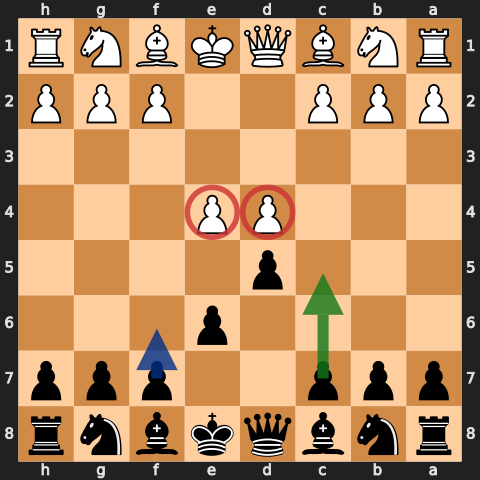

The French begins with `1.e4 e6 2.d4 d5`. Black lets White occupy the centre and then attacks it. The two breaks are `...c5` against d4 and `...f6` against e5.

> "The c5 move—to target the centre." — [Aman, episode 1](https://www.youtube.com/watch?v=C3h3t6GxTH8&t=20s)

Read White's third move before choosing a setup:

- `3.e5`: Advance—attack d4.
- `3.exd5`: Exchange—choose the simple or aggressive setup.
- `3.Nc3`: Winawer with `3...Bb4`.
- `3.Nd2`: Tarrasch—start with `3...c5`.
- `d3`, `Nf3`, and `g3`: King's Indian Attack—stop `e5` and take space.

Do not force the name of the opening after the pawn structure changes. If a Winawer becomes an Exchange French, use Exchange ideas. If White never plays d4, take the centre and develop.

## 2. The Advance: attack d4

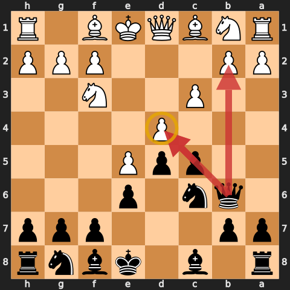

After `1.e4 e6 2.d4 d5 3.e5`, play `3...c5`. White's pawn chain is `b2-c3-d4-e5`; d4 is the first target. Add `...Nc6` and `...Qb6`, and make White prove that the chain can stay together.

### The c3 test

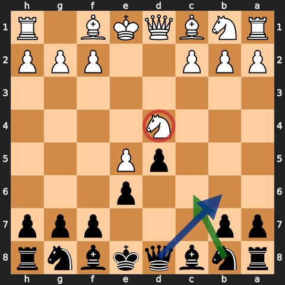

If White has not played `c3`, Aman does not wait:

> "If buddy's not playing c3 to defend his pawn, take it immediately." — [Aman, episode 3](https://www.youtube.com/watch?v=4FdZxT8lKj0&t=20s)

So after an early `Nf3`, `f4`, or another move that leaves d4 unsupported, look first at `...cxd4`. Once d4 disappears, e5 loses its support and Black can gain time against the centre.

This is a rule of thumb, not permission to stop calculating. Before taking, check `Bb5+`, a discovered attack on the queen, and whether White can recover the pawn with development.

## 3. The Advance setup

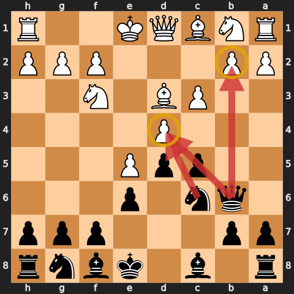

If White does play `c3`, Aman repeatedly returns to the same moves:

1. `...Nc6` attacks d4.
2. `...Qb6` attacks d4 and b2.
3. `...Bd7` develops the bad bishop and answers `Bb5+`.
4. `...Nge7` or `...Nh6-f5` brings a knight against d4.
5. `...f6` attacks the head of the chain.

His summary in episode 3 is simply: "stick to what we know"—`...Nc6`, `...Qb6`, and `...Bd7`: [24:18](https://www.youtube.com/watch?v=4FdZxT8lKj0&t=1458s).

### Qb6: d4 first, b2 second

`...Qb6` makes White defend two pawns. At lower ratings Aman often plays it early because b2 is frequently left hanging. At higher ratings he is more willing to develop `...Nc6` first.

Before taking b2, ask:

- Can `Rb1` trap or harass the queen?
- Does `Bb5+` uncover an attack on the queen?
- Should `...c4` be inserted before `...Qxc3` so that White cannot gain time with `Rc3`?
- Is d4 more important than b2?

### Get rid of the bad bishop

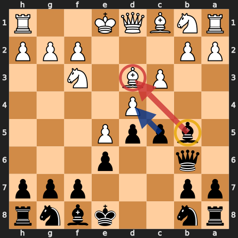

The c8-bishop is shut in by e6. If the route is open, Aman uses `...Bd7-b5` to trade it for White's active light-squared bishop.

> The bishop is "a bad piece objectively"; Black is "always up for trading it." — [Aman, episode 6](https://www.youtube.com/watch?v=LU87kQCjL1g&t=2601s)

The route depends on the position. If a knight already sits on c6, `...Bd7-b5` may be blocked. Develop first and do not spend tempi forcing a trade that is not available.

## 4. Finish the job with f6

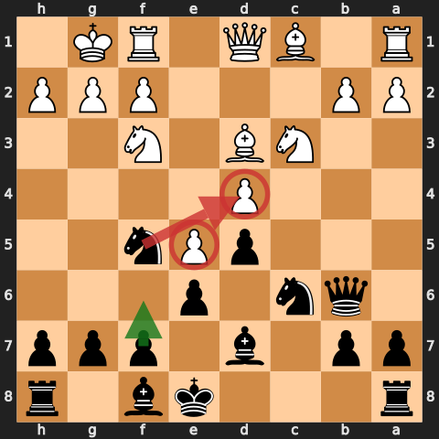

`...c5` attacks d4. `...f6` attacks e5. In the normal Advance, Aman usually prepares the second break with `...Nge7` or `...Nh6-f5`, development of the c8-bishop, and king safety.

After `...f6`, the aim is to remove or fix e5, open lines, and make the whole pawn chain harder to defend. Check `Qh5+`, `Bb5+`, and sacrifices on f6 before pushing.

### When White plays g4, think h5

If White uses `f4` and `g4` to chase the f5-knight, Aman looks first at `...h5`:

> "Whenever you see g4, the move h5 should be ... the first move you think of." — [Aman, episode 7](https://www.youtube.com/watch?v=rH0atZvwYpw&t=163s)

If White closes with `g5`, Black often answers `...g6`; if White opens the h-file, Black may welcome it. The point is to keep control of f5 and stop White's kingside pawns from driving every piece away.

## 5. The Exchange: two setups

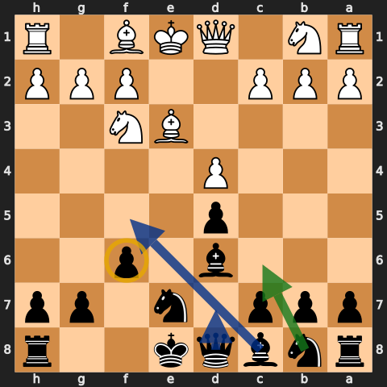

After `3.exd5 exd5`, the centre is symmetrical and the c8-bishop is no longer buried behind e6. Aman uses two setups throughout the series:

- a simple setup with quick development and short castling;
- a more double-edged setup with `...Bd6`, `...Nge7`, `...Nc6`, `...f6`, `...Qd7`, and often long castling.

The choice is not cosmetic. Look at White's early `c4`, checks, pins, and queenside expansion before deciding where the king belongs.

## 6. The simple Exchange setup

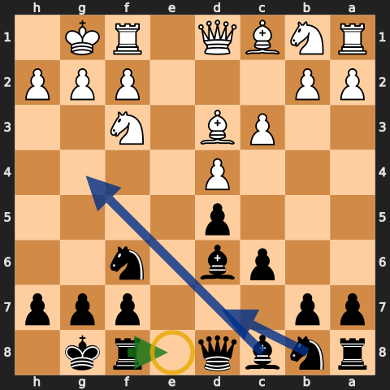

The reliable version is:

- `...Nf6`;
- `...Bd6` or `...Be7`;
- `...O-O`;
- `...c6` when it gives the centre useful support;
- `...Re8`, with `...Bg4` or `...Bf5` when available.

Aman's short description is "knight out, bishop out, castle": [episode 4, 56:21](https://www.youtube.com/watch?v=dissPDPzWas&t=3381s).

This is especially useful when White plays an early `c4`. Take on c4 or d4 when the position calls for it, develop `...Bd6` and `...Nf6`, and get castled before chasing an isolated pawn. Aman calls this the most consistent treatment in [episode 5, 0:29](https://www.youtube.com/watch?v=mdLIVFuqMTI&t=29s).

Symmetry does not mean passivity. Use the open e-file, improve the c8-bishop, and take a small advantage such as the bishop pair, doubled pawns, or an active rook when White offers it.

## 7. The aggressive Exchange setup

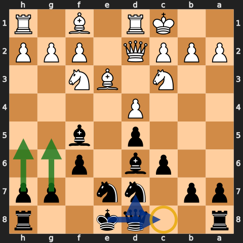

The more ambitious setup is:

`...Bd6`, `...Nge7`, `...Nc6`, `...f6`, `...Bf5`/`...Bg4`/`...Be6`, `...Qd7`, and often `...O-O-O`.

> "Bishop d6, knight e7, this knight to c6, pawn to f6." — [Aman, episode 2](https://www.youtube.com/watch?v=EBEuKTqShpE&t=899s)

Long castling lets Black push the g- and h-pawns, but Aman repeatedly says it is the riskier choice. Before castling long, check White's `c4`, `b4-b5`, the open c-file, and the dark-squared bishop. If those pieces are already aimed at the queenside, castle short.

The point of `...f6` here is different from the Advance. It gives space, controls e5, and supports a kingside expansion. It also lets Black meet `Bg5` with a move Black often wanted anyway.

## 8. Early checks on e2

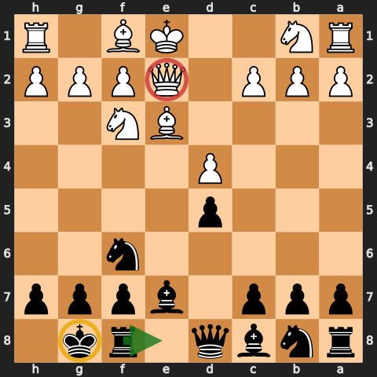

Against an early `Qe2+`, first get the king safe. In the ordinary Exchange position, `...Be7` blocks the check, `...O-O` follows, and `...Re8` places White's queen opposite a rook.

When the check appears before White has castled, Aman often wants "short castle, Re8 ASAP": [episode 4, 0:55](https://www.youtube.com/watch?v=dissPDPzWas&t=55s).

Do not play the sequence blindly. If White has inserted `b3` and plans `Bb2`, the bishop on e7 may become pinned after `Nf6`; Aman points out `...Qe7` as an accurate alternative in that version. A useful `...Bb4+` can also improve the move order, but only if it does not develop White's pieces for free.

## 9. Aman's Winawer: Ne7, b6, and Ba6

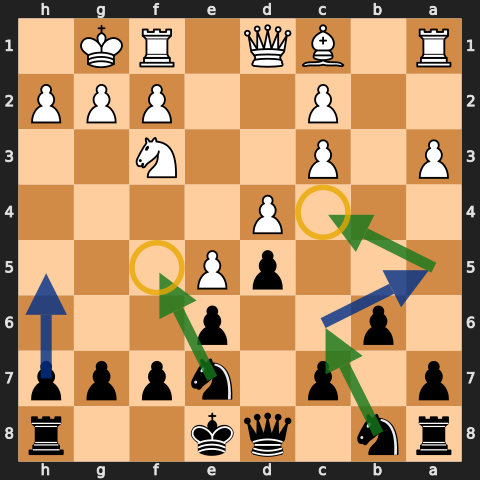

After `1.e4 e6 2.d4 d5 3.Nc3`, Aman plays `3...Bb4`. After `4.e5`, he does **not** teach the standard immediate `4...c5` as his main system. His speedrun system is:

1. `4...Ne7`.
2. `...b6` and `...Ba6`, trading the bad light-squared bishop.
3. If White plays `a3`, take `Bxc3+` because `bxc3` damages the structure.
4. After `...Ba6 Bxa6 Nxa6`, bring that knight back through b8 and c6.
5. Put one knight on f5 and aim the other toward c4, often by `...Nc6-a5-c4`.
6. Use `...h5` to keep `g4` from chasing the f5-knight.

Aman accepts the slow-looking reroute: "one step backwards, two steps forwards": [episode 3, 37:46](https://www.youtube.com/watch?v=4FdZxT8lKj0&t=2266s).

The strategic bargain is clear. Black gives up the dark-squared bishop with `...Bxc3+`, then trades the bad light-squared bishop with `...Ba6`. White keeps a dark-squared bishop, but Black places pawns and knights on the light squares that bishop cannot challenge.

### Do not commit c5 too early

In this system, `...c5` is not automatic. Aman summarises the idea as: delay `...c5`, trade light-squared bishops, and play on the light squares: [episode 6, 26:18](https://www.youtube.com/watch?v=LU87kQCjL1g&t=1578s).

The c-pawn may go to c4 later. That can lock the queenside, open the b-file for a rook, and give a knight a permanent c4-square.

> "Knight c4, knight f5—those are my squares." — [Aman, finale](https://www.youtube.com/watch?v=eifuUWPKsP0&t=70s)

## 10. The Winawer 4.Ne2 exception

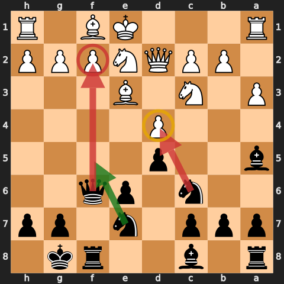

After `1.e4 e6 2.d4 d5 3.Nc3 Bb4 4.Ne2`, two normal Winawer ideas no longer work in the same way:

- Do not rush `...Bxc3+`. White can answer `Nxc3`, so the bishop has only traded for the c3-knight's replacement without damaging the pawns.
- Aman prefers not to grab `4...dxe4`. White normally recovers the pawn while Black spends time trying to hold it.

His practical choice is `4...Nc6`. If White follows with `5.e5`, play `5...f6` immediately: the f3-knight is absent, so Black has to challenge the centre before White's space becomes comfortable.

After an exchange on f6, `...Qxf6` can support `...Nge7-f5` and pressure f2. Develop and prefer short castling unless the position clearly makes long castling safe.

> "I would avoid taking because it's just going to be replaced by another knight." — [Aman, episode 7](https://www.youtube.com/watch?v=rH0atZvwYpw&t=5667s)

## 11. The Tarrasch

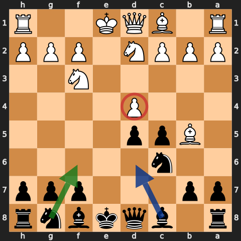

Against `3.Nd2`, Aman starts with `3...c5`.

> "C5 is ... absolute standard stuff." — [Aman, episode 5](https://www.youtube.com/watch?v=mdLIVFuqMTI&t=1151s)

Two recurring move orders are:

- `4.exd5 Qxd5 5.dxc5 Bxc5 6.Ngf3 Nf6`;
- `4.Ngf3 cxd4 5.exd5 Qxd5`, followed by development and eventually `...a6`, `...b5`, and `...Bb7`.

The queen recapture looks unusual, but White's b1-knight has already gone to d2 and cannot chase the queen with `Nc3`. If `Bc4` attacks the queen, Aman later identifies `...Qh5` as the more normal retreat.

Do not rush the queenside pawns while the king and c8-bishop are undeveloped. In the higher-rated Tarrasch game, Aman first plays `...Nf6` and `...Be7`, then uses `...b5` when it arrives with a clear purpose: [episode 6, 1:11:34](https://www.youtube.com/watch?v=LU87kQCjL1g&t=4294s).

The alternative `3...h6` or `3...a6` is a waiting system. Aman uses it to see White's setup before placing the pieces, but he teaches `3...c5` as the first choice.

## 12. The King's Indian Attack

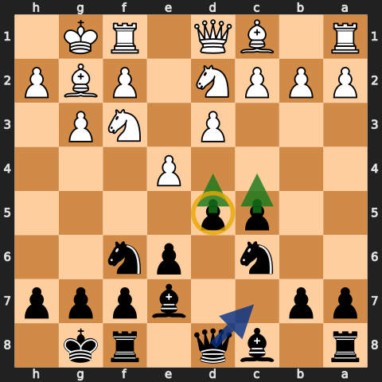

Against `d3`, `Nd2`, `Nf3`, `g3`, and `Bg2`, Aman uses:

- `...d5` and `...c5`;
- `...Bd6`, `...Nc6`, and `...Nge7` rather than an automatic `...Nf6`;
- short castling;
- `...Qc7`, adding control of e5;
- `...f6` if White's queen supports an e5 break.

If White plays `c3`, Aman likes `...d4` followed by `...e5`. The c8-bishop then opens, while White has less room for the normal kingside attack. In the closed position he uses `...h6`, `...g5`, `...f6`, and `...Ng6`, then switches to `...Rb8`, `...a6`, and `...b5` on the queenside.

The practical question is White's `f4` break. If Black prevents it, White can run out of useful play; if Black ignores it, the kingside can open quickly. See the complete model game beginning at [episode 7, 58:18](https://www.youtube.com/watch?v=rH0atZvwYpw&t=3498s).

## 13. Second-move sidelines

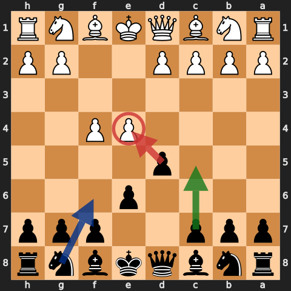

The normal answer to `2.Nf3`, `2.f4`, or `2.Qe2` is still `...d5`. Challenge e4 and let White reveal the structure.

- `2.Nf3 d5` often becomes an Exchange French.
- Against `2.f4`, `...d5` hits e4 before White builds an attack. `...Nh6` can be useful because it reaches f5 without blocking the c8-bishop.
- Against `2.Qe2`, develop carefully and watch the e-file.
- Against `2.c4`, Aman tried `2...e5` in the finale. He explicitly says it is not necessarily best; treat it as a playable experiment, not a repertoire command.

When White plays an early, unsupported `e5` without d4, Aman often answers `...d6` and attacks the pawn at once rather than pretending it is a normal Advance French.

## 14. Light squares, c4, and bishop trades

### c4 is a destination

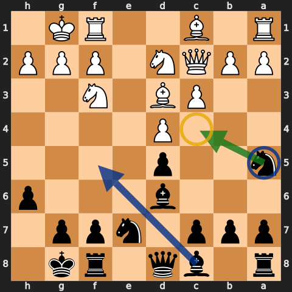

Across the Exchange and Winawer games, c4 keeps appearing. A knight may reach it through a5 or d6. In Aman's Winawer system, the long route `Na6-b8-c6-a5-c4` is often the whole point.

Do not occupy c4 just because it is available. The square matters when the knight attacks a real target, cannot be challenged by a pawn, or dominates a bishop that lives on the opposite colour.

### Judge the bishop by the pawns

Aman's rule is positional: bishop trades are good or bad because of the pawn structure, not because a bishop is always better than a knight: [episode 2, 36:07](https://www.youtube.com/watch?v=EBEuKTqShpE&t=2167s).

- If White's pawns are fixed on dark squares, a knight on a light square can be a powerful partner to Black's light-squared pawns.
- If Black can leave White with a bad dark-squared bishop, trade the light-squared bishops and play on light squares.
- In an opposite-coloured-bishop endgame, advance connected pawns on the colour controlled by the enemy bishop so your own bishop covers the other colour.
- In the middlegame, use pawns to restrict the opponent's bishop and give your own pieces squares.

## 15. Practical checklist

1. Has White played `e5`, `exd5`, `Nc3`, `Nd2`, or a King's Indian Attack setup?
2. Can I challenge d4 with `...c5` now?
3. In the Advance, has White played `c3`? If not, does `...cxd4` work immediately?
4. If White has played `c3`, can I use `...Nc6`, `...Qb6`, and `...Bd7`?
5. Before taking b2, have I checked `Rb1`, `Bb5+`, and `Rc3`?
6. Can I trade the c8-bishop with `...Bd7-b5` or `...b6-Ba6`?
7. Is `...f6` safe from checks and sacrifices?
8. If White is chasing the f5-knight with `g4`, does `...h5` stop the plan?
9. In the Exchange, is this the simple short-castle setup or the double-edged long-castle setup?
10. In Aman's Winawer, have I delayed `...c5`, traded light-squared bishops, and aimed the knights at f5 and c4?
11. Against `4.Ne2`, am I avoiding the automatic `...Bxc3+` and challenging e5 with `...f6`?
12. Against the Tarrasch, can I play `...c5` and use a safe `...Qxd5` because the b1-knight is on d2?
13. Against the King's Indian Attack, have I stopped `e5` and watched White's `f4` break?
14. Does every bishop trade fit the pawn structure that will remain?

## Study files

- [Full annotated French game collection](../pgn/french-defense-annotated-games.pgn)
- [Timestamped source index](../sources/french-defense-speedrun.md)
- [Original French cheatsheet](french-defense.md), preserved unchanged

Diagrams are from legal positions and are shown from Black's side. Green arrows are plans, blue arrows are development or manoeuvres, red arrows are pressure or threats, and yellow circles mark key squares or pieces.
