# The King's Indian Attack, as Aman Hambleton Plays It

**A practical White repertoire distilled from Chessbrah's 800–2000 speedrun**

The King's Indian Attack is not a memorised forcing line. It is a way to reach the same family of positions against many Black setups: White builds a compact centre with `e4` and `d3`, fianchettos with `g3` and `Bg2`, develops the knights to f3 and d2, castles, and then prepares a kingside expansion with `h3`, `Kh2`, `Nh4`, and `f4`.

Aman's speedrun makes the system deliberately repetitive. The value is not that every move is objectively best in every position; it is that the same piece placement, pawn breaks, and tactical questions recur often enough to become practical habits. Across 12 episodes and 88 supplied White games, the durable lesson is: **finish a safe shell, stop Black's central counterplay, then attack on the side where Black's king actually lives.**

> The videos are authoritative. English auto-captions were cross-referenced with the supplied PGN, and engine analysis was used only as a legality and tactical guardrail. Use this guide with the [annotated repertoire PGN](../pgn/kings-indian-attack-repertoire.pgn) and [timestamped source index](../sources/kings-indian-attack-speedrun.md).

## Guide map

1. [The repertoire in one screen](#the-repertoire-in-one-screen)
2. [The core shell](#the-core-shell)
3. [Move-order rules](#move-order-rules)
4. [C3 and the d4 square](#c3-and-the-d4-square)
5. [Qe1 against the pin](#qe1-against-the-pin)
6. [H3, Kh2, and the bishop hunt](#h3-kh2-and-the-bishop-hunt)
7. [The main kingside attack](#the-main-kingside-attack)
8. [When to switch wings](#when-to-switch-wings)
9. [Defence-by-defence adaptations](#defence-by-defence-adaptations)
10. [Piece jobs and strategic rules](#piece-jobs-and-strategic-rules)
11. [What is thematic—and what is not automatic](#what-is-thematicand-what-is-not-automatic)
12. [Aman's practical checklist](#amans-practical-checklist)

## The repertoire in one screen

| Position or problem | Aman's recurring answer | The point |
| --- | --- | --- |
| Ordinary `...e5` setup | `Nf3`, `d3`, `g3`, `Bg2`, `O-O`, `Nbd2` | Reach the familiar KIA shell |
| Black challenges with `...d5` | Develop `Nbd2` before resolving the tension | Keep queens on and preserve attacking chances |
| Black knight can use d4 | `c3` | Remove the outpost and make `Qe1` safe |
| `...Bg4-Bh5` pins f3 | `h3`, `c3`, `Qe1`, then `Nh4` | Break the pin and prepare `f4/g4` |
| `...Be6` plus `...Qd7` attacks h3 | `Kh2`, often `Ng5` | Protect h3 and question the light-squared bishop |
| Normal kingside attack | `Nh4`, `f4`, usually `gxf4`, then `f5/g4` | Build a supported pawn storm |
| Black castles queenside | `b4`, `b5`, `Qa4`, often `a4` | Attack the king that is actually there |
| Caro-Kann or French | `d3` and `Nbd2` early | Avoid the unwanted queen-trade route |
| Sicilian | `Nf3`, `d3`, `Nbd2`, `g3`, `Bg2`, castle | Use the same shell, but respect `...d5` |
| Scandinavian | Adapt; do not force the pure setup | Black attacks e4 immediately |
| Hippo/Modern | Complete development, then choose `f4` or a centre break | Black gives White time but remains flexible |
| Mirrored King's Indian | Check the g-pawn and long diagonal | Similar setups create tactical overloads |

## The core shell

The target development is easy to recognise:

- pawn on e4 and pawn on d3;
- knight on f3 and knight on d2;
- pawn on g3 and bishop on g2;
- king castled short;
- h3 and Kh2 when the kingside attack is coming;
- c3 when d4 must be controlled;
- queen on e1 against a pin, or e2 when the pin is gone.

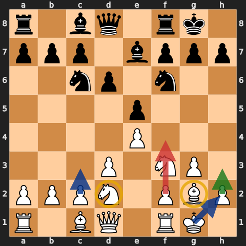

The order is not fixed. Against `...e5`, `Nf3` is natural because it develops while attacking e5. Against the Caro-Kann or French, Aman prioritises `d3` and `Nbd2`. If Black pins the f3-knight, `h3` and `Qe1` matter. If Black threatens `...Nd4`, `c3` comes before the queen leaves d1.

The setup is a decision tree, not a premove sequence.

### The completed attacking shell

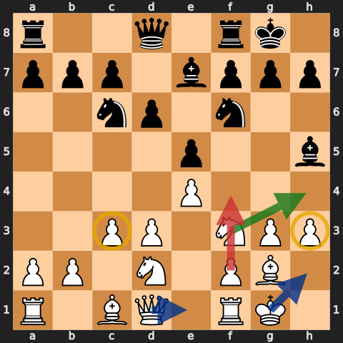

From this position White commonly continues with `Qe1`, `Nh4`, `Kh2`, and `f4`. The pieces have clear jobs and Black has no easy knight jump into d4. Only now does the pawn storm become structurally coherent.

## Move-order rules

### 1. Nbd2 keeps the kind of game Aman wants

When Black strikes with `...d5`, Aman often develops the b1-knight before exchanging in the centre.

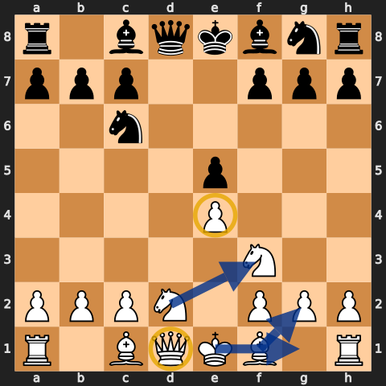

After `...dxe4 dxe4`, White has not allowed a simple queen exchange on d1. Aman explicitly acknowledges that the queenless alternative can be good for White; he avoids it because this repertoire is designed to create attacking positions with queens.

That distinction matters: **the move is a practical repertoire choice, not a claim that queen trades are objectively bad.**

### 2. Develop the f3-knight before allowing Bxf3

If Black's bishop pins or may capture on f3, Aman wants the second knight on d2 so `Nxf3` is available. Otherwise White may be forced into a queen recapture and lose time reorganising.

### 3. Do not rush the c1-bishop

The c1-bishop is often the last piece to move. Aman jokingly treats it as a “princess”: it guards b2, supports the position, and waits until a concrete diagonal appears. Artificially developing it can interfere with the standard shell.

This does not mean the bishop must never move. It means its development follows the pawn structure rather than a generic rule that every minor piece must leave the back rank immediately.

## C3 and the d4 square

`c3` is one of the repertoire's most important moves, especially when Black has a knight on c6.

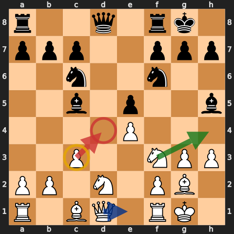

It does three jobs:

- removes d4 from a Black knight;
- supports the e4-pawn and a later d4 break;
- prevents `...Nd4` from attacking c2 and chasing a queen on e1 back to d1.

The timing matters. If White has already committed the queen to e1 without playing c3, `...Nd4` can force an awkward retreat and undo the setup.

Do not play c3 mechanically when the c-pawn has a better job—such as c4 in a closed centre—or when Black has immediate tactics. The rule is about controlling d4, not worshipping a square.

## Qe1 against the pin

Against `...Bg4` and `...Bh5`, `Qe1` is the signature solution.

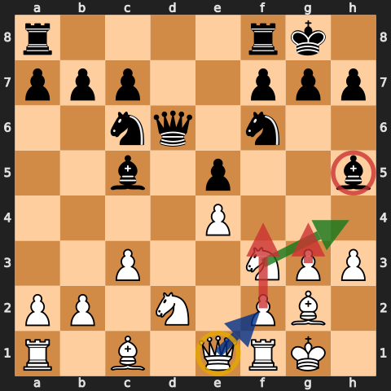

The queen:

- unpins the f3-knight;
- permits `Nh4`;
- supports kingside piece transfers;
- helps prepare `f4` and sometimes `g4`.

When the pin has disappeared or Black's light-squared bishop has been exchanged, Aman usually improves the queen to e2. `Qe1` is a functional square, not a permanent destination.

## H3, Kh2, and the bishop hunt

### H3 is multipurpose

`h3` prevents a piece from settling on g4, asks a bishop on g4 to decide, and creates a baiting mechanism when Black builds `...Be6` and `...Qd7` against h3.

### Kh2 is not a waiting move

`Kh2`:

- directly protects h3;
- steps off the a7-g1 diagonal before the f-pawn moves;
- reduces the force of checks on the diagonal;
- prepares the kingside attack without committing another pawn.

### The Ng5 motif

When Black's light-squared bishop sits on e6 and the queen goes to d7, `Ng5` can defend h3 while attacking the bishop.

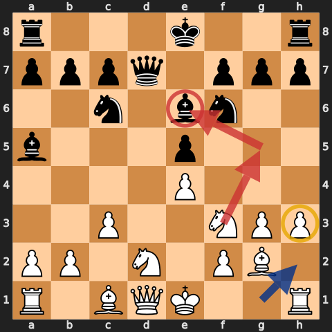

At lower ratings, Black frequently builds the battery and forgets the bishop has no comfortable retreat. Winning that bishop leaves White strong on the light squares.

But the exact geometry matters. If Black has already played `...h6`, the knight may simply be chased. If the centre is opening, a bishop hunt can be slower than Black's counterplay. Treat `Ng5` as a candidate move, not a magic incantation.

## The main kingside attack

### Nh4 clears the f-pawn

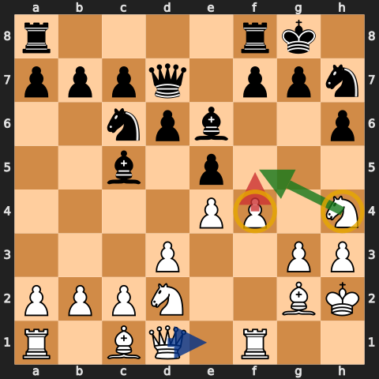

The f3-knight often travels to h4 and then f5. Moving it clears f3 so the f-pawn can advance. With the king on h2, White can play `f4` without opening the a7-g1 diagonal directly onto the king.

The usual attacking order is:

1. secure d4 with c3 if necessary;
2. play h3 and Kh2;
3. move the f3-knight to h4;
4. play f4;
5. recapture with gxf4 if Black exchanges;
6. continue with f5, g4, g5, or e5 according to the centre.

### Why gxf4 is thematic

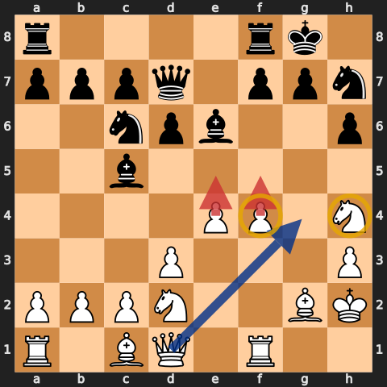

After `...exf4`, Aman usually chooses `gxf4`. The pawn on f4 can advance to f5, the e-pawn remains available for e5, and the g-file or g-pawn may join the attack.

The recapture also weakens White's king. It is justified by the closed centre and attacking momentum—not by a universal rule that doubled or exposed pawns do not matter.

### The full pawn storm

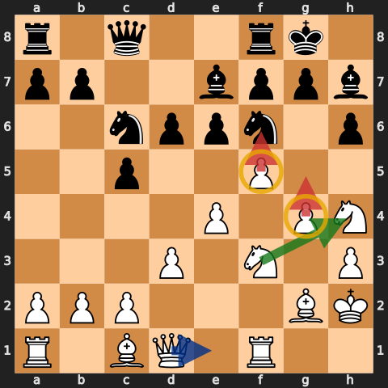

The ideal picture has pawns on f5 and g4, knights ready for h4/f5/g5, and the queen entering through e1, g3, or h4. Aman repeatedly describes the f- and g-pawns as “motoring” up the board.

Before pushing, ask:

- Is the centre closed or stable?
- Has Black castled kingside?
- Are the queen and knights able to support the pawns?
- Does Black have a forcing break such as `...d5`?

If the answer to the last question is yes, deal with the centre first.

## When to switch wings

The KIA is not a promise to attack kingside regardless of the board. When Black castles queenside, Aman switches immediately.

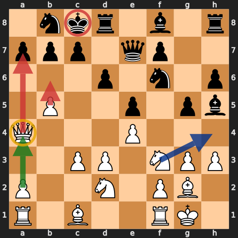

The recurring tools are `b4`, `b5`, `Qa4`, and sometimes `a4`. The advanced b-pawn gains time on a knight while the queen looks toward a7 and the castled king.

If Black leaves the king in the centre, keep both options open. A pawn storm that points at an empty wing only creates weaknesses.

## Defence-by-defence adaptations

### Caro-Kann: d3 and Nbd2 first

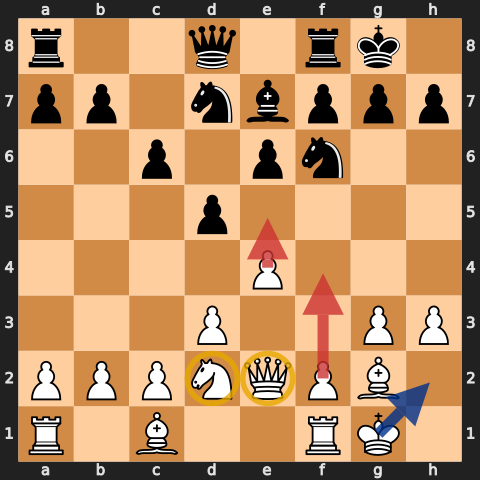

Against `1...c6`, Aman plays `2.d3` and follows with `Nbd2`. This sidesteps the early queen-trade route produced by `Nf3`, `...d5`, and central exchanges. Once the shell is built, White often uses `e5`, `f4`, `g4`, and `Qe2`.

If Black captures on f3, recapture according to the position. `Nxf3` is ideal when available; `Qxf3` is manageable, but the queen often returns to e2.

### French: close the centre and reroute

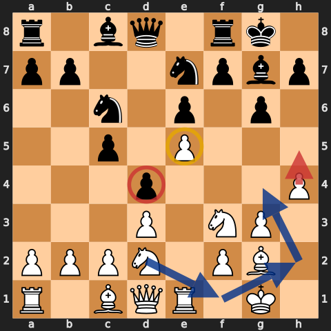

Against `1...e6`, the same `d3/Nbd2` move order keeps queens on. Once White plays e5 and Black closes with `...d4`, the plan changes:

- `Re1` supports e5;
- `h4-h5` gains space;
- `Nf1-h2-g4` transfers a knight toward the king;
- `Qe2` supports the centre and attack.

Do not let the d4-pawn cramp White indefinitely. Watch for c3, c4, or piece pressure against the chain.

### Sicilian: same shell, sharper centre

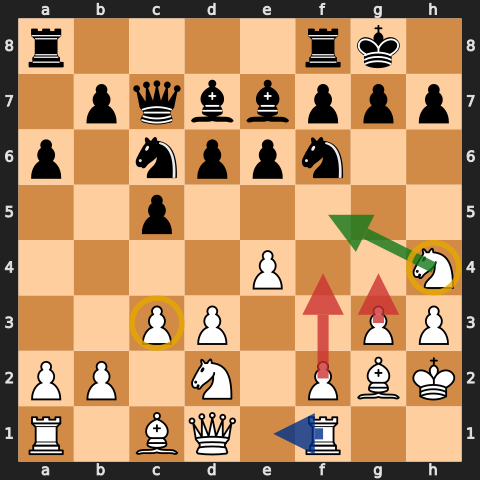

Against the Sicilian, Aman normally begins `Nf3` and `d3`, then uses `Nbd2`, `g3`, `Bg2`, castling, h3, Kh2, and c3. The attacking plan remains `Nh4`, `f4`, `f5`, and g4.

Black's `...d5` break is more urgent here. If Black can open the centre while White moves only kingside pawns, the attack may arrive too late. Complete development and read the central tension before “sending it.”

### Scandinavian: the real exception

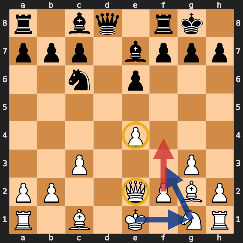

After `1.e4 d5`, Black immediately attacks the centre, so White cannot pretend the standard move order is untouched. Aman experiments with `Nc3`, `d3`, and `Qe2`, then returns to familiar ideas: g3, Bg2, c3, Nf3, castling, and f4.

This is the branch where the guide should be least dogmatic. Learn the actual Scandinavian position rather than forcing every piece onto its KIA square.

### Hippo and Modern setups

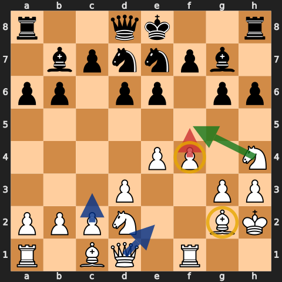

Against `...b6`, `...Bb7`, `...g6`, and `...Bg7`, White generally has time to complete the shell. The question is when to break. `f4-f5` is natural if Black's king is short; a central expansion or queenside play may be better if Black delays castling.

The tactical `Nxg6` seen in the series worked because Black's g-pawn and long diagonal were overloaded. It is not a standard sacrifice.

### Mirrored King's Indian

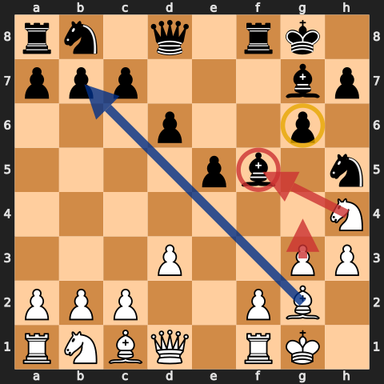

When Black copies the fianchetto structure, both sides understand the same colour complex. In the illustrated game, `...f5` and `...Bxf5` allowed `Nxf5` because the g-pawn could not recapture without exposing the g7-bishop; White then used the long diagonal against b7 and a8.

The general lesson is to inspect overloaded defenders and the fianchetto diagonal. The exact tactic is position-specific.

## Piece jobs and strategic rules

### The g2-bishop is an anchor

The fianchetto bishop protects the king and can dominate the long diagonal after the centre opens. Aman repeatedly warns against exchanging it casually for a knight. Losing it may leave the dark squares around White's king permanently weak.

Trade it when the concrete gain justifies the colour-complex damage—not merely because a capture is available.

### The d2-knight is a rerouting piece

From d2 it supports f3, controls e4/c4, and can travel through f1 or c4. In French structures, `Nf1-h2-g4` is common. Against open queenside play, `Nc4` can target d6 and b6.

### The queen changes squares with the problem

- `Qe1` breaks a pin and supports Nh4/f4.
- `Qe2` is cleaner when the pin is gone.
- `Qa4` belongs to the opposite-castling attack.
- `Qg4/Qh4` appear only after the pawn structure and pieces support entry.

### The centre authorises the wing attack

The KIA attack is strongest when the centre is closed. If files can open around White's king, pushing f- and g-pawns may be reckless. Every kingside move should be checked against `...d5`, `...c5`, or a forcing central exchange.

## What is thematic—and what is not automatic

The speedrun repeatedly wins through recognisable motifs:

- `Ng5` attacking a light-squared bishop on e6;
- `c3` taking d4 away from a knight;
- `Qe1` breaking a bishop pin;
- `Nh4-f5` and `f4-f5`;
- `gxf4` followed by g4-g5;
- a queenside switch after `...O-O-O`;
- tactics against an overloaded g-pawn in mirrored fianchettos.

None is guaranteed. The PGN itself records moments where Aman says a thematic `f4` is an engine blunder, where c4 is chosen for practical reasons despite not being best, and where the Scandinavian prevents the pure setup. The high-quality version of this repertoire is not “play the same moves regardless”; it is **know why the moves belong, then notice when their reason is absent.**

## Aman's practical checklist

Before each opening move, ask:

1. **Which move order am I in?** Against e5/Sicilian, `Nf3` is normal; against the Caro/French, prioritise `d3` and `Nbd2`.
2. **Is Black threatening a queen trade through central exchanges?** If yes, develop `Nbd2` before resolving the tension.
3. **Can a knight use d4?** Play `c3` before moving the queen to e1.
4. **Am I pinned by Bg4-Bh5?** Use h3, c3, and Qe1; then consider Nh4.
5. **Has Black built Be6-Qd7 against h3?** Protect with Kh2 and calculate Ng5.
6. **Is Black's light-squared bishop actually trapped?** Check `...h6` and every retreat before hunting it.
7. **Is the centre stable enough for f4?** Do not ignore `...d5` or an opening file.
8. **If Black takes on f4, is gxf4 safe?** Confirm the king and centre can support the pawn chain.
9. **Where did Black castle?** Attack that wing, not the setup you expected.
10. **Am I preserving the g2-bishop?** Understand the dark-square cost before exchanging it.
11. **Does the queen still belong on e1?** Move to e2 when its pin-breaking job is complete.
12. **Can I improve a piece before pushing again?** A pawn storm without queen and knight support is just loose pawns.

## Study workflow

1. Recreate the 16 diagrams without looking.
2. For each diagram, identify Black's central break before naming White's attack.
3. Play through the [annotated repertoire PGN](../pgn/kings-indian-attack-repertoire.pgn).
4. Watch the corresponding moments in the [source index](../sources/kings-indian-attack-speedrun.md).
5. Sort your own KIA games by defence: e5, Caro-Kann, French, Sicilian, Scandinavian, or flexible fianchetto.
6. Review whether every c3, Qe1, Kh2, and f4 had a concrete purpose.

The King's Indian Attack becomes instructive when the setup stops being a ritual. Its strength is familiarity: the same shell gives White enough time and structure to recognise the correct break, piece route, and wing before committing to the attack.
