# The Orangutan, as Aman Hambleton Plays It

**A practical `1.b4` repertoire distilled from Chessbrah's 400–2600 speedrun**

The Orangutan—also called the Polish Opening—starts with a flank pawn, but Aman's version is really about the centre. White plays `b4`, develops the bishop to b2, pressures e5, and tries to exchange a wing pawn for one of Black's central pawns. If Black does not accept that bargain, the b-pawn gains space with `b5` and interferes with normal queenside development.

Across 22 episodes and 183 supplied games, the surface tactics change but the framework stays recognisable: **`b4`, `Bb2`, then `e3`, `c4`, `Nf3`, central development, and pressure on the b-file.**

> The videos are authoritative. English auto-captions were cross-referenced with the supplied PGN, and engine analysis was used only as a legality and tactical guardrail. Use this guide with the [annotated repertoire PGN](../pgn/orangutan-repertoire.pgn) and [timestamped source index](../sources/orangutan-speedrun.md).

## Guide map

1. [The repertoire in one screen](#the-repertoire-in-one-screen)
2. [What 1.b4 is trying to do](#what-1b4-is-trying-to-do)
3. [Black plays 1...e5](#black-plays-1e5)
4. [The Nc6-b5 mechanism](#the-nc6-b5-mechanism)
5. [Black captures on b4](#black-captures-on-b4)
6. [Black defends e5](#black-defends-e5)
7. [The standard development shell](#the-standard-development-shell)
8. [Black builds with d5 or c6](#black-builds-with-d5-or-c6)
9. [The immediate c5 response](#the-immediate-c5-response)
10. [Fianchetto and mirror setups](#fianchetto-and-mirror-setups)
11. [Black attacks with a5](#black-attacks-with-a5)
12. [Middlegame plans](#middlegame-plans)
13. [Traps—and when they stop being the repertoire](#trapsand-when-they-stop-being-the-repertoire)
14. [Aman's practical checklist](#amans-practical-checklist)

## The repertoire in one screen

| Black's response | Aman's recurring answer | The point |
| --- | --- | --- |
| `1...e5` | `2.Bb2` | Ignore the attack on b4 and attack Black's central pawn |
| `...Nc6` defending e5 | `b5` | Displace the knight; meet `...Nd4` with `e3` and question `...Nb4` with `a3` when the geometry works |
| `...Bxb4` | `Bxe5` | Trade the b-pawn for Black's central pawn |
| `...Nf6` after `e5` | `Bxe5` | Win the e5-pawn; then retreat/develop sensibly when the bishop is challenged |
| `...Qf6` | `Nf3`, then `Bxe5` when ready | Develop with tempo and avoid exposing the queen |
| `...d6` | `e3`, `c4`, `Nc3`, `Nf3`, `Be2`, castle | A reliable English-style centre |
| `...f6` | Usually `b5`, then `e3`, `Nf3`, `d4/c4` | Preserve queenside space and use the weakened dark squares |
| `1...d5` | `Bb2`, `Nf3/e3`, often `b5`, then `c4` | Restrain the queenside before challenging the centre |
| `1...c6` and `...d5` | `Bb2`, `e3`, `Nf3`, `c4`, often `b5` | Build first; choose the right moment to open the centre |
| `1...c5` | `2.bxc5` | Take the pawn, build with `d4`, and make Black prove the pawn can be recovered |
| Kingside fianchetto | `Bb2`, `e3`, `Nf3`, `c4`, `Be2`, castle | Occupy the centre while the long bishop remains useful |
| `...b6` and `...Bb7` | `Bb2`, `e3`, `Nf3`, `c4`, often `b5/a4` | Use the extra queenside space rather than copying moves forever |
| `1...a5` | `2.b5` | Keep the space; stabilise with `a4` if required |

## What 1.b4 is trying to do

After `1.b4 e5 2.Bb2`, the b-pawn is attacked but White does not defend it. The bishop attacks e5 instead.

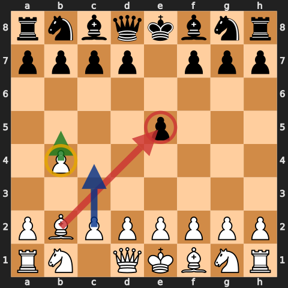

This creates the opening's basic bargain:

- if Black takes `...Bxb4`, White answers `Bxe5` and trades a wing pawn for a central pawn;
- if Black protects e5 with `...Nc6`, White gains time and space with `b5`;
- if Black ignores the pressure without protecting e5, White simply takes it;
- if Black never plays `...e5`, White uses the same `Bb2` bishop to influence the centre while building `e3` and `c4`.

The opening is not a licence to save the b-pawn at any cost. Aman repeatedly prefers White's extra central pawn to Black's extra queenside pawn. The strategic question is whether White can complete development before the advanced pawns become targets.

## Black plays 1...e5

### Do not defend b4 automatically

`2.Bb2` is the identity of the repertoire. It is more valuable to challenge e5 than to spend a tempo with `a3` or another pawn move merely to keep b4.

If Black plays a slow move, ask whether `Bxe5` is already safe. If a queen or knight attacks the bishop after the capture, retreat it to b2 when necessary. The centre pawn is the prize; the bishop is not expendable merely because the rook on h8 looks tempting.

### The bishop's diagonal changes development

Aman's default kingside knight square is f3. The b1-knight usually belongs on c3, but only after White knows that placing it there will not obstruct a needed `c4` break or the bishop's work on the long diagonal. The usual centre is `e3` plus `c4`; `d4` follows once it improves rather than blocks the position.

## The Nc6-b5 mechanism

When Black defends e5 with `...Nc6`, `b5` is the thematic reply. The pawn gains space and asks the knight an immediate question.

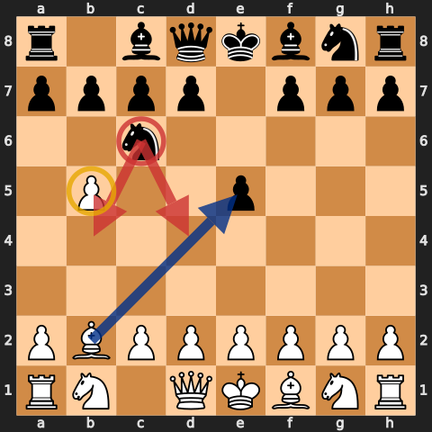

The knight's retreat determines White's next move.

### The Nb4 motif

At lower ratings, `...Nb4` is common because it looks active. `a3` attacks it and can produce a genuine trap when the knight's other squares are occupied or controlled.

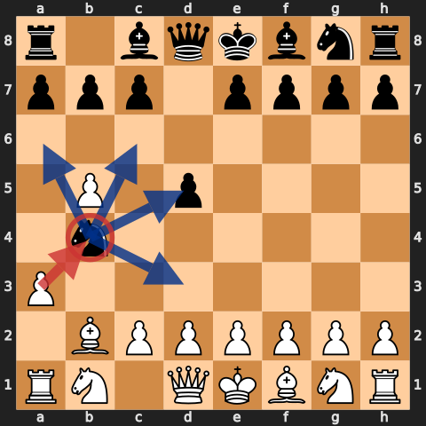

Check the exact board before premoving. In the bare position shown, the knight still has legal retreats such as d5, d3, c6, and a6; `a3` gains a tempo but does not win it by force. The trap becomes real only when the surrounding position removes those squares. The teaching value is broader than the trap—an advanced pawn can restrict a knight and make its active-looking move awkward.

### Meet Nd4 with e3

`...Nd4` is more resilient. Aman keeps `e3` ready: it attacks the knight, opens the f1-bishop, and leaves `Bxe5` in the position.

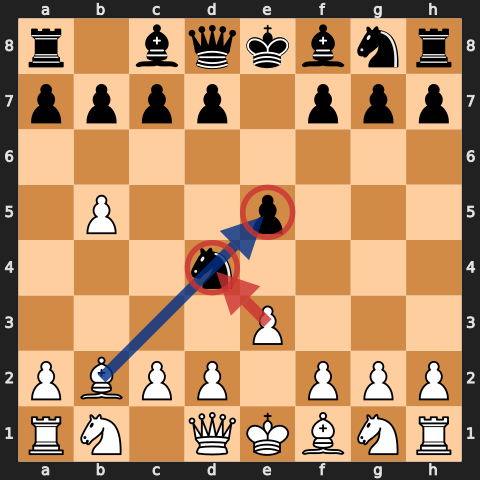

After `...Nxb5`, `Bxb5` recovers the knight and leaves White with the centre. Do not play `e3` only because it is familiar; check whether Black has a forcing capture or check first.

### Do not push b5 without a reason

As the series progresses, Aman sharpens the rule: `b5` is most useful when the b-pawn is attacked or when it gains a concrete tempo on `Nc6`. If Black cannot challenge b4, White may prefer `Nf3`, `e3`, or `c4` first. Space that cannot be supported can become a target.

## Black captures on b4

After `1.b4 e5 2.Bb2 Bxb4`, play `3.Bxe5`.

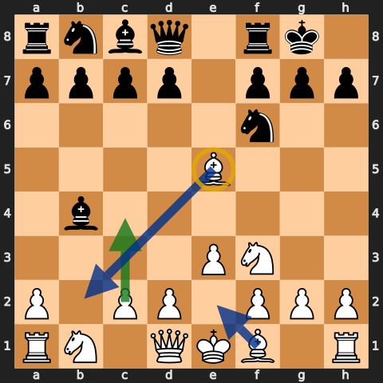

Material is equal, but the imbalance favours White's practical aims: Black has two queenside pawns against one while White has the extra central pawn. Continue with `Nf3`, `e3`, `c4`, `Be2`, and castling.

At low ratings, Black often forgets the bishop on e5 can continue to g7 and h8. Take the rook when it is genuinely available, but expect stronger players to use `...Nf6` and make the bishop retreat.

The mature version is quiet:

- preserve the bishop;
- finish development;
- use the central majority;
- open the b-file only if your bishop and queenside will remain safe.

## Black defends e5

### With Nf6

After `1.b4 e5 2.Bb2 Nf6`, the e5-pawn is not defended. Aman takes it.

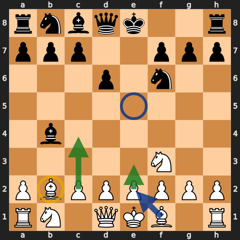

If Black answers with `...Bxb4`, White has achieved the normal trade and should develop. If Black attacks the bishop, drop it back; do not turn a healthy extra central pawn into a trapped bishop.

### With Qf6

`...Qf6` protects e5 but develops the queen prematurely. `Nf3` hits e5 again while improving a piece.

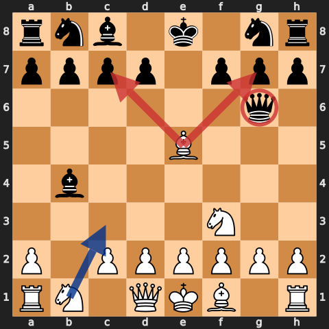

After the queen moves, inspect c7 and g7. The e5-bishop can create forks and long-diagonal threats, but White's first responsibility is development. Chasing the queen is useful only when every chase improves a piece or wins material.

### With d6

`...d6` is solid and leads to the repertoire's standard shell.

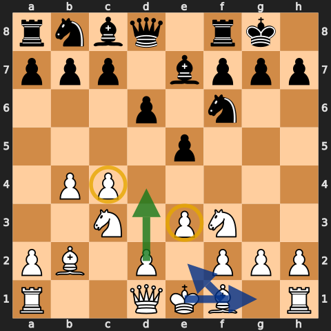

Build with `e3`, `c4`, `Nc3`, `Nf3`, `Be2` or `Bd3`, and castle. Then choose `d3` or `d4` based on Black's centre. This is closer to an English Opening than a trap line: White has queenside space and normal pieces, while the b2-bishop keeps pressure on e5.

### With f6

`...f6` supports e5 but weakens the dark squares and the kingside. Aman usually keeps space with `b5`, then develops before attacking those weaknesses.

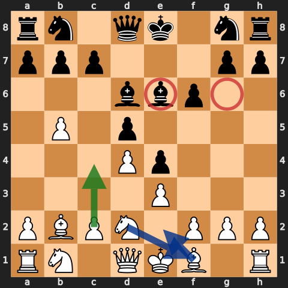

The important response is not an automatic sacrifice. Use `e3`, `Nf3`, `d4/c4`, and the f1-bishop. If the centre closes with `...e4`, reroute the f3-knight rather than leaving it without a square.

## The standard development shell

Most quiet Orangutans use the same pieces even when the order changes:

- bishop to b2;
- pawn to e3;
- pawn to c4 before Black establishes an unchallenged centre;
- knight to f3;
- b1-knight to c3 once c4 is secure;
- bishop to e2 or d3;
- castle;
- only then decide between d3 and d4.

`c4` matters more at higher levels. Aman explicitly corrects himself late in the series for allowing Black to play `...c5` first. When White can establish c4 safely, it restrains `...d5` and gives the pieces clear central squares.

## Black builds with d5 or c6

### Against d5

Do not force the e5 tactics when Black has not played e5. Develop `Bb2`, `Nf3`, and `e3`; use `b5` when it restrains `...Nc6` or preserves the pawn; then strike with `c4`.

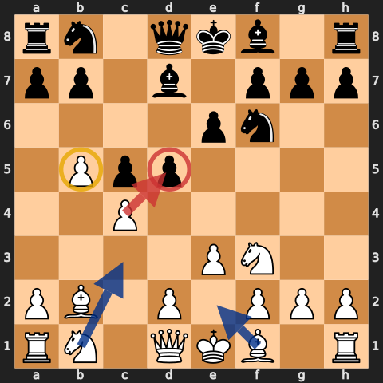

The pawn on b5 can cramp Black, but it also needs support. `a4` often stabilises it. If Black exchanges on c4, recapture with a piece when that improves development and keeps the structure healthy.

### Against c6 and d5

Black's Slav-like structure is sturdy. White should not open it before the pieces are ready.

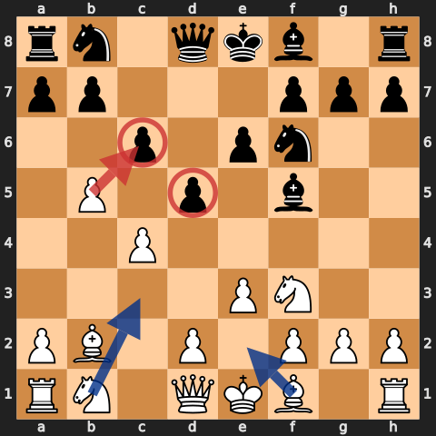

Use `e3`, `Nf3`, `c4`, `Nc3`, and `Be2`. `b5` can fix c6 and create a target, but calculate `...cxb5` and the resulting open b-file. An open b-file is helpful only when Black cannot use it against the b2-bishop.

## The immediate c5 response

After `1.b4 c5`, Aman takes with `2.bxc5`. The c-pawn is a centre/wing hybrid, and exchanging it gives White a useful extra pawn on c5 while removing Black's direct central influence.

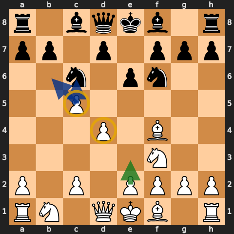

Then build with `d4`, `Nf3`, `Bf4` or `Bb2` depending on the exact order, and `e3`. Black will attack c5; White need not defend it forever. Use the time Black spends recovering it to develop and establish the centre.

If Black answers with `...e5`, the b2-bishop and central knights again become important. Do not hold c5 if doing so lets Black seize every central square.

## Fianchetto and mirror setups

### Black fianchettos the king bishop

Against `...Nf6`, `...g6`, and `...Bg7`, the Orangutan becomes a normal flank opening. White's bishop remains useful on b2 while `e3`, `Nf3`, and `c4` claim central influence.

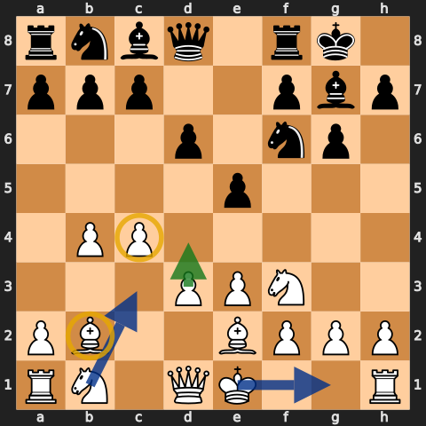

Finish with `Be2`, castling, `d3`, `Nc3`, and later `d4` when it can be supported. Avoid a pawn race before the king is safe.

### Black mirrors with b6 and Bb7

White already owns more queenside space, so use it.

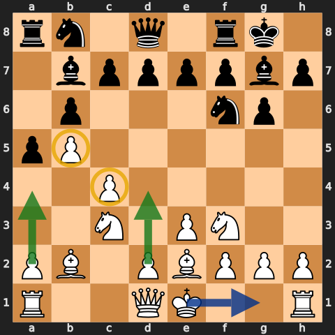

`e3`, `Nf3`, `c4`, `Nc3`, and castling keep the advantage manageable. `b5` and `a4` can restrict Black's queenside. The goal is not to prove the first move wins; it is to reach a playable position where White understands the pawn breaks better.

## Black attacks with a5

Against an immediate `...a5`, Aman pushes `b5`. Capturing on a5 usually helps Black activate a rook; keeping the pawn advanced preserves space.

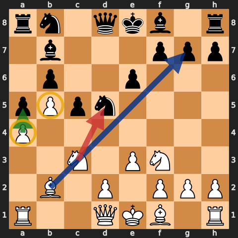

Stabilise with `a4` when Black can undermine b5. Continue with `Bb2`, `c4`, `e3`, and `Nf3`. The advanced pawn is valuable because it restricts pieces, not because it must survive forever.

## Middlegame plans

### 1. Centre pawns beat wing pawns—if the pieces are developed

The opening repeatedly produces Black's two queenside pawns against White's extra central pawn. Aman prefers White's side because a central pawn supports space and piece activity. That preference is conditional: an uncastled king or undeveloped queenside can erase the benefit.

### 2. Rb1 activates the opening's file

Once the b-file opens and the bishop is safe, `Rb1` is the natural rook move.

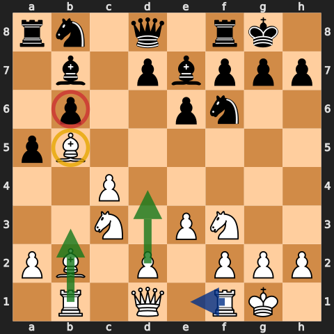

Targets commonly appear on b6 and b7. Combine the rook with `Qb3`, `a4-a5`, or a bishop retreat to c3. Do not open the b-file when it leaves the b2-bishop trapped or hands Black the initiative.

### 3. C4 is the central lever

`c4` challenges d5, prevents a comfortable `...c5`, and gives the b1-knight a reason to develop after the pawn has moved. At higher ratings, the timing of c4 becomes one of the repertoire's most important refinements.

### 4. D4 is a middlegame decision

The d-pawn often waits. Push `d4` when it builds a strong centre or prevents Black's break. Do not block the b2-bishop or allow `...d4` to cramp the pieces without checking the consequences.

### 5. A4 stabilises b5

When White has played b5, `a4` can prevent `...a6` or support the pawn chain. In other positions it can open files prematurely. Connect it to a concrete queenside problem.

### 6. Improve the bishop before opening its file

The b2-bishop may retreat to e5, c3, or b2 depending on the centre. Before exchanging pawns on the b-file, identify where that bishop will live afterwards.

## Traps—and when they stop being the repertoire

The early episodes repeatedly win material through:

- `...Nc6`, `b5`, `...Nb4`, and `a3` trapping the knight when its retreat squares have first been removed;
- an undefended e5-pawn;
- `Bxe5`, followed by `Bxg7` and `Bxh8` when Black ignores the diagonal;
- premature queen development to f6 or g5;
- the opponent treating b4 as a free pawn without accounting for e5.

These motifs explain why moves work, but they are not guaranteed sequences. By the higher episodes, opponents return the bishop with `...Nf6`, challenge the centre, and use the b-file. The durable repertoire is the pawn structure and development shell; the traps are bonuses when Black violates them.

## Aman's practical checklist

Before each opening move, ask:

1. **Is e5 defended?** If not, `Bxe5` is the first candidate.
2. **If Black takes b4, do I get e5?** That wing-pawn-for-centre-pawn exchange is normally welcome.
3. **Has a knight landed on c6?** Calculate `b5`, then know your answer to `...Nd4`, `...Nb4`, and `...Nce7`.
4. **Does b5 gain a tempo or merely create a target?** Push when attacked or when it restricts a piece.
5. **Can I play c4 before Black plays ...c5?** This becomes crucial in the stronger games.
6. **Will Nc3 block my c-pawn or bishop?** Move c4 first when the position requires it.
7. **Where does the b2-bishop go if the file opens?** Solve that before exchanging queenside pawns.
8. **Am I chasing a queen with developing moves?** If not, stop chasing and finish development.
9. **Is d4 a real improvement?** Use it to establish the centre, not because it appears in the setup.
10. **Can I castle now?** The queenside space advantage matters only if the king survives the centre opening.

## Study workflow

1. Recreate the 16 diagrams without looking.
2. For each one, name Black's central pawn and White's next pawn break.
3. Play through the [annotated repertoire PGN](../pgn/orangutan-repertoire.pgn).
4. Watch the corresponding moments in the [source index](../sources/orangutan-speedrun.md).
5. Sort your own games by Black's first setup: `...e5`, `...d5`, `...c5`, `...c6`, fianchetto, or `...a5`.
6. Review whether you chose `b5`, `c4`, and `d4` for a concrete reason.

The Orangutan succeeds when White stops treating `b4` as a pawn to protect and starts treating it as a tool for controlling the centre.
