# The Queen's Gambit, as Aman Hambleton Plays It

**A practical White repertoire distilled from Chessbrah's 400–2600 speedrun**

This is a guide to decisions, not a promise that every game reaches one memorised position. Aman begins with `1.d4` and `2.c4`, takes space when Black permits it, and then lets the pawn structure decide the plan. Across 22 episodes and 159 games, the recurring lesson is simple: **win the centre first; use it to make your pieces easy to play.**

> The videos are the authority. Auto-captions and the supplied PGN were cross-referenced, and engine analysis was used only as a legality and tactical guardrail. Start with the plans below, then use the [annotated repertoire PGN](../pgn/queens-gambit-repertoire.pgn) and [timestamped source index](../sources/queens-gambit-speedrun.md).

## Guide map

1. [The repertoire in one screen](#the-repertoire-in-one-screen)
2. [The Queen's Gambit decision](#the-queens-gambit-decision)
3. [Queen's Gambit Declined](#queens-gambit-declined)
4. [Early ...c5 and the isolated queen's pawn](#early-c5-and-the-isolated-queens-pawn)
5. [Queen's Gambit Accepted](#queens-gambit-accepted)
6. [Slav and Semi-Slav](#slav-and-semi-slav)
7. [Nimzo-Indian](#nimzo-indian)
8. [King's Indian and Modern setups](#kings-indian-and-modern-setups)
9. [Benoni and Benko](#benoni-and-benko)
10. [Dutch](#dutch)
11. [Englund, Albin, and early deviations](#englund-albin-and-early-deviations)
12. [How to play the resulting middlegames](#how-to-play-the-resulting-middlegames)
13. [Aman's practical checklist](#amans-practical-checklist)

## The repertoire in one screen

| Black's setup | Aman's recurring answer | What White is trying to achieve |
| --- | --- | --- |
| `1...d5 2...e6` | `Nc3`, `cxd5`; `Bf4` if Black has committed `...Be7`, otherwise often `Bg5` | A favourable Exchange QGD and a clear Carlsbad plan |
| Early `...c5` | Exchange so Black recaptures with a pawn | Give Black an isolated d-pawn and attack it |
| `2...dxc4` | `3.e4` | Take the full centre; recover c4 after development |
| `...c6` | `Nc3`, `e3`, `Nf3`; challenge `...Bf5/...Bg4` | Do not let the Slav bishop escape and remain unchallenged |
| Nimzo `...Bb4` | `Qc2` | Preserve the bishop pair and support `e4` |
| King's Indian | `Nc3`, `e4`, `Bd3`, `Nge2`, castle, `d5`, `h3`, `Be3` | A stable centre with simple development and kingside options |
| Benoni | Push `d5`, build `e4`, finish development | Use the space advantage before launching anything |
| Benko | Accept `b5` and `a6` when offered; respect the a/b-file pressure | Keep the extra pawn without letting Black's activity run unchecked |
| Dutch | Fianchetto with `g3` and `Bg2` | Aim at the dark squares weakened by `...f5` |
| Englund `1...e5` | Accept with `dxe5`, develop `Bf4`, watch c7 | Keep the pawn only while development and tactics support it |
| Albin `...e5` after `d5/c4` | `dxe5`, then `a3` against `...d4` | Prepare to undermine the advanced pawn safely |

## The Queen's Gambit decision

After `1.d4 d5 2.c4`, White is not donating a pawn for an attack. The c-pawn challenges Black's d-pawn and asks how Black will maintain the centre. If Black cannot support `d5` with another pawn, exchanging on d5 often forces a piece to recapture; that lets White play `e4` and build a broad centre.

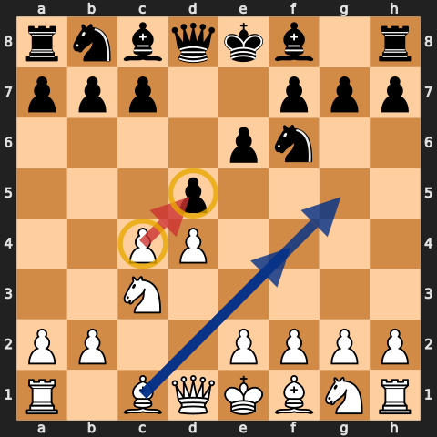

**Read the recapture before exchanging.**

- If `...exd5` or `...cxd5` is available, the exchange changes the structure. Know what plan that structure gives you.
- If a knight or queen must recapture on d5, `e4` often arrives with tempo and White gains space.
- Do not exchange automatically just because the opening is called a gambit. Aman repeatedly waits until the recapture helps White.

The default development is classical: `Nc3`, `Nf3`, a useful bishop square, `e3` when the c1-bishop is already outside the chain, and castling. The move order changes because the bishop's future changes.

## Queen's Gambit Declined

### The Exchange Variation is the spine

Against `...e6`, Aman repeatedly chooses `cxd5`. After `...exd5`, White gets the Carlsbad structure: Black has pawns on c6 and d5; White has a d4-pawn and no c-pawn. The structure gives White two durable plans:

1. **Minority play:** `b4-b5` pressures c6 and can leave weaknesses on c6/d5.
2. **Central expansion:** prepare `f3` and `e4` when the pieces support it.

The point is not to push a wing pawn on autopilot. Finish development, prevent Black's freeing breaks, then choose the plan that matches the piece placement.

### Why Bf4 sometimes comes before Nf3

When Black develops the f8-bishop to e7 before the g8-knight commits, Aman likes `Bf4`. The bishop develops outside the pawn chain and can meet `...Bf5` with direct play such as `g4`, gaining time on Black's active bishop.

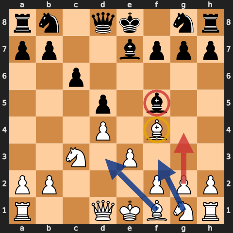

The useful order is often `Bf4`, `e3`, `Bd3`, `Nf3/Nge2`, and castling. `Nge2` keeps the f-pawn free for an eventual `f3-e4` expansion.

When Black has already played `...Nf6`, `Bg5` is more natural: pin the knight, develop, and make `e4` easier to support.

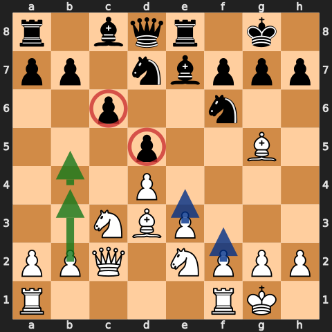

**Carlsbad decision rule:**

- If Black is passive and c6 can be fixed, use `b4-b5`.
- If your pieces point at the centre and Black cannot generate counterplay, prepare `f3-e4`.
- If Black plays `...c5`, calculate the central transformation before continuing a wing plan.

### When a piece takes on d5

If Black answers `cxd5` with `...Nxd5`, the structural restraint has vanished. Play `e4`, develop with tempo, and use the space.

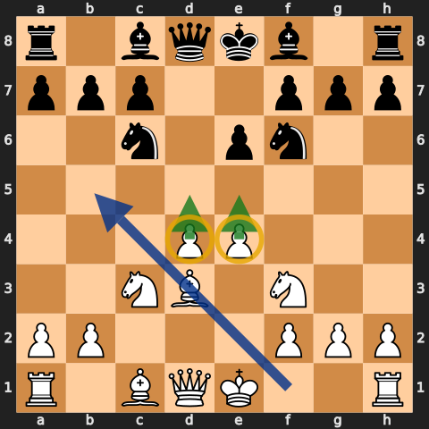

Aman's repeated criticism is practical: `...Nxd5` is playable only when Black knows the immediate counterplay, usually involving `...c5` and sometimes `...Bb4+`. If Black simply retreats, White gets the whole centre for free.

## Early ...c5 and the isolated queen's pawn

When Black strikes with `...c5` in a QGD/Tarrasch structure, Aman usually exchanges so that Black is left with a lone d-pawn. The isolated pawn gives Black activity, but it also gives White a permanent target and a square in front of it.

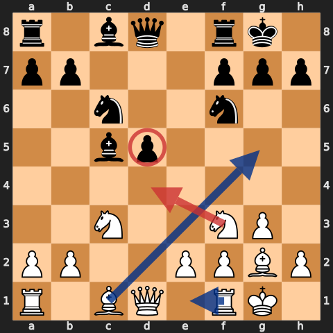

Then:

- blockade on d4 when possible;
- exchange active pieces, not merely any pieces;
- put rooks on the c- and d-files;
- fianchetto with `g3/Bg2` when it attacks d5 without locking the c1-bishop behind `e3` too early;
- stay alert for Black's freeing `...d4` break.

The isolated pawn is not automatically bad. It becomes weak when its activity has been neutralised and the position simplifies.

## Queen's Gambit Accepted

### Take the centre with 3.e4

After `1.d4 d5 2.c4 dxc4`, Aman's immediate recommendation is `3.e4`. Black has spent a move removing a wing pawn; White uses that time to occupy both central squares.

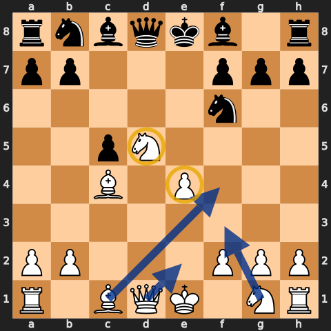

The order of priorities is:

1. maintain the centre if it can be maintained;
2. develop `Nf3`, `Nc3`, and the f1-bishop;
3. recover c4 without contorting the whole army;
4. castle before opening more lines.

Against `...c5`, pushing `d5` often avoids an early liquidation and preserves the space advantage. Against a premature knight capture on e4, `Qe2` and the pin frequently make the knight tactically vulnerable.

### The a4 lever

If Black tries to keep the c4-pawn with `...b5`, the thematic answer is `a4`. Aman stresses that this is a normal Queen's Gambit move, not an exotic exception.

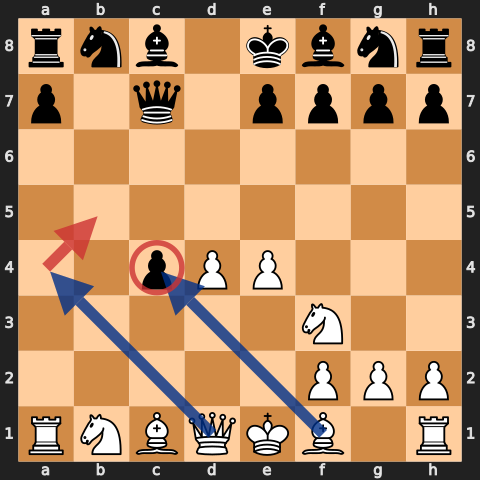

`a4` attacks the base of the queenside chain. The follow-up can be `axb5`, `b3`, `Bxc4`, or `Qa4+`, depending on Black's arrangement. Do not rush to win the pawn back if doing so costs development; undermine the chain and let the pawn become indefensible.

## Slav and Semi-Slav

The logic of the Slav is that Black delays `...e6` long enough to develop the c8-bishop to f5 or g4. Aman's practical response is to make that bishop prove it can survive outside the pawn chain.

Use `Nc3`, `e3`, and `Nf3`, then combine:

- `Nh4` against a bishop on f5;
- `h3` and `g4` against a bishop on g4;
- `Ne5` to take away retreat squares;
- `Qb3` to pressure b7 and d5.

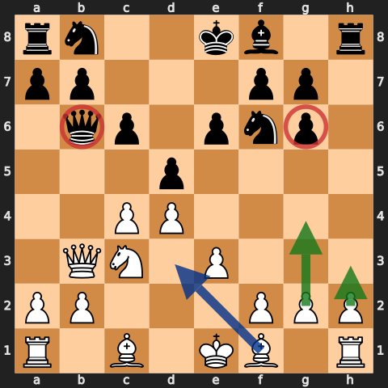

This is not permission to throw kingside pawns without calculation. The point is that Black chose the Slav specifically to save this bishop. If White can gain tempos by attacking it while maintaining the centre, Black has failed to justify the move order.

Against the Semi-Slav (`...c6` and `...e6`), continue developing. The bishop is already locked in, so there is less reason to launch the same bishop hunt; watch for `...dxc4` and `...e5` instead.

## Nimzo-Indian

After `1.d4 Nf6 2.c4 e6 3.Nc3 Bb4`, the repertoire move is `4.Qc2`.

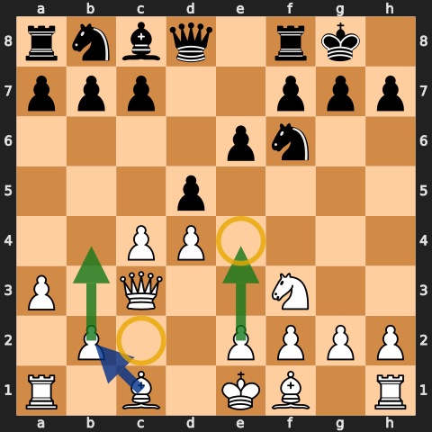

`Qc2` does three jobs:

- supports `e4`;
- permits a queen recapture on c3, avoiding doubled pawns in many lines;
- keeps the bishop pair as a long-term asset.

Typical development is `Nf3`, `a3` when it gains something concrete, `e3`, `Bd3`, and castling. After `...Bxc3+ Qxc3`, use `b4`, `Bb2`, rooks on c1/d1, and eventually `f3-e4` when the centre is ready.

Do not confuse every `...Bb4` with a Nimzo. If Black has already played `...d5`, the pawn structure may call for a Queen's Gambit plan even though the pin looks similar.

## King's Indian and Modern setups

Aman's recurring setup is deliberately easy to reproduce: `Nc3`, `e4`, `Bd3`, `Nge2`, castle, close with `d5` when appropriate, then `h3` and `Be3`.

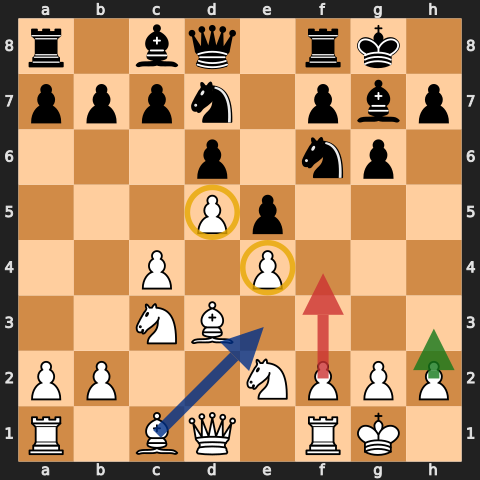

Why `Nge2`? It supports the centre without blocking the f-pawn, and it allows the knight to regroup to g3 or c1. `Bd3` points at h7 and supports the kingside. Once the centre closes, White can prepare `f4`; until then, development and king safety come first.

Against hybrid Modern setups where Black delays `...Nf6`, the same central occupation works. If Black gives White `e4` uncontested, take it. Avoid inventing a flank attack before the centre and king are secure.

## Benoni and Benko

### Benoni: space is the advantage

After `...c5`, push `d5` when the structure permits it. Against the Modern Benoni, build with `e4`, `Nc3`, `Nf3`, `Bd3`, and `h3`.

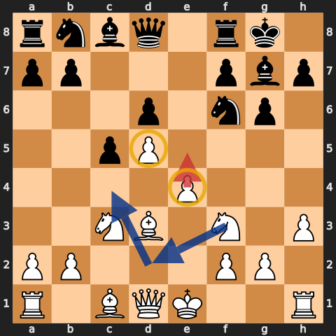

White's centre restricts Black, but Black has active breaks with `...b5` and `...f5`. Finish development before pushing `e5` or `f4`. If Black spends time on queenside pawn play, use the centre; if the centre opens, calculate rather than assuming space alone wins.

### Benko: accept, then neutralise activity

The speedrun accepts the Benko pawns with `cxb5` and `bxa6`. The extra pawn is real, but so is Black's pressure along the a- and b-files.

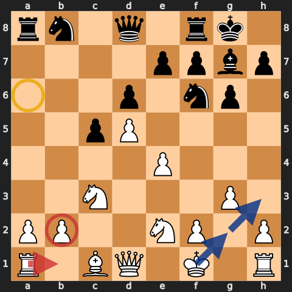

Develop compactly, oppose the g7-bishop when useful, and do not cling to a pawn at the price of paralysis. Moves such as `g3`, `Bg2`, `Nge2`, `Rb1`, and king safety matter more than showing off the extra material.

## Dutch

Against `1...f5`, Aman increasingly settles on a kingside fianchetto. Black has weakened the dark squares and blocked the c8-bishop's natural diagonal; `g3` and `Bg2` make that strategic cost visible.

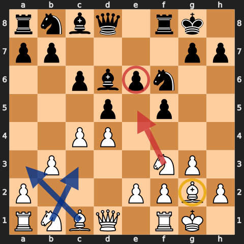

Continue with `Nf3`, castling, `b3/Ba3` or `Nc3`, and pressure e5. Do not force `e4` before it is prepared. Black's kingside ambitions make king safety and control of e5 more important than grabbing a pawn.

## Englund, Albin, and early deviations

### Englund Gambit: accept and develop

After `1.d4 e5`, Aman accepts with `2.dxe5`. Against `...Nc6`, `Bf4` develops while protecting e5. The common queen manoeuvre `...Qe7` can leave c7 vulnerable after `Nd5`.

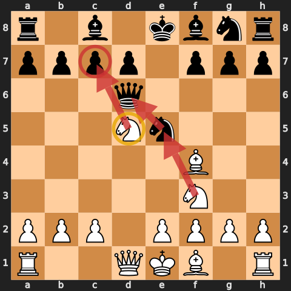

The practical rules are:

- keep the e5-pawn only while it does not delay development;
- meet pressure with developing moves, not repeated pawn defence;
- calculate checks on c7 and captures on e5 before playing automatically;
- when queens come off, a healthy extra pawn is enough—do not manufacture an attack.

### Albin Countergambit: question the advanced pawn

After `1.d4 d5 2.c4 e5 3.dxe5 d4`, Aman uses `4.a3` to prepare `b4` and reduce the force of `...Bb4+` ideas.

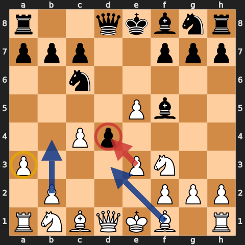

Develop with `Nf3`, `e3`, and then attack d4. The d4-pawn cramps White only if it is allowed to remain supported. Do not play an automatic `e3` before checking the tactical motifs associated with `...Bb4+` and `...dxe3`.

Against other early oddities, return to the same test: can Black support the centre with a pawn? If not, exchange and play `e4`; if yes, develop and wait for the favourable transformation.

## How to play the resulting middlegames

### 1. Let the pawn structure name the plan

- **Carlsbad:** minority attack or `f3-e4`.
- **IQP:** blockade, exchange active pieces, attack the pawn.
- **QGA centre:** develop behind `d4/e4`, then recover c4.
- **Benoni:** use space while restraining `...b5` and `...f5`.
- **Benko:** neutralise files and diagonals before cashing the extra pawn.

### 2. A lead in development is permission to open the centre

Aman repeatedly punishes early queen moves and repeated piece moves by opening lines after castling. If your king is safe and Black's is not, central exchanges gain force. If neither king is safe, opening the centre may help Black just as much.

### 3. Trade the opponent's active piece

The Slav bishop, a Nimzo bishop pair, and an IQP defender are not equivalent pieces. Ask which piece makes Black's position work, then challenge that one. “Trade pieces when ahead” is too vague; trade the pieces that create counterplay.

### 4. Improve the worst piece before forcing tactics

The series often reaches winning positions without an immediate combination. Bring the inactive rook to an open file, reroute a knight, or make luft. A space advantage matters only when the pieces can use it.

### 5. Endgames reward the healthier structure

Queen trades are welcome when White has the bishop pair, a safer king, an extra pawn, or a fixed structural target. Avoid queen trades merely because they are available; make sure the resulting king and pawn ending is actually favourable.

## Aman's practical checklist

Before every opening move, ask:

1. **What supports Black's centre?** A pawn recapture and a piece recapture lead to different plans.
2. **Can I take more centre with `e4`?** This is the reward when Black loses central control.
3. **Where does my c1-bishop belong before `e3`?** `Bf4`, `Bg5`, a fianchetto, or staying home are all structure-dependent.
4. **Has Black spent time moving the same piece or queen twice?** Finish development and consider opening the centre.
5. **What is Black's freeing break?** Usually `...c5`, `...e5`, `...b5`, or `...f5`. Prepare for it before launching your own plan.
6. **If Black keeps the gambit pawn, what is its base?** In the QGA, undermine it with `a4` rather than chasing it move by move.
7. **Which trade removes counterplay?** Seek that trade; keep the pieces that make your advantage grow.

## Study workflow

1. Recreate the 15 positions in this guide from memory.
2. For each board, say the pawn structure and plan aloud before looking at the caption.
3. Play through the [annotated repertoire PGN](../pgn/queens-gambit-repertoire.pgn).
4. Watch the linked moments in the [source index](../sources/queens-gambit-speedrun.md), then continue through the complete playlist.
5. Add your own games beneath the matching chapter. Review decisions by structure, not merely engine centipawns.

The repertoire works because its ideas repeat. `d4` and `c4` ask a structural question; the rest of the guide teaches you how to read Black's answer.
