# The Stonewall Attack, as Aman Hambleton Plays It

This is a practical guide to Aman's Stonewall Speedrun with White. It is not a move-by-move opening tree. The point is to know where the pieces go, what must be stopped, and what to do when the usual plan is unavailable.

**Start here:** `d4`, `e3`, `Bd3`, then complete the pawn shell with `f4` and `c3`. Develop `Nf3`, `Nbd2`, castle, and look for `Ne5`.

> "Your focus is kingside, kingside, kingside." — [Aman, episode 1](https://www.youtube.com/watch?v=W0UmYoFigy4&t=1169s)

## Contents

1. [The setup](#1-the-setup)
2. [Move order: read Black's moves](#2-move-order-read-blacks-moves)
3. [Keep Black out of e4](#3-keep-black-out-of-e4)
4. [Put the knight on e5](#4-put-the-knight-on-e5)
5. [After the knight is exchanged](#5-after-the-knight-is-exchanged)
6. [Choose the queen's route](#6-choose-the-queens-route)
7. [Push g4-g5](#7-push-g4-g5)
8. [Use a rook lift](#8-use-a-rook-lift)
9. [The c1-bishop](#9-the-c1-bishop)
10. [If Black stops Ne5, play e4](#10-if-black-stops-ne5-play-e4)
11. [When the kings are on opposite sides](#11-when-the-kings-are-on-opposite-sides)
12. [Common Black setups](#12-common-black-setups)
13. [What not to do](#13-what-not-to-do)
14. [Practical checklist](#14-practical-checklist)

## 1. The setup

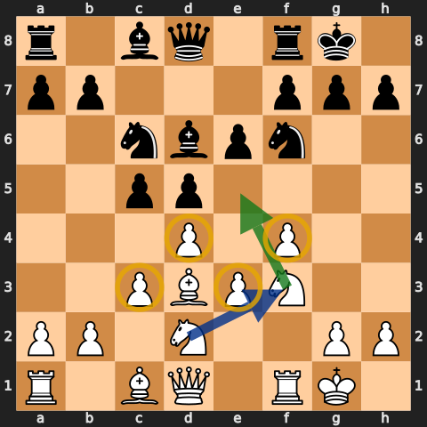

The four pawns are `c3`, `d4`, `e3`, and `f4`. The usual piece placement is:

- `Bd3`, pointing at h7;
- `Nf3`, ready for `Ne5`;
- `Nbd2`, guarding e4;
- king castled short;
- queen on `f3` or `e1`, depending on the position.

The diagram is a destination, not a forced move order. Aman changes the order when Black threatens `...e5`, places a knight on e4, pins a piece, or castles long.

## 2. Move order: read Black's moves

### If Black plays ...Nc6 early, play f4

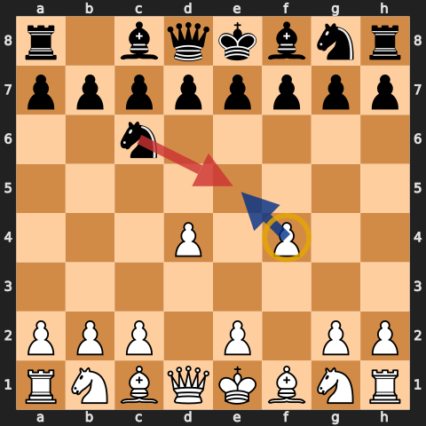

After `1.d4 Nc6`, Black is ready for `...e5`. Play `2.f4` before Black gets that break. Aman is clear that the full Stonewall should not be forced after Black has already played `...e5`.

### Otherwise, solve the bishop first

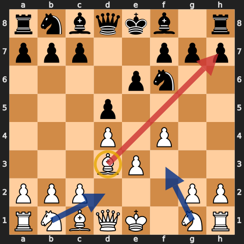

As the series develops, Aman increasingly starts with `d4`, `e3`, and `Bd3`. The bishop belongs on d3 and is useful immediately. The remaining order—`f4`, `c3`, `Nf3`, `Nbd2`, and castling—depends on Black.

> "Solve my problem with the bishop first." — [Aman, episode 8](https://www.youtube.com/watch?v=Rt93_cWZUUA&t=101s)

Two exceptions matter:

- If `...Nc6` threatens `...e5`, play `f4` now.
- If `...Bg4` pins the f3-knight, consider developing differently or breaking the pin before relying on that knight to control e4.

## 3. Keep Black out of e4

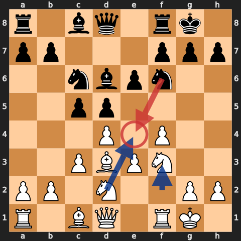

This is the main positional fight. White wants a knight on e5. Black wants a knight on e4. If Black gets `...Ne4` and supports it with `...f5`, White's kingside attack becomes much harder.

Use whichever move fits the position:

- `Nbd2` is the normal answer.
- `f3` can challenge or prevent a knight on e4.
- `Qf3` both attacks and guards e4.
- `Qc2` can add another guard while keeping the queen flexible.
- If Black already has `...Ne4`, do not pretend it is harmless. Exchange it or drive it away before continuing the attack.

Aman often plays `Nbd2` before `Nf3` when `...Ne4` is an immediate concern: [episode 2, 0:50](https://www.youtube.com/watch?v=DYjp2MrfxkA&t=50s).

## 4. Put the knight on e5

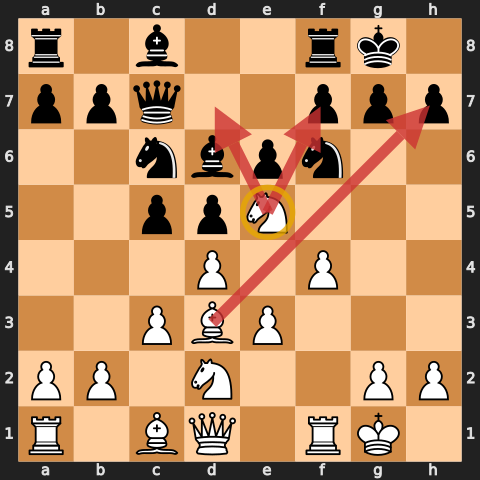

Once e4 is covered and the king is safe, `Ne5` is the first move to check. The knight cannot normally be chased by a pawn. It attacks useful squares, supports the kingside attack, and asks Black to make a decision.

Aman calls it the "fan favourite": [episode 3, 8:45](https://www.youtube.com/watch?v=6yYOQWfQwCk&t=525s).

Do not play it with your eyes closed. Check:

- Can Black take it and win a pawn?
- Can Black answer with `...Ne4`, gaining an equally good outpost?
- Is your king ready for the centre or kingside to open?
- Does `Ne5` block a needed queen or bishop route?

## 5. After the knight is exchanged

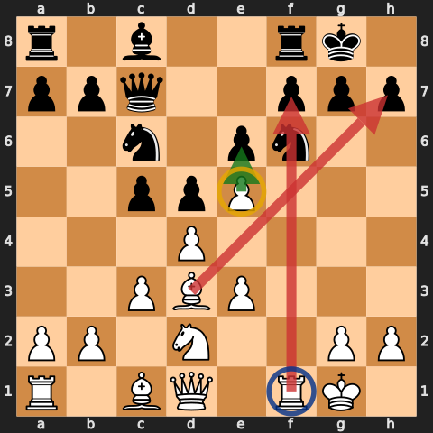

After `...Bxe5` or `...Nxe5`, the usual recapture is `fxe5`.

> "Always take with the f-pawn." — [Aman, episode 2](https://www.youtube.com/watch?v=DYjp2MrfxkA&t=95s)

That recapture does three jobs:

- opens the f-file for the rook;
- leaves a pawn on e5 that restricts Black's kingside pieces;
- keeps the d-pawn supporting the centre.

It is a rule of thumb, not a law. Before recapturing, check for a direct tactic, an exposed king, or a better recapture forced by the position.

## 6. Choose the queen's route

### Qf3: attack and control e4

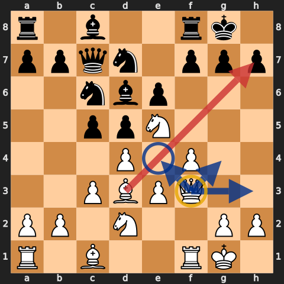

`Qf3` is often the cleanest move. It supports the knight on e5, guards e4, looks toward h3 and g4, and joins the attack without blocking the f-file after `fxe5`.

> "Queen f3—most important move you could play." — [Aman, episode 11](https://www.youtube.com/watch?v=yUFSsm7s3-E&t=1733s)

### Qe1-h4: go straight at h7

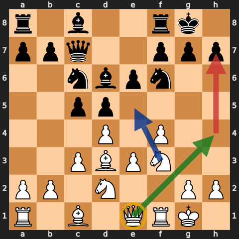

`Qe1` unpins the f-pawn or knight and prepares `Qh4` or `Qg3`. It is especially useful when the h7 diagonal is weak and the f-file is not yet open.

Choose the route by asking one question: where can the queen join the attack without allowing `...Ne4` or losing time to a bishop or knight attack?

## 7. Push g4-g5

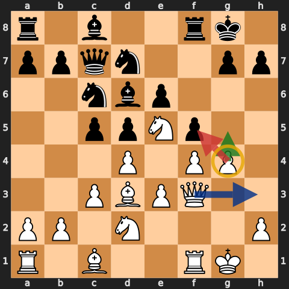

The g-pawn is used to drive away a knight or break open lines. It works best after the centre is stable and the king is castled.

Typical order:

1. Put the knight on e5.
2. Stop Black's `...Ne4`.
3. Bring the queen to f3.
4. Play `g4`, then `g5` if it gains time.

Do not play `g4` just because it is a Stonewall move. Check whether Black can take it, strike in the centre, or open your king before your pieces are ready.

## 8. Use a rook lift

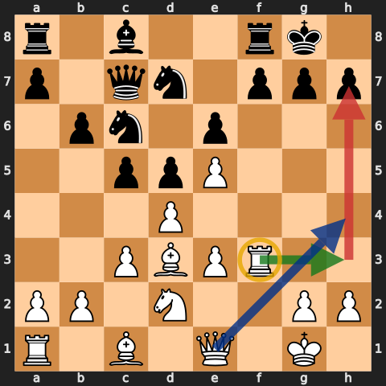

After `fxe5`, the f-file is open. The f-rook can go to `f3`, then across to `h3` or `g3`. This is strongest when the queen and bishop already point at h7.

The rook lift is a follow-up, not the start of the attack. Develop first. Put the knight on e5. Make sure Black cannot answer in the centre.

## 9. The c1-bishop

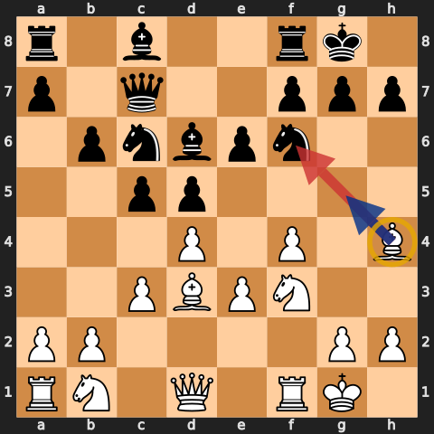

The dark-square pawn chain blocks the c1-bishop. Aman is blunt about it: the bishop can be terrible. There are three ways to deal with it:

- develop it before playing `c3`, if Black allows;
- route it through `d2-e1-h4`;
- leave it alone until `e4` opens the diagonal.

Do not spend three moves on the bishop while Black is creating an immediate threat. In some of Aman's fastest wins the bishop never moves. The attack works because the useful pieces reach the kingside first.

## 10. If Black stops Ne5, play e4

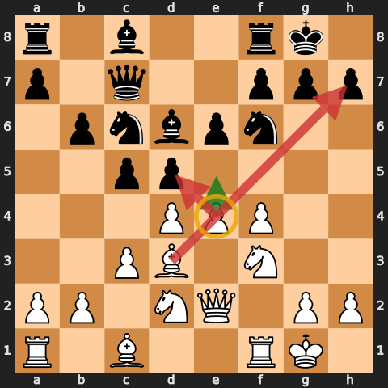

If Black has firm control of e5, do not keep adding pieces to a square you cannot use. Prepare `e4` instead. It challenges the centre and can release the c1-bishop.

Aman states the switch plainly: if they do not let you play `Ne5`, "it is time to just shove that e-pawn up": [episode 8, 2:17](https://www.youtube.com/watch?v=Rt93_cWZUUA&t=137s).

Prepare the break with `Qe2`, `Qf3`, or a rook on e1. Check `...dxe4`, `...cxd4`, and any pin on the e-file before pushing.

## 11. When the kings are on opposite sides

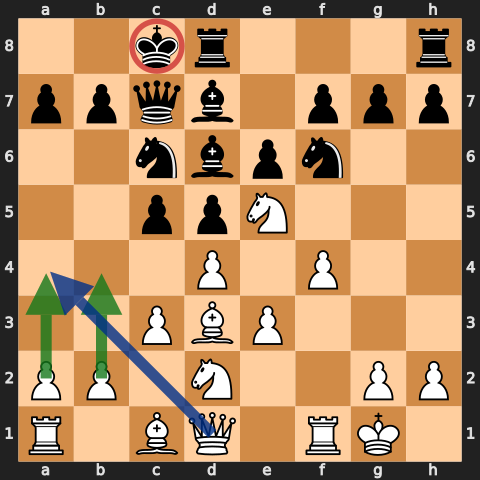

The normal Stonewall attack points at the kingside. If Black castles queenside, the target has moved. Do not keep pushing kingside pawns out of habit.

- Open queenside files with `b4`, `a4`, or a central break.
- Keep enough kingside cover around your own king.
- Use the centre to open lines toward c8.

The setup is the same; the target is not.

## 12. Common Black setups

### ...Bf5 before the shell is complete

Do not automatically play `Bxf5`. The d3-bishop is usually one of White's best attacking pieces. Keep it if you can do so without losing time or allowing `...e5`.

### King's Indian or Grünfeld-style setup

Against `...g6`, `...Bg7`, and `...d6`, the e5-square may be controlled. Build the shell, then decide between `e4-e5`, a kingside pawn push, or the bishop route. Do not force `Ne5` onto a defended square.

### Symmetrical Stonewall

The e4/e5 outpost race is everything. Guard e4 first. If both sides have a knight outpost, look for `g4`, `f5`, or the better bishop before starting tactics.

### Early ...c5

The move attacks d4 but does not by itself refute the setup. Complete development, keep the centre supported, and decide whether to hold, take, or answer with `e4`.

### ...Qb6 against b2

Do not drift into queenside pawn-grabbing. Defend b2 simply if needed, then return to development. A queen on b6 may also leave Black short of kingside defenders.

## 13. What not to do

- Do not force the shell after Black has played `...e5` and gained the centre.
- Do not play `Ne5` while allowing an equally strong `...Ne4`.
- Do not exchange the d3-bishop automatically.
- Do not launch `g4` before castling and development are under control.
- Do not move the c1-bishop three times while a direct threat is waiting.
- Do not attack the wrong wing after Black castles long.

## 14. Practical checklist

Before every move, ask:

1. Is Black threatening `...e5`? If yes, play `f4` or meet the threat directly.
2. Can Black play `...Ne4`? If yes, stop it with `Nbd2`, `f3`, `Qf3`, or an exchange.
3. Is my king safe and development complete enough for `Ne5`?
4. If my e5-knight is taken, does `fxe5` work?
5. Does the queen belong on `f3` or `e1`?
6. Can `g4-g5` gain time on a defender?
7. Is a rook lift available on the open f-file?
8. If e5 is unavailable, can I prepare `e4`?
9. Which wing contains Black's king?

## Study files

- [Full annotated White game collection](../pgn/stonewall-attack-annotated-games.pgn)
- [Timestamped source index](../sources/stonewall-attack-speedrun.md)
- [Original Stonewall cheatsheet](stonewall.md), preserved unchanged

Diagrams are from legal positions and are shown from White's side. Green arrows are plans, blue arrows are development or manoeuvres, red arrows are pressure or threats, and yellow circles mark key squares or pieces.
