# The Stonewall Defense, as Aman Hambleton Plays It

This guide covers Aman's Stonewall with Black. The setup mirrors the Attack, but the move-order problem is harder: White moves first and may play `e4`, `c4`, `Bg5`, or `Bf4` before Black gets everything in place.

**Start here against `1.d4`:** aim for pawns on `f5`, `e6`, `d5`, and `c6`; develop `Nf6`, `Bd6`, castle, and put a knight on e4.

## Contents

1. [The setup](#1-the-setup)
2. [Priority number one: stop e4](#2-priority-number-one-stop-e4)
3. [Put the knight on e4](#3-put-the-knight-on-e4)
4. [After Bxe4, use the f-pawn](#4-after-bxe4-use-the-f-pawn)
5. [Build the kingside attack](#5-build-the-kingside-attack)
6. [The c8-bishop](#6-the-c8-bishop)
7. [Stop White's Ne5](#7-stop-whites-ne5)
8. [The e5 and c5 breaks](#8-the-e5-and-c5-breaks)
9. [Meet Bf4 and Bg5](#9-meet-bf4-and-bg5)
10. [Against 1.e4: do not force it](#10-against-1e4-do-not-force-it)
11. [Common White setups](#11-common-white-setups)
12. [Practical checklist](#12-practical-checklist)

## 1. The setup

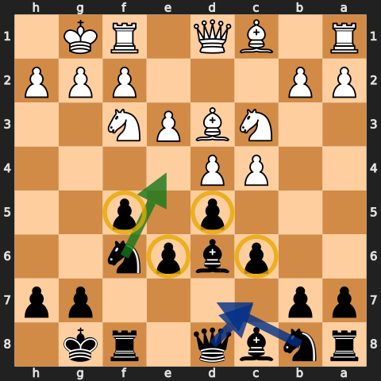

The four pawns are `f5`, `e6`, `d5`, and `c6`. The pieces usually go to:

- `Nf6-e4`;
- `Bd6`, aimed at h2;
- king castled short;
- queen on c7;
- queen's knight on d7;
- c8-bishop through d7-e8-h5, or exchanged when possible.

The setup gives Black a clear plan, but it also creates dark-square weaknesses and blocks the c8-bishop. Do not play the moves without watching what White is doing.

## 2. Priority number one: stop e4

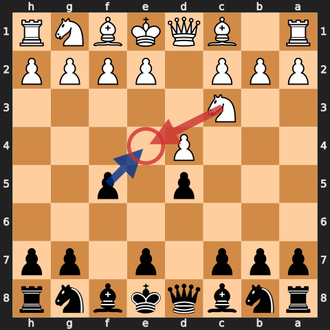

After `1.d4 d5 2.Nc3`, White threatens `e4`. Play `...f5` before White gets the full centre. Against other move orders, `...Nf6`, `...e6`, or `...c6` may come first, but the same question remains: can White play e4 next?

If White gets a strong `e4` in, stop pretending you still have a normal Stonewall. Challenge the centre or transpose to another opening.

## 3. Put the knight on e4

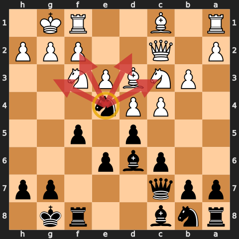

> "The Stonewall is all about anchoring a knight in on e4." — [Aman, episode 3](https://www.youtube.com/watch?v=6yYOQWfQwCk&t=180s)

The f5- and d5-pawns support e4. From there the knight attacks c3, d2, f2, and g3 and can help a queen-and-bishop attack on h2.

Before playing `...Ne4`, check:

- Can White take it without improving your pawn structure?
- Is the knight pinned to the queen or king?
- Can White drive it away with `f3`?
- Does White have `Ne5`, gaining the same outpost on the other side?

The knight belongs on e4 only when the square is secure.

## 4. After Bxe4, use the f-pawn

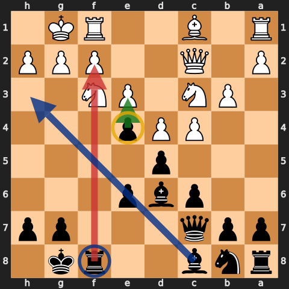

After `...Ne4 Bxe4`, the normal recapture is `...fxe4`.

That move:

- opens the f-file for the rook;
- puts a pawn on e4 that takes space and can advance;
- opens the c8-h3 diagonal for the blocked bishop.

Aman repeats this throughout the series. Still, calculate first: a rook check on e1, a loose king, or a direct tactic can change the answer.

## 5. Build the kingside attack

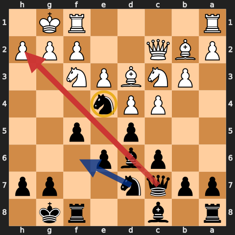

Once `...Ne4` is stable, `...Qc7` and `...Bd6` create pressure on h2. Add pieces before pushing pawns.

Useful moves include:

- `...Nd7-f6`, adding another kingside piece;
- `...Qe8-h5`, when the queen has a safe route;
- `...Rf6-h6`, after the f-file opens;
- `...g5-g4`, when White cannot strike in the centre.

Do not sacrifice on h2 just because the bishop points there. Count defenders, find White's escape squares, and check whether the centre opens against your own king.

## 6. The c8-bishop

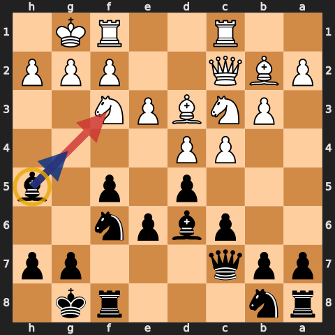

The c8-bishop is Black's problem piece. Aman uses three solutions:

- `...Bd7-e8-h5`;
- `...b6` and `...Bb7`, if the diagonal makes sense;
- trade it for White's useful light-squared bishop.

Do not spend time on the long route if the bishop can be exchanged cleanly or if the centre needs attention now.

## 7. Stop White's Ne5

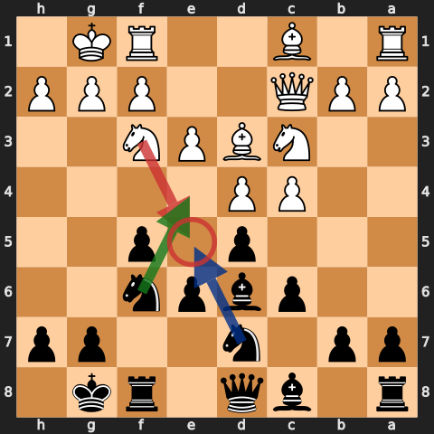

The Stonewall is an outpost race. You want e4; White wants e5. `...Nbd7` is the normal way to support the f6-knight and control e5.

If White lands a knight on e5 uncontested, the h7-square and f7-square can become weak. Do not continue a slow bishop manoeuvre while that knight is arriving.

## 8. The e5 and c5 breaks

### ...e5 when White has not controlled it

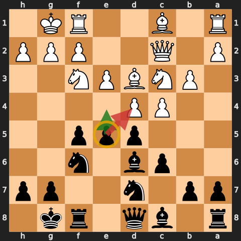

`...e5` challenges d4 and can release the c8-bishop. It is strongest when White has delayed `Nbd2`, `f3`, or another e4/e5 control move.

### ...c5 against the centre

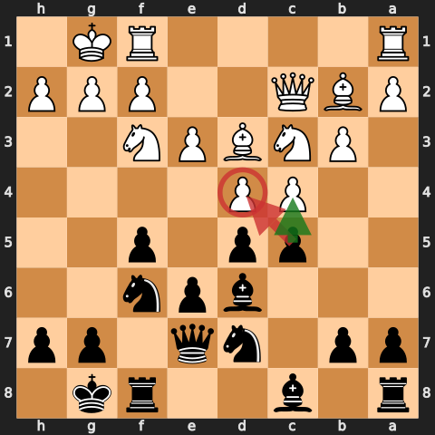

`...c5` is the other freeing move. Use it when the kingside attack is not ready or White has made d4 the base of the position. It can transpose to Queen's Gambit structures; that is fine. The Stonewall is a plan, not a prison.

## 9. Meet Bf4 and Bg5

### Bf4: challenge White's useful bishop

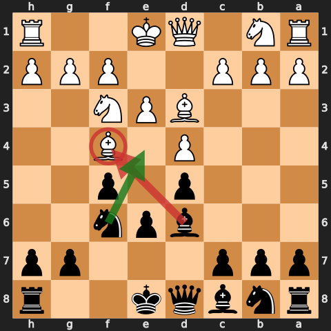

White's light-squared bishop is often the piece that trades your d6-bishop or controls e5. `...Bd6` asks it a question immediately. Exchange if it leaves you with the better minor piece or a clearer attack.

### Bg5: break the pin

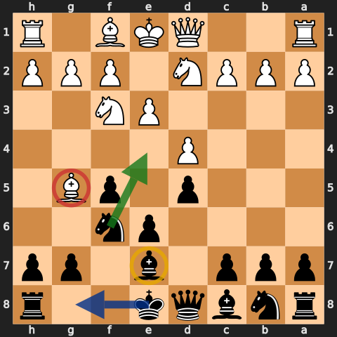

If the f6-knight is pinned, `...Ne4` may fail tactically. `...Be7` is a simple way to break the pin. `...Qd7` or `...Qe7` can work in other positions, but do not unpin mechanically into a new tactic.

## 10. Against 1.e4: do not force it

### The Exchange French may allow the setup

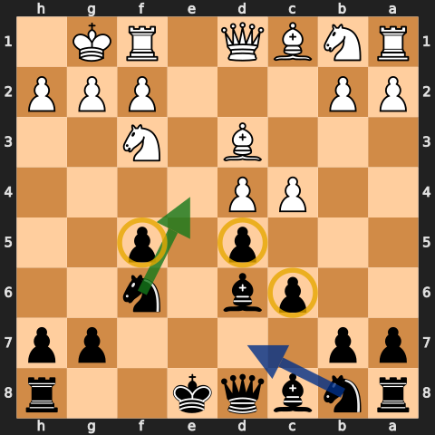

After `1.e4 e6 2.d4 d5 3.exd5 exd5`, Black may get `...f5`, `...Nf6`, `...Bd6`, and `...c6`. This resembles the Stonewall and gives the same `...Ne4` plan.

### If White plays e5, switch to the French

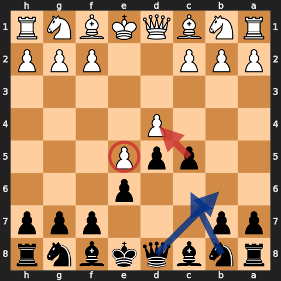

After `3.e5`, play French moves: `...c5`, `...Nc6`, and pressure on d4. Aman says not to keep forcing the Stonewall here: [episode 1, 0:31](https://www.youtube.com/watch?v=W0UmYoFigy4&t=31s).

The same warning applies after early `c4`, `g3`, or a strong central expansion. If the four-pawn shell is no longer sensible, use the nearest sound structure.

## 11. Common White setups

### London setup

Challenge `Bf4`, watch `Ne5`, and use `...c5` or `...e5`. If White castles long, the attack target has moved; open queenside or central lines instead of pushing blindly at h2.

### Queen's Gambit

Do not insist on `...c6` if White's pressure on d5 requires a Queen's Gambit response. Develop, secure d5, then decide whether a Stonewall structure remains available.

### Fianchetto

Against `g3` and `Bg2`, h2 is better defended. The game may be more about `...Ne4`, `...c5`, and the light-squared bishop than a direct mating attack.

### White Stonewall

Both sides fight for e4/e5. Prevent `Ne5`, improve the c8-bishop, and look for the first useful break. A symmetrical shell does not mean the plans are equal if one side has the better bishop.

## 12. Practical checklist

1. Can White play `e4` next?
2. Can I put a knight on e4 safely?
3. If White takes it, does `...fxe4` help me?
4. Can White play `Ne5`? Do I need `...Nbd7`?
5. Is the f6-knight pinned?
6. Does `...Bd6` improve or exchange the right bishop?
7. Can I free the position with `...e5` or `...c5`?
8. Is my king safe before I push kingside pawns?
9. Has White's setup made the Stonewall wrong? If yes, transpose.

## Study files

- [Full annotated Black game collection](../pgn/stonewall-defense-annotated-games.pgn)
- [Timestamped source index](../sources/stonewall-defense-speedrun.md)
- [Original Stonewall cheatsheet](stonewall.md), preserved unchanged

Diagrams are from legal positions and are shown from Black's side. Green arrows are plans, blue arrows are development or manoeuvres, red arrows are pressure or threats, and yellow circles mark key squares or pieces.
