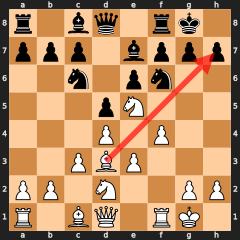
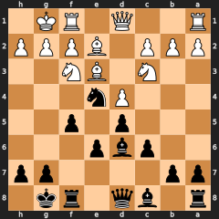
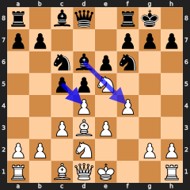
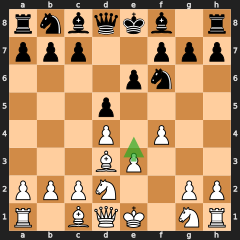
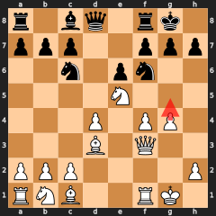
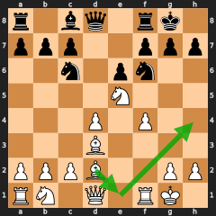
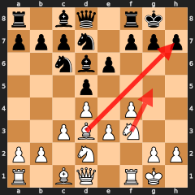

<!-- Generated from source HTML. GitHub renders the HTML below inside this markdown file. -->

<h1>The Stonewall Playbook</h1>

A Data-Driven Cheat Sheet from 116 White + 101 Black Games 
Based on Aman Hambleton's (wonestall) Stonewall Speedrun &bull; Generated April 23, 2026

<strong>Contents</strong>
<ol>
<li>White Stonewall — Overview, Plans & Key Ideas</li>
<li>Black Stonewall — Overview, Plans & Key Ideas</li>
<li>White vs Black — Same System, Different Philosophy</li>
<li>Statistics Deep Dive — Numbers That Tell Stories</li>
<li>Ne5/Ne4 Before Castling — When to Delay Castling</li>
<li>The e4 Central Break — Triggers, Plans & Timing</li>
<li>The g4 Kingside Storm — When, Why & How</li>
<li>The Bad Bishop Maneuver — DSB (White) & LSB (Black)</li>
<li>Bishop Attacks on the Kingside (Bxh7+ & Bxh6)</li>
<li>Opponent Threats & How to Handle Them</li>
<li>Games by Theme — Clickable Study Links</li>
</ol>

<!-- ============================================================ -->
<h2>1. White Stonewall — The Attacker's System</h2>
<!-- ============================================================ -->

<h3>The Structure</h3>

<strong>Pawns:</strong> d4 + e3 + f4 (+ c3 when needed). The f4 pawn is the signature — it stakes a claim on the kingside and prepares the attack.

<strong>Key piece:</strong> Bishop on d3, aimed at the h7 pawn. This is the cannon. Everything else supports it.

<strong>The deal:</strong> You accept a "bad" dark-squared bishop (blocked by e3/f4) in exchange for a clear attacking plan against the enemy king.

    
    
The ideal White Stonewall: c3+d4+e3+f4 wall, Bd3 cannon aimed at h7, Ne5 dominating the center, Nd2 protecting d4.

<h3>The Opening Recipe</h3>

<strong>The Core (almost every game):</strong> 1.d4 → 2.e3 (96%) → 3.Bd3 (62%) or 3.f4 (23%) 
<strong>Most common first 4:</strong> d4 e3 Bd3 f4 (34 games) &nbsp;|&nbsp; d4 e3 f4 Bd3 (17 games) &nbsp;|&nbsp; d4 e3 Bd3 Nd2 (14 games)

<strong>💡 Rule of Thumb:</strong> Always d4, always e3, always Bd3. The order of f4 and c3 depends on what your opponent does. If they're developing normally, get Bd3 out first (it's your most important piece). If they threaten ...c5 or ...e5 quickly, consider f4 or c3 earlier.

<h3>The Five Middlegame Plans</h3>

<strong>Plan A: The Ne5 Squeeze (77 games, 66%)</strong> 
Plant your knight on e5. From there it attacks f7, supports Qf3/Qh5, and controls key squares. Average move: ~11.

<strong>Plan B: The g4 Storm (31 games, 26%)</strong> 
Push g4 to blast open the g-file. Often preceded by Qf3 and Rg1/Rf3. See <strong>Section 7</strong> for the full breakdown of when and how.

<strong>Plan C: The e4 Break (42 games, 36%)</strong> 
The most reliable central break — 100% win rate. Push e3→e4 to open the center, free the DSB, and create tactical threats. See <strong>Section 6</strong> for the complete analysis with triggers, plans, and timing.

<strong>Plan D: Bishop Attacks — Bxh7+ & Bxh6 (12 + 9 games)</strong> 
Two distinct bishop attacks: the LSB sacrifice on h7 (Greek Gift), and the DSB sacrifice on h6 (ripping open the kingside after ...h6). See <strong>Section 9</strong> for full breakdown.

<strong>Plan E: The DSB Maneuver (28 games, 24%)</strong> 
Bd2→Be1→Bh4 to activate the "bad" bishop. See <strong>Section 8</strong> for triggers and when to use it.

<strong>📊 Data Insight:</strong> Plans overlap heavily. A typical attacking game starts with Ne5, transitions to Qf3 or g4, and may finish with Bxh7+ or a breakthrough on the f-file. Think of them as a toolkit, not separate plans.

<h3>The Nd2 Priority</h3>

Aman develops Nd2 in <strong>60 of 116 games</strong> (51%). In 38 games, Nd2 comes <em>before</em> Nf3.

<strong>💡 Why Nd2?</strong> Prevents ...Nd4 (a monster in your camp). Also supports Ne5 transfers (Nd2→Nf3→Ne5). <strong>BUT:</strong> Against symmetrical SW structures (opponent plays ...f5), Nd2 is often futile because ...Ne4 is protected by the d5 and f5 pawns. In those positions, consider the DSB maneuver instead (Section 8). Playing Nd2 in a symmetrical SW can actually <em>block in</em> the DSB, making the maneuver impossible.

<strong>🔍 Quiet support move:</strong> In <strong>19 annotated games</strong>, White uses <strong>Qc2 / Qe1 / Qe2</strong> to do two jobs at once: guard the light-squared bishop and help hold the <strong>e4</strong> square / e-file before committing the knight structure. When Nd2 alone does not solve the square, the queen often does the hidden defensive work first.

<h3>Castling</h3>

<strong>Kingside: 95%</strong> of games. Average castling move: <strong>8.3</strong>.

<!-- ============================================================ -->
<h2>2. Black Stonewall — The Fortress Builder</h2>
<!-- ============================================================ -->

<h3>The Structure</h3>

<strong>Pawns:</strong> d5 + e6 + f5 + c6. Four pawns forming an unbreakable wall. The c6 pawn is more consistently part of the Black setup than c3 is for White.

<strong>Key piece:</strong> Bishop on d6 (the "good" dark-squared bishop), aimed at the kingside.

<strong>The problem piece:</strong> The light-squared bishop on c8 is trapped behind e6/d5/f5. Finding activity for this bishop is the central strategic challenge.

    
    
The ideal Black Stonewall: d5+e6+f5+c6 wall, Bd6 on the strong diagonal, Ne4 on the dream outpost. The c8 bishop is the problem piece — trapped behind the wall.

<h3>The Opening Recipe</h3>

<strong>vs 1.d4 (34 games):</strong>

<strong>Standard:</strong> 1...d5 → 2...e6 → 3...c6 → 4...f5 (then Bd6, Nf6, O-O) 
<strong>Key principle:</strong> Pawns first, pieces second. In 62% of d4 games, 4+ pawns are placed before any piece.

<strong>vs 1.e4 (57 games):</strong>

<strong>French setup:</strong> 1...e6 → 2...d5 → then after exd5 exd5, play ...f5, ...Nf6, ...Bd6 
The Stonewall arises via a French Defence move order.

<strong>💡 Rule of Thumb (Black vs d4):</strong> Build the wall first: d5, e6, c6, f5 — usually in that order. Only after the wall is up do you develop pieces. The wall determines WHERE pieces belong.

<h3>The London Exception</h3>

Against the London System (2.Bf4), Aman sometimes breaks the "pawns first" rule. In 3 games, <strong>Bd6 came before ...f5</strong> — challenging the Bf4 directly to prevent a dark-square bind.

<h3>Middlegame Plans</h3>

<strong>Plan A: The Ne4 Outpost (61 games, 60%)</strong> 
The backbone of Black's middlegame. Plant a knight on e4, attacking d2/f2 and controlling key squares. Average move: ~11.

<strong>Plan B: The LSB Maneuver (18 games)</strong> 
Bd7→Be8→Bh5 to activate the bad bishop. See <strong>Section 8</strong> for when to deploy this vs Ne4.

<strong>Plan C: Queen Reroute (41 games)</strong> 
Swing the queen to e8, then potentially g6 or h5. Often combines with the LSB maneuver.

<strong>Plan D: ...g5 Push (22 games)</strong> 
The aggressive kingside pawn advance. Rare but powerful — this is the Black mirror of White's g4 storm.

<strong>Plan E: Bxh2+ Sacrifice (2 games)</strong> 
The Black mirror of White's Bxh7+ Greek Gift — sacrificing the dark-squared bishop to expose White's king.

<h3>Dealing with Ne5</h3>

White played Ne5 in <strong>38 of 101 games (37%)</strong>. Aman's response: <em>ignore it and continue with the plan.</em> The pawn wall (d5-e6-f5-c6) is structurally sound regardless. Black's counterplay comes from Ne4 and the kingside, not from fighting for e5.

<strong>💡 New black-side nuance:</strong> <strong>...Nd7</strong> is a tool, not a law. The refreshed notes show it used in <strong>4 games</strong> to stop Ne5, but later games often prefer castling, bishop activity, or a direct <strong>...Ne4</strong> plan instead. If ...Nd7 kills your c-pawn flexibility or points you toward an ugly <strong>...cxd5</strong> recapture, don't force it.

<h3>Castling</h3>

<strong>Kingside: 89%</strong>. Average move: <strong>8.2</strong> (close to White's 8.3).

<!-- ============================================================ -->
<h2>3. White vs Black — Same System, Different Philosophy</h2>
<!-- ============================================================ -->

<h3>What's the Same</h3>
<table>
<tr><th>Feature</th><th>White</th><th>Black</th></tr>
<tr><td>Core pawn chain</td><td>d4-e3-f4</td><td>d5-e6-f5</td></tr>
<tr><td>Average castling move</td><td>8.3</td><td>8.4</td></tr>
<tr><td>Knight outpost</td><td>Ne5 (66%)</td><td>Ne4 (60%)</td></tr>
<tr><td>Outpost timing</td><td>Move ~11</td><td>Move ~11</td></tr>
<tr><td>Bad bishop maneuver</td><td>DSB: Bd2→Be1→Bh4</td><td>LSB: Bd7→Be8→Bh5</td></tr>
<tr><td>Bishop attacks</td><td>Bxh7+ (10%) + Bxh6 (7%)</td><td>Bxh2+ (rare)</td></tr>
<tr><td>Central break</td><td>e4 (36%)</td><td>e5 (17%)</td></tr>
</table>

<h3>What's Different</h3>
<table>
<tr><th>Aspect</th><th>White</th><th>Black</th></tr>
<tr><td><strong>Opening priority</strong></td><td>Piece development (Bd3 by move 3)</td><td>Pawn structure (3-4 pawns before pieces)</td></tr>
<tr><td><strong>Bad bishop strategy</strong></td><td>Often leave DSB on c1 (75% never moves). General-purpose maneuver.</td><td>LSB maneuver is more specialized — about 66% of LSB maneuver games are triggered by symmetrical structures.</td></tr>
<tr><td><strong>Preventing infiltration</strong></td><td>Often uses Nd2 to prevent ...Nd4 (60 games total)</td><td>Tolerates Ne5 (37% of games)</td></tr>
<tr><td><strong>Kingside storm</strong></td><td>g4 (26%) — multiple triggers</td><td>g5 (21%) — much rarer</td></tr>
</table>

<h3>The Mirror Patterns</h3>

<strong>🪞 What transfers from White to Black:</strong>
<ul>
<li><strong>Bad bishop maneuver vs symmetrical positions</strong> — White DSB maneuver when opponent plays Dutch/SW; Black LSB maneuver when opponent plays f4. Same trigger, same logic.</li>
<li><strong>Bad bishop maneuver vs passive/Indian setups</strong> — White DSB maneuver vs KID (opponent doesn't commit central pawns to 4th rank, controls e5 from behind); Black LSB maneuver vs KIA (opponent plays g3, uncommitted center denies Ne4 support). Same logic: when the outpost is structurally denied, activate the bad bishop instead.</li>
<li><strong>Bishop sacrifice on the h-pawn</strong> — White Bxh7+ to expose Black's king; Black Bxh2+ to expose White's king. Same concept, different direction.</li>
<li><strong>Kingside pawn storm</strong> — g4 (White) and g5 (Black). Both look to blast open files against the enemy king.</li>
</ul>
<strong>🚫 What does NOT transfer:</strong>
<ul>
<li><strong>Nd2 urgency</strong> — White must prevent ...Nd4; Black tolerates Ne5 because the wall is structurally sound.</li>
<li><strong>g4 frequency</strong> — White pushes g4 in 26% of games; Black pushes g5 in only 21%.</li>
<li><strong>e4/e5 break frequency</strong> — White has e4 (36%); Black has ...e5 but much rarer (17%).</li>
</ul>

<strong>White = Build the cannon (Bd3) first, then the fortress.</strong> 
<strong>Black = Build the fortress (d5-e6-f5-c6) first, then find the cannon.</strong>

<!-- ============================================================ -->
<h2>4. Statistics Deep Dive</h2>
<!-- ============================================================ -->

<h3>White Opening Move Order</h3>
<table>
<tr><th>Move</th><th>When Played</th><th>Frequency</th></tr>
<tr><td><strong>d4</strong></td><td>Always move 1</td><td>116/116 (100%)</td></tr>
<tr><td><strong>e3</strong></td><td>Move 2 (97%), Move 3 (3%)</td><td>115/116 (99%)</td></tr>
<tr><td><strong>Bd3</strong></td><td>Move 3 (72x), Move 4 (24x)</td><td>113/116 (97%)</td></tr>
<tr><td><strong>f4</strong></td><td>Move 3-5 (most by move 5)</td><td>116/116 (100%)</td></tr>
<tr><td><strong>c3</strong></td><td>Scattered (move 5-7)</td><td>104/116 (89%)</td></tr>
<tr><td><strong>Nd2</strong></td><td>Move 4-8</td><td>60/116 (51%)</td></tr>
<tr><td><strong>O-O</strong></td><td>Move 6-8</td><td>111/116 (95%)</td></tr>
</table>

<strong>💡 New note-level pattern:</strong> early <strong>f4</strong> is often prophylaxis, not impatience. In <strong>3 annotated games</strong>, the point is specifically to keep <strong>Nf3</strong> available against <strong>...Bg4</strong>. White is buying piece freedom before the pin arrives.

<h3>Knight Outpost Comparison</h3>
<table>
<tr><th>Metric</th><th>White (Ne5)</th><th>Black (Ne4)</th></tr>
<tr><td>Games with outpost</td><td>77/116 (66%)</td><td>61/101 (60%)</td></tr>
<tr><td>Average timing</td><td>Move ~11</td><td>Move ~11</td></tr>
</table>

<h3>Attack Patterns (White)</h3>
<table>
<tr><th>Attack Type</th><th>Games</th><th>Rate</th></tr>
<tr><td>Ne5 outpost</td><td>77</td><td>66%</td></tr>
<tr><td>g4 kingside storm</td><td>31</td><td>26%</td></tr>
<tr><td>e4 central break</td><td>42</td><td>36%</td></tr>
<tr><td>DSB maneuver</td><td>28</td><td>24%</td></tr>
<tr><td>Qf3 setup</td><td>20</td><td>17%</td></tr>
<tr><td>Bxh7+ Greek gift</td><td>12</td><td>10%</td></tr>
<tr><td>Queen support (Qc2/Qe1/Qe2)</td><td>19</td><td>16%</td></tr>
<tr><td>Rxf3 / exchange sac motif</td><td>9</td><td>7%</td></tr>
<tr><td>Quick wins (≤20 moves)</td><td>29</td><td>25%</td></tr>
</table>

<h3>Attack Patterns (Black)</h3>
<table>
<tr><th>Attack Type</th><th>Games</th><th>Rate</th></tr>
<tr><td>Ne4 outpost</td><td>61</td><td>60%</td></tr>
<tr><td>Queen reroute (Qe8/Qe7)</td><td>41</td><td>40%</td></tr>
<tr><td>LSB maneuver</td><td>18</td><td>17%</td></tr>
<tr><td>g5 kingside push</td><td>22</td><td>21%</td></tr>
<tr><td>e5 central break</td><td>18</td><td>17%</td></tr>
<tr><td>Bxh2+ sacrifice</td><td>2</td><td>1%</td></tr>
<tr><td>...Nd7 prophylaxis</td><td>4</td><td>3%</td></tr>
<tr><td>Full wall (d5+e6+f5+c6)</td><td>81</td><td>80%</td></tr>
<tr><td>Quick wins (≤20 moves)</td><td>23</td><td>22%</td></tr>
</table>

<h3>Opponent Counterplay (White)</h3>
<table>
<tr><th>Opponent Break</th><th>Games</th><th>Notes</th></tr>
<tr><td>...Nc6 (threatens e5)</td><td>80</td><td>⚠️ Very common — see Section 10</td></tr>
<tr><td>...f5 (mirror/Dutch SW)</td><td>14</td><td>🟡 Creates locked center — see Sections 5-7</td></tr>
<tr><td>...e5 (central counter)</td><td>25</td><td>⚠️ Frequent</td></tr>
<tr><td>...b6 (queenside fianchetto)</td><td>18</td><td>⚠️ Bb7 threat — see Section 10</td></tr>
<tr><td>...Qb6 (d4 pin)</td><td>18</td><td>🔴 Dangerous! See Section 10</td></tr>
</table>

<!-- ============================================================ -->
<h2>5. Ne5/Ne4 Before Castling — When to Delay Castling</h2>
<!-- ============================================================ -->

    
    
Ne5 before castling. Black has played ...c5 and ...Bd6 — threatening ...cxd4 exd4 leaving f4 hanging to Bxf4. Aman jumps Ne5 immediately to seize the initiative before castling.

Conventional wisdom says castle early. But Aman delays castling to play the knight outpost first in <strong>10 White games (Ne5)</strong> and <strong>13 Black games (Ne4)</strong> — a combined 19 games with an <strong>18-1 record</strong>. Black is a perfect <strong>13-0</strong>. This is not recklessness — each case has a concrete reason.

<h3>5a. White: Ne5 Before Castling (10 games, 9-1)</h3>

<h4>Trigger 1: Punishing Opponent's Time-Wasting</h4>

When the opponent wastes tempi with queenside pawn pushes (a5, b5, a6, etc.) instead of developing, the position calls for <strong>immediate aggression</strong>. Castling is a quiet move — Ne5 punishes the opponent's slowness by seizing the outpost while they're underdeveloped.

From annotations (vs Noah278): <em>"He does it to punish the opponent's slowness out of the opening, with all of the queenside pawn pushes."</em>

    <h4>Ne5 Punishing Tempo Waste (1 games)</h4>
    
Opponent wastes time with queenside pawn pushes. Ne5 seizes the initiative before they can develop.

    <ul><li><a href="https://lichess.org/study/Tk9U1pMu/6F6fV6eM">Noah278</a></li></ul>
    

<h4>Trigger 2: Blocking Bishop's Attack on the f4 Pawn</h4>

When the opponent's bishop (often via ...Bd6 or after ...c5) threatens the f4 pawn, castling would leave the pawn vulnerable to <strong>cxd4 followed by Bxf4</strong>. Ne5 blocks the bishop's diagonal, so that after cxd4, we can safely recapture with exd4.

From annotations (vs bfk3): <em>"The reason for the urgency is that we want to block the bishop attacking our f pawn, so that on cxd4 we can recapture exd4."</em>

From annotations (vs eugeniogonzalezrd): <em>"We would be forced to recapture with our c pawn here if we had delayed the Ne5 jump."</em>

    <h4>Ne5 Blocking Bishop on f4 (6 games)</h4>
    
Opponent's bishop threatens f4 pawn. Ne5 blocks the diagonal before castling.

    <ul><li><a href="https://lichess.org/study/zOv1VXUQ/YdpjBTPY">MunibertMomsen</a></li><li><a href="https://lichess.org/study/Tk9U1pMu/WcP3N7el">bfk3</a></li><li><a href="https://lichess.org/study/Tk9U1pMu/9MHphyyC">joko844</a></li><li><a href="https://lichess.org/study/Tk9U1pMu/6F6fV6eM">Noah278</a></li><li><a href="https://lichess.org/study/Tk9U1pMu/zdrr2nuU">Sqeckle</a></li><li><a href="https://lichess.org/study/Tk9U1pMu/5bl14ElK">eugeniogonzalezrd</a> (Ne5 before castling, g4 push)</li></ul>
    

<h4>Trigger 3: Targeting Opponent's Bishop on g6</h4>

When the opponent develops their bishop to g6 (common after ...Bg4→g6 or ...Bf5→g6), Ne5 attacks it directly. Capturing the bishop before castling is more urgent than king safety — you're winning the bishop pair and/or forcing structural concessions.

From annotations (vs tonka65): <em>"Aman decided to immediately leap to e5 here in order to take the bishop, even before castling."</em>

    <h4>Ne5 Targeting Bishop on g6 (3 games)</h4>
    
Opponent's bishop sits on g6. Ne5 attacks it directly — capturing is more urgent than castling.

    <ul><li><a href="https://lichess.org/study/zOv1VXUQ/TyOs2LEc">tonka65</a></li><li><a href="https://lichess.org/study/Tk9U1pMu/9MHphyyC">joko844</a></li><li><a href="https://lichess.org/study/Tk9U1pMu/6F6fV6eM">Noah278</a></li></ul>
    

<h4>Trigger 4: Preventing Opponent's ...f5</h4>

When you suspect the opponent is planning ...f5 (creating a symmetrical Stonewall), Ne5 before castling blocks the f5 push and denies the opponent their desired structure. Once ...f5 is in, your Ne5 can be challenged; better to establish it first.

From annotations (vs Sqeckle): <em>"He delays castling here because he thinks the opponent is planning to push f5."</em>

    <h4>Ne5 Preventing ...f5 (3 games)</h4>
    
Opponent threatens ...f5 (symmetrical SW). Ne5 blocks it before they can establish the structure.

    <ul><li><a href="https://lichess.org/study/zOv1VXUQ/YdpjBTPY">MunibertMomsen</a></li><li><a href="https://lichess.org/study/Tk9U1pMu/9MHphyyC">joko844</a></li><li><a href="https://lichess.org/study/Tk9U1pMu/zdrr2nuU">Sqeckle</a></li></ul>
    

<h4>Trigger 5: Castling Disrupted by Opponent</h4>

Sometimes the opponent disrupts our castling plans — most notably with ...Qb6, which creates an X-ray pin on the d-file after any pawn exchanges. If we castle into the pin, the opponent can win the e5 pawn. Ne5 first sidesteps the problem.

From annotations (vs eugeniogonzalezrd): <em>"This queen move DOES X-RAY a pin should our opponent take cxd4, should we castle. So this move disrupts our usual move order."</em>

    <h4>Ne5 — Castling Disrupted (1 games)</h4>
    
Opponent's moves (e.g. Qb6 pin) make castling dangerous. Ne5 sidesteps the problem.

    <ul><li><a href="https://lichess.org/study/Tk9U1pMu/5bl14ElK">eugeniogonzalezrd</a> (Ne5 before castling, g4 push)</li></ul>
    

<strong>🔍 3 of 10 White games: Never castled at all.</strong> In those games, the attack was so overwhelming from the center that castling was never needed. The king stayed in the center while pieces flooded the kingside.

<h3>5b. Black: Ne4 Before Castling (13 games, 13-0)</h3>

A perfect record. With Black, the urgency to play Ne4 before castling is even higher — and the pattern is different from White.

<h4>Primary Trigger: Blocking Rook Checks in the French Exchange</h4>

In the French exchange variation (1.e4 e6 2.d4 d5 3.exd5 exd5), the e-file opens early. Black's king is exposed to <strong>Re1+ checks</strong>. Rather than waste time running the king to safety, <strong>Ne4 blocks the e-file</strong> while simultaneously occupying the dream square. Two problems solved with one move.

From annotations (vs Shipa1389): <em>"With black we often have the move Ne4 to block the rook's check on our king."</em>

From annotations (vs grebenek): <em>"The knight blocking check is an idea when playing Stonewall as black. Perhaps the move order of Nf6, Bd6 actually encourages this rook check which we are actually happy to see."</em>

<strong>💡 Key Insight:</strong> In the French exchange Stonewall, don't fear Re1+. Play Nf6 before Bd6 — this <em>invites</em> Re1+ because you want to answer with Ne4, which blocks the check and establishes the outpost simultaneously. The "threat" actually helps Black.

    <h4>Ne4 Blocking Rook Check (French Exchange) (12 games)</h4>
    
Open e-file gives White Re1+ check. Ne4 blocks the check AND establishes the outpost.

    <ul><li><a href="https://lichess.org/study/nD4ZRU2M/5iwwwfEZ">Rotobono</a></li><li><a href="https://lichess.org/study/nD4ZRU2M/jzgjnUd9">VBKnight007</a></li><li><a href="https://lichess.org/study/nD4ZRU2M/zpyLHTVA">GFST</a></li><li><a href="https://lichess.org/study/nD4ZRU2M/AvAVHjIV">Shipa1389</a></li><li><a href="https://lichess.org/study/xlWBIbwW/kauiOEIG">brianchifumuro</a></li><li><a href="https://lichess.org/study/xlWBIbwW/bEzkbILL">noname2071980</a></li><li><a href="https://lichess.org/study/xlWBIbwW/Cw0xL4rz">RafaelDm3</a></li><li><a href="https://lichess.org/study/xlWBIbwW/pIaZh6Mu">grebenek</a></li><li><a href="https://lichess.org/study/xlWBIbwW/RBPYrQ4G">tigrashka2023</a></li><li><a href="https://lichess.org/study/xlWBIbwW/3UiYayDa">Marmot07</a></li><li><a href="https://lichess.org/study/xlWBIbwW/XMHKsPo3">gal1111</a></li><li><a href="https://lichess.org/study/xlWBIbwW/H6CVVgqf">salah_tahe99</a></li></ul>
    

<h4>Secondary Trigger: Forcing the Issue (Tempo Urgency)</h4>

Black is a tempo down compared to White. This means there's less time for quiet development moves like castling. In several games, Aman plays Ne4 before castling simply because the position demands <strong>immediate action</strong> — forcing the opponent to deal with the knight before they can consolidate.

From annotations (vs VBKnight007): <em>"Knight before castling. Doing it early because we want to force the issue with the knight."</em>

From annotations (vs noname2071980 / vs RafaelDm3): <em>"Perhaps black being a tempo down forces more directness / aggression."</em>

    <h4>Ne4 Forcing the Issue (Tempo Urgency) (7 games)</h4>
    
Black is a tempo down — no time for quiet castling. Ne4 forces immediate resolution.

    <ul><li><a href="https://lichess.org/study/nD4ZRU2M/jzgjnUd9">VBKnight007</a></li><li><a href="https://lichess.org/study/xlWBIbwW/Cw0xL4rz">RafaelDm3</a></li><li><a href="https://lichess.org/study/xlWBIbwW/pIaZh6Mu">grebenek</a></li><li><a href="https://lichess.org/study/xlWBIbwW/RBPYrQ4G">tigrashka2023</a></li><li><a href="https://lichess.org/study/xlWBIbwW/3UiYayDa">Marmot07</a></li><li><a href="https://lichess.org/study/xlWBIbwW/XMHKsPo3">gal1111</a></li><li><a href="https://lichess.org/study/xlWBIbwW/H6CVVgqf">salah_tahe99</a></li></ul>
    

<h4>Tertiary Trigger: Exploiting a Weak e4 Square</h4>

When the opponent's setup leaves e4 structurally weak (no pawn covering it, or opponent committed to a structure that can't challenge the knight), Aman jumps in immediately — before the opponent can shore up the weakness.

From annotations (vs DavidLaguna88): <em>"Avoiding the symmetrical stonewall. Aiming right for that weak e4 square."</em> And later: <em>"This knight on e4 was the dominating factor in black's win."</em>

    <h4>Ne4 Exploiting Weak e4 (1 games)</h4>
    
Opponent's structure leaves e4 undefended. Jump in before they can shore it up.

    <ul><li><a href="https://lichess.org/study/xlWBIbwW/qfQH4LzH">DavidLaguna88</a></li></ul>
    

<strong>🪞 White vs Black — Why Delay Castling?</strong> 
<table>
<tr><th>Aspect</th><th>White (Ne5 before O-O)</th><th>Black (Ne4 before O-O)</th></tr>
<tr><td><strong>Record</strong></td><td>9-1</td><td>13-0 (perfect)</td></tr>
<tr><td><strong>Primary trigger</strong></td><td>Multiple (tempo, bishop, structure)</td><td>Blocking Re1+ check (French exchange)</td></tr>
<tr><td><strong>Philosophy</strong></td><td>Opportunistic — seize the moment</td><td>Structural — the outpost IS the defense</td></tr>
<tr><td><strong>Never castled</strong></td><td>3 games (attack from center)</td><td>2 games (endgame reached first)</td></tr>
</table>

<strong>💡 The Rule:</strong> Castle when it's safe and useful. But when Ne5/Ne4 solves a concrete problem (blocking, punishing, preventing), the outpost takes priority. The knight on e5/e4 often provides <em>more</em> king safety than castling would — it controls key squares and blocks enemy piece activity.

<!-- ============================================================ -->
<h2>6. The e4 Central Break — Triggers, Plans & Timing</h2>
<!-- ============================================================ -->

    
    
The e3 pawn: our structural weakness in the Stonewall — but also a loaded spring. When conditions are right, e4 transforms the position by opening the center, freeing the DSB, and creating tactical threats.

The e4 central break appears in <strong>42 of 116 games (36%)</strong> — and carries a <strong>100% win rate</strong>. When Aman pushes e4, he wins. Every time. This is not coincidence: the break only works when the position is ready, and Aman reads the signs accurately.

<strong>📊 Key Stats:</strong> 42 games with e4 break, all won. Average move: ~12-14. Most common after opponent plays ...c4 (71% e4 rate vs 41% without). Ne5 on the board in 13 games. Opponent not castled in 15 games.

<h3>6a. Signs That e4 Is Possible</h3>

Not every position allows e4. These are the conditions that signal the break is ready:

<strong>1. Opponent pushed ...c4 (13 games)</strong>

When the opponent pushes their c-pawn to c4 (usually attacking our LSB, which retreats to c2), they lock the queenside and <em>release the tension on d4</em>. This is the single strongest signal: <strong>71% of games with ...c4 feature an e4 break</strong>, versus 41% without. From annotations (vs <a href="https://lichess.org/study/bvfOTAKi/N56IBjR7">Atchi23</a>): <em>"We often want to time e4 for after our opponent has played c4."</em> And (vs <a href="https://lichess.org/study/bvfOTAKi/lALlJrhO">Collegeoflaw</a>): <em>"We very often see the e4 push after our opponent has lost the tension on d4 by playing c4."</em>

However, timing matters. Against <a href="https://lichess.org/study/bvfOTAKi/N56IBjR7">Atchi23</a>, Aman played e4 <em>before</em> ...c4 and acknowledged it was an inaccuracy — the engine flagged it because it allows ...cxd4. The lesson: wait for ...c4 if it's coming.

    <h4>e4 After Opponent's ...c4 (13 games)</h4>
    
Opponent locks the queenside with ...c4, freeing our e-pawn. The strongest trigger for the break.

    <ul><li><a href="https://lichess.org/study/zOv1VXUQ/wHX4HZ03">discopawn</a></li><li><a href="https://lichess.org/study/Tk9U1pMu/2vQx66u0">MazdaDave</a></li><li><a href="https://lichess.org/study/Tk9U1pMu/m2E9Y66G">snifs84</a></li><li><a href="https://lichess.org/study/Tk9U1pMu/vG7nmU8d">sriprasu</a></li><li><a href="https://lichess.org/study/Tk9U1pMu/6F6fV6eM">Noah278</a></li><li><a href="https://lichess.org/study/Tk9U1pMu/TPT0jS5f">Collegeoflaw</a></li><li><a href="https://lichess.org/study/Tk9U1pMu/zdrr2nuU">Sqeckle</a></li><li><a href="https://lichess.org/study/Tk9U1pMu/uaxX43Mu">lossmoose</a></li><li><a href="https://lichess.org/study/Tk9U1pMu/5bl14ElK">eugeniogonzalezrd</a> (Ne5 before castling, g4 push)</li><li><a href="https://lichess.org/study/Tk9U1pMu/fU5NrXoT">orlando1410</a></li><li><a href="https://lichess.org/study/Tk9U1pMu/DCqWLIHX">jonvon640</a></li><li><a href="https://lichess.org/study/Tk9U1pMu/FWrdGXnd">phrase111</a></li><li><a href="https://lichess.org/study/Tk9U1pMu/GD2kSQ2j">aivarsopp</a></li></ul>
    

<strong>2. We own the e4 square</strong>

The break requires controlling e4 so the pawn isn't immediately lost or blocked. Key pieces: Nd2 (defends e4 after the push and recaptures), LSB on d3 or c2 (supports e4 and benefits from the opened diagonal), and sometimes the queen on e1, c2, or f3 providing additional cover. From annotations (vs <a href="https://lichess.org/study/jjmB1AcS/z5QkX8XW">Kriisi</a>): <em>"There is an important difference in this position — the bishop covering the e4 square through the knight and pawn. Qc2 is necessary to add another defender."</em>

<strong>3. Opponent is playing passively / KID setup (6 games)</strong>

When the opponent plays ...g6/...Bg7/...d6 without committing central pawns, e4 seizes space and the center. From annotations (vs <a href="https://lichess.org/study/bvfOTAKi/LE4LuYsP">skyshor1</a>): <em>"Seems our main idea vs KID defense-like setups is this e4 push."</em> The opponent's fianchetto doesn't contest the center, making e4 natural and powerful.

    <h4>e4 vs KID/Passive Setups (6 games)</h4>
    
Opponent fianchettoes without committing central pawns. e4 punishes the passivity.

    <ul><li><a href="https://lichess.org/study/zOv1VXUQ/01VYdsY1">livellozero</a></li><li><a href="https://lichess.org/study/zOv1VXUQ/YEMyNND2">iMethodManx</a></li><li><a href="https://lichess.org/study/Tk9U1pMu/5VfkB9dg">skyshor1</a></li><li><a href="https://lichess.org/study/Tk9U1pMu/5gYZRuzX">leafy180</a></li><li><a href="https://lichess.org/study/Tk9U1pMu/DCqWLIHX">jonvon640</a></li><li><a href="https://lichess.org/study/Tk9U1pMu/GD2kSQ2j">aivarsopp</a></li></ul>
    

<strong>4. Opponent is not taking our Ne5 (13 games)</strong>

When Ne5 sits unchallenged, the opponent is under positional pressure but may not be collapsing. The e4 push becomes Plan B — a way to break open the position while the knight still dominates. From annotations (vs <a href="https://lichess.org/study/jjmB1AcS/37amt6Zv">Urano8</a>): <em>"Often if our opponent doesn't capture our e5 knight this is a plan B. This is how we will free up our d2 knight and DSB. If we can push e4 it usually means we can combine other opening/attacking ideas with the Stonewall."</em>

    <h4>e4 With Ne5 On The Board (Plan B) (13 games)</h4>
    
Ne5 unchallenged — e4 opens the position while the knight dominates.

    <ul><li><a href="https://lichess.org/study/zOv1VXUQ/jWirOlpL">Urano8</a></li><li><a href="https://lichess.org/study/zOv1VXUQ/i0fzE8Z8">Fuad311924</a></li><li><a href="https://lichess.org/study/zOv1VXUQ/HKmjRpqz">BoneFSV</a></li><li><a href="https://lichess.org/study/zOv1VXUQ/h3bfVblR">adrianvs16</a></li><li><a href="https://lichess.org/study/zOv1VXUQ/TyOs2LEc">tonka65</a></li><li><a href="https://lichess.org/study/Tk9U1pMu/BAwGtzqQ">UnkleG</a></li><li><a href="https://lichess.org/study/Tk9U1pMu/6F6fV6eM">Noah278</a></li><li><a href="https://lichess.org/study/Tk9U1pMu/zdrr2nuU">Sqeckle</a></li><li><a href="https://lichess.org/study/Tk9U1pMu/uH1WLyab">harishmaddirala</a></li><li><a href="https://lichess.org/study/Tk9U1pMu/5bl14ElK">eugeniogonzalezrd</a> (Ne5 before castling, g4 push)</li><li><a href="https://lichess.org/study/Tk9U1pMu/fU5NrXoT">orlando1410</a></li><li><a href="https://lichess.org/study/Tk9U1pMu/DCqWLIHX">jonvon640</a></li><li><a href="https://lichess.org/study/Tk9U1pMu/FWrdGXnd">phrase111</a></li></ul>
    

<strong>5. Opponent is not castled (15 games)</strong>

Opening the center against an uncastled king is devastating. The e4 break creates open lines that immediately threaten the exposed king. This is the most common condition — present in 15 of 42 e4 break games.

<strong>6. After the LSB is traded (8 games)</strong>

When the opponent trades our LSB (Bxd3), it removes a defender from our camp — but it also eliminates a reason to keep the e3-d5 structure static. With the LSB gone, e4 opens lines for the remaining pieces (especially rooks on the e-file and d-file). The data shows a modest correlation: LSB traded before e4 in 8 of 42 e4 games (20%), compared to 14% LSB trade rate across all 105 games. The more interesting finding: when the LSB <em>is</em> traded, e4 comes <strong>earlier</strong> (average move 12.9 vs 15.8 without the trade). This makes positional sense — without the LSB on d3, e4 is needed to generate activity through other means.

    <h4>e4 After LSB Traded (8 games)</h4>
    
LSB exchanged — e4 compensates by opening lines for rooks and remaining pieces.

    <ul><li><a href="https://lichess.org/study/zOv1VXUQ/7FjdNnTU">Inskaper0</a></li><li><a href="https://lichess.org/study/zOv1VXUQ/rRmGgwom">JackCar3</a></li><li><a href="https://lichess.org/study/zOv1VXUQ/05E9hC1y">krapp70</a></li><li><a href="https://lichess.org/study/zOv1VXUQ/h3bfVblR">adrianvs16</a></li><li><a href="https://lichess.org/study/zOv1VXUQ/StIPLv1V">On7even</a></li><li><a href="https://lichess.org/study/Tk9U1pMu/9Fgp6wkR">voxowl</a></li><li><a href="https://lichess.org/study/Tk9U1pMu/uH1WLyab">harishmaddirala</a></li><li><a href="https://lichess.org/study/Tk9U1pMu/DCqWLIHX">jonvon640</a></li></ul>
    

<h3>6b. Eight Plans Revolving Around e4</h3>

The e4 push isn't one idea — it serves different strategic purposes depending on the position:

<strong>Plan 1: Blast open the center (9 games)</strong>

When our pieces are coordinated and the opponent's are not, e4 rips the position open to exploit superior development. The classic case is vs <a href="https://lichess.org/study/jjmB1AcS/AxGB7RbE">Inskaper0</a>: after ...f6 weakened e6, Aman saw e4 as a way to target the weakened structure. From annotations: <em>"Looking to blast open the position given our superior piece coordination. We are ready to attack. Our opponent is not ready to defend. As soon as Aman saw f6 he was thinking about trying to get e4 in."</em>

<strong>Plan 2: Free the DSB diagonal (7 games)</strong>

The e3 pawn blocks the DSB's c1-h6 diagonal. Pushing e4 (and especially after ...dxe4 Nxe4) clears the way for the dark-squared bishop to become active. From annotations (vs <a href="https://lichess.org/study/jjmB1AcS/zEFBOQhQ">discopawn</a>): <em>"e4, while a great move to free up our minor pieces, would be bad [at that moment] as it would allow Nxe5."</em> — showing Aman evaluates the break even when he can't play it yet. Also (vs <a href="https://lichess.org/study/jjmB1AcS/X3EjQXZl">MunibertMomsen</a>): <em>"Our e4 break. Opening up the DSB."</em>

<strong>Plan 3: Plan B when Ne5 is ignored (3 annotated games)</strong>

If the opponent refuses to trade our Ne5 knight, we have a secondary plan. The e4 push frees the Nd2 and DSB while the knight continues to dominate e5. This combination — Ne5 + open center — is often overwhelming. Vs <a href="https://lichess.org/study/jjmB1AcS/37amt6Zv">Urano8</a> is the textbook example.

<strong>Plan 4: Eliminate our weakness</strong>

The e3 pawn is the structural weakness in our Stonewall. Pushing it to e4 (and exchanging it for d5) removes this liability. From annotations (vs <a href="https://lichess.org/study/jjmB1AcS/n2yNVTgE">AlexTurnbull</a>): <em>"If we can play e4, we usually want to. Getting rid of our weakness. Opening up the diagonal for our DSB."</em>

<strong>Plan 5: Take space against passive opponents (6 games)</strong>

Against passive setups (especially KID-like structures), e4 grabs central space and pushes the opponent back. Vs <a href="https://lichess.org/study/jjmB1AcS/MqoD5v4N">livellozero</a> is the extreme case: Aman played e4 on move 8 against a passive ...d6/...b6/...Bb7 setup and it led to checkmate by move 11.

<strong>Plan 6: Discover an attack (5 games)</strong>

The e4 push can uncover attacks from the d3 bishop or other pieces. Vs <a href="https://lichess.org/study/jjmB1AcS/SGWbiNQo">obrownu</a>: <em>"e4 — discovering an attack on the queen."</em> The pawn moves and suddenly a bishop or rook that was behind it gains a target.

<strong>Plan 7: Create room for piece maneuvers</strong>

After e4, the e3 square becomes available and the position opens up for rook lifts (Re1-e3), knight repositioning, and other piece activity. Vs <a href="https://lichess.org/study/jjmB1AcS/6thtrWst">On7even</a>: after Bxd3 Qxd3, the queen on d3 prepared e4 — and after exd5 Nxd5 Ne4, the knights found dominant squares in the opened center.

<strong>Plan 8: Threaten a pawn fork (9 games)</strong>

When a knight sits on e5 and the opponent has pawns on c6 and e6, the e4 push threatens ...dxe4 followed by e5 forking knight and bishop, or Nxc6 followed by e5. Vs <a href="https://lichess.org/study/bvfOTAKi/awFCeisR">eugeniogonzalezrd</a>: <em>"e4 — threatening Nxc6 followed by e5 and a fork."</em>

<strong>💡 The Decision:</strong> These plans often overlap. A single e4 push might simultaneously free the bishop (Plan 2), eliminate the weakness (Plan 4), and discover an attack (Plan 6). The question isn't "which plan am I executing" but "are enough conditions met to make e4 worth the structural commitment?"

<h3>6c. Timing: When NOT to Play e4</h3>

The <a href="https://lichess.org/study/bvfOTAKi/N56IBjR7">Atchi23</a> game provides the key cautionary tale: Aman played e4 and admitted it was an inaccuracy because the opponent still had ...cxd4 available. The e4 push changes the pawn structure irreversibly — if the opponent can exploit open lines or counter in the center, it backfires.

<strong>Wait for e4 when:</strong>

<ul>
<li>The opponent's c-pawn can still capture on d4 (wait for ...c4 first)</li>
<li>Your pieces aren't coordinated enough to exploit the open lines</li>
</ul>

<strong>Push e4 when:</strong>

<ul>
<li>Opponent has committed with ...c4 (71% e4 rate — this is the green light)</li>
<li>You have Nd2 + LSB controlling the e4 square post-push</li>
<li>Opponent's king is still in the center</li>
<li>Ne5 is established and opponent refuses to trade it</li>
<li>Opponent is passive (KID/fianchetto) and you need central space</li>
</ul>

<!-- ============================================================ -->
<h2>7. The g4 Kingside Storm — When, Why & How</h2>
<!-- ============================================================ -->

    
    
The g4 kingside storm: Qf3 supports the push, Ne5 controls the center, g4 is about to rip open the g-file. After ...fxg4, Qxg4 or Bxg4 opens devastating lines.

The g4 push appears in <strong>31 of 116 games (26%)</strong> — nearly as common as e4, and the most dynamic attacking plan in the Stonewall. But it's not one plan — it has several distinct triggers.

<h3>7a. g4 vs the ...e6 Structure</h3>

When the opponent locks in their LSB with ...e6, they're structurally committed. <strong>Qf3 followed by a quick g4</strong> becomes the default aggressive plan. The logic: the opponent's light squares are permanently weakened, and the g4 push cracks them open further.

Appears in 21 games — the most common g4 trigger.

    <h4>g4 vs e6 — Key Games (21 games)</h4>
    
Opponent plays ...e6 early, locking in the LSB. White responds with Qf3 → g4.

    <ul><li><a href="https://lichess.org/study/zOv1VXUQ/YDfYfFBH">Nikko_L_As</a></li><li><a href="https://lichess.org/study/zOv1VXUQ/OCiLEPOH">Mikon760</a></li><li><a href="https://lichess.org/study/zOv1VXUQ/vmaFRrkg">markchriscompton</a></li><li><a href="https://lichess.org/study/zOv1VXUQ/05E9hC1y">krapp70</a></li><li><a href="https://lichess.org/study/zOv1VXUQ/i0fzE8Z8">Fuad311924</a></li><li><a href="https://lichess.org/study/zOv1VXUQ/Ktlh1Hb5">eetu2</a></li><li><a href="https://lichess.org/study/Tk9U1pMu/nuXPQGwt">confid3nce</a></li><li><a href="https://lichess.org/study/Tk9U1pMu/nr0rVQAh">prikeee</a></li><li><a href="https://lichess.org/study/Tk9U1pMu/rt16o6gI">Supervaq</a></li><li><a href="https://lichess.org/study/Tk9U1pMu/m2E9Y66G">snifs84</a></li><li><a href="https://lichess.org/study/Tk9U1pMu/AhHq7rbz">belmont43</a></li><li><a href="https://lichess.org/study/Tk9U1pMu/Mp3ULZu0">evang_ili</a></li><li><a href="https://lichess.org/study/Tk9U1pMu/9DQBWd8n">AlkhineKing</a></li><li><a href="https://lichess.org/study/Tk9U1pMu/s8mOhjxe">pascancalin</a></li><li><a href="https://lichess.org/study/Tk9U1pMu/9MHphyyC">joko844</a></li><li><a href="https://lichess.org/study/Tk9U1pMu/hIzcE1Kg">Fort9</a></li><li><a href="https://lichess.org/study/Tk9U1pMu/iTVzCPec">enriquecancio</a></li><li><a href="https://lichess.org/study/Tk9U1pMu/uaxX43Mu">lossmoose</a></li><li><a href="https://lichess.org/study/Tk9U1pMu/5bl14ElK">eugeniogonzalezrd</a> (Ne5 before castling, g4 push)</li><li><a href="https://lichess.org/study/Tk9U1pMu/hORNHSXn">Weakpawns93</a></li><li><a href="https://lichess.org/study/Tk9U1pMu/FWrdGXnd">phrase111</a></li></ul>
    

<h3>7b. g4 vs the Symmetrical Stonewall</h3>

When the opponent plays ...f5 (Dutch or symmetrical SW), the position locks up. The g4 push <strong>undermines the Black structure</strong>, especially loosening a knight on e4 (which is protected by the f5 pawn). Preparation: <strong>Kh1 + Rg1</strong> to support the pawn before pushing.

6 games Kh1/Rg1 prep in 7 games

<strong>💡 Aman's Dilemma (evang_ili game):</strong> "You have to pick your poison—g3 or else face the SW." In symmetrical positions, g3 prevents ...Ne4 but blocks the DSB maneuver. g4 undermines ...Ne4 but requires preparation. Know the trade-off before choosing.

    <h4>g4 vs Symmetrical SW — Key Games (6 games)</h4>
    
Opponent plays ...f5 creating a symmetrical structure. g4 undermines the position.

    <ul><li><a href="https://lichess.org/study/zOv1VXUQ/YDfYfFBH">Nikko_L_As</a></li><li><a href="https://lichess.org/study/zOv1VXUQ/thWYDqTy">SurrenderTactic</a></li><li><a href="https://lichess.org/study/zOv1VXUQ/2govYfuU">SkovorodaG</a></li><li><a href="https://lichess.org/study/zOv1VXUQ/Ktlh1Hb5">eetu2</a></li><li><a href="https://lichess.org/study/Tk9U1pMu/Mp3ULZu0">evang_ili</a></li><li><a href="https://lichess.org/study/Tk9U1pMu/ajl9E8Jq">frank0288</a></li></ul>
    

<h3>7c. g4 After Early ...Bxf3 Knight Trade</h3>

When the opponent trades their LSB for our f3 knight early (<strong>...Bxf3, Qxf3</strong>), we no longer have Ne5 — but the opponent is also <strong>weak on the light squares</strong>. The queen on f3 is perfectly placed to support a g4 push. We've lost a knight but gained the light-square initiative.

4 games with this specific pattern

    <h4>g4 After ...Bxf3 — Key Games (4 games)</h4>
    
Opponent trades LSB for knight. No Ne5 available, but g4 exploits weakened light squares.

    <ul><li><a href="https://lichess.org/study/Tk9U1pMu/m2E9Y66G">snifs84</a></li><li><a href="https://lichess.org/study/Tk9U1pMu/Ltg2Kqf5">DonkeyOTea</a></li><li><a href="https://lichess.org/study/Tk9U1pMu/uaxX43Mu">lossmoose</a></li><li><a href="https://lichess.org/study/Tk9U1pMu/spcvs70U">Stigey</a></li></ul>
    

<strong>🪞 Black Mirror: The ...g5 Push (22 games, 21%)</strong> 
The Black equivalent of g4 exists but is much rarer. Usually deployed after castling and establishing Ne4. The asymmetry: White has Bd3 aimed at h7 providing natural support for kingside aggression; Black's Bd6 aims at h2 but doesn't synergize with ...g5 in the same way.

<!-- ============================================================ -->
<h2>8. The Bad Bishop Maneuver — DSB (White) & LSB (Black)</h2>
<!-- ============================================================ -->

Both sides have a "bad" bishop trapped behind their pawn chain. Activating it costs 3 tempi — so you need a good reason to invest that time.

    
    
The DSB maneuver path: Bc1→Bd2→Be1→Bh4. Three tempi to activate the "bad" bishop. Worth it when Ne5 plans are blocked (symmetrical SW or KID setups).

<h3>8a. White: DSB Maneuver (Bd2→Be1→Bh4)</h3>

28 games (24%) Full sequence to Bh4: 16 games DSB never moves: 75%

<h4>Trigger 1: Symmetrical Stonewall / Dutch</h4>

When the opponent plays ...f5 (Dutch or symmetrical SW), recognize immediately: <strong>Nd2 is futile</strong> because ...Ne4 will be firmly rooted, protected by d5 and f5 pawns. Instead, switch to the DSB maneuver <em>before</em> playing Nd2 — otherwise Nd2 blocks the DSB's path and makes the maneuver impossible.

Aman's thinking (vs eetu2): "Elects for the DSB maneuver over keeping the knight out of e4."

8 games

    <h4>DSB Maneuver vs Symmetrical SW / Dutch (8 games)</h4>
    
Opponent plays ...f5. Nd2 is futile; switch to DSB maneuver before blocking it in.

    <ul><li><a href="https://lichess.org/study/zOv1VXUQ/YDfYfFBH">Nikko_L_As</a></li><li><a href="https://lichess.org/study/zOv1VXUQ/2govYfuU">SkovorodaG</a></li><li><a href="https://lichess.org/study/zOv1VXUQ/Ktlh1Hb5">eetu2</a></li><li><a href="https://lichess.org/study/Tk9U1pMu/Mp3ULZu0">evang_ili</a></li><li><a href="https://lichess.org/study/Tk9U1pMu/RiDjME7E">Takota3</a></li><li><a href="https://lichess.org/study/Tk9U1pMu/F6v1FNYh">tony7209</a></li><li><a href="https://lichess.org/study/Tk9U1pMu/HhUrPx0e">Deivijhon</a></li><li><a href="https://lichess.org/study/Tk9U1pMu/ajl9E8Jq">frank0288</a></li></ul>
    

<h4>Trigger 2: KID / Indian Setups (Uncommitted Center)</h4>

When the opponent doesn't commit central pawns to the 4th/5th rank (no ...d5 or ...e5), they often fianchetto and control e5 from behind with pieces and flexible pawns. This makes it harder for our knight to reach e5, but also means the opponent can't support ...Ne4 with pawns. This gives us <strong>time to maneuver the DSB</strong> — get it to at least Be1 before committing Nd2.

Key recognition: the opponent's central pawns stay on d6/e6 (or d7/e7), not d5/e5. They control the center from behind rather than occupying it.

8 games

    <h4>DSB Maneuver vs KID / Indian Setups (8 games)</h4>
    
Opponent has uncommitted center (no ...d5). Controls e5 from behind. Time to activate DSB.

    <ul><li><a href="https://lichess.org/study/zOv1VXUQ/YEMyNND2">iMethodManx</a></li><li><a href="https://lichess.org/study/Tk9U1pMu/5VfkB9dg">skyshor1</a></li><li><a href="https://lichess.org/study/Tk9U1pMu/PBgr9eQl">fantomas570</a></li><li><a href="https://lichess.org/study/Tk9U1pMu/5gYZRuzX">leafy180</a></li><li><a href="https://lichess.org/study/Tk9U1pMu/5BPMKTbz">SchizoidChessPlayer</a></li><li><a href="https://lichess.org/study/Tk9U1pMu/dkD5KJFR">schlichti</a></li><li><a href="https://lichess.org/study/Tk9U1pMu/DCqWLIHX">jonvon640</a></li><li><a href="https://lichess.org/study/Tk9U1pMu/GD2kSQ2j">aivarsopp</a></li></ul>
    

<strong>🔍 When NOT to bother:</strong> In 75% of games, the DSB never moves at all. Don't waste time activating a bad piece when your good pieces (Bd3, Ne5) are already doing the job. The maneuver is for when the normal plans are denied.

<h3>8b. Black: LSB Maneuver (Bd7→Be8→Bh5)</h3>

18 games Full to Bh5: 10 games

<h4>Trigger 1: Symmetrical Stonewall (opponent plays f4)</h4>

The primary trigger. When the opponent plays f4, creating a symmetrical pawn structure, the LSB maneuver creates a favorable imbalance. Of the games where Aman starts the LSB maneuver early, <strong>the majority are against symmetrical structures</strong>.

12 games

    <h4>LSB Maneuver vs Symmetrical SW (12 games)</h4>
    
Opponent plays f4. Pawn structures mirror each other; LSB maneuver creates the imbalance.

    <ul><li><a href="https://lichess.org/study/nD4ZRU2M/kmPdiJ6a">spdn16</a></li><li><a href="https://lichess.org/study/nD4ZRU2M/zhcdU4wP">Luemro</a></li><li><a href="https://lichess.org/study/nD4ZRU2M/EWPs2G6m">AugustaCrow</a></li><li><a href="https://lichess.org/study/nD4ZRU2M/9vOHjTsd">enchevdee</a></li><li><a href="https://lichess.org/study/nD4ZRU2M/nPcgP0C3">RJWBrouwer</a></li><li><a href="https://lichess.org/study/xlWBIbwW/NO204om4">Famous_Musonda</a></li><li><a href="https://lichess.org/study/xlWBIbwW/vXzOa9Nb">Privatier7</a></li><li><a href="https://lichess.org/study/xlWBIbwW/DeLEu8lx">rama1504</a></li><li><a href="https://lichess.org/study/xlWBIbwW/g5n3wyMw">spaskiboris</a></li><li><a href="https://lichess.org/study/xlWBIbwW/EZd5bIzb">mehdiMoussaoui</a></li><li><a href="https://lichess.org/study/xlWBIbwW/BSct6Qut">Slapfighter</a></li><li><a href="https://lichess.org/study/xlWBIbwW/LaA6W9Ab">bchoss26</a></li></ul>
    

<h4>Trigger 2: KIA / Indian Setups (Uncommitted Center)</h4>

The <strong>exact mirror of White's DSB maneuver vs KID</strong>. When the opponent has an uncommitted center — g3 setup, no d4+e4 — they control e4 from behind, making it structurally harder for our Ne4 to be effective. So we switch to the LSB maneuver instead.

Aman's annotation: "Opponent is thwarting our Ne4 idea so time to play our LSB maneuver."

Key recognition: the opponent's central pawns aren't fully committed to the 4th rank, so our e4 outpost lacks the structural support it needs.

3 games

    <h4>LSB Maneuver vs KIA / Indian Setups (3 games)</h4>
    
Opponent has uncommitted center (g3 without d4+e4). Ne4 denied structurally. Switch to LSB.

    <ul><li><a href="https://lichess.org/study/nD4ZRU2M/EWPs2G6m">AugustaCrow</a></li><li><a href="https://lichess.org/study/xlWBIbwW/POanZ5m0">Jimmy_Guzman_GUA</a></li><li><a href="https://lichess.org/study/xlWBIbwW/aCByC7cf">limankastratii</a></li></ul>
    

<strong>🪞 The Perfect Mirror:</strong> 
<table>
<tr><th>Situation</th><th>White</th><th>Black</th></tr>
<tr><td>Symmetrical structure blocks normal plan</td><td>DSB maneuver vs ...f5</td><td>LSB maneuver vs f4</td></tr>
<tr><td>Indian-style setup blocks outpost</td><td>DSB maneuver vs KID (uncommitted center)</td><td>LSB maneuver vs KIA (uncommitted center)</td></tr>
<tr><td>Normal plan available (outpost open)</td><td>Leave DSB on c1 (75%)</td><td>Play Ne4 instead (60%)</td></tr>
</table>

<!-- ============================================================ -->
<h2>9. Bishop Attacks on the Kingside</h2>
<!-- ============================================================ -->

Two distinct bishop attack patterns appear in the Stonewall — one involving the LSB (Bd3) and one involving the DSB. Don't confuse them.

    
    
The Bxh7+ Greek Gift setup: Bd3 aimed at h7, Nf3 ready to jump Ng5+ after Kxh7. Key prerequisites: opponent's Nf6 has moved away (here Nd7), leaving h7 defended only by the king, and Bd6 does NOT cover g5 — so Ng5+ can't be captured.

<h3>9a. Bxh7+ — The Greek Gift (True LSB Sacrifice)</h3>

The Bd3 sacrifices itself on h7 with <strong>no piece supporting the capture</strong>. The return: exposed king, Ng5+ follows, queen reaches the h-file. Aman plays this with supreme confidence — the positional compensation is so overwhelming that precise calculation is secondary.

9 true sacrifices 3 supported captures (rook/queen already on h-file)

<strong>💡 Prerequisites:</strong> (1) Opponent castled kingside, (2) Knight on e5/f3 can jump to g5+ after ...Kxh7, (3) Queen can reach the h-file quickly, (4) Opponent's pieces can't defend the kingside.

    <h4>Bxh7+ — True Sacrifices (no support) (9 games)</h4>
    
LSB sacrifice on h7 with no piece supporting. Ng5+ and Qh5 follow.

    <ul><li><a href="https://lichess.org/study/zOv1VXUQ/FDAIYtAQ">Baker780</a></li><li><a href="https://lichess.org/study/zOv1VXUQ/jWirOlpL">Urano8</a></li><li><a href="https://lichess.org/study/zOv1VXUQ/YdpjBTPY">MunibertMomsen</a></li><li><a href="https://lichess.org/study/zOv1VXUQ/TRY0IrUU">bertbees</a></li><li><a href="https://lichess.org/study/zOv1VXUQ/i0fzE8Z8">Fuad311924</a></li><li><a href="https://lichess.org/study/zOv1VXUQ/oozt8Ch5">ICANTWINATHING</a></li><li><a href="https://lichess.org/study/zOv1VXUQ/zzOOAk7s">craquou</a></li><li><a href="https://lichess.org/study/Tk9U1pMu/hk0VhiC3">mpuhammadfauzi11</a></li><li><a href="https://lichess.org/study/Tk9U1pMu/s8mOhjxe">pascancalin</a></li></ul>
    

    <h4>Bxh7 — Supported Captures (rook/queen on h-file) (3 games)</h4>
    
Bxh7 with a rook or queen already aimed at the h-file. Still devastating, but not a pure sacrifice.

    <ul><li><a href="https://lichess.org/study/zOv1VXUQ/YDfYfFBH">Nikko_L_As</a></li><li><a href="https://lichess.org/study/Tk9U1pMu/9DQBWd8n">AlkhineKing</a></li><li><a href="https://lichess.org/study/Tk9U1pMu/9MHphyyC">joko844</a></li></ul>
    

<h3>9b. Bxh6 — The DSB Kingside Attack</h3>

A different pattern entirely. When the opponent plays ...h6 (often to prevent Ng5 or Bg5), the DSB <strong>captures the h6 pawn</strong>, ripping open the kingside. The queen is typically already on the h-file ready to recapture. Not always a true sacrifice — sometimes the h6 pawn is pinned or the capture is otherwise safe — but always devastating for Black's king safety.

9 games

    <h4>Bxh6 — DSB Kingside Attack (9 games)</h4>
    
DSB captures h6 pawn. Queen often ready to recapture. Rips open kingside shelter.

    <ul><li><a href="https://lichess.org/study/zOv1VXUQ/HJ0JbHk1">faf_09</a></li><li><a href="https://lichess.org/study/zOv1VXUQ/SgHPJCw4">BlknightRising</a></li><li><a href="https://lichess.org/study/zOv1VXUQ/dvRyeH0G">obrownu</a></li><li><a href="https://lichess.org/study/Tk9U1pMu/nr0rVQAh">prikeee</a></li><li><a href="https://lichess.org/study/Tk9U1pMu/Mp3ULZu0">evang_ili</a></li><li><a href="https://lichess.org/study/Tk9U1pMu/7irHJaBF">Kelmendi00</a></li><li><a href="https://lichess.org/study/Tk9U1pMu/5bl14ElK">eugeniogonzalezrd</a> (Ne5 before castling, g4 push)</li><li><a href="https://lichess.org/study/Tk9U1pMu/oKwQGZZb">NazZep</a></li><li><a href="https://lichess.org/study/Tk9U1pMu/FWrdGXnd">phrase111</a></li></ul>
    

<h3>9c. Rxf3 / Exchange Sac on f3</h3>

A recurring attacking motif from the refreshed notes: once the <strong>queen reaches the h-file</strong> and <strong>both bishops</strong> are cutting toward the king, White can crash a rook into <strong>f3</strong> to drag the king out or strip key defenders. This is not a random exchange sac — it works when the h-file and bishop diagonals are already alive.

9 games

    <h4>Rxf3 / Exchange Sac Motif (9 games)</h4>
    
Rook crashes into f3 once the h-file and bishop diagonals are primed.

    <ul><li><a href="https://lichess.org/study/zOv1VXUQ/MfI6QltS">TheVIralAce</a></li><li><a href="https://lichess.org/study/zOv1VXUQ/XFt7q3uS">Wojteq2000</a></li><li><a href="https://lichess.org/study/zOv1VXUQ/SGxQBBl9">KramnikIsAFatPig-BAN-HIM</a></li><li><a href="https://lichess.org/study/zOv1VXUQ/vmaFRrkg">markchriscompton</a></li><li><a href="https://lichess.org/study/zOv1VXUQ/9Ytu1IWm">Matheus_07</a></li><li><a href="https://lichess.org/study/Tk9U1pMu/m2E9Y66G">snifs84</a></li><li><a href="https://lichess.org/study/Tk9U1pMu/K0uQNyPL">viji18</a></li><li><a href="https://lichess.org/study/Tk9U1pMu/RiDjME7E">Takota3</a></li><li><a href="https://lichess.org/study/Tk9U1pMu/spcvs70U">Stigey</a></li></ul>
    

<!-- ============================================================ -->
<h2>10. Opponent Threats & How to Handle Them</h2>
<!-- ============================================================ -->

Recognizing opponent ideas early is as important as executing your own plans. Here are the most common threats and Aman's responses.

<h3>10a. ...Bb7 — Threatens to Force Ne4</h3>

The fianchettoed bishop x-rays the e4 square. Combined with ...Nf6, it threatens to establish an iron ...Ne4. <strong>Response: Qf3</strong> — adds a defender to e4 while also supporting g4 pawn push ideas. The queen on f3 does double duty: defensive anchor + attacking platform. The opponent's LSB is somewhat offside on b7.

16 games with ...Bb7

    <h4>vs ...Bb7 — Key Games (16 games)</h4>
    
Opponent fianchettoes LSB. Qf3 defends e4 and prepares g4.

    <ul><li><a href="https://lichess.org/study/zOv1VXUQ/wyFxhvdC">VTVires</a></li><li><a href="https://lichess.org/study/zOv1VXUQ/e0IESKGE">Kriisi</a></li><li><a href="https://lichess.org/study/zOv1VXUQ/UGnXpOTR">gumersindo19</a></li><li><a href="https://lichess.org/study/zOv1VXUQ/01VYdsY1">livellozero</a></li><li><a href="https://lichess.org/study/zOv1VXUQ/thWYDqTy">SurrenderTactic</a></li><li><a href="https://lichess.org/study/zOv1VXUQ/YEMyNND2">iMethodManx</a></li><li><a href="https://lichess.org/study/zOv1VXUQ/HKmjRpqz">BoneFSV</a></li><li><a href="https://lichess.org/study/zOv1VXUQ/Ktlh1Hb5">eetu2</a></li><li><a href="https://lichess.org/study/Tk9U1pMu/2vQx66u0">MazdaDave</a></li><li><a href="https://lichess.org/study/Tk9U1pMu/nr0rVQAh">prikeee</a></li><li><a href="https://lichess.org/study/Tk9U1pMu/AhHq7rbz">belmont43</a></li><li><a href="https://lichess.org/study/Tk9U1pMu/IMRo4oJQ">Shubrabakhoom</a></li><li><a href="https://lichess.org/study/Tk9U1pMu/QIAjAm08">MichaelBissonnette22</a></li><li><a href="https://lichess.org/study/Tk9U1pMu/vQKyMWyX">akram654654654</a></li><li><a href="https://lichess.org/study/Tk9U1pMu/5gYZRuzX">leafy180</a></li><li><a href="https://lichess.org/study/Tk9U1pMu/GD2kSQ2j">aivarsopp</a></li></ul>
    

<h3>10b. ...b6 — Threatens Bb7</h3>

The pawn push prepares ...Bb7. If this happens before we've played f4, we're in trouble: the bishop targets our undefended e4 square and the diagonal is open. <strong>Response: Play f4 early</strong> if you see ...b6, so that you can answer ...Bb7 with Nf3, defending the pawn on the diagonal.

18 games with ...b6

<h3>10c. ...Nc6 — Threatens ...e5</h3>

When played in the opening, ...Nc6 threatens ...e5, challenging our center directly. <strong>Response: f4</strong> stops ...e5 in many cases and solidifies the Stonewall structure. This is one reason f4 sometimes comes before Bd3.

80 games — the most common opponent development

<h3>10d. ...Qb6 — Pins the d4 Pawn</h3>

Looks like a mistaken anti-London play targeting the b-pawn (which is defended by our DSB since we're NOT playing the London). But the <strong>real danger</strong>: after cxd4/exd4, the d4 pawn is pinned to the king. This means the opponent can capture our e5 lance pawn with a knight and we <strong>cannot recapture with the pinned d-pawn</strong>.

<strong>Response: Kh1</strong> — calmly breaking the pin, or ensuring you don't play into the pin.

From the annotations: "The threat is NOT b2. It is that the queen pins the d pawn which makes Nxe5 a threat."

18 games with ...Qb6

    <h4>vs ...Qb6 Pin — Key Games (18 games)</h4>
    
Opponent pins d4 pawn. Dangerous after cxd4/exd4. Kh1 or prophylaxis needed.

    <ul><li><a href="https://lichess.org/study/zOv1VXUQ/35uiEt2Q">J_blanton</a></li><li><a href="https://lichess.org/study/zOv1VXUQ/wHX4HZ03">discopawn</a></li><li><a href="https://lichess.org/study/zOv1VXUQ/SGxQBBl9">KramnikIsAFatPig-BAN-HIM</a></li><li><a href="https://lichess.org/study/zOv1VXUQ/WNj1zEDi">Bobk999</a></li><li><a href="https://lichess.org/study/zOv1VXUQ/9Ytu1IWm">Matheus_07</a></li><li><a href="https://lichess.org/study/Tk9U1pMu/y37vxSrh">P90P1600</a></li><li><a href="https://lichess.org/study/Tk9U1pMu/m2E9Y66G">snifs84</a></li><li><a href="https://lichess.org/study/Tk9U1pMu/9DQBWd8n">AlkhineKing</a></li><li><a href="https://lichess.org/study/Tk9U1pMu/hk0VhiC3">mpuhammadfauzi11</a></li><li><a href="https://lichess.org/study/Tk9U1pMu/7EqhhTnM">lakshadweep</a></li><li><a href="https://lichess.org/study/Tk9U1pMu/s8mOhjxe">pascancalin</a></li><li><a href="https://lichess.org/study/Tk9U1pMu/vG7nmU8d">sriprasu</a></li><li><a href="https://lichess.org/study/Tk9U1pMu/iTVzCPec">enriquecancio</a></li><li><a href="https://lichess.org/study/Tk9U1pMu/5bl14ElK">eugeniogonzalezrd</a> (Ne5 before castling, g4 push)</li><li><a href="https://lichess.org/study/Tk9U1pMu/HhUrPx0e">Deivijhon</a></li><li><a href="https://lichess.org/study/Tk9U1pMu/dkD5KJFR">schlichti</a></li><li><a href="https://lichess.org/study/Tk9U1pMu/spcvs70U">Stigey</a></li><li><a href="https://lichess.org/study/Tk9U1pMu/GD2kSQ2j">aivarsopp</a></li></ul>
    

<h3>10e. ...Bd6 + ...c5 — f-Pawn Weakness</h3>

The combination of ...Bd6 and ...c5 threatens our pawn structure. After cxd4/exd4, we often leave the f4 pawn undefended (because Nd2 blocks the DSB from defending it). <strong>Response: g3</strong> to support the f-pawn from below.

Trade-off: g3 blocks the DSB maneuver (Bd2→Be1→Bh4) permanently. Choose wisely.

16 games

    <h4>vs ...Bd6 + ...c5 — Key Games (16 games)</h4>
    
Opponent combines Bd6 and c5 threatening f-pawn weakness after pawn exchanges.

    <ul><li><a href="https://lichess.org/study/zOv1VXUQ/gBoErCEq">radekmiszewski</a></li><li><a href="https://lichess.org/study/zOv1VXUQ/wHX4HZ03">discopawn</a></li><li><a href="https://lichess.org/study/zOv1VXUQ/4mhPwPyk">eastersaysfuqyou</a></li><li><a href="https://lichess.org/study/zOv1VXUQ/WNj1zEDi">Bobk999</a></li><li><a href="https://lichess.org/study/zOv1VXUQ/zzOOAk7s">craquou</a></li><li><a href="https://lichess.org/study/Tk9U1pMu/2vQx66u0">MazdaDave</a></li><li><a href="https://lichess.org/study/Tk9U1pMu/m2E9Y66G">snifs84</a></li><li><a href="https://lichess.org/study/Tk9U1pMu/WcP3N7el">bfk3</a></li><li><a href="https://lichess.org/study/Tk9U1pMu/Mp3ULZu0">evang_ili</a></li><li><a href="https://lichess.org/study/Tk9U1pMu/s8mOhjxe">pascancalin</a></li><li><a href="https://lichess.org/study/Tk9U1pMu/hIzcE1Kg">Fort9</a></li><li><a href="https://lichess.org/study/Tk9U1pMu/K0uQNyPL">viji18</a></li><li><a href="https://lichess.org/study/Tk9U1pMu/6F6fV6eM">Noah278</a></li><li><a href="https://lichess.org/study/Tk9U1pMu/5bl14ElK">eugeniogonzalezrd</a> (Ne5 before castling, g4 push)</li><li><a href="https://lichess.org/study/Tk9U1pMu/hORNHSXn">Weakpawns93</a></li><li><a href="https://lichess.org/study/Tk9U1pMu/fU5NrXoT">orlando1410</a></li></ul>
    

<h3>10f. a/b Pawn Pushes — Ba6 Forced Trade</h3>

Opponent pushes queenside pawns to get their bad bishop to a6, where it can <strong>force a trade with our Bd3</strong>. This is dangerous because our Bd3 sits on the same diagonal as our Rf1 — the opponent can exploit the battery. <strong>Response: Re1</strong> (removing the rook from the diagonal) followed by <strong>Bc2</strong> to decline the trade.

From annotations (vs prikeee): "Allows us to avoid the Ba6 forcing of a bishop trade by calmly playing Bc2."

Interesting reversal: When Aman faces the SW as White (tony7209 game), he himself uses b3+Ba3 to trade off his bad bishop — showing this pattern works from both sides.

4 games with explicit Ba6 threat

    <h4>vs Ba6 Forced Trade — Key Games (4 games)</h4>
    
Opponent pushes a/b pawns to get Ba6 and force a trade of our Bd3.

    <ul><li><a href="https://lichess.org/study/zOv1VXUQ/JVPjtNPD">M0zzie7</a></li><li><a href="https://lichess.org/study/Tk9U1pMu/nr0rVQAh">prikeee</a></li><li><a href="https://lichess.org/study/Tk9U1pMu/rt16o6gI">Supervaq</a></li><li><a href="https://lichess.org/study/Tk9U1pMu/zdrr2nuU">Sqeckle</a></li></ul>
    

<!-- ============================================================ -->
<h2>11. Games by Theme — Quick Reference</h2>
<!-- ============================================================ -->

<h3>White — Attack Patterns</h3>

    <h4>Ne5 Outpost (77 games)</h4>
    
The primary weapon — knight on e5 attacking f7 and supporting the attack.

    <ul><li><a href="https://lichess.org/study/zOv1VXUQ/Z3CTn0jJ">fitm-a</a></li><li><a href="https://lichess.org/study/zOv1VXUQ/2XBg7hbC">argenmari</a></li><li><a href="https://lichess.org/study/zOv1VXUQ/5gELUQzb">eladg</a></li><li><a href="https://lichess.org/study/zOv1VXUQ/kClG44x9">LookABoo</a></li><li><a href="https://lichess.org/study/zOv1VXUQ/WbTiQECM">Flox87</a></li><li><a href="https://lichess.org/study/zOv1VXUQ/WQr71QqJ">ssaho</a></li><li><a href="https://lichess.org/study/zOv1VXUQ/35uiEt2Q">J_blanton</a></li><li><a href="https://lichess.org/study/zOv1VXUQ/gBoErCEq">radekmiszewski</a></li><li><a href="https://lichess.org/study/zOv1VXUQ/FDAIYtAQ">Baker780</a></li><li><a href="https://lichess.org/study/zOv1VXUQ/xLadBXcd">DustinDreams</a></li><li><a href="https://lichess.org/study/zOv1VXUQ/7FjdNnTU">Inskaper0</a></li><li><a href="https://lichess.org/study/zOv1VXUQ/JVPjtNPD">M0zzie7</a></li><li><a href="https://lichess.org/study/zOv1VXUQ/wHX4HZ03">discopawn</a></li><li><a href="https://lichess.org/study/zOv1VXUQ/XFt7q3uS">Wojteq2000</a></li><li><a href="https://lichess.org/study/zOv1VXUQ/o3hNkQwQ">Leptivins</a></li><li><a href="https://lichess.org/study/zOv1VXUQ/wyFxhvdC">VTVires</a></li><li><a href="https://lichess.org/study/zOv1VXUQ/SGxQBBl9">KramnikIsAFatPig-BAN-HIM</a></li><li><a href="https://lichess.org/study/zOv1VXUQ/4oaSqZi7">Lehuster</a></li><li><a href="https://lichess.org/study/zOv1VXUQ/jWirOlpL">Urano8</a></li><li><a href="https://lichess.org/study/zOv1VXUQ/rRmGgwom">JackCar3</a></li><li><a href="https://lichess.org/study/zOv1VXUQ/4mhPwPyk">eastersaysfuqyou</a></li><li><a href="https://lichess.org/study/zOv1VXUQ/YdpjBTPY">MunibertMomsen</a></li><li><a href="https://lichess.org/study/zOv1VXUQ/618wLz9s">SAKJ47</a></li><li><a href="https://lichess.org/study/zOv1VXUQ/TRY0IrUU">bertbees</a></li><li><a href="https://lichess.org/study/zOv1VXUQ/M7k86dky">AlexTurnbull</a></li><li><a href="https://lichess.org/study/zOv1VXUQ/OCiLEPOH">Mikon760</a></li><li><a href="https://lichess.org/study/zOv1VXUQ/e0IESKGE">Kriisi</a></li><li><a href="https://lichess.org/study/zOv1VXUQ/vmaFRrkg">markchriscompton</a></li><li><a href="https://lichess.org/study/zOv1VXUQ/UGnXpOTR">gumersindo19</a></li><li><a href="https://lichess.org/study/zOv1VXUQ/GEdMLvTr">nyazzayn</a></li><li><a href="https://lichess.org/study/zOv1VXUQ/05E9hC1y">krapp70</a></li><li><a href="https://lichess.org/study/zOv1VXUQ/jK7CqOQ2">brklccccc</a></li><li><a href="https://lichess.org/study/zOv1VXUQ/HJ0JbHk1">faf_09</a></li><li><a href="https://lichess.org/study/zOv1VXUQ/thWYDqTy">SurrenderTactic</a></li><li><a href="https://lichess.org/study/zOv1VXUQ/i0fzE8Z8">Fuad311924</a></li><li><a href="https://lichess.org/study/zOv1VXUQ/dvRyeH0G">obrownu</a></li><li><a href="https://lichess.org/study/zOv1VXUQ/HKmjRpqz">BoneFSV</a></li><li><a href="https://lichess.org/study/zOv1VXUQ/rTIIfPBn">KaILLERa-Ninja</a></li><li><a href="https://lichess.org/study/zOv1VXUQ/Uy77LxMv">siddybeak</a></li><li><a href="https://lichess.org/study/zOv1VXUQ/h3bfVblR">adrianvs16</a></li><li><a href="https://lichess.org/study/zOv1VXUQ/zzOOAk7s">craquou</a></li><li><a href="https://lichess.org/study/zOv1VXUQ/9Ytu1IWm">Matheus_07</a></li><li><a href="https://lichess.org/study/zOv1VXUQ/2govYfuU">SkovorodaG</a></li><li><a href="https://lichess.org/study/zOv1VXUQ/mc08Nazk">Aorim</a> (e5 gambit)</li><li><a href="https://lichess.org/study/zOv1VXUQ/StIPLv1V">On7even</a></li><li><a href="https://lichess.org/study/zOv1VXUQ/TyOs2LEc">tonka65</a></li><li><a href="https://lichess.org/study/zOv1VXUQ/Ktlh1Hb5">eetu2</a></li><li><a href="https://lichess.org/study/Tk9U1pMu/vp64SEnf">therealmfc</a></li><li><a href="https://lichess.org/study/Tk9U1pMu/nuXPQGwt">confid3nce</a></li><li><a href="https://lichess.org/study/Tk9U1pMu/rLnnJxe9">chessdude_67</a></li><li><a href="https://lichess.org/study/Tk9U1pMu/wiK7L4sc">ifeelblunderful</a></li><li><a href="https://lichess.org/study/Tk9U1pMu/2vQx66u0">MazdaDave</a></li><li><a href="https://lichess.org/study/Tk9U1pMu/nr0rVQAh">prikeee</a></li><li><a href="https://lichess.org/study/Tk9U1pMu/rt16o6gI">Supervaq</a></li><li><a href="https://lichess.org/study/Tk9U1pMu/BAwGtzqQ">UnkleG</a></li><li><a href="https://lichess.org/study/Tk9U1pMu/WcP3N7el">bfk3</a></li><li><a href="https://lichess.org/study/Tk9U1pMu/AhHq7rbz">belmont43</a></li><li><a href="https://lichess.org/study/Tk9U1pMu/N78jmXb4">Atchi23</a></li><li><a href="https://lichess.org/study/Tk9U1pMu/Mp3ULZu0">evang_ili</a></li><li><a href="https://lichess.org/study/Tk9U1pMu/9DQBWd8n">AlkhineKing</a></li><li><a href="https://lichess.org/study/Tk9U1pMu/QIAjAm08">MichaelBissonnette22</a></li><li><a href="https://lichess.org/study/Tk9U1pMu/s8mOhjxe">pascancalin</a></li><li><a href="https://lichess.org/study/Tk9U1pMu/9MHphyyC">joko844</a></li><li><a href="https://lichess.org/study/Tk9U1pMu/hIzcE1Kg">Fort9</a></li><li><a href="https://lichess.org/study/Tk9U1pMu/vQKyMWyX">akram654654654</a></li><li><a href="https://lichess.org/study/Tk9U1pMu/K0uQNyPL">viji18</a></li><li><a href="https://lichess.org/study/Tk9U1pMu/7irHJaBF">Kelmendi00</a></li><li><a href="https://lichess.org/study/Tk9U1pMu/6F6fV6eM">Noah278</a></li><li><a href="https://lichess.org/study/Tk9U1pMu/DphSF006">John-Harker</a></li><li><a href="https://lichess.org/study/Tk9U1pMu/zdrr2nuU">Sqeckle</a></li><li><a href="https://lichess.org/study/Tk9U1pMu/uH1WLyab">harishmaddirala</a></li><li><a href="https://lichess.org/study/Tk9U1pMu/5bl14ElK">eugeniogonzalezrd</a> (Ne5 before castling, g4 push)</li><li><a href="https://lichess.org/study/Tk9U1pMu/7lgnVVKG">Sdomael</a></li><li><a href="https://lichess.org/study/Tk9U1pMu/fU5NrXoT">orlando1410</a></li><li><a href="https://lichess.org/study/Tk9U1pMu/DCqWLIHX">jonvon640</a></li><li><a href="https://lichess.org/study/Tk9U1pMu/spcvs70U">Stigey</a></li><li><a href="https://lichess.org/study/Tk9U1pMu/FWrdGXnd">phrase111</a></li></ul>
    

    <h4>Ne5 Before Castling (10 games)</h4>
    
Games where Ne5 was played before O-O — see Section 5 for full breakdown.

    <ul><li><a href="https://lichess.org/study/zOv1VXUQ/kClG44x9">LookABoo</a></li><li><a href="https://lichess.org/study/zOv1VXUQ/o3hNkQwQ">Leptivins</a></li><li><a href="https://lichess.org/study/zOv1VXUQ/4oaSqZi7">Lehuster</a></li><li><a href="https://lichess.org/study/zOv1VXUQ/YdpjBTPY">MunibertMomsen</a></li><li><a href="https://lichess.org/study/zOv1VXUQ/TyOs2LEc">tonka65</a></li><li><a href="https://lichess.org/study/Tk9U1pMu/WcP3N7el">bfk3</a></li><li><a href="https://lichess.org/study/Tk9U1pMu/9MHphyyC">joko844</a></li><li><a href="https://lichess.org/study/Tk9U1pMu/6F6fV6eM">Noah278</a></li><li><a href="https://lichess.org/study/Tk9U1pMu/zdrr2nuU">Sqeckle</a></li><li><a href="https://lichess.org/study/Tk9U1pMu/5bl14ElK">eugeniogonzalezrd</a> (Ne5 before castling, g4 push)</li></ul>
    

    <h4>g4 Kingside Storm (all types) (31 games)</h4>
    
All games featuring the g4 push regardless of trigger.

    <ul><li><a href="https://lichess.org/study/zOv1VXUQ/XFt7q3uS">Wojteq2000</a></li><li><a href="https://lichess.org/study/zOv1VXUQ/SGxQBBl9">KramnikIsAFatPig-BAN-HIM</a></li><li><a href="https://lichess.org/study/zOv1VXUQ/YDfYfFBH">Nikko_L_As</a></li><li><a href="https://lichess.org/study/zOv1VXUQ/618wLz9s">SAKJ47</a></li><li><a href="https://lichess.org/study/zOv1VXUQ/OCiLEPOH">Mikon760</a></li><li><a href="https://lichess.org/study/zOv1VXUQ/vmaFRrkg">markchriscompton</a></li><li><a href="https://lichess.org/study/zOv1VXUQ/05E9hC1y">krapp70</a></li><li><a href="https://lichess.org/study/zOv1VXUQ/thWYDqTy">SurrenderTactic</a></li><li><a href="https://lichess.org/study/zOv1VXUQ/i0fzE8Z8">Fuad311924</a></li><li><a href="https://lichess.org/study/zOv1VXUQ/2govYfuU">SkovorodaG</a></li><li><a href="https://lichess.org/study/zOv1VXUQ/Ktlh1Hb5">eetu2</a></li><li><a href="https://lichess.org/study/Tk9U1pMu/nuXPQGwt">confid3nce</a></li><li><a href="https://lichess.org/study/Tk9U1pMu/nr0rVQAh">prikeee</a></li><li><a href="https://lichess.org/study/Tk9U1pMu/rt16o6gI">Supervaq</a></li><li><a href="https://lichess.org/study/Tk9U1pMu/m2E9Y66G">snifs84</a></li><li><a href="https://lichess.org/study/Tk9U1pMu/AhHq7rbz">belmont43</a></li><li><a href="https://lichess.org/study/Tk9U1pMu/Mp3ULZu0">evang_ili</a></li><li><a href="https://lichess.org/study/Tk9U1pMu/9DQBWd8n">AlkhineKing</a></li><li><a href="https://lichess.org/study/Tk9U1pMu/s8mOhjxe">pascancalin</a></li><li><a href="https://lichess.org/study/Tk9U1pMu/9MHphyyC">joko844</a></li><li><a href="https://lichess.org/study/Tk9U1pMu/hIzcE1Kg">Fort9</a></li><li><a href="https://lichess.org/study/Tk9U1pMu/vQKyMWyX">akram654654654</a></li><li><a href="https://lichess.org/study/Tk9U1pMu/Ltg2Kqf5">DonkeyOTea</a></li><li><a href="https://lichess.org/study/Tk9U1pMu/iTVzCPec">enriquecancio</a></li><li><a href="https://lichess.org/study/Tk9U1pMu/uaxX43Mu">lossmoose</a></li><li><a href="https://lichess.org/study/Tk9U1pMu/5bl14ElK">eugeniogonzalezrd</a> (Ne5 before castling, g4 push)</li><li><a href="https://lichess.org/study/Tk9U1pMu/hORNHSXn">Weakpawns93</a></li><li><a href="https://lichess.org/study/Tk9U1pMu/DCqWLIHX">jonvon640</a></li><li><a href="https://lichess.org/study/Tk9U1pMu/ajl9E8Jq">frank0288</a></li><li><a href="https://lichess.org/study/Tk9U1pMu/spcvs70U">Stigey</a></li><li><a href="https://lichess.org/study/Tk9U1pMu/FWrdGXnd">phrase111</a></li></ul>
    

    <h4>e4 Central Break (all) (42 games)</h4>
    
All games featuring the thematic e4 pawn break — see Section 6.

    <ul><li><a href="https://lichess.org/study/zOv1VXUQ/7FjdNnTU">Inskaper0</a></li><li><a href="https://lichess.org/study/zOv1VXUQ/wHX4HZ03">discopawn</a></li><li><a href="https://lichess.org/study/zOv1VXUQ/IqaT23Os">hanidave</a></li><li><a href="https://lichess.org/study/zOv1VXUQ/jWirOlpL">Urano8</a></li><li><a href="https://lichess.org/study/zOv1VXUQ/rRmGgwom">JackCar3</a></li><li><a href="https://lichess.org/study/zOv1VXUQ/YdpjBTPY">MunibertMomsen</a></li><li><a href="https://lichess.org/study/zOv1VXUQ/M7k86dky">AlexTurnbull</a></li><li><a href="https://lichess.org/study/zOv1VXUQ/01VYdsY1">livellozero</a></li><li><a href="https://lichess.org/study/zOv1VXUQ/05E9hC1y">krapp70</a></li><li><a href="https://lichess.org/study/zOv1VXUQ/jK7CqOQ2">brklccccc</a></li><li><a href="https://lichess.org/study/zOv1VXUQ/HJ0JbHk1">faf_09</a></li><li><a href="https://lichess.org/study/zOv1VXUQ/i0fzE8Z8">Fuad311924</a></li><li><a href="https://lichess.org/study/zOv1VXUQ/SgHPJCw4">BlknightRising</a></li><li><a href="https://lichess.org/study/zOv1VXUQ/dvRyeH0G">obrownu</a></li><li><a href="https://lichess.org/study/zOv1VXUQ/YEMyNND2">iMethodManx</a></li><li><a href="https://lichess.org/study/zOv1VXUQ/HKmjRpqz">BoneFSV</a></li><li><a href="https://lichess.org/study/zOv1VXUQ/h3bfVblR">adrianvs16</a></li><li><a href="https://lichess.org/study/zOv1VXUQ/StIPLv1V">On7even</a></li><li><a href="https://lichess.org/study/zOv1VXUQ/TyOs2LEc">tonka65</a></li><li><a href="https://lichess.org/study/Tk9U1pMu/wiK7L4sc">ifeelblunderful</a></li><li><a href="https://lichess.org/study/Tk9U1pMu/2vQx66u0">MazdaDave</a></li><li><a href="https://lichess.org/study/Tk9U1pMu/9Fgp6wkR">voxowl</a></li><li><a href="https://lichess.org/study/Tk9U1pMu/BAwGtzqQ">UnkleG</a></li><li><a href="https://lichess.org/study/Tk9U1pMu/m2E9Y66G">snifs84</a></li><li><a href="https://lichess.org/study/Tk9U1pMu/N78jmXb4">Atchi23</a></li><li><a href="https://lichess.org/study/Tk9U1pMu/vG7nmU8d">sriprasu</a></li><li><a href="https://lichess.org/study/Tk9U1pMu/5VfkB9dg">skyshor1</a></li><li><a href="https://lichess.org/study/Tk9U1pMu/7irHJaBF">Kelmendi00</a></li><li><a href="https://lichess.org/study/Tk9U1pMu/6F6fV6eM">Noah278</a></li><li><a href="https://lichess.org/study/Tk9U1pMu/5gYZRuzX">leafy180</a></li><li><a href="https://lichess.org/study/Tk9U1pMu/TPT0jS5f">Collegeoflaw</a></li><li><a href="https://lichess.org/study/Tk9U1pMu/DphSF006">John-Harker</a></li><li><a href="https://lichess.org/study/Tk9U1pMu/zdrr2nuU">Sqeckle</a></li><li><a href="https://lichess.org/study/Tk9U1pMu/uH1WLyab">harishmaddirala</a></li><li><a href="https://lichess.org/study/Tk9U1pMu/uaxX43Mu">lossmoose</a></li><li><a href="https://lichess.org/study/Tk9U1pMu/5bl14ElK">eugeniogonzalezrd</a> (Ne5 before castling, g4 push)</li><li><a href="https://lichess.org/study/Tk9U1pMu/oKwQGZZb">NazZep</a></li><li><a href="https://lichess.org/study/Tk9U1pMu/fU5NrXoT">orlando1410</a></li><li><a href="https://lichess.org/study/Tk9U1pMu/DCqWLIHX">jonvon640</a></li><li><a href="https://lichess.org/study/Tk9U1pMu/FWrdGXnd">phrase111</a></li><li><a href="https://lichess.org/study/Tk9U1pMu/GD2kSQ2j">aivarsopp</a></li><li><a href="https://lichess.org/study/Tk9U1pMu/i4hIBcpi">limankastratii</a></li></ul>
    

    <h4>e4 After Opponent's ...c4 (13 games)</h4>
    
Strongest trigger: opponent locks QS with ...c4, freeing our e-pawn.

    <ul><li><a href="https://lichess.org/study/zOv1VXUQ/wHX4HZ03">discopawn</a></li><li><a href="https://lichess.org/study/Tk9U1pMu/2vQx66u0">MazdaDave</a></li><li><a href="https://lichess.org/study/Tk9U1pMu/m2E9Y66G">snifs84</a></li><li><a href="https://lichess.org/study/Tk9U1pMu/vG7nmU8d">sriprasu</a></li><li><a href="https://lichess.org/study/Tk9U1pMu/6F6fV6eM">Noah278</a></li><li><a href="https://lichess.org/study/Tk9U1pMu/TPT0jS5f">Collegeoflaw</a></li><li><a href="https://lichess.org/study/Tk9U1pMu/zdrr2nuU">Sqeckle</a></li><li><a href="https://lichess.org/study/Tk9U1pMu/uaxX43Mu">lossmoose</a></li><li><a href="https://lichess.org/study/Tk9U1pMu/5bl14ElK">eugeniogonzalezrd</a> (Ne5 before castling, g4 push)</li><li><a href="https://lichess.org/study/Tk9U1pMu/fU5NrXoT">orlando1410</a></li><li><a href="https://lichess.org/study/Tk9U1pMu/DCqWLIHX">jonvon640</a></li><li><a href="https://lichess.org/study/Tk9U1pMu/FWrdGXnd">phrase111</a></li><li><a href="https://lichess.org/study/Tk9U1pMu/GD2kSQ2j">aivarsopp</a></li></ul>
    

    <h4>e4 With Ne5 On Board (13 games)</h4>
    
Plan B: Ne5 unchallenged, e4 opens the position while knight dominates.

    <ul><li><a href="https://lichess.org/study/zOv1VXUQ/jWirOlpL">Urano8</a></li><li><a href="https://lichess.org/study/zOv1VXUQ/i0fzE8Z8">Fuad311924</a></li><li><a href="https://lichess.org/study/zOv1VXUQ/HKmjRpqz">BoneFSV</a></li><li><a href="https://lichess.org/study/zOv1VXUQ/h3bfVblR">adrianvs16</a></li><li><a href="https://lichess.org/study/zOv1VXUQ/TyOs2LEc">tonka65</a></li><li><a href="https://lichess.org/study/Tk9U1pMu/BAwGtzqQ">UnkleG</a></li><li><a href="https://lichess.org/study/Tk9U1pMu/6F6fV6eM">Noah278</a></li><li><a href="https://lichess.org/study/Tk9U1pMu/zdrr2nuU">Sqeckle</a></li><li><a href="https://lichess.org/study/Tk9U1pMu/uH1WLyab">harishmaddirala</a></li><li><a href="https://lichess.org/study/Tk9U1pMu/5bl14ElK">eugeniogonzalezrd</a> (Ne5 before castling, g4 push)</li><li><a href="https://lichess.org/study/Tk9U1pMu/fU5NrXoT">orlando1410</a></li><li><a href="https://lichess.org/study/Tk9U1pMu/DCqWLIHX">jonvon640</a></li><li><a href="https://lichess.org/study/Tk9U1pMu/FWrdGXnd">phrase111</a></li></ul>
    

    <h4>e4 vs KID/Passive Setups (6 games)</h4>
    
e4 seizes space against fianchetto/passive opponents.

    <ul><li><a href="https://lichess.org/study/zOv1VXUQ/01VYdsY1">livellozero</a></li><li><a href="https://lichess.org/study/zOv1VXUQ/YEMyNND2">iMethodManx</a></li><li><a href="https://lichess.org/study/Tk9U1pMu/5VfkB9dg">skyshor1</a></li><li><a href="https://lichess.org/study/Tk9U1pMu/5gYZRuzX">leafy180</a></li><li><a href="https://lichess.org/study/Tk9U1pMu/DCqWLIHX">jonvon640</a></li><li><a href="https://lichess.org/study/Tk9U1pMu/GD2kSQ2j">aivarsopp</a></li></ul>
    

    <h4>e4 After LSB Traded (8 games)</h4>
    
LSB exchanged — e4 compensates by opening lines for remaining pieces.

    <ul><li><a href="https://lichess.org/study/zOv1VXUQ/7FjdNnTU">Inskaper0</a></li><li><a href="https://lichess.org/study/zOv1VXUQ/rRmGgwom">JackCar3</a></li><li><a href="https://lichess.org/study/zOv1VXUQ/05E9hC1y">krapp70</a></li><li><a href="https://lichess.org/study/zOv1VXUQ/h3bfVblR">adrianvs16</a></li><li><a href="https://lichess.org/study/zOv1VXUQ/StIPLv1V">On7even</a></li><li><a href="https://lichess.org/study/Tk9U1pMu/9Fgp6wkR">voxowl</a></li><li><a href="https://lichess.org/study/Tk9U1pMu/uH1WLyab">harishmaddirala</a></li><li><a href="https://lichess.org/study/Tk9U1pMu/DCqWLIHX">jonvon640</a></li></ul>
    

    <h4>Bxh7+ Greek Gift (True Sacrifice) (9 games)</h4>
    
Unsupported LSB sacrifice on h7 to expose the king.

    <ul><li><a href="https://lichess.org/study/zOv1VXUQ/FDAIYtAQ">Baker780</a></li><li><a href="https://lichess.org/study/zOv1VXUQ/jWirOlpL">Urano8</a></li><li><a href="https://lichess.org/study/zOv1VXUQ/YdpjBTPY">MunibertMomsen</a></li><li><a href="https://lichess.org/study/zOv1VXUQ/TRY0IrUU">bertbees</a></li><li><a href="https://lichess.org/study/zOv1VXUQ/i0fzE8Z8">Fuad311924</a></li><li><a href="https://lichess.org/study/zOv1VXUQ/oozt8Ch5">ICANTWINATHING</a></li><li><a href="https://lichess.org/study/zOv1VXUQ/zzOOAk7s">craquou</a></li><li><a href="https://lichess.org/study/Tk9U1pMu/hk0VhiC3">mpuhammadfauzi11</a></li><li><a href="https://lichess.org/study/Tk9U1pMu/s8mOhjxe">pascancalin</a></li></ul>
    

    <h4>Bxh7 Supported Capture (3 games)</h4>
    
Bxh7 with rook/queen already on h-file.

    <ul><li><a href="https://lichess.org/study/zOv1VXUQ/YDfYfFBH">Nikko_L_As</a></li><li><a href="https://lichess.org/study/Tk9U1pMu/9DQBWd8n">AlkhineKing</a></li><li><a href="https://lichess.org/study/Tk9U1pMu/9MHphyyC">joko844</a></li></ul>
    

    <h4>Bxh6 DSB Kingside Attack (9 games)</h4>
    
DSB captures h6 pawn — rips open kingside shelter.

    <ul><li><a href="https://lichess.org/study/zOv1VXUQ/HJ0JbHk1">faf_09</a></li><li><a href="https://lichess.org/study/zOv1VXUQ/SgHPJCw4">BlknightRising</a></li><li><a href="https://lichess.org/study/zOv1VXUQ/dvRyeH0G">obrownu</a></li><li><a href="https://lichess.org/study/Tk9U1pMu/nr0rVQAh">prikeee</a></li><li><a href="https://lichess.org/study/Tk9U1pMu/Mp3ULZu0">evang_ili</a></li><li><a href="https://lichess.org/study/Tk9U1pMu/7irHJaBF">Kelmendi00</a></li><li><a href="https://lichess.org/study/Tk9U1pMu/5bl14ElK">eugeniogonzalezrd</a> (Ne5 before castling, g4 push)</li><li><a href="https://lichess.org/study/Tk9U1pMu/oKwQGZZb">NazZep</a></li><li><a href="https://lichess.org/study/Tk9U1pMu/FWrdGXnd">phrase111</a></li></ul>
    

    <h4>Rxf3 / Exchange Sac Motif (9 games)</h4>
    
Rook sac on f3 once the h-file and bishop diagonals are primed.

    <ul><li><a href="https://lichess.org/study/zOv1VXUQ/MfI6QltS">TheVIralAce</a></li><li><a href="https://lichess.org/study/zOv1VXUQ/XFt7q3uS">Wojteq2000</a></li><li><a href="https://lichess.org/study/zOv1VXUQ/SGxQBBl9">KramnikIsAFatPig-BAN-HIM</a></li><li><a href="https://lichess.org/study/zOv1VXUQ/vmaFRrkg">markchriscompton</a></li><li><a href="https://lichess.org/study/zOv1VXUQ/9Ytu1IWm">Matheus_07</a></li><li><a href="https://lichess.org/study/Tk9U1pMu/m2E9Y66G">snifs84</a></li><li><a href="https://lichess.org/study/Tk9U1pMu/K0uQNyPL">viji18</a></li><li><a href="https://lichess.org/study/Tk9U1pMu/RiDjME7E">Takota3</a></li><li><a href="https://lichess.org/study/Tk9U1pMu/spcvs70U">Stigey</a></li></ul>
    

    <h4>Qf3 Attack Setup (20 games)</h4>
    
Queen to f3 — defends e4, supports g4, eyes the kingside.

    <ul><li><a href="https://lichess.org/study/zOv1VXUQ/5gELUQzb">eladg</a></li><li><a href="https://lichess.org/study/zOv1VXUQ/wyFxhvdC">VTVires</a></li><li><a href="https://lichess.org/study/zOv1VXUQ/4oaSqZi7">Lehuster</a></li><li><a href="https://lichess.org/study/zOv1VXUQ/rRmGgwom">JackCar3</a></li><li><a href="https://lichess.org/study/zOv1VXUQ/618wLz9s">SAKJ47</a></li><li><a href="https://lichess.org/study/zOv1VXUQ/i0fzE8Z8">Fuad311924</a></li><li><a href="https://lichess.org/study/zOv1VXUQ/Uy77LxMv">siddybeak</a></li><li><a href="https://lichess.org/study/zOv1VXUQ/StIPLv1V">On7even</a></li><li><a href="https://lichess.org/study/Tk9U1pMu/nr0rVQAh">prikeee</a></li><li><a href="https://lichess.org/study/Tk9U1pMu/rt16o6gI">Supervaq</a></li><li><a href="https://lichess.org/study/Tk9U1pMu/WcP3N7el">bfk3</a></li><li><a href="https://lichess.org/study/Tk9U1pMu/AhHq7rbz">belmont43</a></li><li><a href="https://lichess.org/study/Tk9U1pMu/Mp3ULZu0">evang_ili</a></li><li><a href="https://lichess.org/study/Tk9U1pMu/9DQBWd8n">AlkhineKing</a></li><li><a href="https://lichess.org/study/Tk9U1pMu/QIAjAm08">MichaelBissonnette22</a></li><li><a href="https://lichess.org/study/Tk9U1pMu/hIzcE1Kg">Fort9</a></li><li><a href="https://lichess.org/study/Tk9U1pMu/vQKyMWyX">akram654654654</a></li><li><a href="https://lichess.org/study/Tk9U1pMu/RiDjME7E">Takota3</a></li><li><a href="https://lichess.org/study/Tk9U1pMu/oKwQGZZb">NazZep</a></li><li><a href="https://lichess.org/study/Tk9U1pMu/fU5NrXoT">orlando1410</a></li></ul>
    

    <h4>Queen Guarding LSB / e4 (19 games)</h4>
    
Qc2, Qe1, or Qe2 used to hold e4 and keep the LSB healthy.

    <ul><li><a href="https://lichess.org/study/zOv1VXUQ/Z3CTn0jJ">fitm-a</a></li><li><a href="https://lichess.org/study/zOv1VXUQ/2XBg7hbC">argenmari</a></li><li><a href="https://lichess.org/study/zOv1VXUQ/SGxQBBl9">KramnikIsAFatPig-BAN-HIM</a></li><li><a href="https://lichess.org/study/zOv1VXUQ/YdpjBTPY">MunibertMomsen</a></li><li><a href="https://lichess.org/study/zOv1VXUQ/TRY0IrUU">bertbees</a></li><li><a href="https://lichess.org/study/zOv1VXUQ/OCiLEPOH">Mikon760</a></li><li><a href="https://lichess.org/study/zOv1VXUQ/e0IESKGE">Kriisi</a></li><li><a href="https://lichess.org/study/zOv1VXUQ/vmaFRrkg">markchriscompton</a></li><li><a href="https://lichess.org/study/zOv1VXUQ/YEMyNND2">iMethodManx</a></li><li><a href="https://lichess.org/study/zOv1VXUQ/2govYfuU">SkovorodaG</a></li><li><a href="https://lichess.org/study/Tk9U1pMu/wiK7L4sc">ifeelblunderful</a></li><li><a href="https://lichess.org/study/Tk9U1pMu/9Fgp6wkR">voxowl</a></li><li><a href="https://lichess.org/study/Tk9U1pMu/hk0VhiC3">mpuhammadfauzi11</a></li><li><a href="https://lichess.org/study/Tk9U1pMu/7EqhhTnM">lakshadweep</a></li><li><a href="https://lichess.org/study/Tk9U1pMu/K0uQNyPL">viji18</a></li><li><a href="https://lichess.org/study/Tk9U1pMu/DphSF006">John-Harker</a></li><li><a href="https://lichess.org/study/Tk9U1pMu/zdrr2nuU">Sqeckle</a></li><li><a href="https://lichess.org/study/Tk9U1pMu/spcvs70U">Stigey</a></li><li><a href="https://lichess.org/study/Tk9U1pMu/GD2kSQ2j">aivarsopp</a></li></ul>
    

    <h4>Bc2 Battery (21 games)</h4>
    
Bishop retreats to c2 creating a battery with the queen.

    <ul><li><a href="https://lichess.org/study/zOv1VXUQ/2XBg7hbC">argenmari</a></li><li><a href="https://lichess.org/study/zOv1VXUQ/5gELUQzb">eladg</a></li><li><a href="https://lichess.org/study/zOv1VXUQ/wHX4HZ03">discopawn</a></li><li><a href="https://lichess.org/study/zOv1VXUQ/jK7CqOQ2">brklccccc</a></li><li><a href="https://lichess.org/study/zOv1VXUQ/zzOOAk7s">craquou</a></li><li><a href="https://lichess.org/study/zOv1VXUQ/9Ytu1IWm">Matheus_07</a></li><li><a href="https://lichess.org/study/zOv1VXUQ/2govYfuU">SkovorodaG</a></li><li><a href="https://lichess.org/study/zOv1VXUQ/Ktlh1Hb5">eetu2</a></li><li><a href="https://lichess.org/study/Tk9U1pMu/2vQx66u0">MazdaDave</a></li><li><a href="https://lichess.org/study/Tk9U1pMu/m2E9Y66G">snifs84</a></li><li><a href="https://lichess.org/study/Tk9U1pMu/AhHq7rbz">belmont43</a></li><li><a href="https://lichess.org/study/Tk9U1pMu/hIzcE1Kg">Fort9</a></li><li><a href="https://lichess.org/study/Tk9U1pMu/6F6fV6eM">Noah278</a></li><li><a href="https://lichess.org/study/Tk9U1pMu/TPT0jS5f">Collegeoflaw</a></li><li><a href="https://lichess.org/study/Tk9U1pMu/zdrr2nuU">Sqeckle</a></li><li><a href="https://lichess.org/study/Tk9U1pMu/uaxX43Mu">lossmoose</a></li><li><a href="https://lichess.org/study/Tk9U1pMu/5bl14ElK">eugeniogonzalezrd</a> (Ne5 before castling, g4 push)</li><li><a href="https://lichess.org/study/Tk9U1pMu/HhUrPx0e">Deivijhon</a></li><li><a href="https://lichess.org/study/Tk9U1pMu/fU5NrXoT">orlando1410</a></li><li><a href="https://lichess.org/study/Tk9U1pMu/DCqWLIHX">jonvon640</a></li><li><a href="https://lichess.org/study/Tk9U1pMu/GD2kSQ2j">aivarsopp</a></li></ul>
    

    <h4>Quick Wins (≤20 moves) (29 games)</h4>
    
Games that ended fast — the Stonewall can be a quick killer.

    <ul><li><a href="https://lichess.org/study/zOv1VXUQ/kClG44x9">LookABoo</a></li><li><a href="https://lichess.org/study/zOv1VXUQ/WQr71QqJ">ssaho</a></li><li><a href="https://lichess.org/study/zOv1VXUQ/35uiEt2Q">J_blanton</a></li><li><a href="https://lichess.org/study/zOv1VXUQ/gBoErCEq">radekmiszewski</a></li><li><a href="https://lichess.org/study/zOv1VXUQ/wngL6sZA">GPS965</a></li><li><a href="https://lichess.org/study/zOv1VXUQ/xLadBXcd">DustinDreams</a></li><li><a href="https://lichess.org/study/zOv1VXUQ/MfI6QltS">TheVIralAce</a></li><li><a href="https://lichess.org/study/zOv1VXUQ/XFt7q3uS">Wojteq2000</a></li><li><a href="https://lichess.org/study/zOv1VXUQ/o3hNkQwQ">Leptivins</a></li><li><a href="https://lichess.org/study/zOv1VXUQ/IqaT23Os">hanidave</a></li><li><a href="https://lichess.org/study/zOv1VXUQ/618wLz9s">SAKJ47</a></li><li><a href="https://lichess.org/study/zOv1VXUQ/M7k86dky">AlexTurnbull</a></li><li><a href="https://lichess.org/study/zOv1VXUQ/UGnXpOTR">gumersindo19</a></li><li><a href="https://lichess.org/study/zOv1VXUQ/GEdMLvTr">nyazzayn</a></li><li><a href="https://lichess.org/study/zOv1VXUQ/01VYdsY1">livellozero</a></li><li><a href="https://lichess.org/study/zOv1VXUQ/OWDz5VBw">Vleeswaren</a></li><li><a href="https://lichess.org/study/zOv1VXUQ/i0fzE8Z8">Fuad311924</a></li><li><a href="https://lichess.org/study/zOv1VXUQ/rTIIfPBn">KaILLERa-Ninja</a></li><li><a href="https://lichess.org/study/zOv1VXUQ/mc08Nazk">Aorim</a> (e5 gambit)</li><li><a href="https://lichess.org/study/Tk9U1pMu/rLnnJxe9">chessdude_67</a></li><li><a href="https://lichess.org/study/Tk9U1pMu/BAwGtzqQ">UnkleG</a></li><li><a href="https://lichess.org/study/Tk9U1pMu/N78jmXb4">Atchi23</a></li><li><a href="https://lichess.org/study/Tk9U1pMu/5VfkB9dg">skyshor1</a></li><li><a href="https://lichess.org/study/Tk9U1pMu/hIzcE1Kg">Fort9</a></li><li><a href="https://lichess.org/study/Tk9U1pMu/5BPMKTbz">SchizoidChessPlayer</a></li><li><a href="https://lichess.org/study/Tk9U1pMu/HhUrPx0e">Deivijhon</a></li><li><a href="https://lichess.org/study/Tk9U1pMu/dkD5KJFR">schlichti</a></li><li><a href="https://lichess.org/study/Tk9U1pMu/hORNHSXn">Weakpawns93</a></li><li><a href="https://lichess.org/study/Tk9U1pMu/8lNrHuIv">skendiii</a></li></ul>
    
<h3>White — Structural Themes</h3>

    <h4>DSB Maneuver (all types) (28 games)</h4>
    
All games featuring Bd2→Be1(→Bh4) regardless of trigger.

    <ul><li><a href="https://lichess.org/study/zOv1VXUQ/Z3CTn0jJ">fitm-a</a></li><li><a href="https://lichess.org/study/zOv1VXUQ/5gELUQzb">eladg</a></li><li><a href="https://lichess.org/study/zOv1VXUQ/35uiEt2Q">J_blanton</a></li><li><a href="https://lichess.org/study/zOv1VXUQ/MfI6QltS">TheVIralAce</a></li><li><a href="https://lichess.org/study/zOv1VXUQ/7FjdNnTU">Inskaper0</a></li><li><a href="https://lichess.org/study/zOv1VXUQ/XFt7q3uS">Wojteq2000</a></li><li><a href="https://lichess.org/study/zOv1VXUQ/wyFxhvdC">VTVires</a></li><li><a href="https://lichess.org/study/zOv1VXUQ/YDfYfFBH">Nikko_L_As</a></li><li><a href="https://lichess.org/study/zOv1VXUQ/OCiLEPOH">Mikon760</a></li><li><a href="https://lichess.org/study/zOv1VXUQ/e0IESKGE">Kriisi</a></li><li><a href="https://lichess.org/study/zOv1VXUQ/YEMyNND2">iMethodManx</a></li><li><a href="https://lichess.org/study/zOv1VXUQ/2govYfuU">SkovorodaG</a></li><li><a href="https://lichess.org/study/zOv1VXUQ/Ktlh1Hb5">eetu2</a></li><li><a href="https://lichess.org/study/Tk9U1pMu/vp64SEnf">therealmfc</a></li><li><a href="https://lichess.org/study/Tk9U1pMu/Mp3ULZu0">evang_ili</a></li><li><a href="https://lichess.org/study/Tk9U1pMu/hk0VhiC3">mpuhammadfauzi11</a></li><li><a href="https://lichess.org/study/Tk9U1pMu/5VfkB9dg">skyshor1</a></li><li><a href="https://lichess.org/study/Tk9U1pMu/PBgr9eQl">fantomas570</a></li><li><a href="https://lichess.org/study/Tk9U1pMu/5gYZRuzX">leafy180</a></li><li><a href="https://lichess.org/study/Tk9U1pMu/RiDjME7E">Takota3</a></li><li><a href="https://lichess.org/study/Tk9U1pMu/F6v1FNYh">tony7209</a></li><li><a href="https://lichess.org/study/Tk9U1pMu/iTVzCPec">enriquecancio</a></li><li><a href="https://lichess.org/study/Tk9U1pMu/HhUrPx0e">Deivijhon</a></li><li><a href="https://lichess.org/study/Tk9U1pMu/dkD5KJFR">schlichti</a></li><li><a href="https://lichess.org/study/Tk9U1pMu/DCqWLIHX">jonvon640</a></li><li><a href="https://lichess.org/study/Tk9U1pMu/ajl9E8Jq">frank0288</a></li><li><a href="https://lichess.org/study/Tk9U1pMu/GD2kSQ2j">aivarsopp</a></li><li><a href="https://lichess.org/study/Tk9U1pMu/i4hIBcpi">limankastratii</a></li></ul>
    

    <h4>DSB Maneuver vs Symmetrical SW (8 games)</h4>
    
Triggered when opponent plays ...f5.

    <ul><li><a href="https://lichess.org/study/zOv1VXUQ/YDfYfFBH">Nikko_L_As</a></li><li><a href="https://lichess.org/study/zOv1VXUQ/2govYfuU">SkovorodaG</a></li><li><a href="https://lichess.org/study/zOv1VXUQ/Ktlh1Hb5">eetu2</a></li><li><a href="https://lichess.org/study/Tk9U1pMu/Mp3ULZu0">evang_ili</a></li><li><a href="https://lichess.org/study/Tk9U1pMu/RiDjME7E">Takota3</a></li><li><a href="https://lichess.org/study/Tk9U1pMu/F6v1FNYh">tony7209</a></li><li><a href="https://lichess.org/study/Tk9U1pMu/HhUrPx0e">Deivijhon</a></li><li><a href="https://lichess.org/study/Tk9U1pMu/ajl9E8Jq">frank0288</a></li></ul>
    

    <h4>DSB Maneuver vs KID / Indian Setups (8 games)</h4>
    
Triggered when opponent has uncommitted center (no ...d5).

    <ul><li><a href="https://lichess.org/study/zOv1VXUQ/YEMyNND2">iMethodManx</a></li><li><a href="https://lichess.org/study/Tk9U1pMu/5VfkB9dg">skyshor1</a></li><li><a href="https://lichess.org/study/Tk9U1pMu/PBgr9eQl">fantomas570</a></li><li><a href="https://lichess.org/study/Tk9U1pMu/5gYZRuzX">leafy180</a></li><li><a href="https://lichess.org/study/Tk9U1pMu/5BPMKTbz">SchizoidChessPlayer</a></li><li><a href="https://lichess.org/study/Tk9U1pMu/dkD5KJFR">schlichti</a></li><li><a href="https://lichess.org/study/Tk9U1pMu/DCqWLIHX">jonvon640</a></li><li><a href="https://lichess.org/study/Tk9U1pMu/GD2kSQ2j">aivarsopp</a></li></ul>
    

    <h4>Nd2 Before Nf3 (38 games)</h4>
    
Aman prioritizes Nd2 to prevent ...Nd4.

    <ul><li><a href="https://lichess.org/study/zOv1VXUQ/35uiEt2Q">J_blanton</a></li><li><a href="https://lichess.org/study/zOv1VXUQ/gBoErCEq">radekmiszewski</a></li><li><a href="https://lichess.org/study/zOv1VXUQ/FDAIYtAQ">Baker780</a></li><li><a href="https://lichess.org/study/zOv1VXUQ/JVPjtNPD">M0zzie7</a></li><li><a href="https://lichess.org/study/zOv1VXUQ/o3hNkQwQ">Leptivins</a></li><li><a href="https://lichess.org/study/zOv1VXUQ/jWirOlpL">Urano8</a></li><li><a href="https://lichess.org/study/zOv1VXUQ/rRmGgwom">JackCar3</a></li><li><a href="https://lichess.org/study/zOv1VXUQ/YdpjBTPY">MunibertMomsen</a></li><li><a href="https://lichess.org/study/zOv1VXUQ/M7k86dky">AlexTurnbull</a></li><li><a href="https://lichess.org/study/zOv1VXUQ/UGnXpOTR">gumersindo19</a></li><li><a href="https://lichess.org/study/zOv1VXUQ/05E9hC1y">krapp70</a></li><li><a href="https://lichess.org/study/zOv1VXUQ/jK7CqOQ2">brklccccc</a></li><li><a href="https://lichess.org/study/zOv1VXUQ/HJ0JbHk1">faf_09</a></li><li><a href="https://lichess.org/study/zOv1VXUQ/oozt8Ch5">ICANTWINATHING</a></li><li><a href="https://lichess.org/study/zOv1VXUQ/zzOOAk7s">craquou</a></li><li><a href="https://lichess.org/study/zOv1VXUQ/q2dI1GGE">Valuboy</a></li><li><a href="https://lichess.org/study/Tk9U1pMu/vp64SEnf">therealmfc</a></li><li><a href="https://lichess.org/study/Tk9U1pMu/mRJoIKr5">geysondias</a></li><li><a href="https://lichess.org/study/Tk9U1pMu/2vQx66u0">MazdaDave</a></li><li><a href="https://lichess.org/study/Tk9U1pMu/nr0rVQAh">prikeee</a></li><li><a href="https://lichess.org/study/Tk9U1pMu/rt16o6gI">Supervaq</a></li><li><a href="https://lichess.org/study/Tk9U1pMu/BAwGtzqQ">UnkleG</a></li><li><a href="https://lichess.org/study/Tk9U1pMu/WcP3N7el">bfk3</a></li><li><a href="https://lichess.org/study/Tk9U1pMu/AhHq7rbz">belmont43</a></li><li><a href="https://lichess.org/study/Tk9U1pMu/N78jmXb4">Atchi23</a></li><li><a href="https://lichess.org/study/Tk9U1pMu/Mp3ULZu0">evang_ili</a></li><li><a href="https://lichess.org/study/Tk9U1pMu/9DQBWd8n">AlkhineKing</a></li><li><a href="https://lichess.org/study/Tk9U1pMu/s8mOhjxe">pascancalin</a></li><li><a href="https://lichess.org/study/Tk9U1pMu/hIzcE1Kg">Fort9</a></li><li><a href="https://lichess.org/study/Tk9U1pMu/K0uQNyPL">viji18</a></li><li><a href="https://lichess.org/study/Tk9U1pMu/7irHJaBF">Kelmendi00</a></li><li><a href="https://lichess.org/study/Tk9U1pMu/6F6fV6eM">Noah278</a></li><li><a href="https://lichess.org/study/Tk9U1pMu/Ltg2Kqf5">DonkeyOTea</a></li><li><a href="https://lichess.org/study/Tk9U1pMu/3b5mlkS7">Caspairov</a></li><li><a href="https://lichess.org/study/Tk9U1pMu/zdrr2nuU">Sqeckle</a></li><li><a href="https://lichess.org/study/Tk9U1pMu/5bl14ElK">eugeniogonzalezrd</a> (Ne5 before castling, g4 push)</li><li><a href="https://lichess.org/study/Tk9U1pMu/7lgnVVKG">Sdomael</a></li><li><a href="https://lichess.org/study/Tk9U1pMu/fU5NrXoT">orlando1410</a></li></ul>
    

    <h4>vs Symmetrical / Dutch SW (14 games)</h4>
    
All games where opponent plays ...f5.

    <ul><li><a href="https://lichess.org/study/zOv1VXUQ/2XBg7hbC">argenmari</a></li><li><a href="https://lichess.org/study/zOv1VXUQ/xLadBXcd">DustinDreams</a></li><li><a href="https://lichess.org/study/zOv1VXUQ/jWirOlpL">Urano8</a></li><li><a href="https://lichess.org/study/zOv1VXUQ/YDfYfFBH">Nikko_L_As</a></li><li><a href="https://lichess.org/study/zOv1VXUQ/M7k86dky">AlexTurnbull</a></li><li><a href="https://lichess.org/study/zOv1VXUQ/UGnXpOTR">gumersindo19</a></li><li><a href="https://lichess.org/study/zOv1VXUQ/thWYDqTy">SurrenderTactic</a></li><li><a href="https://lichess.org/study/zOv1VXUQ/HKmjRpqz">BoneFSV</a></li><li><a href="https://lichess.org/study/zOv1VXUQ/2govYfuU">SkovorodaG</a></li><li><a href="https://lichess.org/study/zOv1VXUQ/Ktlh1Hb5">eetu2</a></li><li><a href="https://lichess.org/study/Tk9U1pMu/RiDjME7E">Takota3</a></li><li><a href="https://lichess.org/study/Tk9U1pMu/F6v1FNYh">tony7209</a></li><li><a href="https://lichess.org/study/Tk9U1pMu/5BPMKTbz">SchizoidChessPlayer</a></li><li><a href="https://lichess.org/study/Tk9U1pMu/HhUrPx0e">Deivijhon</a></li></ul>
    

    <h4>vs Fianchetto Setups (35 games)</h4>
    
Opponent fianchettoes kingside.

    <ul><li><a href="https://lichess.org/study/zOv1VXUQ/Z3CTn0jJ">fitm-a</a></li><li><a href="https://lichess.org/study/zOv1VXUQ/5gELUQzb">eladg</a></li><li><a href="https://lichess.org/study/zOv1VXUQ/kClG44x9">LookABoo</a></li><li><a href="https://lichess.org/study/zOv1VXUQ/wngL6sZA">GPS965</a></li><li><a href="https://lichess.org/study/zOv1VXUQ/MfI6QltS">TheVIralAce</a></li><li><a href="https://lichess.org/study/zOv1VXUQ/XFt7q3uS">Wojteq2000</a></li><li><a href="https://lichess.org/study/zOv1VXUQ/wyFxhvdC">VTVires</a></li><li><a href="https://lichess.org/study/zOv1VXUQ/SGxQBBl9">KramnikIsAFatPig-BAN-HIM</a></li><li><a href="https://lichess.org/study/zOv1VXUQ/UGnXpOTR">gumersindo19</a></li><li><a href="https://lichess.org/study/zOv1VXUQ/GEdMLvTr">nyazzayn</a></li><li><a href="https://lichess.org/study/zOv1VXUQ/01VYdsY1">livellozero</a></li><li><a href="https://lichess.org/study/zOv1VXUQ/thWYDqTy">SurrenderTactic</a></li><li><a href="https://lichess.org/study/zOv1VXUQ/i0fzE8Z8">Fuad311924</a></li><li><a href="https://lichess.org/study/zOv1VXUQ/YEMyNND2">iMethodManx</a></li><li><a href="https://lichess.org/study/zOv1VXUQ/2govYfuU">SkovorodaG</a></li><li><a href="https://lichess.org/study/Tk9U1pMu/7EqhhTnM">lakshadweep</a></li><li><a href="https://lichess.org/study/Tk9U1pMu/5VfkB9dg">skyshor1</a></li><li><a href="https://lichess.org/study/Tk9U1pMu/vQKyMWyX">akram654654654</a></li><li><a href="https://lichess.org/study/Tk9U1pMu/PBgr9eQl">fantomas570</a></li><li><a href="https://lichess.org/study/Tk9U1pMu/7irHJaBF">Kelmendi00</a></li><li><a href="https://lichess.org/study/Tk9U1pMu/Ltg2Kqf5">DonkeyOTea</a></li><li><a href="https://lichess.org/study/Tk9U1pMu/3b5mlkS7">Caspairov</a></li><li><a href="https://lichess.org/study/Tk9U1pMu/5gYZRuzX">leafy180</a></li><li><a href="https://lichess.org/study/Tk9U1pMu/TPT0jS5f">Collegeoflaw</a></li><li><a href="https://lichess.org/study/Tk9U1pMu/iTVzCPec">enriquecancio</a></li><li><a href="https://lichess.org/study/Tk9U1pMu/5BPMKTbz">SchizoidChessPlayer</a></li><li><a href="https://lichess.org/study/Tk9U1pMu/HhUrPx0e">Deivijhon</a></li><li><a href="https://lichess.org/study/Tk9U1pMu/dkD5KJFR">schlichti</a></li><li><a href="https://lichess.org/study/Tk9U1pMu/hORNHSXn">Weakpawns93</a></li><li><a href="https://lichess.org/study/Tk9U1pMu/DCqWLIHX">jonvon640</a></li><li><a href="https://lichess.org/study/Tk9U1pMu/ajl9E8Jq">frank0288</a></li><li><a href="https://lichess.org/study/Tk9U1pMu/spcvs70U">Stigey</a></li><li><a href="https://lichess.org/study/Tk9U1pMu/GD2kSQ2j">aivarsopp</a></li><li><a href="https://lichess.org/study/Tk9U1pMu/i4hIBcpi">limankastratii</a></li><li><a href="https://lichess.org/study/Tk9U1pMu/UkyHWlei">KnightOfOwner7818</a></li></ul>
    

    <h4>Early f4 vs ...Bg4 (3 games)</h4>
    
f4 played early to keep Nf3 available against ...Bg4.

    <ul><li><a href="https://lichess.org/study/Tk9U1pMu/wiK7L4sc">ifeelblunderful</a></li><li><a href="https://lichess.org/study/Tk9U1pMu/K0uQNyPL">viji18</a></li><li><a href="https://lichess.org/study/Tk9U1pMu/7irHJaBF">Kelmendi00</a></li></ul>
    
<h3>White — Opponent Threats</h3>

    <h4>vs ...Qb6 Pin (18 games)</h4>
    
Opponent pins the d4 pawn — dangerous after exd4.

    <ul><li><a href="https://lichess.org/study/zOv1VXUQ/35uiEt2Q">J_blanton</a></li><li><a href="https://lichess.org/study/zOv1VXUQ/wHX4HZ03">discopawn</a></li><li><a href="https://lichess.org/study/zOv1VXUQ/SGxQBBl9">KramnikIsAFatPig-BAN-HIM</a></li><li><a href="https://lichess.org/study/zOv1VXUQ/WNj1zEDi">Bobk999</a></li><li><a href="https://lichess.org/study/zOv1VXUQ/9Ytu1IWm">Matheus_07</a></li><li><a href="https://lichess.org/study/Tk9U1pMu/y37vxSrh">P90P1600</a></li><li><a href="https://lichess.org/study/Tk9U1pMu/m2E9Y66G">snifs84</a></li><li><a href="https://lichess.org/study/Tk9U1pMu/9DQBWd8n">AlkhineKing</a></li><li><a href="https://lichess.org/study/Tk9U1pMu/hk0VhiC3">mpuhammadfauzi11</a></li><li><a href="https://lichess.org/study/Tk9U1pMu/7EqhhTnM">lakshadweep</a></li><li><a href="https://lichess.org/study/Tk9U1pMu/s8mOhjxe">pascancalin</a></li><li><a href="https://lichess.org/study/Tk9U1pMu/vG7nmU8d">sriprasu</a></li><li><a href="https://lichess.org/study/Tk9U1pMu/iTVzCPec">enriquecancio</a></li><li><a href="https://lichess.org/study/Tk9U1pMu/5bl14ElK">eugeniogonzalezrd</a> (Ne5 before castling, g4 push)</li><li><a href="https://lichess.org/study/Tk9U1pMu/HhUrPx0e">Deivijhon</a></li><li><a href="https://lichess.org/study/Tk9U1pMu/dkD5KJFR">schlichti</a></li><li><a href="https://lichess.org/study/Tk9U1pMu/spcvs70U">Stigey</a></li><li><a href="https://lichess.org/study/Tk9U1pMu/GD2kSQ2j">aivarsopp</a></li></ul>
    

    <h4>vs ...Bb7 Fianchetto (16 games)</h4>
    
Opponent threatens to force Ne4 via the b7 bishop.

    <ul><li><a href="https://lichess.org/study/zOv1VXUQ/wyFxhvdC">VTVires</a></li><li><a href="https://lichess.org/study/zOv1VXUQ/e0IESKGE">Kriisi</a></li><li><a href="https://lichess.org/study/zOv1VXUQ/UGnXpOTR">gumersindo19</a></li><li><a href="https://lichess.org/study/zOv1VXUQ/01VYdsY1">livellozero</a></li><li><a href="https://lichess.org/study/zOv1VXUQ/thWYDqTy">SurrenderTactic</a></li><li><a href="https://lichess.org/study/zOv1VXUQ/YEMyNND2">iMethodManx</a></li><li><a href="https://lichess.org/study/zOv1VXUQ/HKmjRpqz">BoneFSV</a></li><li><a href="https://lichess.org/study/zOv1VXUQ/Ktlh1Hb5">eetu2</a></li><li><a href="https://lichess.org/study/Tk9U1pMu/2vQx66u0">MazdaDave</a></li><li><a href="https://lichess.org/study/Tk9U1pMu/nr0rVQAh">prikeee</a></li><li><a href="https://lichess.org/study/Tk9U1pMu/AhHq7rbz">belmont43</a></li><li><a href="https://lichess.org/study/Tk9U1pMu/IMRo4oJQ">Shubrabakhoom</a></li><li><a href="https://lichess.org/study/Tk9U1pMu/QIAjAm08">MichaelBissonnette22</a></li><li><a href="https://lichess.org/study/Tk9U1pMu/vQKyMWyX">akram654654654</a></li><li><a href="https://lichess.org/study/Tk9U1pMu/5gYZRuzX">leafy180</a></li><li><a href="https://lichess.org/study/Tk9U1pMu/GD2kSQ2j">aivarsopp</a></li></ul>
    

    <h4>vs ...Bd6 + ...c5 (16 games)</h4>
    
Threatens f-pawn weakness after pawn exchanges.

    <ul><li><a href="https://lichess.org/study/zOv1VXUQ/gBoErCEq">radekmiszewski</a></li><li><a href="https://lichess.org/study/zOv1VXUQ/wHX4HZ03">discopawn</a></li><li><a href="https://lichess.org/study/zOv1VXUQ/4mhPwPyk">eastersaysfuqyou</a></li><li><a href="https://lichess.org/study/zOv1VXUQ/WNj1zEDi">Bobk999</a></li><li><a href="https://lichess.org/study/zOv1VXUQ/zzOOAk7s">craquou</a></li><li><a href="https://lichess.org/study/Tk9U1pMu/2vQx66u0">MazdaDave</a></li><li><a href="https://lichess.org/study/Tk9U1pMu/m2E9Y66G">snifs84</a></li><li><a href="https://lichess.org/study/Tk9U1pMu/WcP3N7el">bfk3</a></li><li><a href="https://lichess.org/study/Tk9U1pMu/Mp3ULZu0">evang_ili</a></li><li><a href="https://lichess.org/study/Tk9U1pMu/s8mOhjxe">pascancalin</a></li><li><a href="https://lichess.org/study/Tk9U1pMu/hIzcE1Kg">Fort9</a></li><li><a href="https://lichess.org/study/Tk9U1pMu/K0uQNyPL">viji18</a></li><li><a href="https://lichess.org/study/Tk9U1pMu/6F6fV6eM">Noah278</a></li><li><a href="https://lichess.org/study/Tk9U1pMu/5bl14ElK">eugeniogonzalezrd</a> (Ne5 before castling, g4 push)</li><li><a href="https://lichess.org/study/Tk9U1pMu/hORNHSXn">Weakpawns93</a></li><li><a href="https://lichess.org/study/Tk9U1pMu/fU5NrXoT">orlando1410</a></li></ul>
    

    <h4>vs Ba6 Forced Trade (4 games)</h4>
    
Opponent pushes a/b pawns to force a bishop trade.

    <ul><li><a href="https://lichess.org/study/zOv1VXUQ/JVPjtNPD">M0zzie7</a></li><li><a href="https://lichess.org/study/Tk9U1pMu/nr0rVQAh">prikeee</a></li><li><a href="https://lichess.org/study/Tk9U1pMu/rt16o6gI">Supervaq</a></li><li><a href="https://lichess.org/study/Tk9U1pMu/zdrr2nuU">Sqeckle</a></li></ul>
    
<h3>Black — Plans & Patterns</h3>

    <h4>Ne4 Outpost (61 games)</h4>
    
The backbone of Black's middlegame — knight on e4.

    <ul><li><a href="https://lichess.org/study/nD4ZRU2M/VtYIBmXZ">CrookedYouth</a></li><li><a href="https://lichess.org/study/nD4ZRU2M/PgEeGCHv">pucxii</a></li><li><a href="https://lichess.org/study/nD4ZRU2M/X4sty3YP">RQB9921</a></li><li><a href="https://lichess.org/study/nD4ZRU2M/phn6Kr2J">nateplat</a></li><li><a href="https://lichess.org/study/nD4ZRU2M/xGIsLHS4">TroutLegend</a></li><li><a href="https://lichess.org/study/nD4ZRU2M/EAQyAK8G">mac6337</a></li><li><a href="https://lichess.org/study/nD4ZRU2M/uH1FyHwH">bubblebuddy</a></li><li><a href="https://lichess.org/study/nD4ZRU2M/8FpbpSrf">freshaquariums</a></li><li><a href="https://lichess.org/study/nD4ZRU2M/EJF8tDar">NiklasEder64</a></li><li><a href="https://lichess.org/study/nD4ZRU2M/zhcdU4wP">Luemro</a></li><li><a href="https://lichess.org/study/nD4ZRU2M/WazHf2IE">niixed</a></li><li><a href="https://lichess.org/study/nD4ZRU2M/1BuEnCHU">Sitcratic</a></li><li><a href="https://lichess.org/study/nD4ZRU2M/zRDFRubC">muppetpumper</a></li><li><a href="https://lichess.org/study/nD4ZRU2M/WVPmct6t">Jessekoi</a></li><li><a href="https://lichess.org/study/nD4ZRU2M/5iwwwfEZ">Rotobono</a></li><li><a href="https://lichess.org/study/nD4ZRU2M/jzgjnUd9">VBKnight007</a></li><li><a href="https://lichess.org/study/nD4ZRU2M/ts3R4TML">Fideledestrier</a></li><li><a href="https://lichess.org/study/nD4ZRU2M/zpyLHTVA">GFST</a></li><li><a href="https://lichess.org/study/nD4ZRU2M/EWPs2G6m">AugustaCrow</a></li><li><a href="https://lichess.org/study/nD4ZRU2M/paWRXVYs">tycanol</a></li><li><a href="https://lichess.org/study/nD4ZRU2M/j3VFrcfr">peetersherman</a></li><li><a href="https://lichess.org/study/nD4ZRU2M/HaHxsmPc">Eg_alex</a></li><li><a href="https://lichess.org/study/nD4ZRU2M/IrUjZ8ca">VladOlen</a></li><li><a href="https://lichess.org/study/nD4ZRU2M/AvAVHjIV">Shipa1389</a></li><li><a href="https://lichess.org/study/nD4ZRU2M/W7aDrkqC">Just_a_chess_wound</a></li><li><a href="https://lichess.org/study/nD4ZRU2M/LikNLy7D">tdcdiesel19</a></li><li><a href="https://lichess.org/study/nD4ZRU2M/kUj60zQQ">samgold722</a></li><li><a href="https://lichess.org/study/nD4ZRU2M/Yeik7buB">Addishero</a></li><li><a href="https://lichess.org/study/nD4ZRU2M/rWdTlPH9">lanman10k</a></li><li><a href="https://lichess.org/study/xlWBIbwW/gxHUlPzJ">tryme1509</a></li><li><a href="https://lichess.org/study/xlWBIbwW/oRtGejK8">Check_Norr1s</a></li><li><a href="https://lichess.org/study/xlWBIbwW/VtBSsh3p">CapnMoe</a></li><li><a href="https://lichess.org/study/xlWBIbwW/kauiOEIG">brianchifumuro</a></li><li><a href="https://lichess.org/study/xlWBIbwW/LeWbDkyW">Kader20</a></li><li><a href="https://lichess.org/study/xlWBIbwW/bEzkbILL">noname2071980</a></li><li><a href="https://lichess.org/study/xlWBIbwW/Cw0xL4rz">RafaelDm3</a></li><li><a href="https://lichess.org/study/xlWBIbwW/qfQH4LzH">DavidLaguna88</a></li><li><a href="https://lichess.org/study/xlWBIbwW/uHFxSXp9">aloksee</a></li><li><a href="https://lichess.org/study/xlWBIbwW/pIaZh6Mu">grebenek</a></li><li><a href="https://lichess.org/study/xlWBIbwW/L86GcD8w">33Infinity</a></li><li><a href="https://lichess.org/study/xlWBIbwW/HeIQTIJR">Alan298</a></li><li><a href="https://lichess.org/study/xlWBIbwW/3EFFp2Nd">Grecchi</a></li><li><a href="https://lichess.org/study/xlWBIbwW/a7Lt84To">dragondawg16</a></li><li><a href="https://lichess.org/study/xlWBIbwW/yZYr9jiX">EspiaRuso</a></li><li><a href="https://lichess.org/study/xlWBIbwW/euKVdbpG">chesstreck</a></li><li><a href="https://lichess.org/study/xlWBIbwW/W9BQZatG">LegionarSK</a></li><li><a href="https://lichess.org/study/xlWBIbwW/NO204om4">Famous_Musonda</a></li><li><a href="https://lichess.org/study/xlWBIbwW/3UiYayDa">Marmot07</a></li><li><a href="https://lichess.org/study/xlWBIbwW/XMHKsPo3">gal1111</a></li><li><a href="https://lichess.org/study/xlWBIbwW/DeLEu8lx">rama1504</a></li><li><a href="https://lichess.org/study/xlWBIbwW/JBZb2lt4">talsattalt</a></li><li><a href="https://lichess.org/study/xlWBIbwW/g5n3wyMw">spaskiboris</a></li><li><a href="https://lichess.org/study/xlWBIbwW/NCS4oW1s">orensh1</a></li><li><a href="https://lichess.org/study/xlWBIbwW/z0hIP9nm">w00dy6</a></li><li><a href="https://lichess.org/study/xlWBIbwW/dTRuiX16">jula_adrian</a></li><li><a href="https://lichess.org/study/xlWBIbwW/EZd5bIzb">mehdiMoussaoui</a></li><li><a href="https://lichess.org/study/xlWBIbwW/BSct6Qut">Slapfighter</a></li><li><a href="https://lichess.org/study/xlWBIbwW/H6CVVgqf">salah_tahe99</a></li><li><a href="https://lichess.org/study/xlWBIbwW/aCByC7cf">limankastratii</a></li><li><a href="https://lichess.org/study/xlWBIbwW/WWNaT8WT">zhaachan</a></li><li><a href="https://lichess.org/study/xlWBIbwW/LaA6W9Ab">bchoss26</a></li></ul>
    

    <h4>Ne4 Before Castling (13 games)</h4>
    
Games where Ne4 was played before O-O — see Section 5 for full breakdown. Perfect record.

    <ul><li><a href="https://lichess.org/study/nD4ZRU2M/5iwwwfEZ">Rotobono</a></li><li><a href="https://lichess.org/study/nD4ZRU2M/jzgjnUd9">VBKnight007</a></li><li><a href="https://lichess.org/study/nD4ZRU2M/zpyLHTVA">GFST</a></li><li><a href="https://lichess.org/study/nD4ZRU2M/AvAVHjIV">Shipa1389</a></li><li><a href="https://lichess.org/study/xlWBIbwW/kauiOEIG">brianchifumuro</a></li><li><a href="https://lichess.org/study/xlWBIbwW/bEzkbILL">noname2071980</a></li><li><a href="https://lichess.org/study/xlWBIbwW/Cw0xL4rz">RafaelDm3</a></li><li><a href="https://lichess.org/study/xlWBIbwW/qfQH4LzH">DavidLaguna88</a></li><li><a href="https://lichess.org/study/xlWBIbwW/pIaZh6Mu">grebenek</a></li><li><a href="https://lichess.org/study/xlWBIbwW/RBPYrQ4G">tigrashka2023</a></li><li><a href="https://lichess.org/study/xlWBIbwW/3UiYayDa">Marmot07</a></li><li><a href="https://lichess.org/study/xlWBIbwW/XMHKsPo3">gal1111</a></li><li><a href="https://lichess.org/study/xlWBIbwW/H6CVVgqf">salah_tahe99</a></li></ul>
    

    <h4>LSB Maneuver (all types) (18 games)</h4>
    
Bd7→Be8→Bh5 — activating the bad light-squared bishop.

    <ul><li><a href="https://lichess.org/study/nD4ZRU2M/kmPdiJ6a">spdn16</a></li><li><a href="https://lichess.org/study/nD4ZRU2M/EAQyAK8G">mac6337</a></li><li><a href="https://lichess.org/study/nD4ZRU2M/zhcdU4wP">Luemro</a></li><li><a href="https://lichess.org/study/nD4ZRU2M/EWPs2G6m">AugustaCrow</a></li><li><a href="https://lichess.org/study/nD4ZRU2M/paWRXVYs">tycanol</a></li><li><a href="https://lichess.org/study/nD4ZRU2M/Zo5QB2e7">coruxxx</a></li><li><a href="https://lichess.org/study/nD4ZRU2M/9vOHjTsd">enchevdee</a></li><li><a href="https://lichess.org/study/nD4ZRU2M/nPcgP0C3">RJWBrouwer</a></li><li><a href="https://lichess.org/study/nD4ZRU2M/Yeik7buB">Addishero</a></li><li><a href="https://lichess.org/study/xlWBIbwW/NO204om4">Famous_Musonda</a></li><li><a href="https://lichess.org/study/xlWBIbwW/vXzOa9Nb">Privatier7</a></li><li><a href="https://lichess.org/study/xlWBIbwW/DeLEu8lx">rama1504</a></li><li><a href="https://lichess.org/study/xlWBIbwW/POanZ5m0">Jimmy_Guzman_GUA</a></li><li><a href="https://lichess.org/study/xlWBIbwW/g5n3wyMw">spaskiboris</a></li><li><a href="https://lichess.org/study/xlWBIbwW/EZd5bIzb">mehdiMoussaoui</a></li><li><a href="https://lichess.org/study/xlWBIbwW/BSct6Qut">Slapfighter</a></li><li><a href="https://lichess.org/study/xlWBIbwW/aCByC7cf">limankastratii</a></li><li><a href="https://lichess.org/study/xlWBIbwW/LaA6W9Ab">bchoss26</a></li></ul>
    

    <h4>LSB vs Symmetrical SW (12 games)</h4>
    
Triggered when opponent plays f4.

    <ul><li><a href="https://lichess.org/study/nD4ZRU2M/kmPdiJ6a">spdn16</a></li><li><a href="https://lichess.org/study/nD4ZRU2M/zhcdU4wP">Luemro</a></li><li><a href="https://lichess.org/study/nD4ZRU2M/EWPs2G6m">AugustaCrow</a></li><li><a href="https://lichess.org/study/nD4ZRU2M/9vOHjTsd">enchevdee</a></li><li><a href="https://lichess.org/study/nD4ZRU2M/nPcgP0C3">RJWBrouwer</a></li><li><a href="https://lichess.org/study/xlWBIbwW/NO204om4">Famous_Musonda</a></li><li><a href="https://lichess.org/study/xlWBIbwW/vXzOa9Nb">Privatier7</a></li><li><a href="https://lichess.org/study/xlWBIbwW/DeLEu8lx">rama1504</a></li><li><a href="https://lichess.org/study/xlWBIbwW/g5n3wyMw">spaskiboris</a></li><li><a href="https://lichess.org/study/xlWBIbwW/EZd5bIzb">mehdiMoussaoui</a></li><li><a href="https://lichess.org/study/xlWBIbwW/BSct6Qut">Slapfighter</a></li><li><a href="https://lichess.org/study/xlWBIbwW/LaA6W9Ab">bchoss26</a></li></ul>
    

    <h4>LSB vs KIA / Indian Setups (3 games)</h4>
    
Mirror of White's DSB vs KID. Triggered when opponent has uncommitted center.

    <ul><li><a href="https://lichess.org/study/nD4ZRU2M/EWPs2G6m">AugustaCrow</a></li><li><a href="https://lichess.org/study/xlWBIbwW/POanZ5m0">Jimmy_Guzman_GUA</a></li><li><a href="https://lichess.org/study/xlWBIbwW/aCByC7cf">limankastratii</a></li></ul>
    

    <h4>...e5 Central Break (18 games)</h4>
    
Black's central pawn break — rarer than White's e4 but it exists.

    <ul><li><a href="https://lichess.org/study/nD4ZRU2M/PgEeGCHv">pucxii</a></li><li><a href="https://lichess.org/study/nD4ZRU2M/8F5By4p8">sanjayvenkat2000</a></li><li><a href="https://lichess.org/study/nD4ZRU2M/1BuEnCHU">Sitcratic</a></li><li><a href="https://lichess.org/study/nD4ZRU2M/usuID92f">orly1957</a></li><li><a href="https://lichess.org/study/nD4ZRU2M/kf8fGAmH">vinyotmc</a></li><li><a href="https://lichess.org/study/nD4ZRU2M/ts3R4TML">Fideledestrier</a></li><li><a href="https://lichess.org/study/nD4ZRU2M/Cskjp2aT">1ucker13</a></li><li><a href="https://lichess.org/study/nD4ZRU2M/IrUjZ8ca">VladOlen</a></li><li><a href="https://lichess.org/study/nD4ZRU2M/ybmRQgQu">Watchman_23</a></li><li><a href="https://lichess.org/study/xlWBIbwW/oRtGejK8">Check_Norr1s</a></li><li><a href="https://lichess.org/study/xlWBIbwW/bEzkbILL">noname2071980</a></li><li><a href="https://lichess.org/study/xlWBIbwW/fLy7UY35">aratner1</a></li><li><a href="https://lichess.org/study/xlWBIbwW/HeIQTIJR">Alan298</a></li><li><a href="https://lichess.org/study/xlWBIbwW/W9BQZatG">LegionarSK</a></li><li><a href="https://lichess.org/study/xlWBIbwW/UifzIOW3">fahadmotikhan</a></li><li><a href="https://lichess.org/study/xlWBIbwW/JBZb2lt4">talsattalt</a></li><li><a href="https://lichess.org/study/xlWBIbwW/POanZ5m0">Jimmy_Guzman_GUA</a></li><li><a href="https://lichess.org/study/xlWBIbwW/kS9MmoLb">ChessGamertag</a></li></ul>
    

    <h4>...g5 Kingside Push (22 games)</h4>
    
The aggressive pawn advance — mirror of White's g4.

    <ul><li><a href="https://lichess.org/study/nD4ZRU2M/LZQI1isc">FetoPanis</a></li><li><a href="https://lichess.org/study/nD4ZRU2M/xGIsLHS4">TroutLegend</a></li><li><a href="https://lichess.org/study/nD4ZRU2M/vWSdtrjG">northstar07</a></li><li><a href="https://lichess.org/study/nD4ZRU2M/8F5By4p8">sanjayvenkat2000</a></li><li><a href="https://lichess.org/study/nD4ZRU2M/5iwwwfEZ">Rotobono</a></li><li><a href="https://lichess.org/study/nD4ZRU2M/7a6HlrBk">Adramelus</a></li><li><a href="https://lichess.org/study/nD4ZRU2M/HaHxsmPc">Eg_alex</a></li><li><a href="https://lichess.org/study/nD4ZRU2M/LikNLy7D">tdcdiesel19</a></li><li><a href="https://lichess.org/study/xlWBIbwW/Xhtrl43z">citroblaise</a></li><li><a href="https://lichess.org/study/xlWBIbwW/nCZZhHwc">anotherlostpawn_2020</a></li><li><a href="https://lichess.org/study/xlWBIbwW/FycPuBbz">ReveHavan</a></li><li><a href="https://lichess.org/study/xlWBIbwW/NO204om4">Famous_Musonda</a></li><li><a href="https://lichess.org/study/xlWBIbwW/3UiYayDa">Marmot07</a></li><li><a href="https://lichess.org/study/xlWBIbwW/g5n3wyMw">spaskiboris</a></li><li><a href="https://lichess.org/study/xlWBIbwW/NCS4oW1s">orensh1</a></li><li><a href="https://lichess.org/study/xlWBIbwW/8KKbDLXY">sergiomillares</a></li><li><a href="https://lichess.org/study/xlWBIbwW/vgVtGHhp">Pavlik_M14</a></li><li><a href="https://lichess.org/study/xlWBIbwW/z0hIP9nm">w00dy6</a></li><li><a href="https://lichess.org/study/xlWBIbwW/dTRuiX16">jula_adrian</a></li><li><a href="https://lichess.org/study/xlWBIbwW/SwVFRiG5">medvedulya</a></li><li><a href="https://lichess.org/study/xlWBIbwW/aCByC7cf">limankastratii</a></li><li><a href="https://lichess.org/study/xlWBIbwW/E8z9kidr">ckika</a></li></ul>
    

    <h4>Bxh2+ Attack (2 games)</h4>
    
Mirror of White's Bxh7+ — DSB attacks h2.

    <ul><li><a href="https://lichess.org/study/nD4ZRU2M/WazHf2IE">niixed</a></li><li><a href="https://lichess.org/study/nD4ZRU2M/5iwwwfEZ">Rotobono</a></li></ul>
    

    <h4>Quick Wins (≤20 moves) (23 games)</h4>
    
Games that ended fast.

    <ul><li><a href="https://lichess.org/study/nD4ZRU2M/VtYIBmXZ">CrookedYouth</a></li><li><a href="https://lichess.org/study/nD4ZRU2M/UbQO2j9D">kocurek0</a></li><li><a href="https://lichess.org/study/nD4ZRU2M/phn6Kr2J">nateplat</a></li><li><a href="https://lichess.org/study/nD4ZRU2M/EAQyAK8G">mac6337</a></li><li><a href="https://lichess.org/study/nD4ZRU2M/8F5By4p8">sanjayvenkat2000</a></li><li><a href="https://lichess.org/study/nD4ZRU2M/EJF8tDar">NiklasEder64</a></li><li><a href="https://lichess.org/study/nD4ZRU2M/1BuEnCHU">Sitcratic</a></li><li><a href="https://lichess.org/study/nD4ZRU2M/usuID92f">orly1957</a></li><li><a href="https://lichess.org/study/nD4ZRU2M/WVPmct6t">Jessekoi</a></li><li><a href="https://lichess.org/study/nD4ZRU2M/Cskjp2aT">1ucker13</a></li><li><a href="https://lichess.org/study/nD4ZRU2M/klq6AOUT">urielgochin</a></li><li><a href="https://lichess.org/study/nD4ZRU2M/j3VFrcfr">peetersherman</a></li><li><a href="https://lichess.org/study/nD4ZRU2M/ScMLIJHR">ezeki4</a></li><li><a href="https://lichess.org/study/nD4ZRU2M/zuQSP5fD">Senatore1976</a></li><li><a href="https://lichess.org/study/nD4ZRU2M/ZWUWh0zn">djemir</a></li><li><a href="https://lichess.org/study/xlWBIbwW/oRtGejK8">Check_Norr1s</a></li><li><a href="https://lichess.org/study/xlWBIbwW/kauiOEIG">brianchifumuro</a></li><li><a href="https://lichess.org/study/xlWBIbwW/Cw0xL4rz">RafaelDm3</a></li><li><a href="https://lichess.org/study/xlWBIbwW/pIaZh6Mu">grebenek</a></li><li><a href="https://lichess.org/study/xlWBIbwW/a7Lt84To">dragondawg16</a></li><li><a href="https://lichess.org/study/xlWBIbwW/yZYr9jiX">EspiaRuso</a></li><li><a href="https://lichess.org/study/xlWBIbwW/euKVdbpG">chesstreck</a></li><li><a href="https://lichess.org/study/xlWBIbwW/z0hIP9nm">w00dy6</a></li></ul>
    

    <h4>Queen Reroute (Qe8/Qe7) (41 games)</h4>
    
Queen repositioned for kingside attack.

    <ul><li><a href="https://lichess.org/study/nD4ZRU2M/kmPdiJ6a">spdn16</a></li><li><a href="https://lichess.org/study/nD4ZRU2M/X4sty3YP">RQB9921</a></li><li><a href="https://lichess.org/study/nD4ZRU2M/xGIsLHS4">TroutLegend</a></li><li><a href="https://lichess.org/study/nD4ZRU2M/vWSdtrjG">northstar07</a></li><li><a href="https://lichess.org/study/nD4ZRU2M/uH1FyHwH">bubblebuddy</a></li><li><a href="https://lichess.org/study/nD4ZRU2M/0PAhlTXG">MilesPepper</a></li><li><a href="https://lichess.org/study/nD4ZRU2M/8F5By4p8">sanjayvenkat2000</a></li><li><a href="https://lichess.org/study/nD4ZRU2M/zhcdU4wP">Luemro</a></li><li><a href="https://lichess.org/study/nD4ZRU2M/zRDFRubC">muppetpumper</a></li><li><a href="https://lichess.org/study/nD4ZRU2M/jzgjnUd9">VBKnight007</a></li><li><a href="https://lichess.org/study/nD4ZRU2M/EWPs2G6m">AugustaCrow</a></li><li><a href="https://lichess.org/study/nD4ZRU2M/Zo5QB2e7">coruxxx</a></li><li><a href="https://lichess.org/study/nD4ZRU2M/ssGiPY8j">5aad10</a></li><li><a href="https://lichess.org/study/nD4ZRU2M/IrUjZ8ca">VladOlen</a></li><li><a href="https://lichess.org/study/nD4ZRU2M/W7aDrkqC">Just_a_chess_wound</a></li><li><a href="https://lichess.org/study/nD4ZRU2M/LikNLy7D">tdcdiesel19</a></li><li><a href="https://lichess.org/study/nD4ZRU2M/kUj60zQQ">samgold722</a></li><li><a href="https://lichess.org/study/nD4ZRU2M/nPcgP0C3">RJWBrouwer</a></li><li><a href="https://lichess.org/study/nD4ZRU2M/Yeik7buB">Addishero</a></li><li><a href="https://lichess.org/study/nD4ZRU2M/ybmRQgQu">Watchman_23</a></li><li><a href="https://lichess.org/study/xlWBIbwW/gxHUlPzJ">tryme1509</a></li><li><a href="https://lichess.org/study/xlWBIbwW/hN1uCWMS">Ralglot</a></li><li><a href="https://lichess.org/study/xlWBIbwW/oRtGejK8">Check_Norr1s</a></li><li><a href="https://lichess.org/study/xlWBIbwW/VtBSsh3p">CapnMoe</a></li><li><a href="https://lichess.org/study/xlWBIbwW/qfQH4LzH">DavidLaguna88</a></li><li><a href="https://lichess.org/study/xlWBIbwW/uHFxSXp9">aloksee</a></li><li><a href="https://lichess.org/study/xlWBIbwW/L86GcD8w">33Infinity</a></li><li><a href="https://lichess.org/study/xlWBIbwW/3EFFp2Nd">Grecchi</a></li><li><a href="https://lichess.org/study/xlWBIbwW/RBPYrQ4G">tigrashka2023</a></li><li><a href="https://lichess.org/study/xlWBIbwW/W9BQZatG">LegionarSK</a></li><li><a href="https://lichess.org/study/xlWBIbwW/3UiYayDa">Marmot07</a></li><li><a href="https://lichess.org/study/xlWBIbwW/XMHKsPo3">gal1111</a></li><li><a href="https://lichess.org/study/xlWBIbwW/vXzOa9Nb">Privatier7</a></li><li><a href="https://lichess.org/study/xlWBIbwW/DeLEu8lx">rama1504</a></li><li><a href="https://lichess.org/study/xlWBIbwW/UifzIOW3">fahadmotikhan</a></li><li><a href="https://lichess.org/study/xlWBIbwW/POanZ5m0">Jimmy_Guzman_GUA</a></li><li><a href="https://lichess.org/study/xlWBIbwW/g5n3wyMw">spaskiboris</a></li><li><a href="https://lichess.org/study/xlWBIbwW/vgVtGHhp">Pavlik_M14</a></li><li><a href="https://lichess.org/study/xlWBIbwW/z0hIP9nm">w00dy6</a></li><li><a href="https://lichess.org/study/xlWBIbwW/BSct6Qut">Slapfighter</a></li><li><a href="https://lichess.org/study/xlWBIbwW/LaA6W9Ab">bchoss26</a></li></ul>
    

    <h4>...Nd7 to Stop Ne5 (4 games)</h4>
    
Black uses ...Nd7 prophylactically — but only when the structure supports it.

    <ul><li><a href="https://lichess.org/study/nD4ZRU2M/EAQyAK8G">mac6337</a></li><li><a href="https://lichess.org/study/nD4ZRU2M/LikNLy7D">tdcdiesel19</a></li><li><a href="https://lichess.org/study/xlWBIbwW/Cw0xL4rz">RafaelDm3</a></li><li><a href="https://lichess.org/study/xlWBIbwW/euKVdbpG">chesstreck</a></li></ul>
    

    <h4>Early ...Bd6 vs London (5 games)</h4>
    
Breaking the "pawns first" rule to challenge Bf4.

    <ul><li><a href="https://lichess.org/study/nD4ZRU2M/ts3R4TML">Fideledestrier</a></li><li><a href="https://lichess.org/study/xlWBIbwW/HeIQTIJR">Alan298</a></li><li><a href="https://lichess.org/study/xlWBIbwW/NCS4oW1s">orensh1</a></li><li><a href="https://lichess.org/study/xlWBIbwW/EZd5bIzb">mehdiMoussaoui</a></li><li><a href="https://lichess.org/study/xlWBIbwW/BSct6Qut">Slapfighter</a></li></ul>
    

    <h4>Opponent Plays Ne5 (38 games)</h4>
    
How Aman handles the opponent's knight outpost.

    <ul><li><a href="https://lichess.org/study/nD4ZRU2M/VtYIBmXZ">CrookedYouth</a></li><li><a href="https://lichess.org/study/nD4ZRU2M/EAQyAK8G">mac6337</a></li><li><a href="https://lichess.org/study/nD4ZRU2M/WWWF2gav">itzJcovington</a></li><li><a href="https://lichess.org/study/nD4ZRU2M/uH1FyHwH">bubblebuddy</a></li><li><a href="https://lichess.org/study/nD4ZRU2M/0PAhlTXG">MilesPepper</a></li><li><a href="https://lichess.org/study/nD4ZRU2M/EJF8tDar">NiklasEder64</a></li><li><a href="https://lichess.org/study/nD4ZRU2M/zhcdU4wP">Luemro</a></li><li><a href="https://lichess.org/study/nD4ZRU2M/WVPmct6t">Jessekoi</a></li><li><a href="https://lichess.org/study/nD4ZRU2M/ts3R4TML">Fideledestrier</a></li><li><a href="https://lichess.org/study/nD4ZRU2M/EWPs2G6m">AugustaCrow</a></li><li><a href="https://lichess.org/study/nD4ZRU2M/paWRXVYs">tycanol</a></li><li><a href="https://lichess.org/study/nD4ZRU2M/AvAVHjIV">Shipa1389</a></li><li><a href="https://lichess.org/study/nD4ZRU2M/LikNLy7D">tdcdiesel19</a></li><li><a href="https://lichess.org/study/nD4ZRU2M/kUj60zQQ">samgold722</a></li><li><a href="https://lichess.org/study/nD4ZRU2M/9vOHjTsd">enchevdee</a></li><li><a href="https://lichess.org/study/nD4ZRU2M/nPcgP0C3">RJWBrouwer</a></li><li><a href="https://lichess.org/study/nD4ZRU2M/zuQSP5fD">Senatore1976</a></li><li><a href="https://lichess.org/study/xlWBIbwW/gxHUlPzJ">tryme1509</a></li><li><a href="https://lichess.org/study/xlWBIbwW/VtBSsh3p">CapnMoe</a></li><li><a href="https://lichess.org/study/xlWBIbwW/2KidUVjc">jonathan_wright</a></li><li><a href="https://lichess.org/study/xlWBIbwW/Cw0xL4rz">RafaelDm3</a></li><li><a href="https://lichess.org/study/xlWBIbwW/qfQH4LzH">DavidLaguna88</a></li><li><a href="https://lichess.org/study/xlWBIbwW/uHFxSXp9">aloksee</a></li><li><a href="https://lichess.org/study/xlWBIbwW/L86GcD8w">33Infinity</a></li><li><a href="https://lichess.org/study/xlWBIbwW/3EFFp2Nd">Grecchi</a></li><li><a href="https://lichess.org/study/xlWBIbwW/a7Lt84To">dragondawg16</a></li><li><a href="https://lichess.org/study/xlWBIbwW/NO204om4">Famous_Musonda</a></li><li><a href="https://lichess.org/study/xlWBIbwW/XMHKsPo3">gal1111</a></li><li><a href="https://lichess.org/study/xlWBIbwW/vXzOa9Nb">Privatier7</a></li><li><a href="https://lichess.org/study/xlWBIbwW/DeLEu8lx">rama1504</a></li><li><a href="https://lichess.org/study/xlWBIbwW/g5n3wyMw">spaskiboris</a></li><li><a href="https://lichess.org/study/xlWBIbwW/NCS4oW1s">orensh1</a></li><li><a href="https://lichess.org/study/xlWBIbwW/z0hIP9nm">w00dy6</a></li><li><a href="https://lichess.org/study/xlWBIbwW/EZd5bIzb">mehdiMoussaoui</a></li><li><a href="https://lichess.org/study/xlWBIbwW/BSct6Qut">Slapfighter</a></li><li><a href="https://lichess.org/study/xlWBIbwW/aCByC7cf">limankastratii</a></li><li><a href="https://lichess.org/study/xlWBIbwW/WWNaT8WT">zhaachan</a></li><li><a href="https://lichess.org/study/xlWBIbwW/LaA6W9Ab">bchoss26</a></li></ul>
    
<h3>Black — By Opening</h3>

    <h4>vs 1.e4 — French Stonewall (57 games)</h4>
    
Stonewall arising from the French Defence.

    <ul><li><a href="https://lichess.org/study/nD4ZRU2M/VtYIBmXZ">CrookedYouth</a></li><li><a href="https://lichess.org/study/nD4ZRU2M/kmPdiJ6a">spdn16</a></li><li><a href="https://lichess.org/study/nD4ZRU2M/LZQI1isc">FetoPanis</a></li><li><a href="https://lichess.org/study/nD4ZRU2M/phn6Kr2J">nateplat</a></li><li><a href="https://lichess.org/study/nD4ZRU2M/xGIsLHS4">TroutLegend</a></li><li><a href="https://lichess.org/study/nD4ZRU2M/vWSdtrjG">northstar07</a></li><li><a href="https://lichess.org/study/nD4ZRU2M/8F5By4p8">sanjayvenkat2000</a></li><li><a href="https://lichess.org/study/nD4ZRU2M/8FpbpSrf">freshaquariums</a></li><li><a href="https://lichess.org/study/nD4ZRU2M/EJF8tDar">NiklasEder64</a></li><li><a href="https://lichess.org/study/nD4ZRU2M/WazHf2IE">niixed</a></li><li><a href="https://lichess.org/study/nD4ZRU2M/zRDFRubC">muppetpumper</a></li><li><a href="https://lichess.org/study/nD4ZRU2M/usuID92f">orly1957</a></li><li><a href="https://lichess.org/study/nD4ZRU2M/kf8fGAmH">vinyotmc</a></li><li><a href="https://lichess.org/study/nD4ZRU2M/5iwwwfEZ">Rotobono</a></li><li><a href="https://lichess.org/study/nD4ZRU2M/7a6HlrBk">Adramelus</a></li><li><a href="https://lichess.org/study/nD4ZRU2M/zpyLHTVA">GFST</a></li><li><a href="https://lichess.org/study/nD4ZRU2M/Cskjp2aT">1ucker13</a></li><li><a href="https://lichess.org/study/nD4ZRU2M/klq6AOUT">urielgochin</a></li><li><a href="https://lichess.org/study/nD4ZRU2M/Zo5QB2e7">coruxxx</a></li><li><a href="https://lichess.org/study/nD4ZRU2M/j3VFrcfr">peetersherman</a></li><li><a href="https://lichess.org/study/nD4ZRU2M/XJB7bXCN">Nahue1977</a></li><li><a href="https://lichess.org/study/nD4ZRU2M/HaHxsmPc">Eg_alex</a></li><li><a href="https://lichess.org/study/nD4ZRU2M/AvAVHjIV">Shipa1389</a></li><li><a href="https://lichess.org/study/nD4ZRU2M/W7aDrkqC">Just_a_chess_wound</a></li><li><a href="https://lichess.org/study/nD4ZRU2M/LikNLy7D">tdcdiesel19</a></li><li><a href="https://lichess.org/study/nD4ZRU2M/kUj60zQQ">samgold722</a></li><li><a href="https://lichess.org/study/nD4ZRU2M/ScMLIJHR">ezeki4</a></li><li><a href="https://lichess.org/study/nD4ZRU2M/zuQSP5fD">Senatore1976</a></li><li><a href="https://lichess.org/study/nD4ZRU2M/rWdTlPH9">lanman10k</a></li><li><a href="https://lichess.org/study/nD4ZRU2M/ybmRQgQu">Watchman_23</a></li><li><a href="https://lichess.org/study/nD4ZRU2M/ZWUWh0zn">djemir</a></li><li><a href="https://lichess.org/study/xlWBIbwW/gxHUlPzJ">tryme1509</a></li><li><a href="https://lichess.org/study/xlWBIbwW/Xhtrl43z">citroblaise</a></li><li><a href="https://lichess.org/study/xlWBIbwW/hN1uCWMS">Ralglot</a></li><li><a href="https://lichess.org/study/xlWBIbwW/VtBSsh3p">CapnMoe</a></li><li><a href="https://lichess.org/study/xlWBIbwW/nCZZhHwc">anotherlostpawn_2020</a></li><li><a href="https://lichess.org/study/xlWBIbwW/kauiOEIG">brianchifumuro</a></li><li><a href="https://lichess.org/study/xlWBIbwW/uHFxSXp9">aloksee</a></li><li><a href="https://lichess.org/study/xlWBIbwW/pIaZh6Mu">grebenek</a></li><li><a href="https://lichess.org/study/xlWBIbwW/L86GcD8w">33Infinity</a></li><li><a href="https://lichess.org/study/xlWBIbwW/3EFFp2Nd">Grecchi</a></li><li><a href="https://lichess.org/study/xlWBIbwW/RBPYrQ4G">tigrashka2023</a></li><li><a href="https://lichess.org/study/xlWBIbwW/FycPuBbz">ReveHavan</a></li><li><a href="https://lichess.org/study/xlWBIbwW/3UiYayDa">Marmot07</a></li><li><a href="https://lichess.org/study/xlWBIbwW/XMHKsPo3">gal1111</a></li><li><a href="https://lichess.org/study/xlWBIbwW/UifzIOW3">fahadmotikhan</a></li><li><a href="https://lichess.org/study/xlWBIbwW/JBZb2lt4">talsattalt</a></li><li><a href="https://lichess.org/study/xlWBIbwW/JGoKL5io">metalheadcatbus</a></li><li><a href="https://lichess.org/study/xlWBIbwW/u5VKytne">JRAMTR</a></li><li><a href="https://lichess.org/study/xlWBIbwW/8KKbDLXY">sergiomillares</a></li><li><a href="https://lichess.org/study/xlWBIbwW/vgVtGHhp">Pavlik_M14</a></li><li><a href="https://lichess.org/study/xlWBIbwW/z0hIP9nm">w00dy6</a></li><li><a href="https://lichess.org/study/xlWBIbwW/dTRuiX16">jula_adrian</a></li><li><a href="https://lichess.org/study/xlWBIbwW/H6CVVgqf">salah_tahe99</a></li><li><a href="https://lichess.org/study/xlWBIbwW/SwVFRiG5">medvedulya</a></li><li><a href="https://lichess.org/study/xlWBIbwW/E8z9kidr">ckika</a></li><li><a href="https://lichess.org/study/xlWBIbwW/WWNaT8WT">zhaachan</a></li></ul>
    

    <h4>vs London System (Bf4) (18 games)</h4>
    
Includes early ...Bd6 to challenge the London bishop.

    <ul><li><a href="https://lichess.org/study/nD4ZRU2M/X4sty3YP">RQB9921</a></li><li><a href="https://lichess.org/study/nD4ZRU2M/uH1FyHwH">bubblebuddy</a></li><li><a href="https://lichess.org/study/nD4ZRU2M/0PAhlTXG">MilesPepper</a></li><li><a href="https://lichess.org/study/nD4ZRU2M/1BuEnCHU">Sitcratic</a></li><li><a href="https://lichess.org/study/nD4ZRU2M/ts3R4TML">Fideledestrier</a></li><li><a href="https://lichess.org/study/nD4ZRU2M/paWRXVYs">tycanol</a></li><li><a href="https://lichess.org/study/nD4ZRU2M/9vOHjTsd">enchevdee</a></li><li><a href="https://lichess.org/study/nD4ZRU2M/Yeik7buB">Addishero</a></li><li><a href="https://lichess.org/study/xlWBIbwW/2KidUVjc">jonathan_wright</a></li><li><a href="https://lichess.org/study/xlWBIbwW/fLy7UY35">aratner1</a></li><li><a href="https://lichess.org/study/xlWBIbwW/HeIQTIJR">Alan298</a></li><li><a href="https://lichess.org/study/xlWBIbwW/yZYr9jiX">EspiaRuso</a></li><li><a href="https://lichess.org/study/xlWBIbwW/vXzOa9Nb">Privatier7</a></li><li><a href="https://lichess.org/study/xlWBIbwW/NCS4oW1s">orensh1</a></li><li><a href="https://lichess.org/study/xlWBIbwW/EZd5bIzb">mehdiMoussaoui</a></li><li><a href="https://lichess.org/study/xlWBIbwW/BSct6Qut">Slapfighter</a></li><li><a href="https://lichess.org/study/xlWBIbwW/aCByC7cf">limankastratii</a></li><li><a href="https://lichess.org/study/xlWBIbwW/LaA6W9Ab">bchoss26</a></li></ul>
    

    <h4>vs 1.d4 + c4 Systems (7 games)</h4>
    
Opponent plays c4 challenging the d5 pawn.

    <ul><li><a href="https://lichess.org/study/nD4ZRU2M/PgEeGCHv">pucxii</a></li><li><a href="https://lichess.org/study/nD4ZRU2M/WWWF2gav">itzJcovington</a></li><li><a href="https://lichess.org/study/nD4ZRU2M/WVPmct6t">Jessekoi</a></li><li><a href="https://lichess.org/study/nD4ZRU2M/jzgjnUd9">VBKnight007</a></li><li><a href="https://lichess.org/study/nD4ZRU2M/2zYvgYoB">rhage56</a></li><li><a href="https://lichess.org/study/xlWBIbwW/LeWbDkyW">Kader20</a></li><li><a href="https://lichess.org/study/xlWBIbwW/DeLEu8lx">rama1504</a></li></ul>
    

    <h4>vs 1.d4 (other) (9 games)</h4>
    
Non-London, non-c4 d4 openings.

    <ul><li><a href="https://lichess.org/study/nD4ZRU2M/UbQO2j9D">kocurek0</a></li><li><a href="https://lichess.org/study/nD4ZRU2M/EAQyAK8G">mac6337</a></li><li><a href="https://lichess.org/study/nD4ZRU2M/zhcdU4wP">Luemro</a></li><li><a href="https://lichess.org/study/nD4ZRU2M/nPcgP0C3">RJWBrouwer</a></li><li><a href="https://lichess.org/study/xlWBIbwW/oRtGejK8">Check_Norr1s</a></li><li><a href="https://lichess.org/study/xlWBIbwW/bEzkbILL">noname2071980</a></li><li><a href="https://lichess.org/study/xlWBIbwW/qfQH4LzH">DavidLaguna88</a></li><li><a href="https://lichess.org/study/xlWBIbwW/a7Lt84To">dragondawg16</a></li><li><a href="https://lichess.org/study/xlWBIbwW/kS9MmoLb">ChessGamertag</a></li></ul>
    

    <h4>Full Pawn Wall Achieved (81 games)</h4>
    
All four wall pawns (d5+e6+f5+c6) established.

    <ul><li><a href="https://lichess.org/study/nD4ZRU2M/UbQO2j9D">kocurek0</a></li><li><a href="https://lichess.org/study/nD4ZRU2M/kmPdiJ6a">spdn16</a></li><li><a href="https://lichess.org/study/nD4ZRU2M/PgEeGCHv">pucxii</a></li><li><a href="https://lichess.org/study/nD4ZRU2M/X4sty3YP">RQB9921</a></li><li><a href="https://lichess.org/study/nD4ZRU2M/phn6Kr2J">nateplat</a></li><li><a href="https://lichess.org/study/nD4ZRU2M/xGIsLHS4">TroutLegend</a></li><li><a href="https://lichess.org/study/nD4ZRU2M/EAQyAK8G">mac6337</a></li><li><a href="https://lichess.org/study/nD4ZRU2M/vWSdtrjG">northstar07</a></li><li><a href="https://lichess.org/study/nD4ZRU2M/WWWF2gav">itzJcovington</a></li><li><a href="https://lichess.org/study/nD4ZRU2M/uH1FyHwH">bubblebuddy</a></li><li><a href="https://lichess.org/study/nD4ZRU2M/0PAhlTXG">MilesPepper</a></li><li><a href="https://lichess.org/study/nD4ZRU2M/8FpbpSrf">freshaquariums</a></li><li><a href="https://lichess.org/study/nD4ZRU2M/EJF8tDar">NiklasEder64</a></li><li><a href="https://lichess.org/study/nD4ZRU2M/zhcdU4wP">Luemro</a></li><li><a href="https://lichess.org/study/nD4ZRU2M/WazHf2IE">niixed</a></li><li><a href="https://lichess.org/study/nD4ZRU2M/1BuEnCHU">Sitcratic</a></li><li><a href="https://lichess.org/study/nD4ZRU2M/zRDFRubC">muppetpumper</a></li><li><a href="https://lichess.org/study/nD4ZRU2M/usuID92f">orly1957</a></li><li><a href="https://lichess.org/study/nD4ZRU2M/kf8fGAmH">vinyotmc</a></li><li><a href="https://lichess.org/study/nD4ZRU2M/WVPmct6t">Jessekoi</a></li><li><a href="https://lichess.org/study/nD4ZRU2M/5iwwwfEZ">Rotobono</a></li><li><a href="https://lichess.org/study/nD4ZRU2M/jzgjnUd9">VBKnight007</a></li><li><a href="https://lichess.org/study/nD4ZRU2M/ts3R4TML">Fideledestrier</a></li><li><a href="https://lichess.org/study/nD4ZRU2M/7a6HlrBk">Adramelus</a></li><li><a href="https://lichess.org/study/nD4ZRU2M/EWPs2G6m">AugustaCrow</a></li><li><a href="https://lichess.org/study/nD4ZRU2M/klq6AOUT">urielgochin</a></li><li><a href="https://lichess.org/study/nD4ZRU2M/paWRXVYs">tycanol</a></li><li><a href="https://lichess.org/study/nD4ZRU2M/Zo5QB2e7">coruxxx</a></li><li><a href="https://lichess.org/study/nD4ZRU2M/j3VFrcfr">peetersherman</a></li><li><a href="https://lichess.org/study/nD4ZRU2M/HaHxsmPc">Eg_alex</a></li><li><a href="https://lichess.org/study/nD4ZRU2M/ssGiPY8j">5aad10</a></li><li><a href="https://lichess.org/study/nD4ZRU2M/IrUjZ8ca">VladOlen</a></li><li><a href="https://lichess.org/study/nD4ZRU2M/AvAVHjIV">Shipa1389</a></li><li><a href="https://lichess.org/study/nD4ZRU2M/2zYvgYoB">rhage56</a></li><li><a href="https://lichess.org/study/nD4ZRU2M/W7aDrkqC">Just_a_chess_wound</a></li><li><a href="https://lichess.org/study/nD4ZRU2M/LikNLy7D">tdcdiesel19</a></li><li><a href="https://lichess.org/study/nD4ZRU2M/kUj60zQQ">samgold722</a></li><li><a href="https://lichess.org/study/nD4ZRU2M/9vOHjTsd">enchevdee</a></li><li><a href="https://lichess.org/study/nD4ZRU2M/nPcgP0C3">RJWBrouwer</a></li><li><a href="https://lichess.org/study/nD4ZRU2M/ScMLIJHR">ezeki4</a></li><li><a href="https://lichess.org/study/nD4ZRU2M/Yeik7buB">Addishero</a></li><li><a href="https://lichess.org/study/nD4ZRU2M/zuQSP5fD">Senatore1976</a></li><li><a href="https://lichess.org/study/nD4ZRU2M/rWdTlPH9">lanman10k</a></li><li><a href="https://lichess.org/study/nD4ZRU2M/ZWUWh0zn">djemir</a></li><li><a href="https://lichess.org/study/xlWBIbwW/Xhtrl43z">citroblaise</a></li><li><a href="https://lichess.org/study/xlWBIbwW/hN1uCWMS">Ralglot</a></li><li><a href="https://lichess.org/study/xlWBIbwW/VtBSsh3p">CapnMoe</a></li><li><a href="https://lichess.org/study/xlWBIbwW/nCZZhHwc">anotherlostpawn_2020</a></li><li><a href="https://lichess.org/study/xlWBIbwW/2KidUVjc">jonathan_wright</a></li><li><a href="https://lichess.org/study/xlWBIbwW/LeWbDkyW">Kader20</a></li><li><a href="https://lichess.org/study/xlWBIbwW/bEzkbILL">noname2071980</a></li><li><a href="https://lichess.org/study/xlWBIbwW/Cw0xL4rz">RafaelDm3</a></li><li><a href="https://lichess.org/study/xlWBIbwW/fLy7UY35">aratner1</a></li><li><a href="https://lichess.org/study/xlWBIbwW/uHFxSXp9">aloksee</a></li><li><a href="https://lichess.org/study/xlWBIbwW/L86GcD8w">33Infinity</a></li><li><a href="https://lichess.org/study/xlWBIbwW/HeIQTIJR">Alan298</a></li><li><a href="https://lichess.org/study/xlWBIbwW/3EFFp2Nd">Grecchi</a></li><li><a href="https://lichess.org/study/xlWBIbwW/RBPYrQ4G">tigrashka2023</a></li><li><a href="https://lichess.org/study/xlWBIbwW/FycPuBbz">ReveHavan</a></li><li><a href="https://lichess.org/study/xlWBIbwW/yZYr9jiX">EspiaRuso</a></li><li><a href="https://lichess.org/study/xlWBIbwW/euKVdbpG">chesstreck</a></li><li><a href="https://lichess.org/study/xlWBIbwW/W9BQZatG">LegionarSK</a></li><li><a href="https://lichess.org/study/xlWBIbwW/NO204om4">Famous_Musonda</a></li><li><a href="https://lichess.org/study/xlWBIbwW/3UiYayDa">Marmot07</a></li><li><a href="https://lichess.org/study/xlWBIbwW/XMHKsPo3">gal1111</a></li><li><a href="https://lichess.org/study/xlWBIbwW/vXzOa9Nb">Privatier7</a></li><li><a href="https://lichess.org/study/xlWBIbwW/DeLEu8lx">rama1504</a></li><li><a href="https://lichess.org/study/xlWBIbwW/JBZb2lt4">talsattalt</a></li><li><a href="https://lichess.org/study/xlWBIbwW/JGoKL5io">metalheadcatbus</a></li><li><a href="https://lichess.org/study/xlWBIbwW/POanZ5m0">Jimmy_Guzman_GUA</a></li><li><a href="https://lichess.org/study/xlWBIbwW/g5n3wyMw">spaskiboris</a></li><li><a href="https://lichess.org/study/xlWBIbwW/u5VKytne">JRAMTR</a></li><li><a href="https://lichess.org/study/xlWBIbwW/8KKbDLXY">sergiomillares</a></li><li><a href="https://lichess.org/study/xlWBIbwW/z0hIP9nm">w00dy6</a></li><li><a href="https://lichess.org/study/xlWBIbwW/dTRuiX16">jula_adrian</a></li><li><a href="https://lichess.org/study/xlWBIbwW/RulJYCqK">fish</a></li><li><a href="https://lichess.org/study/xlWBIbwW/kS9MmoLb">ChessGamertag</a></li><li><a href="https://lichess.org/study/xlWBIbwW/BSct6Qut">Slapfighter</a></li><li><a href="https://lichess.org/study/xlWBIbwW/H6CVVgqf">salah_tahe99</a></li><li><a href="https://lichess.org/study/xlWBIbwW/aCByC7cf">limankastratii</a></li><li><a href="https://lichess.org/study/xlWBIbwW/LaA6W9Ab">bchoss26</a></li></ul>
    

    <strong>Source:</strong> wonestall Stonewall Speedrun games on Lichess Studies 
    All game links open in Lichess for analysis with engine and annotations. 
    Generated from 116 White + 101 Black games &bull; April 23, 2026

