# The Taimanov, as Aman Hambleton Plays It

A practical guide to Aman's Taimanov speedrun, from 400 to 2400: build the position by squares and structures, then change the move order when White's setup demands it.

Source series: [Aman's Taimanov Speedrun](https://www.youtube.com/playlist?list=PLUjxDD7HNNTjZAD99gBAKVm_ZipXTtNYn)

Companion study: [annotated repertoire PGN](../pgn/taimanov-sicilian-repertoire.pgn)

All boards are shown from Black's side, matching Aman's point of view in the speedrun. Green arrows show Black's plans, blue arrows show piece routes or lines, red marks an immediate tactical target, and gold circles mark the square that makes the idea work.

### Guide map

- **Build the system:** [core setup](#1-the-core-system), [d4 exchanges](#2-when-to-exchange-on-d4), and [c6 recaptures](#3-the-c6-recapture-decision)
- **Play the main structures:** [short castling](#4-white-castles-short-build-on-the-queenside), [English Attack](#5-the-english-attack-be3-qd2-f3-and-long-castling), the [`e5`/`...b4` counter-threat](#the-e5-counter-threat-b4), [quiet development](#6-quiet-be2-and-bd3-setups), and [bxc6](#7-the-bxc6-structure)
- **Handle deviations:** [Maroczy](#8-the-maroczy-bind-with-5c4), [Bowdler](#9-the-bowdler-attack-with-3bc4), [Alapin](#10-the-alapin-with-2c3), [other sidelines](#11-smith-morra-early-c4-and-f4-systems), and [Nb3/b3](#12-nb3-and-b3bb2-systems)
- **Convert the position:** [recurring themes](#13-recurring-tactical-and-positional-themes), [endgames](#14-structures-and-endgames), [practical play](#15-practical-play), and the [final checklist](#16-practical-checklist)

## 1. The core system

The basic Open Sicilian route is:

`1.e4 c5 2.Nf3 e6 3.d4 cxd4 4.Nxd4 Nc6 5.Nc3 Qc7`

The early order has a clear logic. Aman chooses `2...e6` before `2...Nc6` because it is the more flexible commitment. After White establishes the Open Sicilian and Black reaches `...Qc7`, the position becomes less about reciting a fixed sequence and more about responding to White's setup.

Black's usual destinations are:

- pawns on `e6`, `a6`, and `b5` after the c-pawn exchanges on d4;
- queen on `c7`;
- queenside knight on `c6`;
- dark-squared bishop on `b7`;
- rook on `c8` when the c-file is useful;
- kingside pieces on `f6` and `e7`, followed by castling when tactics permit.

The common move-order recipe is `...Nc6`, `...Qc7`, `...a6`, `...b5`, and `...Bb7`. The target is a position with pawns on `a6`, `b5`, and `e6`; queen on `c7`; bishop on `b7`; and rook on `c8`, while the d-pawn remains flexible on `d7`. This is a map, not a forced sequence. White's castling choice, `e4-e5`, `f2-f3`, `g2-g4`, `c2-c4`, and pressure on the c6-knight can all change the order.

  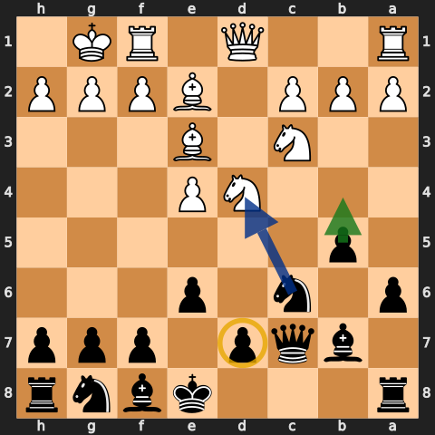
  
<strong>The core setup after 8...Bb7.</strong> Black has built <code>...e6</code>, <code>...Nc6</code>, <code>...Qc7</code>, <code>...a6-b5</code>, and <code>...Bb7</code>. The green arrow is the space-gaining <code>...b4</code>; the blue arrow shows the c6-knight's pressure on d4. The gold ring on d7 is the reminder: the d-pawn has not committed yet.

  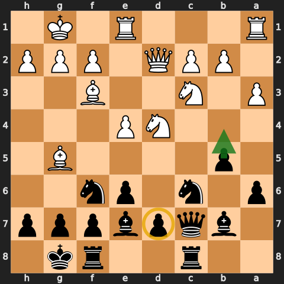
  
<strong>The mature target, not a forced tabiya.</strong> Queen c7, bishop b7, and rook c8 coordinate against the centre and queenside. The d7-pawn is still flexible, while <code>...b4</code> remains Black's most visible space-gaining lever. Aim for this harmony only when White's threats permit it.

### The two master heuristics

1. Keep the d-pawn at home in the opening unless there is a concrete reason to play `...d6`, `...d5`, or occasionally `...e5`. This preserves the f8-bishop's flexible diagonal and removes several `Qa4+` ideas.
2. Develop first on the wing opposite White's king. If White castles short, the queenside expansion is natural. If White signals long castling, bring out the kingside pieces and begin the queenside pawn race only when it is ready.

### Move-order refinements

- Delay castling while White is still arranging the attack. The queenside setup moves remain useful, so Black can often wait until White's intentions are clear.
- Do not commit to `...b5` too early when White's b1-knight has not chosen a square. After `Nc3`, `...b5-b4` gains time; before `Nc3`, White may meet `...b4` with `Nbd2` in one move.
- If the only aim is to place the bishop on b7, `...b6` may be cleaner than `...a6-b5`, especially when an early `a4` would start an unnecessary argument.
- If White plays `d3` and later `d4`, Black has reached the normal structure with a free tempo.
- Treat `...d6` as a reaction to a meaningful `f4-e5` plan, not as an automatic developing move.

## 2. When to exchange on d4

After White plays `d4`, capture when White must answer with a piece:

- `Nxd4` or `Qxd4`: the normal Open Sicilian structure;
- `cxd4`: be careful, because exchanging may hand White a broad pawn centre.

This is why the Alapin needs its own treatment. Against `c3` followed by `d4`, the ordinary Taimanov development can become misplaced: the c-file opens against the queen and the c6-knight can lose tempi.

## 3. The c6 recapture decision

When White plays `Nxc6`, ask three questions before recapturing:

1. Is the queen already on `c7`, and is `...Qxc6` tactically safe?
2. Can the b-pawn recapture without losing castling rights or allowing a tactical shot?
3. Does White have an immediate `e4-e5` break?

The speedrun's practical defaults are:

- `...Qxc6` when the queen is ready: preserve the pawns and build a queen-bishop battery on the long diagonal;
- `...bxc6` when the queen is not ready: follow quickly with `...d5`, and after `exd5` often use `cxd5`;
- `...dxc6` only for a concrete tactical or structural reason.

Do not turn this into a slogan. A bishop recapture can be strongest in an exact position, and `e4-e5` can punish an automatic queen recapture or an automatic `...Nf6`.

The same structural idea appears after `...Ne5-c4 Bxc4`: `...Qxc4` often keeps the c-file and queenside pawns healthier than `...bxc4`.

  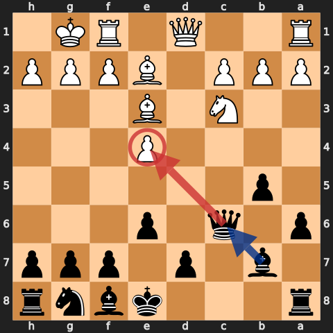
  
<strong>After 9...Qxc6: preserve the structure and create alignment.</strong> The bishop sits behind the queen on the b7-c6 diagonal. For now the queen attacks e4—the red target—and the centre blocks the route toward g2. This is why the recapture is powerful, but also why Black must calculate <code>e5</code> rather than imagining a battery that is already open.

## 4. White castles short: build on the queenside

The ideal plan is:

1. `...a6` prepares `...b5` and controls b5.
2. `...b5` gains space and opens the long diagonal.
3. `...Bb7` activates the dark-squared bishop.
4. `...Rc8` uses the half-open c-file when tactics allow.
5. Add `...Nf6`, `...Be7`, and `...O-O` in the order demanded by the position.

Do not play the last three moves mechanically. Before every routine developing move, check White's `e5`, `Nd5`, and captures on c6.

## 5. The English Attack: Be3, Qd2, f3, and long castling

`Be3` and `Qd2` usually announce queenside castling. Switch priorities:

- develop `...Nf6` early;
- use `...Ng4` if the bishop on e3 is genuinely unprotected;
- reinforce with `...d6` when White's `f3/g4/g5` plan needs a stable answer;
- race with `...b5-b4`, then consider `...a5-a4-a3`;
- use `...Qa5`, `...Bb4`, and sometimes `...Bxc3` to attack dark squares around the king.

Against `g4`, `...h6` can make `g5` less effective: after exchanges, the g-file may open toward White's own king. Calculate before using the pattern; it is not automatic.

Be suspicious of `...Bxa3`. Check both knight captures on b5 before grabbing the pawn.

  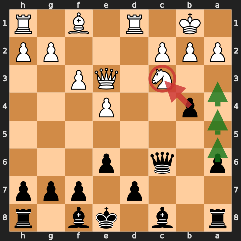
  
<strong>The English Attack race after 12...b4.</strong> The immediate question is the c3-knight: <code>...bxc3</code> can damage the shelter around White's king. Black's follow-up route is <code>...a5-a4-a3</code>. The diagram makes the priority clear—open lines against the king before spending time on decorative moves.

### The `e5` counter-threat: `...b4!`

In the KNeres post-game analysis, Aman isolates one of the Taimanov's most important tactical move-order ideas. White has castled queenside, Black has a pawn on b5, and `e5` attacks the f6-knight. Do not assume that the knight must move immediately. First check whether `...b4` creates the stronger threat.

The mechanism is:

1. `e5` attacks the f6-knight.
2. `...b4!` counterattacks the c3-knight instead of answering White's threat.
3. If the c3-knight moves, it stops controlling d5, so Black's f6-knight can often land on the excellent d5-square.
4. If White continues with `exf6`, `...bxc3` attacks the queen on d2. White cannot casually continue capturing: `...cxd2+` would take the queen with check. A typical safe resolution is `Qxc3 Qxc3 bxc3 Bxf6`, leaving Black with comfortable play.

  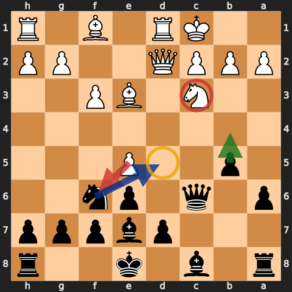
  
<strong>After 11.e5: counterattack before retreating.</strong> White's red arrow is the threat <code>e5xf6</code>. Black replies <code>...b4!</code>, attacking the c3-knight and loosening its control of d5. The blue route shows the reward: once c3 is cleared, the f6-knight can often reach d5 instead of retreating. This is the position Aman used to teach the motif.

The geometry matters. `...b4` itself is not check, and the idea is not an automatic answer to every `e5`. It works here because White's king is still on c1, the queen is on d2, the knight is on c3, and Black's b-pawn is ready on b5. If the king has moved to b1 or any of those pieces occupy different squares, recalculate the line rather than repeating the pattern by memory.

## 6. Quiet Be2 and Bd3 setups

Against a passive `Be2`, look for immediate pressure on e4 with `...Bb4` and sometimes `...Nxe4`.

Against `Bd3`, the key pivot is `...Ne5`:

- it attacks the bishop;
- it prepares `...Nc4`;
- `...Nc4` is strongest when White's queen is on d2, because queen and bishop can be forked;
- with the queen on e2, the jump may achieve much less;
- with a white knight on b3, insert `...b4` when needed so `Na5` does not solve White's problems.

After `...Nc4 Bxc4`, prefer `...Qxc4` when it preserves the c-file and pawn chain. Avoid exchanging on d3 merely to let `cxd3` repair White's structure and activate the c-file.

  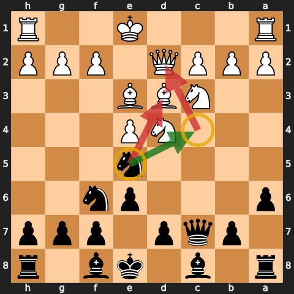
  
<strong>The <code>...Ne5-c4</code> pivot.</strong> On e5 the knight hits Bd3 immediately and threatens to land on c4. With White's queen on d2, a knight on c4 attacks both the queen and bishop. This is a tactical route, not a ritual: change the queen square or the b3-knight and the idea may lose its force.

## 7. The bxc6 structure

After `Nxc6 bxc6`, the doubled c-pawns are useful if they support an immediate `...d5`.

Typical plans:

- `...d5`, meeting `exd5` with `cxd5` when appropriate;
- `...Nd7-c5` to hit a bishop on d3;
- `...Ba6` to offer the light-squared bishop for an important defender;
- `...a5-a4` to stop b3 and restrict White's queenside;
- `...Qb6` and `...Na6-b4` to pressure a2 and b2.

The `cxd5` recapture is important: it removes the doubled c-pawn and usually leaves connected central pawns. Taking with the e-pawn can create an extra pawn island and open a file toward Black's king. Once the central majority is established, it must eventually advance with `...e5-e4` or `...d5-d4`; if the pawns never move, Black has structure but no winning attempt.

  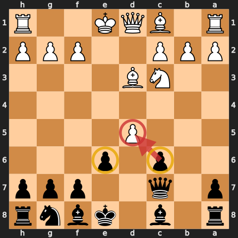
  
<strong>The doubled pawn does its job.</strong> After <code>...bxc6</code>, <code>...d5</code>, and <code>exd5</code>, the c6-pawn recaptures on d5. That single move undoubles the pawns and produces a connected d5/e6 centre. This is the structural reason for <code>...bxc6</code>; without the timely break, Black has accepted the weakness without earning the activity.

The king can sometimes remain on e8 because the centre is closed and castling would invite `Qg4` or `Bh6`. This is a practical option, not a blanket rule.

## 8. The Maroczy Bind with 5.c4

After `5.c4`, abandon the normal `...b5` machine. White has taken that square under control.

Use:

- `...Nf6` to hit e4;
- `...Bc5` to pressure the d4-knight;
- `...Qb6` to attack d4 and b2;
- checks on b4 or a5 when they create a real tactical problem.

Model tactic:

`1.e4 c5 2.Nf3 e6 3.d4 cxd4 4.Nxd4 Nc6 5.c4 Nf6 6.Nc3 Bc5 7.Be3 Qb6 8.Na4 Bb4+ 9.Bd2 Qxd4`

The point is to take the hanging knight. Retreating the queen after `Bd2` would lose the tactical justification for the check.

  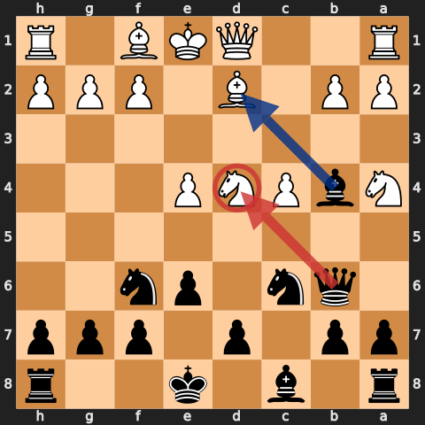
  
<strong>Stop before Black's ninth move.</strong> White's Bd2 blocks the check, but the knight on d4 is now loose. The red arrow is the whole tactic: <code>9...Qxd4</code>. The bishop's check forced the blocking move; retreating the queen would waste the combination.

## 9. The Bowdler Attack with 3.Bc4

The e6-pawn neutralizes White's routine f7 battery and removes d5 from the bishop.

Aman's preferred move order is pawns before pieces:

`1.e4 c5 2.Nf3 e6 3.Bc4 a6 4.Nc3 b5`

If the bishop retreats to b3, `...c4` can force it to a4 and leave it badly restricted. It is a clamp, not a literal trap: `Ba4` remains legal.

Only use `...c4` against a bishop on b3. If the bishop retreats to d3, or White has played d3 and controls c4, return to normal development. Against an early a4, `...b6` and `...Bb7` often preserve the same strategic idea without forcing `...b5`.

  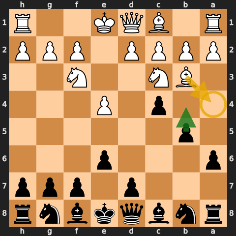
  
<strong>A clamp, not a trap.</strong> After <code>...c4</code>, the bishop still has the gold route <code>Ba4</code>. What Black has won is space and time: the bishop is pushed to the rim while <code>...b4</code> can chase the c3-knight. This corrects the tempting but inaccurate claim that the bishop has no square.

## 10. The Alapin with 2.c3

Do not force the standard Taimanov formation:

`1.e4 c5 2.c3 Nf6`

The rule is about the pawn on c3, not the move number. After `1.e4 c5 2.Nf3 e6 3.c3`, use `3...Nf6` for the same reason: attack e4 before White builds the full centre.

After `e5` and `c4`, Aman prefers retreating the knight to c7 rather than b6. From c7 it can support `...d6`, `...b5`, and `...Ne6`.

Undermine the e5-pawn with `...d6`, and if it can be removed safely, play `...dxe5` before returning to the familiar `...e6` structure. In these positions `...b6` and `...Bb7` are often more useful than an automatic `...a6-b5` expansion.

  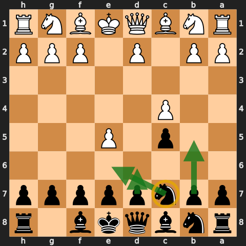
  
<strong>Against c3, reset the system.</strong> The knight belongs on c7 rather than b6: from c7 it can reach e6, support <code>...d6</code>, and leave <code>...b5</code> available. Black's first job is to undermine e5—not to force a queen onto c7 and pretend this is a normal Open Sicilian.

## 11. Smith-Morra, early c4, and f4 systems

### Smith-Morra

The speedrun declines with `1.e4 c5 2.d4 cxd4 3.c3 d3`, returning the pawn and keeping the c-file closed. A practical setup is `...Nc6`, `...d6`, `...g6`, `...Bg7`, and `...Bg4` to reduce White's attacking force.

This is a repertoire choice, not a claim that accepting the gambit is unsound.

  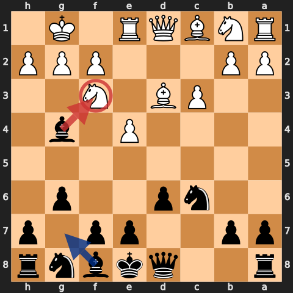
  
<strong>The declined Morra setup.</strong> Returning the pawn with <code>...d3</code> closes the c-file and reduces White's immediate acceleration. Black then builds <code>...Nc6</code>, <code>...d6</code>, <code>...g6</code>, and <code>...Bg4</code>; the red target is the f3-knight, an important attacking piece.

### Early c4 / English structures

After an early c4 that prevents `...b5`, switch plans. In the symmetrical English structure, fianchetto with `...g6` and `...Bg7`; `...Nge7` can be more harmonious than forcing the normal Taimanov piece placement.

### f4 systems

Against f4, `e4-e5` carries extra force and e5 may no longer be available to Black's knight. Useful adjustments include:

- `...d6` to challenge the e5 advance;
- rerouting the knight through a5-c4;
- developing a kingside knight through h6-f5;
- using `...h5-h4` and `...Nh5-g3` when White has weakened g3.

  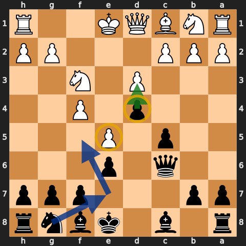
  
<strong>Against f4, fight the centre first.</strong> The pawn on d4 cramps White and the advanced e5-pawn gives Black a fixed target. Because f4 denies the usual e5 outpost, the g8-knight can reroute through e7 to f5 instead of following the standard setup mechanically.

### Additional practical sidelines

- Against an early `Qxd4`, develop with `...Nc6` and gain the tempo Black wanted anyway.
- Against `a4` hitting a pawn already on b5, consider pushing past with `...b4` rather than automatically capturing or defending.
- If `Nb5` attacks the queen on c7, retreat to a useful square, play `...a6`, and return the queen only when the position permits it.
- Against `Bg5`, `...Be7` can welcome `Bxf6`: Black gains the bishop pair and White gives up an important dark-squared bishop.
- Against `Qg4`, `...g6` is often the simple answer to `Qxg7` and `Bh6` ideas, though the weakened dark squares still need respect.
- The `2.a3` Wing Gambit is a separate Sicilian problem. Accepting it is possible, but do not confuse its piece retreats with the normal Taimanov setup.

## 12. Nb3 and b3/Bb2 systems

Against Nb3 or a b3/Bb2 setup:

- preserve the dark-squared bishop whenever practical;
- do not rush `...Bb7` into a setup designed to trade that bishop;
- use `...a6` to reduce `Bb5xc6` ideas;
- consider `...d4` to close the b2-bishop's diagonal;
- meet a kingside pawn expansion in the centre before spending a tempo on a rook lift.

In the annotated PGN, `...Ne5` replaces an immediate `...Rb8` because the central move is urgent and the rook move is too slow.

  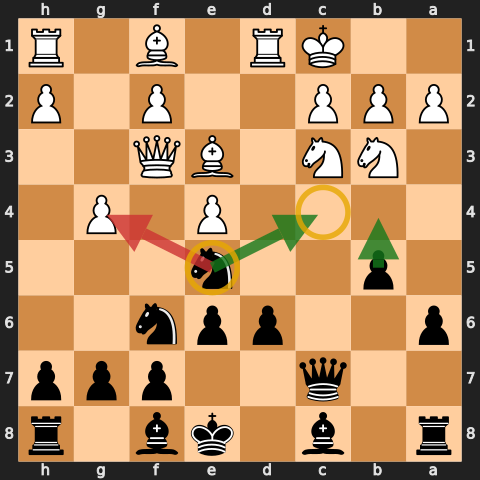
  
<strong>Meet the attack in the centre.</strong> White has castled long and played g4, but <code>...Ne5</code> attacks that pawn, prepares <code>...Nc4</code>, and keeps <code>...b4</code> ready. This is why the immediate <code>...Rb8</code> was too slow: Black already has three forcing ideas.

## 13. Recurring tactical and positional themes

### The long-diagonal battery

The queen on c7 and bishop on b7 form the tactical spine of the system. When a defender leaves f3 or f1, check `...Qxg2`; when the queen also bears on h2, `...Ng4` may create mating ideas. The same geometry explains why `...Qxc6` can be so attractive after `Nxc6`: the queen joins the bishop without losing a tempo.

### Preserve the dark-squared bishop

White's bishop on e3 often supports the entire kingside pawn storm, so `...Ng4` or a favorable exchange can remove an important attacker. Black's own bishop on b7 is normally the piece to preserve. If a bishop trade is desirable, use the light-squared bishop with ideas such as `...Ba6` or `...Qb6` followed by `...Ba6`.

### The test of the opening

Ask whether Black can achieve `...d5` without allowing a favorable `e5`. If the answer is yes, the opening has usually gone well. If `e5` still drives a knight to a poor square, finish the preparation first.

### Open files and two weaknesses

On an open file, the queen often belongs behind the doubled rooks. If the front rooks are exchanged, a queen recapture may preserve control better than an automatic rook recapture. Strategically, pressure on one weakness can be held forever; fix it, then create a second target on the other wing before loosening your own position.

## 14. Structures and endgames

Aman repeatedly treats the queenless Sicilian as something Black should welcome when the concrete position permits it. His point is structural, not a promise that every Sicilian ending is better: if the other factors are equal, Black's compact central pawns and active pieces often make the ending comfortable.

Practical themes from the speedrun:

- do not avoid a sound queen trade merely because the opening began as a fighting Sicilian;
- keep the `d7`- and `e6`-pawns when their compact wall restricts White and supports the king;
- use `...f6` to challenge e5, open the f- or g-file, and give the king an active route;
- activate the dark-squared bishop, often on c5 or b7, before simplifying;
- advance `...h5-h4` when the centre is stable and the kingside pawns can gain space;
- judge each trade by the resulting activity and pawn structure, not by a blanket rule.
- judge doubled pawns by the squares they control and the files they open, not by appearance alone;
- with one bishop against the bishop pair, place pawns mainly on the colour your remaining bishop does not control;
- leave the king in the centre when the position is closed and castling would merely give White a target.

One recurring model is a strong bishop plus the `d7/e6` wall, followed by `...f6`, activity on the g-file, and an advancing h-pawn. Aman explicitly describes these positions as comfortable rather than automatically winning: Black can still be outplayed, and tactical or positional details can reverse the structural preference.

## 15. Practical play

- Prefer a simple continuation that you understand to a marginally more accurate move that demands a long calculation.
- Use knowledge of the setup to bank time for the real branch points: recaptures, `e5`, castling direction, and tactical jumps.
- Once ahead, stop collecting pawns. Finish development, connect the rooks, and welcome sound simplification.
- Do not spend a tempo on a check or attack that lets White play a useful defensive move for free.
- Against weaker opposition, keeping pieces on the board can be practical, but only when the chosen move remains sound.
- Practise the structure from White's side through a reversed setup with `c4`, `Nf3`, `b3`, `Bb2`, castling, and `Rc1`; the familiar squares matter more than the colour.

## 16. Practical checklist

Before each move, ask:

1. Can White play `e5` or `Nd5` immediately?
2. If `e5` attacks the f6-knight after long castling, does `...b4` counterattack c3 and clear d5?
3. If White takes on c6, which recapture preserves the position without allowing a tactic?
4. Has White castled, and which wing should I develop first?
5. Is `...b5` still possible, or has c4 changed the opening?
6. Does `...Ne5-c4` hit something concrete?
7. Am I preserving the dark-squared bishop in the structures where it matters?
8. Is this a remembered setup move, or is it legal and useful in the position actually on the board?

That final question is the heart of the speedrun: learn a system deeply enough to play quickly, but never so mechanically that the system replaces calculation.
